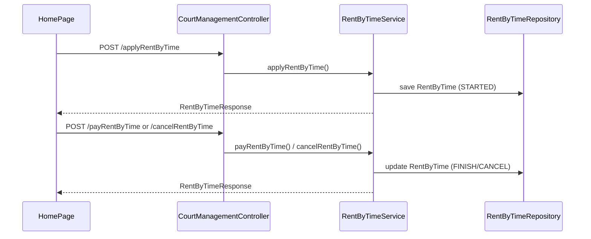
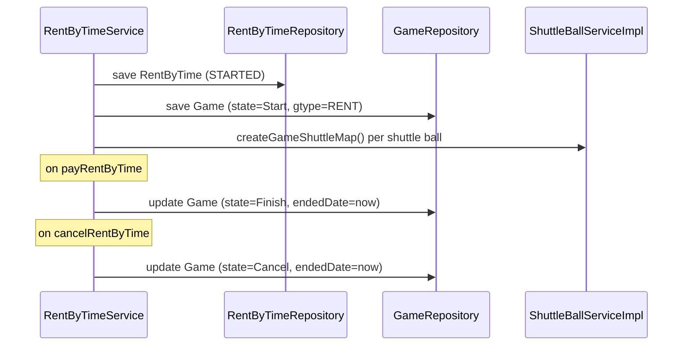

# Integrate GameType.RENT into Rent-by-Time Flow

## Current flow



The UI entry point is already wired: [`handleRentConfirm`](bad-court-mana-ui/src/page/HomePage.js) posts to `/court-mana/applyRentByTime`; finish/cancel use `/payRentByTime` and `/cancelRentByTime`. **All changes are backend-only in [`RentByTimeService`](BadmintonCourtManagement/src/main/java/com/badminton/service/RentByTimeService.java).**

## Target flow



## State mapping

| Rent action | RentByTime.state | Game.state (`GameState`) |
|---|---|---|
| apply | `STARTED` | `Start` |
| pay | `FINISH` | `Finish` |
| cancel | `CANCEL` | `Cancel` |

Use `GameType.RENT.name()` for `gtype` and `GameState.*.getValue()` for `state` (matches existing [`changeGameState`](BadmintonCourtManagement/src/main/java/com/badminton/service/CourtServicesService.java) conventions).

## Implementation (single file focus)

### 1. Add dependencies to `RentByTimeService`

Inject:

- [`GameRepository`](BadmintonCourtManagement/src/main/java/com/badminton/repository/GameRepository.java)
- [`ShuttleBallServiceImpl`](BadmintonCourtManagement/src/main/java/com/badminton/service/ShuttleBallServiceImpl.java) (reuse existing `createGameShuttleMap`)

Import `Game`, `GameState`, `GameType`, `GameShuttleMap`.

### 2. Guard before creating a rental game — `applyRentByTime`

Before saving rental + game, reject if the court already has an active game:

```java
gameRepo.findByCourtIdAndEndedDateIsNull(court.getCourtId())
    .ifPresent(g -> { throw new IllegalArgumentException("Court already has an active game"); });
```

Also reject duplicate active rental (currently missing):

```java
rentByTimeRepo.findByCourtCourtIdAndState(court.getCourtId(), RentState.STARTED.name())
    .ifPresent(r -> { throw new IllegalArgumentException("Court already has an active rental"); });
```

### 3. Create `Game` after line 79 in `applyRentByTime`

Right after `rentByTimeRepo.save(rental)`:

```java
Game game = new Game();
game.setCourt(court);
game.setState(GameState.START.getValue());
game.setGtype(GameType.RENT.name());
game.setShuttleMap(new ArrayList<>());
gameRepo.save(game);

if (request.getShuttleBalls() != null) {
    for (ShuttleBallDTO dto : request.getShuttleBalls()) {
        shuttleBallService.createGameShuttleMap(game, dto, dto.getBallQuantity());
    }
}
```

Notes:

- Do **not** use `new Game(court, shuttleBall)` — that constructor sets `NOT_START` and always adds one shuttle.
- RENT games have **no teams** (`teamOne`/`teamTwo` stay null); [`CourtDTO`](BadmintonCourtManagement/src/main/java/com/badminton/requestmodel/CourtDTO.java) already handles null teams safely.
- Initialize `shuttleMap` to an empty list to avoid NPE in [`GameDTO(Game)`](BadmintonCourtManagement/src/main/java/com/badminton/requestmodel/GameDTO.java) when building court management DTOs.

### 4. Add private helper to terminate the linked game

```java
private void updateRentGameState(Court court, GameState targetState) {
    gameRepo.findByCourtIdAndEndedDateIsNull(court.getCourtId())
        .filter(g -> GameType.RENT.name().equals(g.getGtype()))
        .ifPresent(game -> {
            game.setState(targetState.getValue());
            game.setEndedDate(sessionService.getUTCPlus7Instant());
            gameRepo.save(game);
        });
}
```

Filter by `gtype=RENT` so pay/cancel never accidentally closes a SHARE/NEGO game if data is inconsistent.

### 5. Call helper from pay/cancel

In [`payRentByTime`](BadmintonCourtManagement/src/main/java/com/badminton/service/RentByTimeService.java) after updating `RentByTime`:

```java
updateRentGameState(rental.getCourt(), GameState.FINISH);
```

In [`cancelRentByTime`](BadmintonCourtManagement/src/main/java/com/badminton/service/RentByTimeService.java):

```java
updateRentGameState(rental.getCourt(), GameState.CANCEL);
```

**No controller changes** — [`CourtManagementController`](BadmintonCourtManagement/src/main/java/com/badminton/controller/CourtManagementController.java) already delegates to the service for lines 182 and 189.

### 6. Out of scope (unless you want them next)

- **`updateRentByTime`**: not requested; shuttle sync on Game can be added later if needed.
- **Schema FK** (`RentByTime.game_id`): not required; lookup by `courtId + gtype + endedDate is null` is sufficient while one active game per court is enforced.
- **Frontend reload**: after refresh, `getCourtManagement` will see the RENT `Game` and lock the court, but `rentalInfoMap` is not restored from `/getActiveRentByTime`. Optional follow-up: load active rentals per court on page init.

## Side effects to be aware of

- A RENT game with `state=Start` appears in `gameService.findAllInprogress()` used by [`getCourtManagement`](BadmintonCourtManagement/src/main/java/com/badminton/service/CourtServicesService.java), so the court is excluded from “remain courts” and marked locked on refresh — consistent with an occupied court.
- [`ExcelExportService`](BadmintonCourtManagement/src/main/java/com/badminton/service/impl/ExcelExportService.java) already merges shuttle usage from both `Game` and `RentByTime`; after this change, rental shuttles may appear in both sources for the same session. Worth a later dedup pass, not blocking for this task.

## Verification

Manual test path:

1. Start rent from UI → confirm `rent_by_time` row (`STARTED`) and `game` row (`Start`, `gtype=RENT`, matching `court_id`, shuttle maps if selected).
2. Finish rent → `rent_by_time.state=FINISH`, `game.state=Finish`, `game.ended_date` set.
3. Start another rent, cancel → `rent_by_time.state=CANCEL`, `game.state=Cancel`, `game.ended_date` set.
4. Attempt rent on a court with an active SHARE/NEGO game → expect error, no duplicate records.
