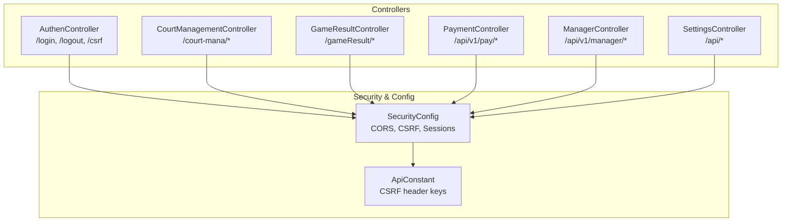
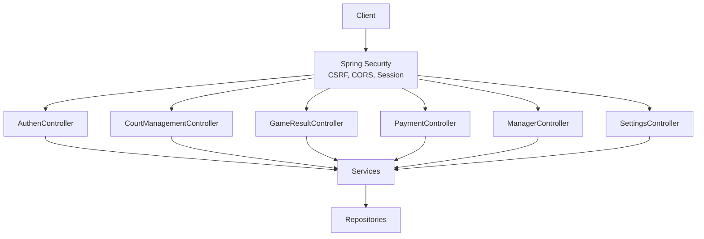
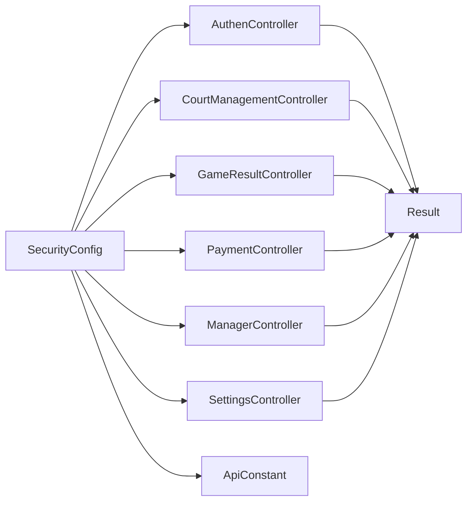

# API Reference

<cite>
**Referenced Files in This Document**
- [AuthenController.java](file://BadmintonCourtManagement/src/main/java/com/badminton/controller/AuthenController.java)
- [CourtManagementController.java](file://BadmintonCourtManagement/src/main/java/com/badminton/controller/CourtManagementController.java)
- [GameResultController.java](file://BadmintonCourtManagement/src/main/java/com/badminton/controller/GameResultController.java)
- [PaymentController.java](file://BadmintonCourtManagement/src/main/java/com/badminton/controller/PaymentController.java)
- [ManagerController.java](file://BadmintonCourtManagement/src/main/java/com/badminton/controller/ManagerController.java)
- [SettingsController.java](file://BadmintonCourtManagement/src/main/java/com/badminton/controller/SettingsController.java)
- [SecurityConfig.java](file://BadmintonCourtManagement/src/main/java/com/badminton/config/SecurityConfig.java)
- [ApiConstant.java](file://BadmintonCourtManagement/src/main/java/com/badminton/constant/ApiConstant.java)
- [AuthenDTO.java](file://BadmintonCourtManagement/src/main/java/com/badminton/requestmodel/AuthenDTO.java)
- [Result.java](file://BadmintonCourtManagement/src/main/java/com/badminton/response/result/Result.java)
- [LoginDTO.java](file://BadmintonCourtManagement/src/main/java/com/badminton/requestmodel/LoginDTO.java)
- [CourtManagementDTO.java](file://BadmintonCourtManagement/src/main/java/com/badminton/requestmodel/CourtManagementDTO.java)
- [GameDTO.java](file://BadmintonCourtManagement/src/main/java/com/badminton/requestmodel/GameDTO.java)
- [PayRequest.java](file://BadmintonCourtManagement/src/main/java/com/badminton/requestmodel/PayRequest.java)
- [SetUpServiceDTO.java](file://BadmintonCourtManagement/src/main/java/com/badminton/requestmodel/SetUpServiceDTO.java)
</cite>

## Table of Contents
1. [Introduction](#introduction)
2. [Project Structure](#project-structure)
3. [Core Components](#core-components)
4. [Architecture Overview](#architecture-overview)
5. [Detailed Component Analysis](#detailed-component-analysis)
6. [Dependency Analysis](#dependency-analysis)
7. [Performance Considerations](#performance-considerations)
8. [Troubleshooting Guide](#troubleshooting-guide)
9. [Conclusion](#conclusion)
10. [Appendices](#appendices)

## Introduction
This document provides comprehensive API documentation for the Badminton Court Management REST endpoints. It covers authentication, court management, game results, payments, manager reporting, and settings. For each endpoint, you will find HTTP methods, URL patterns, request/response schemas, authentication requirements, error handling, and practical integration guidance. Session-based authentication and CSRF token handling are documented along with CORS configuration and role-based access patterns.

## Project Structure
The REST API is implemented via Spring MVC controllers grouped by functional domain:
- Authentication: /login, /logout, /csrf
- Court Management: /court-mana/*
- Game Results: /gameResult/*
- Payments: /api/v1/pay/*
- Manager Reporting: /api/v1/manager/*
- Settings: /api/getSetupServices, /api/addSetupService, /api/updateSetupService, /api/deleteService, /api/deleteShuttleBall

**Diagram sources**
- [AuthenController.java:78-110](file://BadmintonCourtManagement/src/main/java/com/badminton/controller/AuthenController.java#L78-L110)
- [CourtManagementController.java:25-163](file://BadmintonCourtManagement/src/main/java/com/badminton/controller/CourtManagementController.java#L25-L163)
- [GameResultController.java:15-42](file://BadmintonCourtManagement/src/main/java/com/badminton/controller/GameResultController.java#L15-L42)
- [PaymentController.java:18-28](file://BadmintonCourtManagement/src/main/java/com/badminton/controller/PaymentController.java#L18-L28)
- [ManagerController.java:34-121](file://BadmintonCourtManagement/src/main/java/com/badminton/controller/ManagerController.java#L34-L121)
- [SettingsController.java:14-62](file://BadmintonCourtManagement/src/main/java/com/badminton/controller/SettingsController.java#L14-L62)
- [SecurityConfig.java:44-91](file://BadmintonCourtManagement/src/main/java/com/badminton/config/SecurityConfig.java#L44-L91)
- [ApiConstant.java:3-10](file://BadmintonCourtManagement/src/main/java/com/badminton/constant/ApiConstant.java#L3-L10)

**Section sources**
- [AuthenController.java:26-110](file://BadmintonCourtManagement/src/main/java/com/badminton/controller/AuthenController.java#L26-L110)
- [CourtManagementController.java:24-163](file://BadmintonCourtManagement/src/main/java/com/badminton/controller/CourtManagementController.java#L24-L163)
- [GameResultController.java:14-42](file://BadmintonCourtManagement/src/main/java/com/badminton/controller/GameResultController.java#L14-L42)
- [PaymentController.java:17-28](file://BadmintonCourtManagement/src/main/java/com/badminton/controller/PaymentController.java#L17-L28)
- [ManagerController.java:33-121](file://BadmintonCourtManagement/src/main/java/com/badminton/controller/ManagerController.java#L33-L121)
- [SettingsController.java:13-62](file://BadmintonCourtManagement/src/main/java/com/badminton/controller/SettingsController.java#L13-L62)
- [SecurityConfig.java:44-136](file://BadmintonCourtManagement/src/main/java/com/badminton/config/SecurityConfig.java#L44-L136)

## Core Components
- Authentication endpoints: /login, /logout, /csrf
- Court management endpoints: /court-mana/*
- Game result endpoints: /gameResult/*
- Payment endpoints: /api/v1/pay/*
- Manager endpoints: /api/v1/manager/*
- Settings endpoints: /api/getSetupServices, /api/addSetupService, /api/updateSetupService, /api/deleteService, /api/deleteShuttleBall

Authentication and authorization:
- Session-based authentication is enabled. Successful login stores a Spring Security context in the HTTP session and sets a CSRF token in the session.
- CSRF protection is configured via Cookie-based CSRF token repository and session-based token storage.
- CORS allows localhost:3000 (frontend) and localhost:8080 (Tomcat) with credentials and exposed Content-Disposition header.

Response wrapper:
- All endpoints return a generic Result<T> envelope with success flag, data, error message, and error code.

**Section sources**
- [SecurityConfig.java:46-63](file://BadmintonCourtManagement/src/main/java/com/badminton/config/SecurityConfig.java#L46-L63)
- [SecurityConfig.java:112-136](file://BadmintonCourtManagement/src/main/java/com/badminton/config/SecurityConfig.java#L112-L136)
- [Result.java:1-28](file://BadmintonCourtManagement/src/main/java/com/badminton/response/result/Result.java#L1-L28)

## Architecture Overview
The API follows a layered architecture with controllers exposing REST endpoints, services handling business logic, and repositories managing persistence. Security is configured centrally to enforce session-based authentication, CSRF protection, and CORS policies.

**Diagram sources**
- [SecurityConfig.java:44-91](file://BadmintonCourtManagement/src/main/java/com/badminton/config/SecurityConfig.java#L44-L91)
- [AuthenController.java:26-110](file://BadmintonCourtManagement/src/main/java/com/badminton/controller/AuthenController.java#L26-L110)
- [CourtManagementController.java:24-163](file://BadmintonCourtManagement/src/main/java/com/badminton/controller/CourtManagementController.java#L24-L163)
- [GameResultController.java:14-42](file://BadmintonCourtManagement/src/main/java/com/badminton/controller/GameResultController.java#L14-L42)
- [PaymentController.java:17-28](file://BadmintonCourtManagement/src/main/java/com/badminton/controller/PaymentController.java#L17-L28)
- [ManagerController.java:33-121](file://BadmintonCourtManagement/src/main/java/com/badminton/controller/ManagerController.java#L33-L121)
- [SettingsController.java:13-62](file://BadmintonCourtManagement/src/main/java/com/badminton/controller/SettingsController.java#L13-L62)

## Detailed Component Analysis

### Authentication Endpoints
- /login (POST)
  - Purpose: Authenticate user and establish session with CSRF token stored in session.
  - Request: Form parameters username, password.
  - Response: AuthenDTO with message, username, csrfToken; HTTP 200 on success, 401 on failure.
  - Authentication: Not required; creates session upon success.
  - CSRF: CSRF token is generated and stored in session; clients must include XSRF token header on subsequent requests.
  - Example request: curl -X POST "http://localhost:8080/login?username=admin&password=pass"
  - Example response: {"message":"Login successful","username":"admin","csrfToken":"...","valid":true,"expiresInSeconds":...}

- /logout (POST)
  - Purpose: Terminate session and send logout success response.
  - Request: No body required.
  - Response: 200 OK with message "Logged out".
  - Authentication: Requires session; CSRF applies if enabled.

- /csrf (GET)
  - Purpose: Validate session CSRF token freshness and return remaining validity.
  - Request: Session cookie required.
  - Response: AuthenDTO with csrfToken, valid=true, expiresInSeconds; or 401/403 on missing/expired token.
  - Example request: curl -H "Cookie: JSESSIONID=..." "http://localhost:8080/csrf"

Security and CSRF:
- CSRF tokens are stored in the HTTP session under a dedicated attribute and validated on each request.
- Clients must include the XSRF token header matching the session-stored token.

**Section sources**
- [AuthenController.java:78-110](file://BadmintonCourtManagement/src/main/java/com/badminton/controller/AuthenController.java#L78-L110)
- [AuthenController.java:45-73](file://BadmintonCourtManagement/src/main/java/com/badminton/controller/AuthenController.java#L45-L73)
- [SecurityConfig.java:48-53](file://BadmintonCourtManagement/src/main/java/com/badminton/config/SecurityConfig.java#L48-L53)
- [ApiConstant.java:4-6](file://BadmintonCourtManagement/src/main/java/com/badminton/constant/ApiConstant.java#L4-L6)
- [AuthenDTO.java:14-25](file://BadmintonCourtManagement/src/main/java/com/badminton/requestmodel/AuthenDTO.java#L14-L25)

### Court Management Endpoints
Base path: /court-mana/*

- GET /court-mana/getShuttleBalls
  - Purpose: Retrieve active shuttle balls.
  - Auth: Requires session.
  - Response: Array of ShuttleBallResponse items.

- POST /court-mana/addListBallIntoCourt
  - Purpose: Add a list of shuttle balls to a court.
  - Query: courtId (string).
  - Body: Array of ShuttleBallRequest.
  - Response: Boolean.

- POST /court-mana/changeBallQuantity
  - Purpose: Change quantity of a specific shuttle ball for a court.
  - Query: courtId (string).
  - Body: ShuttleBallDTO.
  - Response: Result<Boolean>.

- GET /court-mana/getServices
  - Purpose: Retrieve active services.
  - Auth: Requires session.
  - Response: Array of ServiceResponse.

- GET /court-mana/getAllActiveCourt
  - Purpose: Retrieve all active courts.
  - Auth: Requires session.
  - Response: Array of CourtDTO.

- GET /court-mana/getAvailablePlayers
  - Purpose: Retrieve currently available players.
  - Auth: Requires session.
  - Response: Array of AvaPlayerDTO.

- GET /court-mana/getCourtManagement
  - Purpose: Retrieve aggregated court management data.
  - Auth: Requires session.
  - Response: CourtManagementDTO.

- POST /court-mana/addPlayer
  - Purpose: Add a player to the current available session.
  - Body: String (player name).
  - Response: Result<Boolean>.

- POST /court-mana/removeServiceOutPlayer
  - Purpose: Remove a service from an available player.
  - Query: playerName (string).
  - Body: ServiceDTO.
  - Response: Boolean.

- POST /court-mana/updateServiceToPlayer
  - Purpose: Update services assigned to an available player.
  - Query: playerName (string).
  - Body: Array of ServiceRequest.
  - Response: Boolean.

- POST /court-mana/addServiceToPlayer
  - Purpose: Add a service to an available player.
  - Query: playerName (string).
  - Body: ServiceRequest.
  - Response: Boolean.

- POST /court-mana/addPlayerToCourt
  - Purpose: Add an available player to a court area.
  - Body: GameDTO.
  - Response: Boolean.

- POST /court-mana/removePlayerFromCourt
  - Purpose: Remove a player from a court area.
  - Body: CourtDTO.
  - Validation: Returns 400 Bad Request if invalid input detected.
  - Response: Boolean.

- POST /court-mana/changeGameState
  - Purpose: Change game state (Started, Finished, Cancelled).
  - Body: GameDTO with gameState and courtId present.
  - Validation: Returns 400 Bad Request if missing required fields.
  - Response: Boolean.

- POST /court-mana/changeSelectedBall
  - Purpose: Set selected shuttle ball.
  - Body: ShuttleBallDTO.
  - Response: Void.

Notes:
- Many endpoints return raw boolean or lists without explicit error envelopes; consumers should inspect HTTP status codes.
- Validation helpers are used to guard against malformed inputs (e.g., invalid court DTO).

**Section sources**
- [CourtManagementController.java:33-160](file://BadmintonCourtManagement/src/main/java/com/badminton/controller/CourtManagementController.java#L33-L160)

### Game Result Endpoints
Base path: /gameResult/*

- GET /gameResult/getGameResult
  - Purpose: Retrieve the latest game result for a given court.
  - Query: courtId (string).
  - Response: GameResult.

- POST /gameResult/confirmGameResult
  - Purpose: Confirm the game result.
  - Body: GameDTO.
  - Response: Result<Boolean>.

- POST /gameResult/rejectGameResult
  - Purpose: Reject or terminate the game.
  - Body: GameDTO.
  - Response: Result<Boolean>.

- POST /gameResult/editGameResult
  - Purpose: Placeholder for editing game result.
  - Response: GameResult (currently returns null).

Validation and error handling:
- Missing or invalid parameters may lead to 400 responses depending on service behavior.

**Section sources**
- [GameResultController.java:21-41](file://BadmintonCourtManagement/src/main/java/com/badminton/controller/GameResultController.java#L21-L41)

### Payment Endpoints
Base path: /api/v1/pay/*

- POST /api/v1/pay/payToPlayer
  - Purpose: Process payment to a player for services rendered.
  - Body: PayRequest with playerName, serviceRequests, totalExpense, payType (required).
  - Validation: payType is required (NotBlank).
  - Response: Result<PayResponse>.

Integration notes:
- Ensure payType is populated; otherwise the request will be rejected by validation.

**Section sources**
- [PaymentController.java:24-27](file://BadmintonCourtManagement/src/main/java/com/badminton/controller/PaymentController.java#L24-L27)
- [PayRequest.java:9-15](file://BadmintonCourtManagement/src/main/java/com/badminton/requestmodel/PayRequest.java#L9-L15)

### Manager Endpoints
Base path: /api/v1/manager/*

- POST /api/v1/manager/reportList
  - Purpose: Fetch paginated reports based on ReportListRequest.
  - Body: ReportListRequest.
  - Response: Result<PageResponse<ReportResponse>>.

- GET /api/v1/manager/reportExport/{sessionId}
  - Purpose: Download a single report as a Resource.
  - Path: sessionId (string).
  - Response: Resource with Content-Disposition.

- GET /api/v1/manager/stream/reportExportList/{token}
  - Purpose: Stream a batch of reports as a downloadable list.
  - Path: token (string).
  - Response: StreamingResponseBody with octet-stream and filename.

- GET /api/v1/manager/getMonthYear
  - Purpose: Retrieve month/year options for filtering.
  - Response: List<MonthYearResponse>.

- POST /api/v1/manager/reportToken
  - Purpose: Prepare a long report list export; returns a token for later download.
  - Body: ExportReportRequest.
  - Response: Map with reportToken.

- GET /api/v1/manager/download/{token}
  - Purpose: Download a zipped report list using the token.
  - Path: token (string).
  - Response: StreamingResponseBody with octet-stream and filename.

Security and streaming:
- Streaming endpoints set Content-Disposition and application/octet-stream headers for downloads.
- Token-based caching is used temporarily in-memory for export preparation.

**Section sources**
- [ManagerController.java:44-120](file://BadmintonCourtManagement/src/main/java/com/badminton/controller/ManagerController.java#L44-L120)

### Settings Endpoints
Base path: /api/*

- GET /api/getSetupServices
  - Purpose: Retrieve current setup services configuration.
  - Response: SetUpServiceResponse.

- POST /api/addSetupService
  - Purpose: Add new setup services.
  - Body: SetUpServiceDTO.
  - Response: 200 OK on success, 400 Bad Request on failure.

- POST /api/updateSetupService
  - Purpose: Update existing setup services.
  - Body: SetUpServiceRequest.
  - Response: 200 OK on success, 400 Bad Request on failure.

- PUT /api/deleteService
  - Purpose: Delete a service by ID.
  - Body: ServiceDTO.
  - Response: 200 OK on success, 400 Bad Request on failure.

- PUT /api/deleteShuttleBall
  - Purpose: Delete a shuttle ball by ID.
  - Body: ShuttleBallDTO.
  - Response: 200 OK on success, 400 Bad Request on failure.

**Section sources**
- [SettingsController.java:20-61](file://BadmintonCourtManagement/src/main/java/com/badminton/controller/SettingsController.java#L20-L61)

## Dependency Analysis
- Controllers depend on services for business logic and repositories for persistence.
- SecurityConfig centralizes CSRF, CORS, and session policy.
- ApiConstant defines CSRF header keys used by clients.

**Diagram sources**
- [SecurityConfig.java:44-91](file://BadmintonCourtManagement/src/main/java/com/badminton/config/SecurityConfig.java#L44-L91)
- [Result.java:1-28](file://BadmintonCourtManagement/src/main/java/com/badminton/response/result/Result.java#L1-L28)
- [ApiConstant.java:3-10](file://BadmintonCourtManagement/src/main/java/com/badminton/constant/ApiConstant.java#L3-L10)

**Section sources**
- [SecurityConfig.java:44-136](file://BadmintonCourtManagement/src/main/java/com/badminton/config/SecurityConfig.java#L44-L136)
- [Result.java:1-28](file://BadmintonCourtManagement/src/main/java/com/badminton/response/result/Result.java#L1-L28)

## Performance Considerations
- Streaming downloads for large report exports reduce memory overhead by streaming bytes directly to the client.
- Session-based authentication avoids frequent token refreshes but requires careful session timeout configuration.
- CSRF token validation adds minimal overhead and improves security against cross-site request forgery.

[No sources needed since this section provides general guidance]

## Troubleshooting Guide
Common issues and resolutions:
- 401 Unauthorized on protected endpoints: Ensure a valid session exists and CSRF token is included in headers when required.
- 403 Forbidden on CSRF validation: Call /csrf to validate token freshness or re-login to obtain a fresh token.
- 400 Bad Request on court management endpoints: Verify required fields (e.g., courtId, gameState) and DTO shapes.
- CORS errors: Confirm that the frontend runs on localhost:3000 or Tomcat on localhost:8080 and credentials are allowed.
- Streaming download failures: Ensure the token is still valid and the server supports streaming responses.

**Section sources**
- [AuthenController.java:45-73](file://BadmintonCourtManagement/src/main/java/com/badminton/controller/AuthenController.java#L45-L73)
- [CourtManagementController.java:133-153](file://BadmintonCourtManagement/src/main/java/com/badminton/controller/CourtManagementController.java#L133-L153)
- [SecurityConfig.java:112-136](file://BadmintonCourtManagement/src/main/java/com/badminton/config/SecurityConfig.java#L112-L136)

## Conclusion
The API provides a cohesive set of endpoints for managing badminton courts, games, payments, reporting, and settings. Session-based authentication with CSRF protection and CORS configuration ensures secure and flexible integration. Use the provided schemas and examples to implement clients and handle errors gracefully.

[No sources needed since this section summarizes without analyzing specific files]

## Appendices

### Authentication and CSRF Details
- Session creation: On successful login, a Spring Security context is stored in the HTTP session and session timeout is set.
- CSRF token storage: Token is stored in the session and validated on requests.
- Headers: Clients should include the XSRF token header matching the session-stored token.

**Section sources**
- [AuthenController.java:87-98](file://BadmintonCourtManagement/src/main/java/com/badminton/controller/AuthenController.java#L87-L98)
- [ApiConstant.java:4-6](file://BadmintonCourtManagement/src/main/java/com/badminton/constant/ApiConstant.java#L4-L6)

### Request/Response Schemas

- AuthenDTO
  - Fields: message, username, csrfToken, valid, expiresInSeconds
  - Used by: /login, /csrf

- Result<T>
  - Fields: success, data, errorMessage, errorCode
  - Used by: most endpoints returning structured results

- LoginDTO
  - Fields: inputUsername, inputPassword
  - Used for: future login DTO if extended

- CourtManagementDTO
  - Fields: gameDTOs, availablePlayerDTOs, remainCourtDTOs
  - Used by: /court-mana/getCourtManagement

- GameDTO
  - Fields: playerName, court, shuttleBalls, shuttleMap, gameState
  - Used by: court management and game result endpoints

- PayRequest
  - Fields: playerName, serviceRequests, totalExpense, payType (required)
  - Used by: /api/v1/pay/payToPlayer

- SetUpServiceDTO
  - Fields: totalCourt, costInPerson, shuttleBalls, services
  - Used by: settings endpoints

**Section sources**
- [AuthenDTO.java:14-25](file://BadmintonCourtManagement/src/main/java/com/badminton/requestmodel/AuthenDTO.java#L14-L25)
- [Result.java:6-26](file://BadmintonCourtManagement/src/main/java/com/badminton/response/result/Result.java#L6-L26)
- [LoginDTO.java:10-14](file://BadmintonCourtManagement/src/main/java/com/badminton/requestmodel/LoginDTO.java#L10-L14)
- [CourtManagementDTO.java:17-39](file://BadmintonCourtManagement/src/main/java/com/badminton/requestmodel/CourtManagementDTO.java#L17-L39)
- [GameDTO.java:20-43](file://BadmintonCourtManagement/src/main/java/com/badminton/requestmodel/GameDTO.java#L20-L43)
- [PayRequest.java:9-15](file://BadmintonCourtManagement/src/main/java/com/badminton/requestmodel/PayRequest.java#L9-L15)
- [SetUpServiceDTO.java:16-21](file://BadmintonCourtManagement/src/main/java/com/badminton/requestmodel/SetUpServiceDTO.java#L16-L21)

### Endpoint Security and Role-Based Access
- Current configuration enforces session-based authentication for all endpoints except /login, /logout, /index, /error, /public/**, and /csrf.
- Method-level security is enabled; roles and authorities can be enforced via method annotations in services if needed.

**Section sources**
- [SecurityConfig.java:57-60](file://BadmintonCourtManagement/src/main/java/com/badminton/config/SecurityConfig.java#L57-L60)
- [SecurityConfig.java:34-35](file://BadmintonCourtManagement/src/main/java/com/badminton/config/SecurityConfig.java#L34-L35)

### CORS Configuration
- Allowed origins: localhost:3000 (frontend), localhost:8080 (Tomcat)
- Methods: GET, POST, PUT, DELETE, OPTIONS
- Headers: All headers allowed
- Credentials: Allowed
- Exposed headers: Content-Disposition

**Section sources**
- [SecurityConfig.java:112-136](file://BadmintonCourtManagement/src/main/java/com/badminton/config/SecurityConfig.java#L112-L136)

### Client Implementation Notes
- After login, persist the session cookie and include the XSRF token header on subsequent requests.
- For streaming downloads, handle StreamingResponseBody and set appropriate file names.
- Validate required fields (e.g., payType) before sending requests.

[No sources needed since this section provides general guidance]