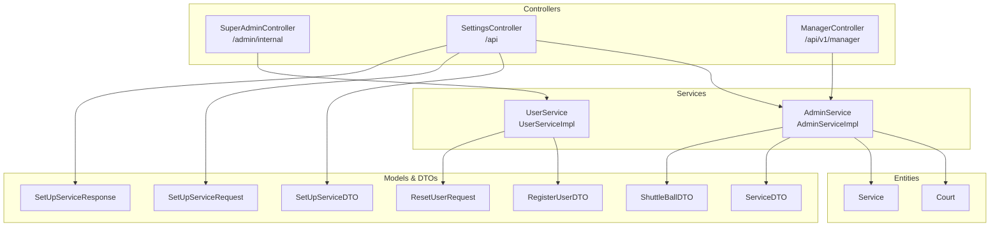
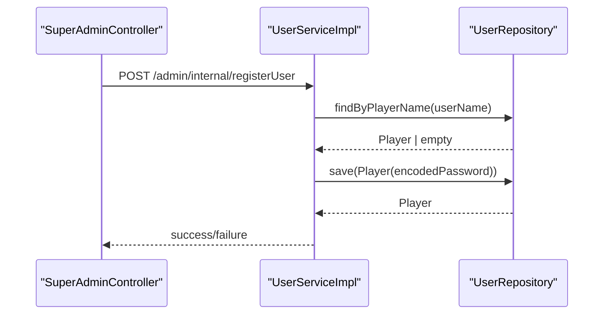
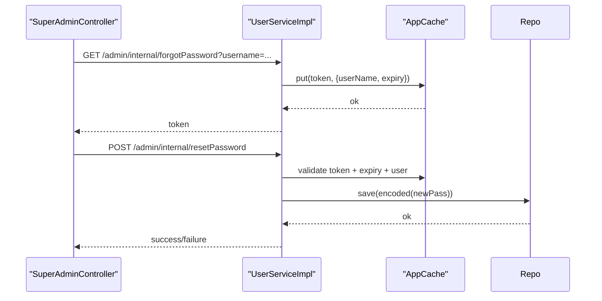
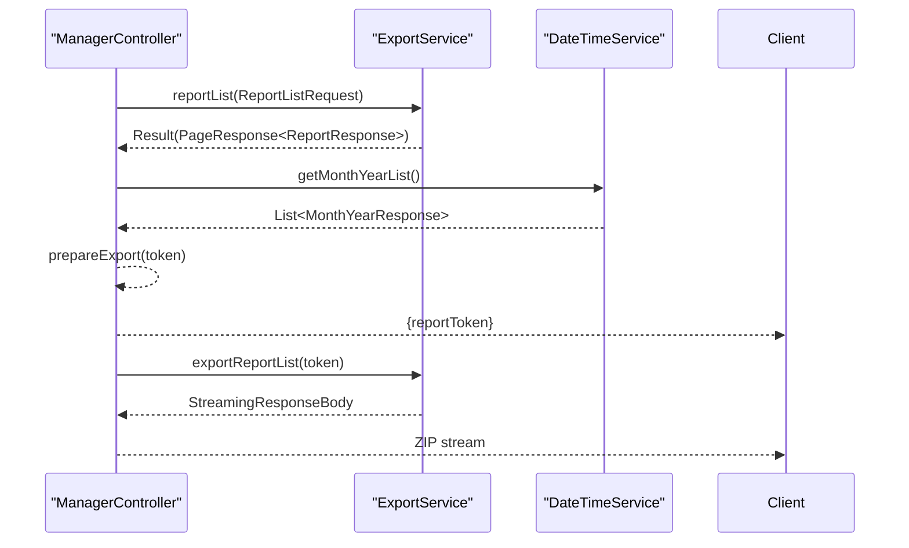
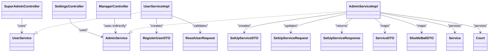

# Administrative Features

<cite>
**Referenced Files in This Document**
- [SuperAdminController.java](file://BadmintonCourtManagement/src/main/java/com/badminton/controller/SuperAdminController.java)
- [AdminServiceImpl.java](file://BadmintonCourtManagement/src/main/java/com/badminton/service/AdminServiceImpl.java)
- [SettingsController.java](file://BadmintonCourtManagement/src/main/java/com/badminton/controller/SettingsController.java)
- [ManagerController.java](file://BadmintonCourtManagement/src/main/java/com/badminton/controller/ManagerController.java)
- [UserService.java](file://BadmintonCourtManagement/src/main/java/com/badminton/service/UserService.java)
- [UserServiceImpl.java](file://BadmintonCourtManagement/src/main/java/com/badminton/service/UserServiceImpl.java)
- [AdminService.java](file://BadmintonCourtManagement/src/main/java/com/badminton/service/AdminService.java)
- [RegisterUserDTO.java](file://BadmintonCourtManagement/src/main/java/com/badminton/requestmodel/RegisterUserDTO.java)
- [ResetUserRequest.java](file://BadmintonCourtManagement/src/main/java/com/badminton/requestmodel/ResetUserRequest.java)
- [SetUpServiceDTO.java](file://BadmintonCourtManagement/src/main/java/com/badminton/requestmodel/SetUpServiceDTO.java)
- [SetUpServiceRequest.java](file://BadmintonCourtManagement/src/main/java/com/badminton/requestmodel/SetUpServiceRequest.java)
- [SetUpServiceResponse.java](file://BadmintonCourtManagement/src/main/java/com/badminton/response/SetUpServiceResponse.java)
- [ServiceDTO.java](file://BadmintonCourtManagement/src/main/java/com/badminton/model/dto/ServiceDTO.java)
- [ShuttleBallDTO.java](file://BadmintonCourtManagement/src/main/java/com/badminton/model/dto/ShuttleBallDTO.java)
- [Service.java](file://BadmintonCourtManagement/src/main/java/com/badminton/entity/Service.java)
- [Court.java](file://BadmintonCourtManagement/src/main/java/com/badminton/entity/Court.java)
</cite>

## Table of Contents
1. [Introduction](#introduction)
2. [Project Structure](#project-structure)
3. [Core Components](#core-components)
4. [Architecture Overview](#architecture-overview)
5. [Detailed Component Analysis](#detailed-component-analysis)
6. [Dependency Analysis](#dependency-analysis)
7. [Performance Considerations](#performance-considerations)
8. [Troubleshooting Guide](#troubleshooting-guide)
9. [Conclusion](#conclusion)
10. [Appendices](#appendices)

## Introduction
This document explains the administrative features of the Badminton Court Management system with a focus on:
- Super admin capabilities for internal admin functions (user creation and password reset)
- Administrative operations for system configuration (venues, shuttles, services, pricing)
- Manager controller functionality for operational oversight and reporting
- User administration workflows, role assignment, and permission management
- System configuration options, defaults, and operational parameters
- Administrative workflows for adding users, resetting credentials, configuring venue settings, and managing system parameters

## Project Structure
Administrative features are implemented across controllers, services, repositories, request/response models, and entities. The primary administrative endpoints are exposed via:
- SuperAdminController: internal admin endpoints for user registration and password reset
- SettingsController: system configuration endpoints for venues, shuttles, services, and pricing
- ManagerController: reporting and export endpoints for operational oversight

**Diagram sources**
- [SuperAdminController.java:14-49](file://BadmintonCourtManagement/src/main/java/com/badminton/controller/SuperAdminController.java#L14-L49)
- [SettingsController.java:13-62](file://BadmintonCourtManagement/src/main/java/com/badminton/controller/SettingsController.java#L13-L62)
- [ManagerController.java:32-121](file://BadmintonCourtManagement/src/main/java/com/badminton/controller/ManagerController.java#L32-L121)
- [AdminServiceImpl.java:26-290](file://BadmintonCourtManagement/src/main/java/com/badminton/service/AdminServiceImpl.java#L26-L290)
- [UserServiceImpl.java:19-91](file://BadmintonCourtManagement/src/main/java/com/badminton/service/UserServiceImpl.java#L19-L91)
- [SetUpServiceDTO.java:10-21](file://BadmintonCourtManagement/src/main/java/com/badminton/requestmodel/SetUpServiceDTO.java#L10-L21)
- [SetUpServiceRequest.java:12-23](file://BadmintonCourtManagement/src/main/java/com/badminton/requestmodel/SetUpServiceRequest.java#L12-L23)
- [SetUpServiceResponse.java:17-40](file://BadmintonCourtManagement/src/main/java/com/badminton/response/SetUpServiceResponse.java#L17-L40)
- [ServiceDTO.java:10-22](file://BadmintonCourtManagement/src/main/java/com/badminton/model/dto/ServiceDTO.java#L10-L22)
- [ShuttleBallDTO.java:10-25](file://BadmintonCourtManagement/src/main/java/com/badminton/model/dto/ShuttleBallDTO.java#L10-L25)
- [Service.java:11-53](file://BadmintonCourtManagement/src/main/java/com/badminton/entity/Service.java#L11-L53)
- [Court.java:11-42](file://BadmintonCourtManagement/src/main/java/com/badminton/entity/Court.java#L11-L42)

**Section sources**
- [SuperAdminController.java:14-49](file://BadmintonCourtManagement/src/main/java/com/badminton/controller/SuperAdminController.java#L14-L49)
- [SettingsController.java:13-62](file://BadmintonCourtManagement/src/main/java/com/badminton/controller/SettingsController.java#L13-L62)
- [ManagerController.java:32-121](file://BadmintonCourtManagement/src/main/java/com/badminton/controller/ManagerController.java#L32-L121)

## Core Components
- SuperAdminController: exposes internal admin endpoints for registering users and resetting passwords.
- AdminServiceImpl: implements administrative operations for configuring venues, shuttles, services, and pricing.
- SettingsController: exposes system configuration endpoints for retrieving, adding, updating, deleting services and shuttles.
- ManagerController: provides reporting and export endpoints for operational oversight.
- UserServiceImpl: handles user creation and password reset workflows with token validation and caching.

Key responsibilities:
- User management: create admin users, generate and validate reset tokens, reset passwords.
- System configuration: manage courts, shuttles, services, and pricing defaults.
- Operational oversight: report listing, report export, month/year selection, streaming exports.

**Section sources**
- [SuperAdminController.java:23-47](file://BadmintonCourtManagement/src/main/java/com/badminton/controller/SuperAdminController.java#L23-L47)
- [AdminServiceImpl.java:52-290](file://BadmintonCourtManagement/src/main/java/com/badminton/service/AdminServiceImpl.java#L52-L290)
- [SettingsController.java:20-61](file://BadmintonCourtManagement/src/main/java/com/badminton/controller/SettingsController.java#L20-L61)
- [ManagerController.java:44-78](file://BadmintonCourtManagement/src/main/java/com/badminton/controller/ManagerController.java#L44-L78)
- [UserServiceImpl.java:30-91](file://BadmintonCourtManagement/src/main/java/com/badminton/service/UserServiceImpl.java#L30-L91)

## Architecture Overview
Administrative workflows span controller-layer orchestration, service-layer business logic, and persistence via repositories. Controllers expose REST endpoints; services encapsulate domain logic; DTOs and models represent request/response structures.

**Diagram sources**
- [SuperAdminController.java:23-30](file://BadmintonCourtManagement/src/main/java/com/badminton/controller/SuperAdminController.java#L23-L30)
- [UserServiceImpl.java:30-43](file://BadmintonCourtManagement/src/main/java/com/badminton/service/UserServiceImpl.java#L30-L43)

**Diagram sources**
- [SuperAdminController.java:39-47](file://BadmintonCourtManagement/src/main/java/com/badminton/controller/SuperAdminController.java#L39-L47)
- [UserServiceImpl.java:51-91](file://BadmintonCourtManagement/src/main/java/com/badminton/service/UserServiceImpl.java#L51-L91)

**Diagram sources**
- [ManagerController.java:44-78](file://BadmintonCourtManagement/src/main/java/com/badminton/controller/ManagerController.java#L44-L78)

## Detailed Component Analysis

### SuperAdminController
Responsibilities:
- Register new admin users via internal endpoint
- Remove available players out of a session
- Generate password reset tokens
- Reset user passwords using validated tokens

Endpoints:
- POST /admin/internal/registerUser
- POST /admin/internal/removeAvaPlayerOutSession
- GET /admin/internal/forgotPassword
- POST /admin/internal/resetPassword

Operational notes:
- Uses UserService for user creation and password reset
- Uses CourtServicesServiceImpl for removing available players out of a session

**Section sources**
- [SuperAdminController.java:14-49](file://BadmintonCourtManagement/src/main/java/com/badminton/controller/SuperAdminController.java#L14-L49)
- [RegisterUserDTO.java:12-19](file://BadmintonCourtManagement/src/main/java/com/badminton/requestmodel/RegisterUserDTO.java#L12-L19)
- [ResetUserRequest.java:6-11](file://BadmintonCourtManagement/src/main/java/com/badminton/requestmodel/ResetUserRequest.java#L6-L11)

### AdminServiceImpl
Responsibilities:
- Configure venue settings (number of courts)
- Manage shuttles (add/update/delete)
- Manage services (add/update/delete)
- Maintain default pricing (cost per person)

Key methods:
- setUpService(SetUpServiceDTO): create/update shuttles, services, and cost-in-person
- updateSetUpService(SetUpServiceRequest): incremental updates for shuttles and services
- getSetUpService(): fetch current configuration
- deleteService(ServiceDTO), deleteShuttleBall(ShuttleBallDTO): soft-delete by deactivating items

Data handling:
- Courts: active count determines configured number
- Services: active/inactive flag controls visibility
- Shuttlles: active/inactive flag controls availability

**Section sources**
- [AdminServiceImpl.java:52-290](file://BadmintonCourtManagement/src/main/java/com/badminton/service/AdminServiceImpl.java#L52-L290)
- [Service.java:11-53](file://BadmintonCourtManagement/src/main/java/com/badminton/entity/Service.java#L11-L53)
- [Court.java:11-42](file://BadmintonCourtManagement/src/main/java/com/badminton/entity/Court.java#L11-L42)

### SettingsController
Responsibilities:
- Retrieve current setup (courts, shuttles, services)
- Add new setup (including shuttles, services, cost-in-person)
- Update existing setup incrementally
- Delete services and shuttles (soft-delete)

Endpoints:
- GET /api/getSetupServices
- POST /api/addSetupService
- POST /api/updateSetupService
- PUT /api/deleteService
- PUT /api/deleteShuttleBall

**Section sources**
- [SettingsController.java:13-62](file://BadmintonCourtManagement/src/main/java/com/badminton/controller/SettingsController.java#L13-L62)
- [SetUpServiceDTO.java:10-21](file://BadmintonCourtManagement/src/main/java/com/badminton/requestmodel/SetUpServiceDTO.java#L10-L21)
- [SetUpServiceRequest.java:12-23](file://BadmintonCourtManagement/src/main/java/com/badminton/requestmodel/SetUpServiceRequest.java#L12-L23)
- [SetUpServiceResponse.java:17-40](file://BadmintonCourtManagement/src/main/java/com/badminton/response/SetUpServiceResponse.java#L17-L40)

### ManagerController
Responsibilities:
- Report listing and pagination
- Report export (single and batch/streaming)
- Month/year selection for reports
- Token-based preparation and streaming downloads

Endpoints:
- POST /api/v1/manager/reportList
- GET /api/v1/manager/reportExport/{sessionId}
- GET /api/v1/manager/stream/reportExportList/{token}
- GET /api/v1/manager/getMonthYear
- POST /api/v1/manager/reportToken
- GET /api/v1/manager/download/{token}

Operational notes:
- Uses ExportService for report generation and streaming
- Uses DateTimeService for month/year selection
- Maintains temporary export cache keyed by token

**Section sources**
- [ManagerController.java:32-121](file://BadmintonCourtManagement/src/main/java/com/badminton/controller/ManagerController.java#L32-L121)

### UserService and Password Reset Workflow
Responsibilities:
- Save admin users during registration
- Generate reset tokens and persist them in cache
- Validate reset requests and apply new passwords

Validation steps:
- Token existence and freshness
- Username match
- New password confirmation

**Section sources**
- [UserService.java:7-16](file://BadmintonCourtManagement/src/main/java/com/badminton/service/UserService.java#L7-L16)
- [UserServiceImpl.java:30-91](file://BadmintonCourtManagement/src/main/java/com/badminton/service/UserServiceImpl.java#L30-L91)
- [RegisterUserDTO.java:12-19](file://BadmintonCourtManagement/src/main/java/com/badminton/requestmodel/RegisterUserDTO.java#L12-L19)
- [ResetUserRequest.java:6-11](file://BadmintonCourtManagement/src/main/java/com/badminton/requestmodel/ResetUserRequest.java#L6-L11)

## Dependency Analysis
Administrative components depend on:
- Controllers depend on Services
- Services depend on Repositories and Entities
- DTOs and Responses decouple request/response shapes from entities

**Diagram sources**
- [SuperAdminController.java:14-49](file://BadmintonCourtManagement/src/main/java/com/badminton/controller/SuperAdminController.java#L14-L49)
- [SettingsController.java:13-62](file://BadmintonCourtManagement/src/main/java/com/badminton/controller/SettingsController.java#L13-L62)
- [ManagerController.java:32-121](file://BadmintonCourtManagement/src/main/java/com/badminton/controller/ManagerController.java#L32-L121)
- [UserServiceImpl.java:19-91](file://BadmintonCourtManagement/src/main/java/com/badminton/service/UserServiceImpl.java#L19-L91)
- [AdminServiceImpl.java:26-290](file://BadmintonCourtManagement/src/main/java/com/badminton/service/AdminServiceImpl.java#L26-L290)
- [RegisterUserDTO.java:12-19](file://BadmintonCourtManagement/src/main/java/com/badminton/requestmodel/RegisterUserDTO.java#L12-L19)
- [ResetUserRequest.java:6-11](file://BadmintonCourtManagement/src/main/java/com/badminton/requestmodel/ResetUserRequest.java#L6-L11)
- [SetUpServiceDTO.java:10-21](file://BadmintonCourtManagement/src/main/java/com/badminton/requestmodel/SetUpServiceDTO.java#L10-L21)
- [SetUpServiceRequest.java:12-23](file://BadmintonCourtManagement/src/main/java/com/badminton/requestmodel/SetUpServiceRequest.java#L12-L23)
- [SetUpServiceResponse.java:17-40](file://BadmintonCourtManagement/src/main/java/com/badminton/response/SetUpServiceResponse.java#L17-L40)
- [ServiceDTO.java:10-22](file://BadmintonCourtManagement/src/main/java/com/badminton/model/dto/ServiceDTO.java#L10-L22)
- [ShuttleBallDTO.java:10-25](file://BadmintonCourtManagement/src/main/java/com/badminton/model/dto/ShuttleBallDTO.java#L10-L25)
- [Service.java:11-53](file://BadmintonCourtManagement/src/main/java/com/badminton/entity/Service.java#L11-L53)
- [Court.java:11-42](file://BadmintonCourtManagement/src/main/java/com/badminton/entity/Court.java#L11-L42)

## Performance Considerations
- Batch saves: AdminServiceImpl uses batch persistence for shuttles and services to reduce database round-trips.
- Soft deletion: Deactivating entities avoids costly cascading deletes and supports auditability.
- Streaming exports: ManagerController streams large report exports to reduce memory overhead.
- Token caching: Password reset tokens are cached with expiry checks to avoid repeated database lookups.

## Troubleshooting Guide
Common issues and resolutions:
- Registration failures: Verify unique usernames and successful password encoding.
- Password reset errors: Ensure token validity, user match, and matching new/repeat passwords.
- Configuration updates: Confirm DTO completeness and that cost-in-person is properly formatted.
- Reporting export timeouts: Check token validity and streaming pipeline health.

**Section sources**
- [UserServiceImpl.java:79-88](file://BadmintonCourtManagement/src/main/java/com/badminton/service/UserServiceImpl.java#L79-L88)
- [AdminServiceImpl.java:52-90](file://BadmintonCourtManagement/src/main/java/com/badminton/service/AdminServiceImpl.java#L52-L90)
- [ManagerController.java:82-89](file://BadmintonCourtManagement/src/main/java/com/badminton/controller/ManagerController.java#L82-L89)

## Conclusion
The administrative subsystem provides robust capabilities for user management, system configuration, and operational oversight. SuperAdminController and UserServiceImpl handle internal admin functions including user creation and secure password resets. SettingsController and AdminServiceImpl manage venue, shuttle, and service configurations with flexible add/update/delete operations. ManagerController enables efficient reporting and export workflows. Together, these components support scalable administrative operations with clear separation of concerns and strong validation.

## Appendices

### Administrative Workflows

#### Adding a New User (Internal Admin)
- Endpoint: POST /admin/internal/registerUser
- Steps:
  - Prepare RegisterUserDTO with username, password, and optional metadata
  - Call endpoint and verify success response
- Notes:
  - Password is encoded before persistence
  - Unique username enforcement occurs at repository level

**Section sources**
- [SuperAdminController.java:23-30](file://BadmintonCourtManagement/src/main/java/com/badminton/controller/SuperAdminController.java#L23-L30)
- [UserServiceImpl.java:30-43](file://BadmintonCourtManagement/src/main/java/com/badminton/service/UserServiceImpl.java#L30-L43)
- [RegisterUserDTO.java:12-19](file://BadmintonCourtManagement/src/main/java/com/badminton/requestmodel/RegisterUserDTO.java#L12-L19)

#### Resetting a User’s Credentials
- Steps:
  - Request token: GET /admin/internal/forgotPassword?username=...
  - Reset password: POST /admin/internal/resetPassword with token and new credentials
- Validation:
  - Token must exist and not expire
  - Username must match the token holder
  - New password must equal repeat password

**Section sources**
- [SuperAdminController.java:39-47](file://BadmintonCourtManagement/src/main/java/com/badminton/controller/SuperAdminController.java#L39-L47)
- [UserServiceImpl.java:51-91](file://BadmintonCourtManagement/src/main/java/com/badminton/service/UserServiceImpl.java#L51-L91)
- [ResetUserRequest.java:6-11](file://BadmintonCourtManagement/src/main/java/com/badminton/requestmodel/ResetUserRequest.java#L6-L11)

#### Configuring Venue Settings (Courts, Shuttles, Services, Pricing)
- Retrieve current setup: GET /api/getSetupServices
- Add new setup: POST /api/addSetupService with total courts, cost-in-person, shuttles, services
- Update existing setup: POST /api/updateSetupService with added/deleted items
- Delete items: PUT /api/deleteService and PUT /api/deleteShuttleBall
- Defaults:
  - Cost-in-person is maintained via a dedicated service name and updated cost
  - Courts are activated/deactivated to match configured totals

**Section sources**
- [SettingsController.java:20-61](file://BadmintonCourtManagement/src/main/java/com/badminton/controller/SettingsController.java#L20-L61)
- [AdminServiceImpl.java:52-290](file://BadmintonCourtManagement/src/main/java/com/badminton/service/AdminServiceImpl.java#L52-L290)
- [SetUpServiceDTO.java:10-21](file://BadmintonCourtManagement/src/main/java/com/badminton/requestmodel/SetUpServiceDTO.java#L10-L21)
- [SetUpServiceRequest.java:12-23](file://BadmintonCourtManagement/src/main/java/com/badminton/requestmodel/SetUpServiceRequest.java#L12-L23)
- [Service.java:11-53](file://BadmintonCourtManagement/src/main/java/com/badminton/entity/Service.java#L11-L53)
- [Court.java:11-42](file://BadmintonCourtManagement/src/main/java/com/badminton/entity/Court.java#L11-L42)

#### Operational Oversight and Reporting
- Report listing: POST /api/v1/manager/reportList
- Single export: GET /api/v1/manager/reportExport/{sessionId}
- Batch/streaming export: GET /api/v1/manager/stream/reportExportList/{token}
- Month/year selection: GET /api/v1/manager/getMonthYear
- Tokenized preparation: POST /api/v1/manager/reportToken

**Section sources**
- [ManagerController.java:44-78](file://BadmintonCourtManagement/src/main/java/com/badminton/controller/ManagerController.java#L44-L78)

### Role Assignment and Permission Management
- Internal admin functions are exposed under /admin/internal and intended for privileged users.
- User roles are not modeled in the provided code; access control relies on endpoint protection and token-based flows.
- Recommendations:
  - Enforce role-based access control (RBAC) at controller level
  - Integrate with Spring Security to restrict /admin/internal endpoints to super admins
  - Add auditing for sensitive admin actions

[No sources needed since this section provides general guidance]