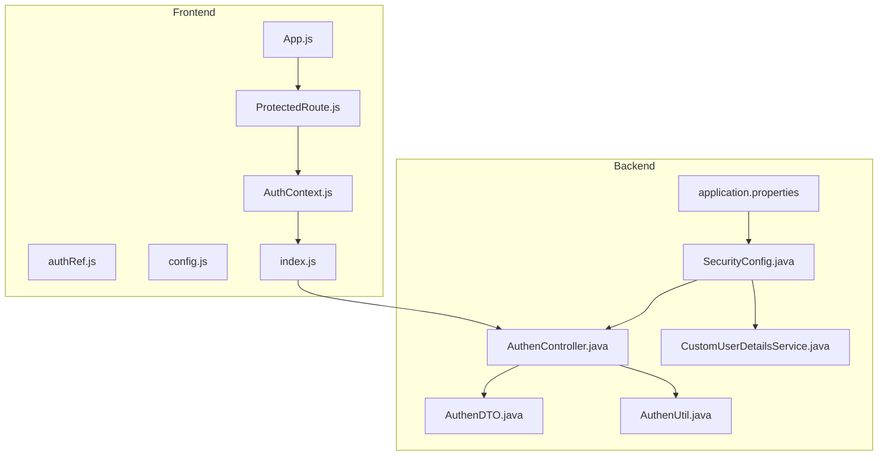
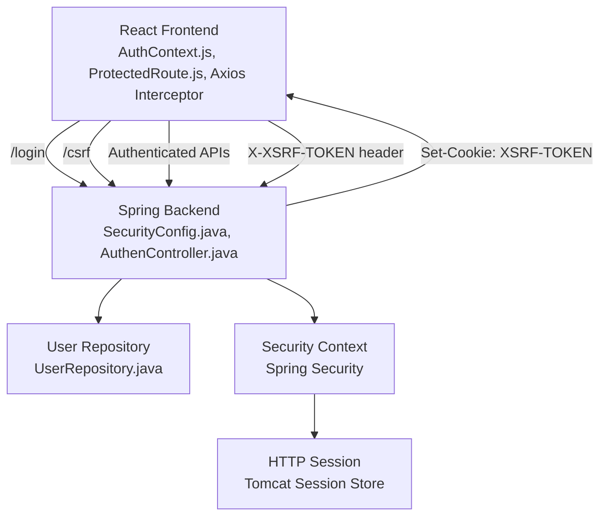
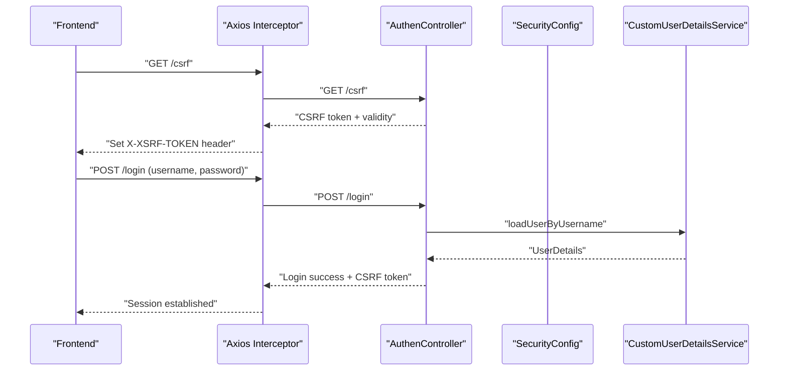

# Authentication & Security

<cite>
**Referenced Files in This Document**
- [SecurityConfig.java](file://BadmintonCourtManagement/src/main/java/com/badminton/config/SecurityConfig.java)
- [CustomUserDetailsService.java](file://BadmintonCourtManagement/src/main/java/com/badminton/CustomUserDetailsService.java)
- [AuthenController.java](file://BadmintonCourtManagement/src/main/java/com/badminton/controller/AuthenController.java)
- [AuthenDTO.java](file://BadmintonCourtManagement/src/main/java/com/badminton/requestmodel/AuthenDTO.java)
- [AuthenUtil.java](file://BadmintonCourtManagement/src/main/java/com/badminton/util/AuthenUtil.java)
- [application.properties](file://BadmintonCourtManagement/src/main/resources/application.properties)
- [AuthContext.js](file://bad-court-mana-ui/src/context/AuthContext.js)
- [ProtectedRoute.js](file://bad-court-mana-ui/src/context/ProtectedRoute.js)
- [authRef.js](file://bad-court-mana-ui/src/context/authRef.js)
- [config.js](file://bad-court-mana-ui/src/api/config.js)
- [index.js](file://bad-court-mana-ui/src/api/index.js)
- [App.js](file://bad-court-mana-ui/src/App.js)
- [Player.java](file://BadmintonCourtManagement/src/main/java/com/badminton/entity/Player.java)
- [UserRepository.java](file://BadmintonCourtManagement/src/main/java/com/badminton/repository/UserRepository.java)
</cite>

## Table of Contents
1. [Introduction](#introduction)
2. [Project Structure](#project-structure)
3. [Core Components](#core-components)
4. [Architecture Overview](#architecture-overview)
5. [Detailed Component Analysis](#detailed-component-analysis)
6. [Dependency Analysis](#dependency-analysis)
7. [Performance Considerations](#performance-considerations)
8. [Troubleshooting Guide](#troubleshooting-guide)
9. [Conclusion](#conclusion)

## Introduction
This document explains the authentication and security model of the Badminton Court Management system. It covers the session-based authentication with a 30-minute timeout, CSRF protection mechanisms, and the current role model. It documents the Spring Security configuration, custom user detail service implementation, password hashing with BCrypt, and session management. It also describes the frontend authentication context, protected route handling, and cookie-based session persistence. Finally, it outlines login/logout workflows, session timeout behavior, API endpoint security requirements, CORS configuration for React-frontend integration, and authentication flow diagrams.

## Project Structure
The authentication and security implementation spans the backend Spring Boot application and the React frontend:
- Backend: Spring Security configuration, custom user detail service, authentication controller, CSRF utilities, and session management.
- Frontend: Authentication context, protected routes, and Axios interceptors for CSRF and session handling.

**Diagram sources**
- [SecurityConfig.java:44-92](file://BadmintonCourtManagement/src/main/java/com/badminton/config/SecurityConfig.java#L44-L92)
- [CustomUserDetailsService.java:16-28](file://BadmintonCourtManagement/src/main/java/com/badminton/CustomUserDetailsService.java#L16-L28)
- [AuthenController.java:78-109](file://BadmintonCourtManagement/src/main/java/com/badminton/controller/AuthenController.java#L78-L109)
- [AuthenDTO.java:14-25](file://BadmintonCourtManagement/src/main/java/com/badminton/requestmodel/AuthenDTO.java#L14-L25)
- [AuthenUtil.java:9-19](file://BadmintonCourtManagement/src/main/java/com/badminton/util/AuthenUtil.java#L9-L19)
- [application.properties:4-17](file://BadmintonCourtManagement/src/main/resources/application.properties#L4-L17)
- [AuthContext.js:9-50](file://bad-court-mana-ui/src/context/AuthContext.js#L9-L50)
- [ProtectedRoute.js:8-33](file://bad-court-mana-ui/src/context/ProtectedRoute.js#L8-L33)
- [authRef.js:1-2](file://bad-court-mana-ui/src/context/authRef.js#L1-L2)
- [config.js:1-7](file://bad-court-mana-ui/src/api/config.js#L1-L7)
- [index.js:13-25](file://bad-court-mana-ui/src/api/index.js#L13-L25)
- [App.js:68-103](file://bad-court-mana-ui/src/App.js#L68-L103)

**Section sources**
- [SecurityConfig.java:44-92](file://BadmintonCourtManagement/src/main/java/com/badminton/config/SecurityConfig.java#L44-L92)
- [AuthenController.java:78-109](file://BadmintonCourtManagement/src/main/java/com/badminton/controller/AuthenController.java#L78-L109)
- [AuthContext.js:9-50](file://bad-court-mana-ui/src/context/AuthContext.js#L9-L50)
- [index.js:13-25](file://bad-court-mana-ui/src/api/index.js#L13-L25)

## Core Components
- Spring Security configuration with CSRF disabled for selected endpoints and CORS configured for frontend origins.
- Custom user detail service implementing the user lookup mechanism.
- Authentication controller handling login, CSRF token validation, and session creation.
- Frontend authentication context managing session state, CSRF token storage, and logout.
- Axios interceptor attaching CSRF tokens and handling unauthorized responses.

Key implementation references:
- Security filter chain and CORS configuration: [SecurityConfig.java:44-136](file://BadmintonCourtManagement/src/main/java/com/badminton/config/SecurityConfig.java#L44-L136)
- Password encoder (BCrypt): [SecurityConfig.java:106-109](file://BadmintonCourtManagement/src/main/java/com/badminton/config/SecurityConfig.java#L106-L109)
- Custom user detail service: [CustomUserDetailsService.java:16-28](file://BadmintonCourtManagement/src/main/java/com/badminton/CustomUserDetailsService.java#L16-L28)
- Login and CSRF token handling: [AuthenController.java:78-109](file://BadmintonCourtManagement/src/main/java/com/badminton/controller/AuthenController.java#L78-L109)
- CSRF token retrieval and validation: [AuthenController.java:45-73](file://BadmintonCourtManagement/src/main/java/com/badminton/controller/AuthenController.java#L45-L73)
- Frontend CSRF and session handling: [AuthContext.js:14-32](file://bad-court-mana-ui/src/context/AuthContext.js#L14-L32), [index.js:18-25](file://bad-court-mana-ui/src/api/index.js#L18-L25)

**Section sources**
- [SecurityConfig.java:44-136](file://BadmintonCourtManagement/src/main/java/com/badminton/config/SecurityConfig.java#L44-L136)
- [CustomUserDetailsService.java:16-28](file://BadmintonCourtManagement/src/main/java/com/badminton/CustomUserDetailsService.java#L16-L28)
- [AuthenController.java:45-109](file://BadmintonCourtManagement/src/main/java/com/badminton/controller/AuthenController.java#L45-L109)
- [AuthContext.js:14-32](file://bad-court-mana-ui/src/context/AuthContext.js#L14-L32)
- [index.js:18-25](file://bad-court-mana-ui/src/api/index.js#L18-L25)

## Architecture Overview
The system uses session-based authentication with CSRF protection via a cookie-based token repository. The frontend persists session via cookies and stores a CSRF token in memory for request headers. The backend validates sessions and enforces CSRF for non-exempt endpoints.

**Diagram sources**
- [SecurityConfig.java:48-53](file://BadmintonCourtManagement/src/main/java/com/badminton/config/SecurityConfig.java#L48-L53)
- [AuthenController.java:78-109](file://BadmintonCourtManagement/src/main/java/com/badminton/controller/AuthenController.java#L78-L109)
- [AuthContext.js:14-32](file://bad-court-mana-ui/src/context/AuthContext.js#L14-L32)
- [index.js:18-25](file://bad-court-mana-ui/src/api/index.js#L18-L25)
- [UserRepository.java:10-15](file://BadmintonCourtManagement/src/main/java/com/badminton/repository/UserRepository.java#L10-L15)

## Detailed Component Analysis

### Spring Security Configuration
- CSRF policy: Disabled for login and logout endpoints; cookie-based CSRF token repository configured.
- CORS policy: Allows localhost origins for frontend (ports 3000 and 8080) and credentials.
- Authorization: Public endpoints include login, logout, index, error, public assets, and CSRF; all other requests require authentication.
- Session management: Session creation policy set to IF_REQUIRED; server session timeout configured via application properties.

Implementation references:
- CSRF and CORS configuration: [SecurityConfig.java:48-53](file://BadmintonCourtManagement/src/main/java/com/badminton/config/SecurityConfig.java#L48-L53), [SecurityConfig.java:112-136](file://BadmintonCourtManagement/src/main/java/com/badminton/config/SecurityConfig.java#L112-L136)
- Authorization rules: [SecurityConfig.java:57-60](file://BadmintonCourtManagement/src/main/java/com/badminton/config/SecurityConfig.java#L57-L60)
- Session creation policy: [SecurityConfig.java:61-63](file://BadmintonCourtManagement/src/main/java/com/badminton/config/SecurityConfig.java#L61-L63)
- Password encoder bean: [SecurityConfig.java:106-109](file://BadmintonCourtManagement/src/main/java/com/badminton/config/SecurityConfig.java#L106-L109)

**Section sources**
- [SecurityConfig.java:48-63](file://BadmintonCourtManagement/src/main/java/com/badminton/config/SecurityConfig.java#L48-L63)
- [SecurityConfig.java:112-136](file://BadmintonCourtManagement/src/main/java/com/badminton/config/SecurityConfig.java#L112-L136)
- [SecurityConfig.java:106-109](file://BadmintonCourtManagement/src/main/java/com/badminton/config/SecurityConfig.java#L106-L109)

### Custom User Detail Service
- Loads user by username from the user repository.
- Returns a Spring Security UserDetails object with username, password, and empty authorities collection.

Implementation references:
- User detail service: [CustomUserDetailsService.java:16-28](file://BadmintonCourtManagement/src/main/java/com/badminton/CustomUserDetailsService.java#L16-L28)
- User entity: [Player.java:20-38](file://BadmintonCourtManagement/src/main/java/com/badminton/entity/Player.java#L20-L38)
- User repository: [UserRepository.java:10-15](file://BadmintonCourtManagement/src/main/java/com/badminton/repository/UserRepository.java#L10-L15)

**Section sources**
- [CustomUserDetailsService.java:16-28](file://BadmintonCourtManagement/src/main/java/com/badminton/CustomUserDetailsService.java#L16-L28)
- [Player.java:20-38](file://BadmintonCourtManagement/src/main/java/com/badminton/entity/Player.java#L20-L38)
- [UserRepository.java:10-15](file://BadmintonCourtManagement/src/main/java/com/badminton/repository/UserRepository.java#L10-L15)

### Authentication Controller
- Login endpoint authenticates credentials, sets security context, creates/updates session, and returns CSRF token.
- CSRF endpoint validates session existence, CSRF token presence, and token age against configured timeout.
- Session timeout is enforced via MAX_TOKEN_AGE_MILLIS and session.setMaxInactiveInterval.

Implementation references:
- Login workflow: [AuthenController.java:78-109](file://BadmintonCourtManagement/src/main/java/com/badminton/controller/AuthenController.java#L78-L109)
- CSRF validation: [AuthenController.java:45-73](file://BadmintonCourtManagement/src/main/java/com/badminton/controller/AuthenController.java#L45-L73)
- Session timeout property: [application.properties](file://BadmintonCourtManagement/src/main/resources/application.properties#L17)
- CSRF token creation utility: [AuthenUtil.java:9-19](file://BadmintonCourtManagement/src/main/java/com/badminton/util/AuthenUtil.java#L9-L19)
- DTO structure: [AuthenDTO.java:14-25](file://BadmintonCourtManagement/src/main/java/com/badminton/requestmodel/AuthenDTO.java#L14-L25)

**Section sources**
- [AuthenController.java:45-109](file://BadmintonCourtManagement/src/main/java/com/badminton/controller/AuthenController.java#L45-L109)
- [application.properties](file://BadmintonCourtManagement/src/main/resources/application.properties#L17)
- [AuthenUtil.java:9-19](file://BadmintonCourtManagement/src/main/java/com/badminton/util/AuthenUtil.java#L9-L19)
- [AuthenDTO.java:14-25](file://BadmintonCourtManagement/src/main/java/com/badminton/requestmodel/AuthenDTO.java#L14-L25)

### Frontend Authentication Context and Protected Routes
- On app initialization, the frontend fetches CSRF token and sets it in sessionStorage; it checks cookie presence to validate session.
- Axios interceptor attaches X-XSRF-TOKEN header from sessionStorage for authenticated requests.
- Logout triggers backend logout endpoint and clears frontend state.
- ProtectedRoute enforces navigation to login when not authenticated.

Implementation references:
- Session check and CSRF retrieval: [AuthContext.js:14-32](file://bad-court-mana-ui/src/context/AuthContext.js#L14-L32)
- Logout and state cleanup: [AuthContext.js:51-70](file://bad-court-mana-ui/src/context/AuthContext.js#L51-L70)
- Axios interceptor and CSRF header: [index.js:18-25](file://bad-court-mana-ui/src/api/index.js#L18-L25)
- Protected route behavior: [ProtectedRoute.js:8-33](file://bad-court-mana-ui/src/context/ProtectedRoute.js#L8-L33)
- App routing with protected routes: [App.js:68-103](file://bad-court-mana-ui/src/App.js#L68-L103)

**Section sources**
- [AuthContext.js:14-70](file://bad-court-mana-ui/src/context/AuthContext.js#L14-L70)
- [index.js:18-25](file://bad-court-mana-ui/src/api/index.js#L18-L25)
- [ProtectedRoute.js:8-33](file://bad-court-mana-ui/src/context/ProtectedRoute.js#L8-L33)
- [App.js:68-103](file://bad-court-mana-ui/src/App.js#L68-L103)

### Role-Based Access Control (RBAC)
- Current implementation loads users but does not assign roles or enforce role-based authorization in the security configuration.
- To implement RBAC, configure method-level or HTTP security rules to restrict endpoints by roles and populate GrantedAuthority instances in the user detail service.

Recommendations:
- Extend the user detail service to load roles from the database and return authorities.
- Add role-based HTTP security rules in SecurityConfig.
- Annotate service methods with @PreAuthorize or @PostAuthorize as needed.

[No sources needed since this section provides general guidance]

## Dependency Analysis
The authentication flow depends on the interplay between backend security configuration, authentication controller, and frontend context.

**Diagram sources**
- [AuthenController.java:45-109](file://BadmintonCourtManagement/src/main/java/com/badminton/controller/AuthenController.java#L45-L109)
- [SecurityConfig.java:48-53](file://BadmintonCourtManagement/src/main/java/com/badminton/config/SecurityConfig.java#L48-L53)
- [CustomUserDetailsService.java:16-28](file://BadmintonCourtManagement/src/main/java/com/badminton/CustomUserDetailsService.java#L16-L28)
- [index.js:18-25](file://bad-court-mana-ui/src/api/index.js#L18-L25)

**Section sources**
- [AuthenController.java:45-109](file://BadmintonCourtManagement/src/main/java/com/badminton/controller/AuthenController.java#L45-L109)
- [SecurityConfig.java:48-53](file://BadmintonCourtManagement/src/main/java/com/badminton/config/SecurityConfig.java#L48-L53)
- [CustomUserDetailsService.java:16-28](file://BadmintonCourtManagement/src/main/java/com/badminton/CustomUserDetailsService.java#L16-L28)
- [index.js:18-25](file://bad-court-mana-ui/src/api/index.js#L18-L25)

## Performance Considerations
- CSRF token validation occurs on the server during token retrieval; keep token age checks lightweight.
- Session timeout is enforced both at the server level and via application properties; ensure consistency.
- CORS configuration allows credentials; avoid wildcard origins in production.

[No sources needed since this section provides general guidance]

## Troubleshooting Guide
Common issues and resolutions:
- CSRF token missing or expired: The frontend should refresh the CSRF token via GET /csrf and ensure the cookie is present.
- Session invalid after 30 minutes: Verify session.setMaxInactiveInterval and application.properties session.timeout alignment.
- 401/403 responses: The frontend forces logout and redirects to login; inspect network tab for unauthorized responses.
- CORS errors: Confirm allowed origins and credentials in SecurityConfig and withCredentials in Axios.

Implementation references:
- CSRF validation and token age enforcement: [AuthenController.java:45-73](file://BadmintonCourtManagement/src/main/java/com/badminton/controller/AuthenController.java#L45-L73)
- Session timeout property: [application.properties](file://BadmintonCourtManagement/src/main/resources/application.properties#L17)
- Frontend unauthorized handling: [index.js:44-53](file://bad-court-mana-ui/src/api/index.js#L44-L53)
- Frontend forced logout: [AuthContext.js:63-70](file://bad-court-mana-ui/src/context/AuthContext.js#L63-L70)

**Section sources**
- [AuthenController.java:45-73](file://BadmintonCourtManagement/src/main/java/com/badminton/controller/AuthenController.java#L45-L73)
- [application.properties](file://BadmintonCourtManagement/src/main/resources/application.properties#L17)
- [index.js:44-53](file://bad-court-mana-ui/src/api/index.js#L44-L53)
- [AuthContext.js:63-70](file://bad-court-mana-ui/src/context/AuthContext.js#L63-L70)

## Conclusion
The system implements a pragmatic session-based authentication model with CSRF protection via cookie tokens and CORS configured for the React frontend. Login and CSRF endpoints manage session lifecycle and token validity, while the frontend maintains session state and enforces protected routes. To strengthen security, consider enabling CSRF for all endpoints, adding role-based access control, and hardening CORS and session configurations for production environments.