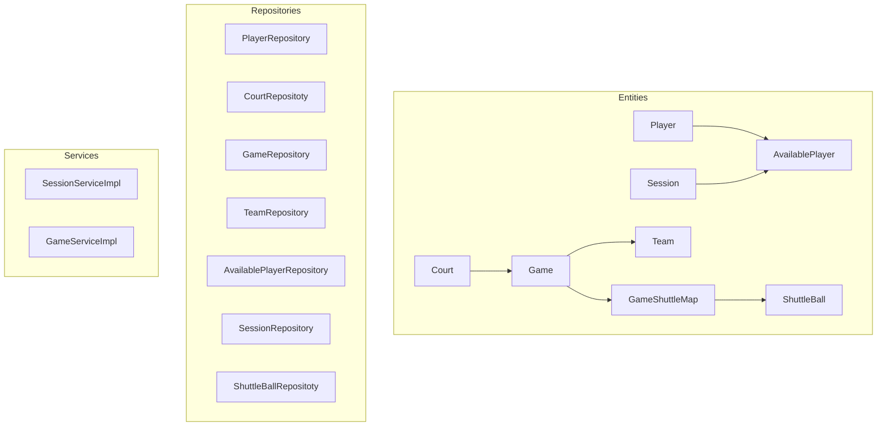
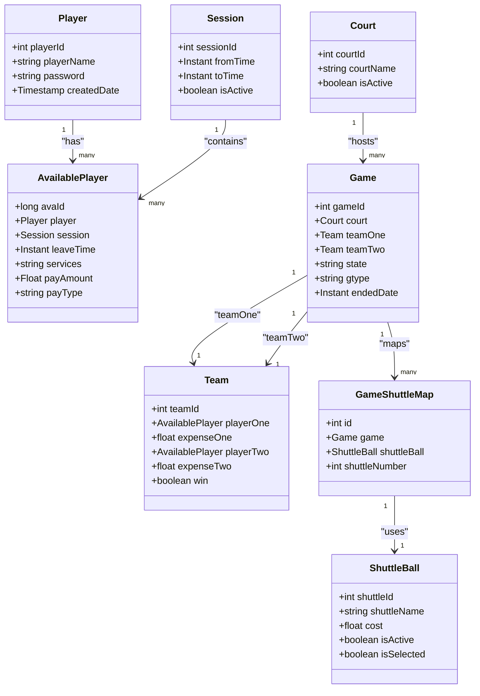
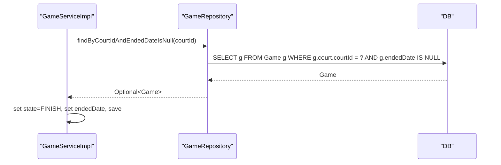
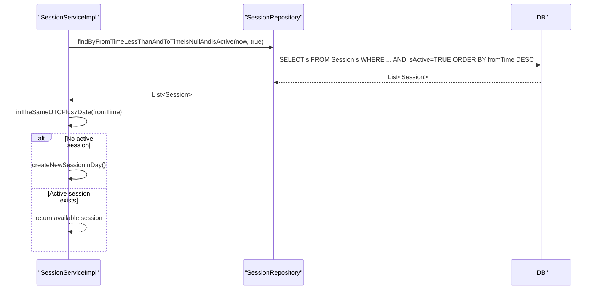
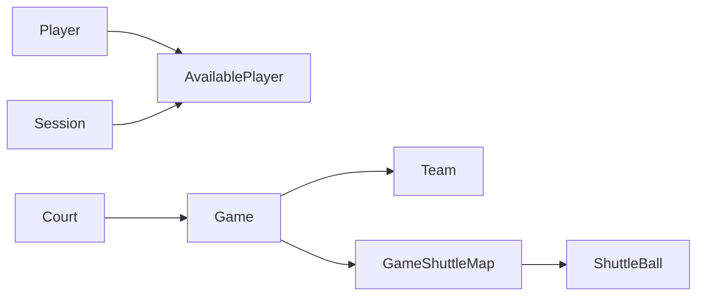

# Core Business Entities

<cite>
**Referenced Files in This Document**
- [Player.java](file://BadmintonCourtManagement/src/main/java/com/badminton/entity/Player.java)
- [AvailablePlayer.java](file://BadmintonCourtManagement/src/main/java/com/badminton/entity/AvailablePlayer.java)
- [Court.java](file://BadmintonCourtManagement/src/main/java/com/badminton/entity/Court.java)
- [Game.java](file://BadmintonCourtManagement/src/main/java/com/badminton/entity/Game.java)
- [GameShuttleMap.java](file://BadmintonCourtManagement/src/main/java/com/badminton/entity/GameShuttleMap.java)
- [Team.java](file://BadmintonCourtManagement/src/main/java/com/badminton/entity/Team.java)
- [Session.java](file://BadmintonCourtManagement/src/main/java/com/badminton/entity/Session.java)
- [ShuttleBall.java](file://BadmintonCourtManagement/src/main/java/com/badminton/entity/ShuttleBall.java)
- [GameRepository.java](file://BadmintonCourtManagement/src/main/java/com/badminton/repository/GameRepository.java)
- [CourtRepositoty.java](file://BadmintonCourtManagement/src/main/java/com/badminton/repository/CourtRepositoty.java)
- [TeamRepository.java](file://BadmintonCourtManagement/src/main/java/com/badminton/repository/TeamRepository.java)
- [GameState.java](file://BadmintonCourtManagement/src/main/java/com/badminton/constant/GameState.java)
- [GameType.java](file://BadmintonCourtManagement/src/main/java/com/badminton/constant/GameType.java)
- [SessionServiceImpl.java](file://BadmintonCourtManagement/src/main/java/com/badminton/service/SessionServiceImpl.java)
- [GameServiceImpl.java](file://BadmintonCourtManagement/src/main/java/com/badminton/service/impl/GameServiceImpl.java)
</cite>

## Table of Contents
1. [Introduction](#introduction)
2. [Project Structure](#project-structure)
3. [Core Components](#core-components)
4. [Architecture Overview](#architecture-overview)
5. [Detailed Component Analysis](#detailed-component-analysis)
6. [Dependency Analysis](#dependency-analysis)
7. [Performance Considerations](#performance-considerations)
8. [Troubleshooting Guide](#troubleshooting-guide)
9. [Conclusion](#conclusion)
10. [Appendices](#appendices)

## Introduction
This document describes the core business entities in the Badminton Court Management system with emphasis on data modeling, JPA annotations, relationships, constraints, and lifecycle management. It focuses on:
- Player: registration and availability linkage
- Court: facility definition and match hosting
- Game: match lifecycle, team composition, and equipment mapping
- Team: player pairings and outcome tracking
- Session: daily operational boundary and availability container
- ShuttleBall: equipment usage tracking

It also documents repository access patterns, integration with the session-centric domain model, and common query scenarios.

## Project Structure
The core entities reside under the entity package and are complemented by repositories and services that orchestrate lifecycle operations and queries.

**Diagram sources**
- [Player.java:1-39](file://BadmintonCourtManagement/src/main/java/com/badminton/entity/Player.java#L1-L39)
- [AvailablePlayer.java:1-58](file://BadmintonCourtManagement/src/main/java/com/badminton/entity/AvailablePlayer.java#L1-L58)
- [Session.java:1-42](file://BadmintonCourtManagement/src/main/java/com/badminton/entity/Session.java#L1-L42)
- [Court.java:1-43](file://BadmintonCourtManagement/src/main/java/com/badminton/entity/Court.java#L1-L43)
- [Game.java:1-79](file://BadmintonCourtManagement/src/main/java/com/badminton/entity/Game.java#L1-L79)
- [Team.java:1-40](file://BadmintonCourtManagement/src/main/java/com/badminton/entity/Team.java#L1-L40)
- [ShuttleBall.java:1-62](file://BadmintonCourtManagement/src/main/java/com/badminton/entity/ShuttleBall.java#L1-L62)
- [GameShuttleMap.java:1-31](file://BadmintonCourtManagement/src/main/java/com/badminton/entity/GameShuttleMap.java#L1-L31)
- [GameRepository.java:1-32](file://BadmintonCourtManagement/src/main/java/com/badminton/repository/GameRepository.java#L1-L32)
- [CourtRepositoty.java:1-19](file://BadmintonCourtManagement/src/main/java/com/badminton/repository/CourtRepositoty.java#L1-L19)
- [TeamRepository.java:1-10](file://BadmintonCourtManagement/src/main/java/com/badminton/repository/TeamRepository.java#L1-L10)
- [SessionServiceImpl.java:1-200](file://BadmintonCourtManagement/src/main/java/com/badminton/service/SessionServiceImpl.java#L1-L200)
- [GameServiceImpl.java:1-200](file://BadmintonCourtManagement/src/main/java/com/badminton/service/impl/GameServiceImpl.java#L1-L200)

**Section sources**
- [Player.java:1-39](file://BadmintonCourtManagement/src/main/java/com/badminton/entity/Player.java#L1-L39)
- [AvailablePlayer.java:1-58](file://BadmintonCourtManagement/src/main/java/com/badminton/entity/AvailablePlayer.java#L1-L58)
- [Session.java:1-42](file://BadmintonCourtManagement/src/main/java/com/badminton/entity/Session.java#L1-L42)
- [Court.java:1-43](file://BadmintonCourtManagement/src/main/java/com/badminton/entity/Court.java#L1-L43)
- [Game.java:1-79](file://BadmintonCourtManagement/src/main/java/com/badminton/entity/Game.java#L1-L79)
- [Team.java:1-40](file://BadmintonCourtManagement/src/main/java/com/badminton/entity/Team.java#L1-L40)
- [ShuttleBall.java:1-62](file://BadmintonCourtManagement/src/main/java/com/badminton/entity/ShuttleBall.java#L1-L62)
- [GameShuttleMap.java:1-31](file://BadmintonCourtManagement/src/main/java/com/badminton/entity/GameShuttleMap.java#L1-L31)
- [GameRepository.java:1-32](file://BadmintonCourtManagement/src/main/java/com/badminton/repository/GameRepository.java#L1-L32)
- [CourtRepositoty.java:1-19](file://BadmintonCourtManagement/src/main/java/com/badminton/repository/CourtRepositoty.java#L1-L19)
- [TeamRepository.java:1-10](file://BadmintonCourtManagement/src/main/java/com/badminton/repository/TeamRepository.java#L1-L10)
- [SessionServiceImpl.java:1-200](file://BadmintonCourtManagement/src/main/java/com/badminton/service/SessionServiceImpl.java#L1-L200)
- [GameServiceImpl.java:1-200](file://BadmintonCourtManagement/src/main/java/com/badminton/service/impl/GameServiceImpl.java#L1-L200)

## Core Components
This section outlines each entity’s role, fields, JPA annotations, and business rules.

- Player
  - Purpose: Registered person in the system.
  - Key fields: playerId (PK), playerName, password, createdDate (insertable=false, updatable=false).
  - Annotations: @Entity, @Table("player"), @Id, @GeneratedValue.
  - Notes: Password stored as-is; consider hashing in production.

- AvailablePlayer
  - Purpose: Links a Player to a Session, tracks availability and payment metadata.
  - Key fields: avaId (PK), player_id (FK), session_id (FK), leaveTime, services, payAmount, payType.
  - Annotations: @Entity, @Table("available_player"), @Id, @ManyToOne to Player and Session.
  - Constraints: player_id and session_id are non-null; services defaults to empty via helper method.

- Session
  - Purpose: Daily operational boundary; contains AvailablePlayer entries.
  - Key fields: sessionId (PK), fromTime, toTime, isActive, availablePlayers (mapped).
  - Annotations: @Entity, @Table("`session`"), @Id, @GeneratedValue, @OneToMany with cascade.
  - Lifecycle: Defaults to active=true; services manage open/close cycles.

- Court
  - Purpose: Facility hosting matches.
  - Key fields: courtId (PK), courtName, isActive, createdDate.
  - Annotations: @Entity, @Table("court"), @Id, @OneToMany(mappedBy="court").
  - Constraints: isActive defaults to true.

- Game
  - Purpose: Match lifecycle manager; links Court, Teams, and ShuttleBall mapping.
  - Key fields: gameId (PK), court (FK), state (GameState), gtype (GameType), endedDate, createdDate, shuttleMap (mapped), teamOne/teamTwo (OneToOne with cascade).
  - Annotations: @Entity, @Table("game"), @Id, @ManyToOne to Court, @OneToOne to Team, @OneToMany to GameShuttleMap with cascade.
  - Business rules: state initialized to NOT_START; endedDate set on finish/cancel; cascade ALL for teams and shuttle mapping.

- Team
  - Purpose: Pair of players per side; tracks expenses and outcome.
  - Key fields: teamId (PK), player_id1/player_id2 (FKs to AvailablePlayer), expense_1/expense_2, is_status (win), game (FK to Game).
  - Annotations: @Entity, @Table("team"), @Id, @ManyToOne to AvailablePlayer, @OneToOne to Game.
  - Constraints: One Game has two Teams; either can be null pending pairing.

- ShuttleBall
  - Purpose: Equipment tracked per game; supports cost and selection.
  - Key fields: shuttleId (PK), shuttle_name, cost, createdDate, is_active, is_selected.
  - Annotations: @Entity, @Table("shuttle_ball"), @Id, @Column naming.
  - Business rules: isActive defaults to true; helpers to toggle selection.

- GameShuttleMap
  - Purpose: Tracks ShuttleBall instances used in a Game with quantities.
  - Key fields: id (PK), game_id (FK), shuttle_id (FK), shuttleNumber.
  - Annotations: @Entity, @Id, @ManyToOne to Game, @OneToOne to ShuttleBall with cascade DETACH.

**Section sources**
- [Player.java:1-39](file://BadmintonCourtManagement/src/main/java/com/badminton/entity/Player.java#L1-L39)
- [AvailablePlayer.java:1-58](file://BadmintonCourtManagement/src/main/java/com/badminton/entity/AvailablePlayer.java#L1-L58)
- [Session.java:1-42](file://BadmintonCourtManagement/src/main/java/com/badminton/entity/Session.java#L1-L42)
- [Court.java:1-43](file://BadmintonCourtManagement/src/main/java/com/badminton/entity/Court.java#L1-L43)
- [Game.java:1-79](file://BadmintonCourtManagement/src/main/java/com/badminton/entity/Game.java#L1-L79)
- [Team.java:1-40](file://BadmintonCourtManagement/src/main/java/com/badminton/entity/Team.java#L1-L40)
- [ShuttleBall.java:1-62](file://BadmintonCourtManagement/src/main/java/com/badminton/entity/ShuttleBall.java#L1-L62)
- [GameShuttleMap.java:1-31](file://BadmintonCourtManagement/src/main/java/com/badminton/entity/GameShuttleMap.java#L1-L31)

## Architecture Overview
The system centers around Session as the daily operational unit. Players become AvailablePlayer entries during a Session. Games are scheduled on Courts and composed of two Teams. Equipment (ShuttleBall) is mapped per Game.

**Diagram sources**
- [Player.java:1-39](file://BadmintonCourtManagement/src/main/java/com/badminton/entity/Player.java#L1-L39)
- [AvailablePlayer.java:1-58](file://BadmintonCourtManagement/src/main/java/com/badminton/entity/AvailablePlayer.java#L1-L58)
- [Session.java:1-42](file://BadmintonCourtManagement/src/main/java/com/badminton/entity/Session.java#L1-L42)
- [Court.java:1-43](file://BadmintonCourtManagement/src/main/java/com/badminton/entity/Court.java#L1-L43)
- [Game.java:1-79](file://BadmintonCourtManagement/src/main/java/com/badminton/entity/Game.java#L1-L79)
- [Team.java:1-40](file://BadmintonCourtManagement/src/main/java/com/badminton/entity/Team.java#L1-L40)
- [ShuttleBall.java:1-62](file://BadmintonCourtManagement/src/main/java/com/badminton/entity/ShuttleBall.java#L1-L62)
- [GameShuttleMap.java:1-31](file://BadmintonCourtManagement/src/main/java/com/badminton/entity/GameShuttleMap.java#L1-L31)

## Detailed Component Analysis

### Player Entity
- Role: Core identity of a user registered in the system.
- JPA: @Entity, @Table("player"), @Id, @GeneratedValue.
- Data validation: None enforced at entity level; password stored as-is.
- Lifecycle: Created on registration; linked to sessions via AvailablePlayer.

**Section sources**
- [Player.java:1-39](file://BadmintonCourtManagement/src/main/java/com/badminton/entity/Player.java#L1-L39)

### AvailablePlayer Entity
- Role: Captures a Player’s presence and activity during a Session.
- JPA: @Entity, @Table("available_player"), @Id, @ManyToOne to Player and Session.
- Fields: leaveTime, services, payAmount, payType; services normalized via helper.
- Constraints: player_id and session_id are mandatory.

**Section sources**
- [AvailablePlayer.java:1-58](file://BadmintonCourtManagement/src/main/java/com/badminton/entity/AvailablePlayer.java#L1-L58)

### Session Entity
- Role: Daily operational boundary; holds AvailablePlayer entries.
- JPA: @Entity, @Table("`session`"), @Id, @GeneratedValue, @OneToMany with cascade.
- Lifecycle: isActive defaults true; services open/close manage fromTime/toTime.

**Section sources**
- [Session.java:1-42](file://BadmintonCourtManagement/src/main/java/com/badminton/entity/Session.java#L1-L42)

### Court Entity
- Role: Facility hosting matches.
- JPA: @Entity, @Table("court"), @Id, @GeneratedValue, @OneToMany(mappedBy="court").
- Constraints: isActive defaults true.

**Section sources**
- [Court.java:1-43](file://BadmintonCourtManagement/src/main/java/com/badminton/entity/Court.java#L1-L43)

### Game Entity
- Role: Manages match lifecycle, team composition, and equipment mapping.
- JPA: @Entity, @Table("game"), @Id, @ManyToOne to Court, @OneToOne to Team (cascade), @OneToMany to GameShuttleMap (cascade).
- State machine: state follows GameState enum; gtype follows GameType enum.
- Cascade: cascade ALL for teams and shuttle mapping; DETACH for shuttle mapping.

**Diagram sources**
- [GameServiceImpl.java:83-116](file://BadmintonCourtManagement/src/main/java/com/badminton/service/impl/GameServiceImpl.java#L83-L116)
- [GameRepository.java:18-22](file://BadmintonCourtManagement/src/main/java/com/badminton/repository/GameRepository.java#L18-L22)

**Section sources**
- [Game.java:1-79](file://BadmintonCourtManagement/src/main/java/com/badminton/entity/Game.java#L1-L79)
- [GameRepository.java:1-32](file://BadmintonCourtManagement/src/main/java/com/badminton/repository/GameRepository.java#L1-L32)
- [GameState.java:1-57](file://BadmintonCourtManagement/src/main/java/com/badminton/constant/GameState.java#L1-L57)
- [GameType.java:1-18](file://BadmintonCourtManagement/src/main/java/com/badminton/constant/GameType.java#L1-L18)
- [GameServiceImpl.java:83-116](file://BadmintonCourtManagement/src/main/java/com/badminton/service/impl/GameServiceImpl.java#L83-L116)

### Team Entity
- Role: Pair of players per side; tracks outcome and expenses.
- JPA: @Entity, @Table("team"), @Id, @ManyToOne to AvailablePlayer, @OneToOne to Game.
- Constraints: Either team can be null until finalized; win flag indicates outcome.

**Section sources**
- [Team.java:1-40](file://BadmintonCourtManagement/src/main/java/com/badminton/entity/Team.java#L1-L40)

### ShuttleBall Entity
- Role: Equipment used in games; tracks cost and selection.
- JPA: @Entity, @Table("shuttle_ball"), @Id, @Column naming.
- Helpers: setActiveBall/setDeActiveBall; theSameDTO compares name and cost.

**Section sources**
- [ShuttleBall.java:1-62](file://BadmintonCourtManagement/src/main/java/com/badminton/entity/ShuttleBall.java#L1-L62)

### GameShuttleMap Entity
- Role: Associates ShuttleBall to a Game with a quantity.
- JPA: @Entity, @Id, @ManyToOne to Game, @OneToOne to ShuttleBall with cascade DETACH.

**Section sources**
- [GameShuttleMap.java:1-31](file://BadmintonCourtManagement/src/main/java/com/badminton/entity/GameShuttleMap.java#L1-L31)

### Session-Centric Domain Model Integration
- SessionServiceImpl orchestrates session creation and closure, ensuring only one active session per day.
- It retrieves the current session and filters AvailablePlayer entries by player name and absence of leaveTime.

**Diagram sources**
- [SessionServiceImpl.java:85-103](file://BadmintonCourtManagement/src/main/java/com/badminton/service/SessionServiceImpl.java#L85-L103)

**Section sources**
- [SessionServiceImpl.java:76-103](file://BadmintonCourtManagement/src/main/java/com/badminton/service/SessionServiceImpl.java#L76-L103)

## Dependency Analysis
- Player → AvailablePlayer (many-to-one)
- Session → AvailablePlayer (one-to-many)
- Court → Game (one-to-many)
- Game → Team (one-to-one, optional)
- Game → GameShuttleMap (one-to-many)
- GameShuttleMap → ShuttleBall (one-to-one)

**Diagram sources**
- [Player.java:1-39](file://BadmintonCourtManagement/src/main/java/com/badminton/entity/Player.java#L1-L39)
- [AvailablePlayer.java:1-58](file://BadmintonCourtManagement/src/main/java/com/badminton/entity/AvailablePlayer.java#L1-L58)
- [Session.java:1-42](file://BadmintonCourtManagement/src/main/java/com/badminton/entity/Session.java#L1-L42)
- [Court.java:1-43](file://BadmintonCourtManagement/src/main/java/com/badminton/entity/Court.java#L1-L43)
- [Game.java:1-79](file://BadmintonCourtManagement/src/main/java/com/badminton/entity/Game.java#L1-L79)
- [Team.java:1-40](file://BadmintonCourtManagement/src/main/java/com/badminton/entity/Team.java#L1-L40)
- [GameShuttleMap.java:1-31](file://BadmintonCourtManagement/src/main/java/com/badminton/entity/GameShuttleMap.java#L1-L31)
- [ShuttleBall.java:1-62](file://BadmintonCourtManagement/src/main/java/com/badminton/entity/ShuttleBall.java#L1-L62)

**Section sources**
- [Player.java:1-39](file://BadmintonCourtManagement/src/main/java/com/badminton/entity/Player.java#L1-L39)
- [AvailablePlayer.java:1-58](file://BadmintonCourtManagement/src/main/java/com/badminton/entity/AvailablePlayer.java#L1-L58)
- [Session.java:1-42](file://BadmintonCourtManagement/src/main/java/com/badminton/entity/Session.java#L1-L42)
- [Court.java:1-43](file://BadmintonCourtManagement/src/main/java/com/badminton/entity/Court.java#L1-L43)
- [Game.java:1-79](file://BadmintonCourtManagement/src/main/java/com/badminton/entity/Game.java#L1-L79)
- [Team.java:1-40](file://BadmintonCourtManagement/src/main/java/com/badminton/entity/Team.java#L1-L40)
- [GameShuttleMap.java:1-31](file://BadmintonCourtManagement/src/main/java/com/badminton/entity/GameShuttleMap.java#L1-L31)
- [ShuttleBall.java:1-62](file://BadmintonCourtManagement/src/main/java/com/badminton/entity/ShuttleBall.java#L1-L62)

## Performance Considerations
- Prefer batch operations for session initialization and game termination to reduce round-trips.
- Use JOIN FETCH in queries where eager loading of associated entities (e.g., teams) is required to avoid N+1 selects.
- Indexes on frequently filtered columns: session.fromTime, session.toTime, game.court_id, game.state, game.endedDate.
- Limit cascading to only what is necessary; cascade ALL on Game teams and GameShuttleMap is appropriate for lifecycle consistency.

## Troubleshooting Guide
- Game not found on finish/cancel:
  - Verify active game exists for the given courtId with endedDate IS NULL.
  - Ensure GameState transitions follow NOT_START → START → FINISH/CANCEL.
- Session not created:
  - Confirm no active session exists for the current UTC+7 date.
  - Check time zone conversion and fromTime/toTime boundaries.
- Team pairing anomalies:
  - Ensure Team references are set before persisting Game with cascade.
  - Validate that either teamOne or teamTwo can be null until finalized.

**Section sources**
- [GameRepository.java:18-30](file://BadmintonCourtManagement/src/main/java/com/badminton/repository/GameRepository.java#L18-L30)
- [GameState.java:1-57](file://BadmintonCourtManagement/src/main/java/com/badminton/constant/GameState.java#L1-L57)
- [SessionServiceImpl.java:85-103](file://BadmintonCourtManagement/src/main/java/com/badminton/service/SessionServiceImpl.java#L85-L103)

## Conclusion
The core entities form a cohesive session-centric model: Sessions define daily boundaries, AvailablePlayer connects Players to Sessions, Courts host Games, Games manage Teams and ShuttleBall usage, and Teams track outcomes. JPA annotations and repository queries support efficient lifecycle management and common operational workflows.

## Appendices

### Typical Entity Relationships
- Player → AvailablePlayer → Session: Registration to daily availability.
- Court → Game: Facility to match scheduling.
- Game → Team ×2: Side composition with optional pairing.
- Game → GameShuttleMap → ShuttleBall: Equipment usage per match.

**Section sources**
- [AvailablePlayer.java:1-58](file://BadmintonCourtManagement/src/main/java/com/badminton/entity/AvailablePlayer.java#L1-L58)
- [Session.java:1-42](file://BadmintonCourtManagement/src/main/java/com/badminton/entity/Session.java#L1-L42)
- [Court.java:1-43](file://BadmintonCourtManagement/src/main/java/com/badminton/entity/Court.java#L1-L43)
- [Game.java:1-79](file://BadmintonCourtManagement/src/main/java/com/badminton/entity/Game.java#L1-L79)
- [Team.java:1-40](file://BadmintonCourtManagement/src/main/java/com/badminton/entity/Team.java#L1-L40)
- [GameShuttleMap.java:1-31](file://BadmintonCourtManagement/src/main/java/com/badminton/entity/GameShuttleMap.java#L1-L31)
- [ShuttleBall.java:1-62](file://BadmintonCourtManagement/src/main/java/com/badminton/entity/ShuttleBall.java#L1-L62)

### Common Query Patterns
- Find active games on a court:
  - JPQL: select g from Game g where g.court.courtId = ?1 and g.endedDate is null
  - Repository method: findByCourtIdAndEndedDateIsNull(int)
- Find in-progress games (not finished):
  - Repository method: findAllByStateInAndEndedDateIsNull(Set)
- Find games by player availability IDs:
  - JPQL: JOIN FETCH team members and left-join teams to load collections efficiently
  - Repository method: findGamesByPlayerIds(@Param("avaIds") List<Long>)

**Section sources**
- [GameRepository.java:18-30](file://BadmintonCourtManagement/src/main/java/com/badminton/repository/GameRepository.java#L18-L30)
- [CourtRepositoty.java:14-16](file://BadmintonCourtManagement/src/main/java/com/badminton/repository/CourtRepositoty.java#L14-L16)
- [TeamRepository.java:1-10](file://BadmintonCourtManagement/src/main/java/com/badminton/repository/TeamRepository.java#L1-L10)