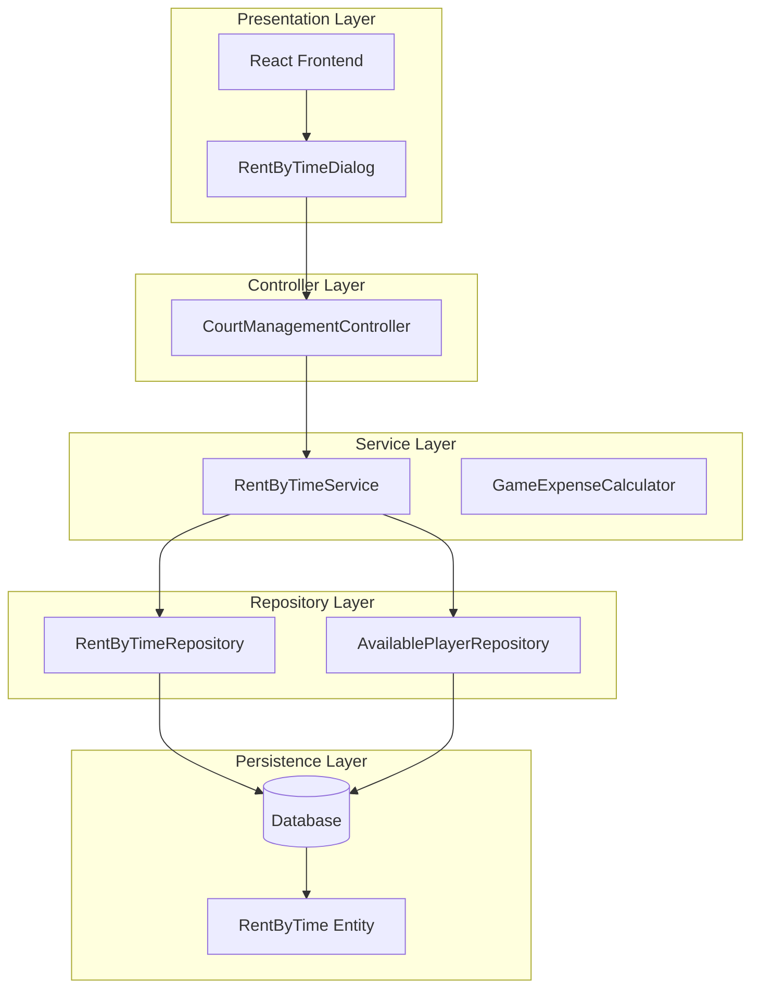
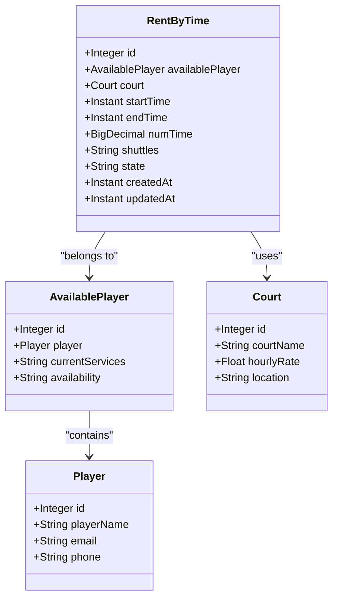
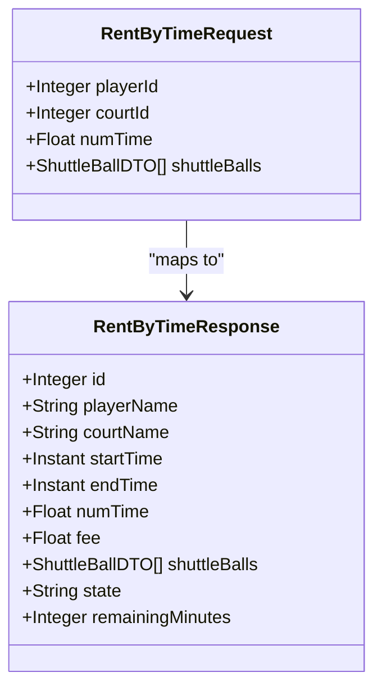
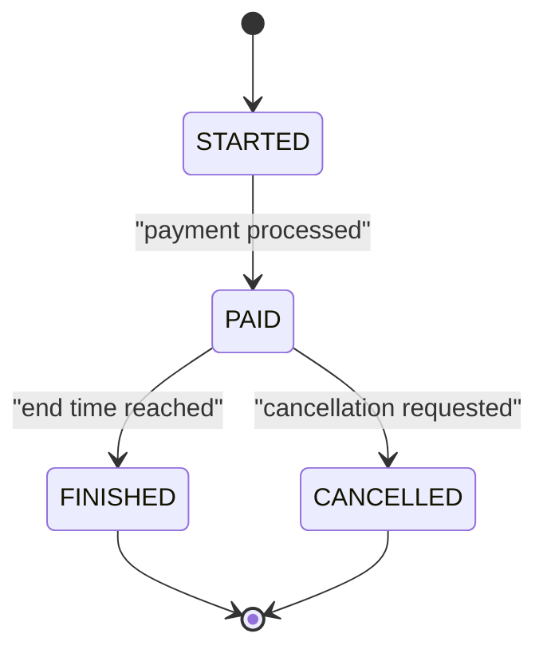
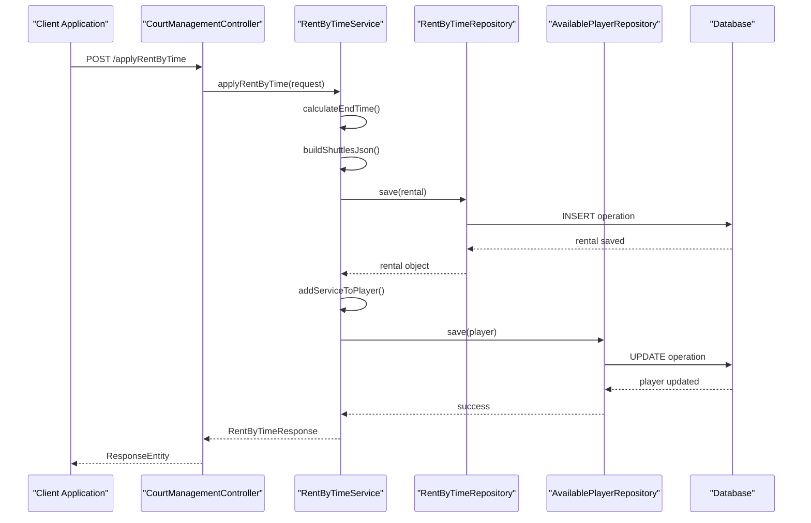
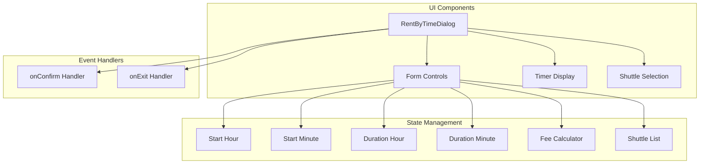
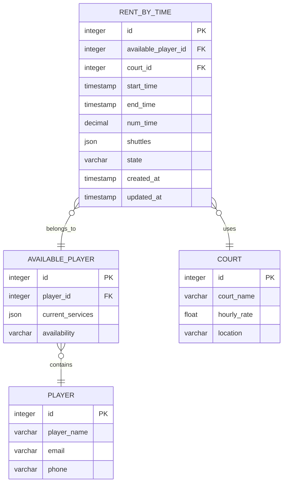
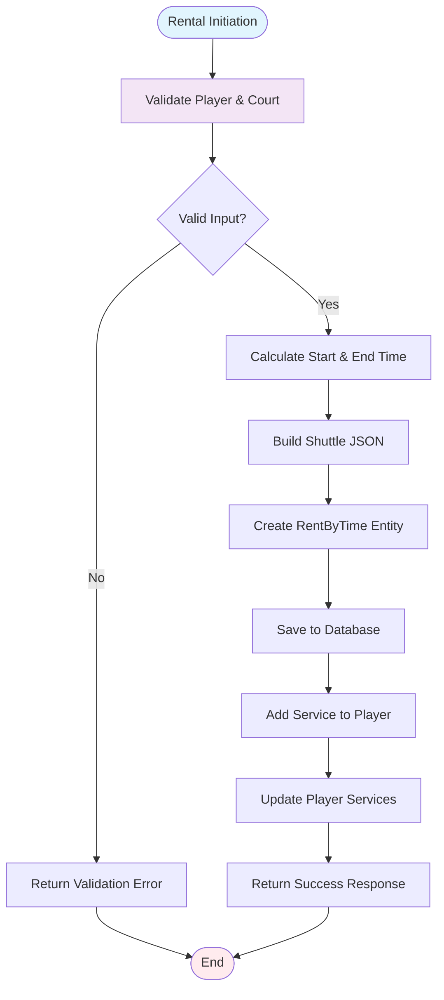
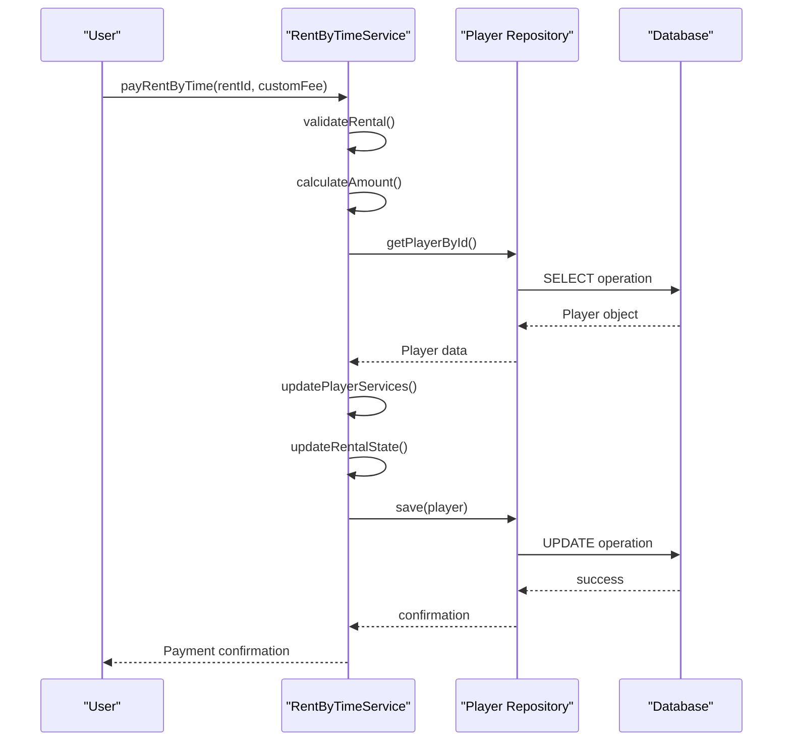

# RentByTime System

<cite>
**Referenced Files in This Document**
- [RentByTime.java](file://BadmintonCourtManagement/src/main/java/com/badminton/entity/RentByTime.java)
- [RentByTimeRepository.java](file://BadmintonCourtManagement/src/main/java/com/badminton/repository/RentByTimeRepository.java)
- [RentByTimeRequest.java](file://BadmintonCourtManagement/src/main/java/com/badminton/requestmodel/RentByTimeRequest.java)
- [RentByTimeResponse.java](file://BadmintonCourtManagement/src/main/java/com/badminton/response/RentByTimeResponse.java)
- [RentByTimeService.java](file://BadmintonCourtManagement/src/main/java/com/badminton/service/RentByTimeService.java)
- [CourtManagementController.java](file://BadmintonCourtManagement/src/main/java/com/badminton/controller/CourtManagementController.java)
- [RentByTimeDialog.js](file://bad-court-mana-ui/src/page/dialog/RentByTimeDialog.js)
- [rent-by-time.sql](file://BadmintonCourtManagement/src/main/resources/db/changelog/rent-by-time.sql)
- [GameState.java](file://BadmintonCourtManagement/src/main/java/com/badminton/constant/GameState.java)
- [GameConstant.java](file://BadmintonCourtManagement/src/main/java/com/badminton/constant/GameConstant.java)
- [PayType.java](file://BadmintonCourtManagement/src/main/java/com/badminton/constant/PayType.java)
- [ApiConstant.java](file://BadmintonCourtManagement/src/main/java/com/badminton/constant/ApiConstant.java)
- [CommonConstant.java](file://BadmintonCourtManagement/src/main/java/com/badminton/constant/CommonConstant.java)
- [ErrorConstant.java](file://BadmintonCourtManagement/src/main/java/com/badminton/constant/ErrorConstant.java)
- [SessionServiceImpl.java](file://BadmintonCourtManagement/src/main/java/com/badminton/service/impl/SessionServiceImpl.java)
- [AvailablePlayer.java](file://BadmintonCourtManagement/src/main/java/com/badminton/entity/AvailablePlayer.java)
- [Court.java](file://BadmintonCourtManagement/src/main/java/com/badminton/entity/Court.java)
- [Player.java](file://BadmintonCourtManagement/src/main/java/com/badminton/entity/Player.java)
- [ServiceUtil.java](file://BadmintonCourtManagement/src/main/java/com/badminton/util/ServiceUtil.java)
</cite>

## Table of Contents
1. [Introduction](#introduction)
2. [System Architecture](#system-architecture)
3. [Core Components](#core-components)
4. [RentByTime Entity Model](#rentbytime-entity-model)
5. [Service Layer Implementation](#service-layer-implementation)
6. [API Endpoints](#api-endpoints)
7. [UI Integration](#ui-integration)
8. [Database Schema](#database-schema)
9. [Business Logic Flow](#business-logic-flow)
10. [Error Handling](#error-handling)
11. [Performance Considerations](#performance-considerations)
12. [Conclusion](#conclusion)

## Introduction

The RentByTime System is a specialized module within the Badminton Court Management platform designed to handle time-based court rentals. This system enables customers to rent badminton courts for specific time periods, track rental status, manage payments, and monitor remaining time usage. The system integrates seamlessly with the broader court management infrastructure while providing dedicated functionality for time-based rentals.

The module supports real-time rental operations including initiation, payment processing, cancellation, updates, and status monitoring. It maintains accurate time tracking, calculates fees based on hourly rates, manages shuttle ball allocations, and provides comprehensive reporting capabilities for rental activities.

## System Architecture

The RentByTime System follows a layered architecture pattern with clear separation of concerns across different layers:



**Diagram sources**
- [CourtManagementController.java:176-214](file://BadmintonCourtManagement/src/main/java/com/badminton/controller/CourtManagementController.java#L176-L214)
- [RentByTimeService.java:73-255](file://BadmintonCourtManagement/src/main/java/com/badminton/service/RentByTimeService.java#L73-L255)

The architecture ensures loose coupling between components while maintaining clear data flow from user interface to database persistence. The service layer encapsulates business logic, while repositories handle data access operations.

**Section sources**
- [CourtManagementController.java:176-214](file://BadmintonCourtManagement/src/main/java/com/badminton/controller/CourtManagementController.java#L176-L214)
- [RentByTimeService.java:73-255](file://BadmintonCourtManagement/src/main/java/com/badminton/service/RentByTimeService.java#L73-L255)

## Core Components

### Entity Layer

The RentByTime entity serves as the core data structure representing rental transactions:



**Diagram sources**
- [RentByTime.java](file://BadmintonCourtManagement/src/main/java/com/badminton/entity/RentByTime.java)
- [AvailablePlayer.java](file://BadmintonCourtManagement/src/main/java/com/badminton/entity/AvailablePlayer.java)
- [Court.java](file://BadmintonCourtManagement/src/main/java/com/badminton/entity/Court.java)
- [Player.java](file://BadmintonCourtManagement/src/main/java/com/badminton/entity/Player.java)

### Request and Response Models

The system utilizes dedicated DTOs for request and response handling:



**Diagram sources**
- [RentByTimeRequest.java](file://BadmintonCourtManagement/src/main/java/com/badminton/requestmodel/RentByTimeRequest.java)
- [RentByTimeResponse.java](file://BadmintonCourtManagement/src/main/java/com/badminton/response/RentByTimeResponse.java)

**Section sources**
- [RentByTime.java](file://BadmintonCourtManagement/src/main/java/com/badminton/entity/RentByTime.java)
- [RentByTimeRequest.java](file://BadmintonCourtManagement/src/main/java/com/badminton/requestmodel/RentByTimeRequest.java)
- [RentByTimeResponse.java](file://BadmintonCourtManagement/src/main/java/com/badminton/response/RentByTimeResponse.java)

## RentByTime Entity Model

The RentByTime entity encapsulates all essential attributes for time-based court rentals:

### Core Attributes

| Attribute | Type | Description | Constraints |
|-----------|------|-------------|-------------|
| id | Integer | Unique identifier | Primary Key |
| availablePlayer | AvailablePlayer | Player associated with rental | Foreign Key |
| court | Court | Court being rented | Foreign Key |
| startTime | Instant | Rental start timestamp | Required |
| endTime | Instant | Rental end timestamp | Required |
| numTime | BigDecimal | Duration in hours | Precision: 2 decimal places |
| shuttles | String | JSON serialized shuttle balls | JSON format |
| state | String | Current rental state | Enumerated values |

### State Management

The system implements a finite state machine for rental lifecycle management:



**Diagram sources**
- [GameState.java](file://BadmintonCourtManagement/src/main/java/com/badminton/constant/GameState.java)

**Section sources**
- [RentByTime.java](file://BadmintonCourtManagement/src/main/java/com/badminton/entity/RentByTime.java)
- [GameState.java](file://BadmintonCourtManagement/src/main/java/com/badminton/constant/GameState.java)

## Service Layer Implementation

### Business Logic Implementation

The RentByTimeService handles all business operations for time-based rentals:



**Diagram sources**
- [CourtManagementController.java:176-180](file://BadmintonCourtManagement/src/main/java/com/badminton/controller/CourtManagementController.java#L176-L180)
- [RentByTimeService.java:73-94](file://BadmintonCourtManagement/src/main/java/com/badminton/service/RentByTimeService.java#L73-L94)

### Key Service Methods

The service layer implements several critical methods for rental management:

1. **applyRentByTime**: Creates new rental applications
2. **payRentByTime**: Processes payment for active rentals
3. **cancelRentByTime**: Handles rental cancellations
4. **updateRentByTime**: Modifies existing rental terms
5. **getActiveRentByTimeForCourt**: Retrieves current rentals

**Section sources**
- [RentByTimeService.java:73-255](file://BadmintonCourtManagement/src/main/java/com/badminton/service/RentByTimeService.java#L73-L255)

## API Endpoints

The RentByTime module exposes RESTful endpoints for comprehensive rental management:

### Endpoint Definitions

| Method | Endpoint | Description | Parameters |
|--------|----------|-------------|------------|
| POST | `/applyRentByTime` | Create new rental application | RentByTimeRequest body |
| POST | `/payRentByTime` | Process rental payment | rentId (path), customFee (optional) |
| POST | `/cancelRentByTime` | Cancel active rental | rentId (path) |
| POST | `/updateRentByTime` | Modify rental terms | rentId (path), RentByTimeRequest body |
| GET | `/getActiveRentByTime` | Get current rental | courtId (query) |
| GET | `/getCurrentTime` | Get server time | None |

### Request/Response Examples

**Apply Rent Request:**
```json
{
  "playerId": 1,
  "courtId": 5,
  "numTime": 2.5,
  "shuttleBalls": [
    {"name": "Bull Hide", "quantity": 3}
  ]
}
```

**Payment Response:**
```json
{
  "id": 101,
  "playerName": "John Doe",
  "courtName": "Court 1",
  "startTime": "2024-01-15T14:00:00Z",
  "endTime": "2024-01-15T16:30:00Z",
  "numTime": 2.5,
  "fee": 250000.0,
  "shuttleBalls": [...],
  "state": "PAID",
  "remainingMinutes": 150
}
```

**Section sources**
- [CourtManagementController.java:176-214](file://BadmintonCourtManagement/src/main/java/com/badminton/controller/CourtManagementController.java#L176-L214)

## UI Integration

### React Component Architecture

The frontend integration utilizes a modal dialog system for seamless user interaction:



**Diagram sources**
- [RentByTimeDialog.js:77-102](file://bad-court-mana-ui/src/page/dialog/RentByTimeDialog.js#L77-L102)

### User Interaction Flow

The UI provides intuitive controls for rental management:

1. **Time Configuration**: Users can set start time, duration, and automatically calculated end time
2. **Fee Calculation**: Real-time fee calculation based on hourly rate and duration
3. **Shuttle Selection**: Dropdown selection for shuttle ball types and quantities
4. **Confirmation**: Modal-based confirmation with validation

**Section sources**
- [RentByTimeDialog.js:77-102](file://bad-court-mana-ui/src/page/dialog/RentByTimeDialog.js#L77-L102)

## Database Schema

### Table Structure

The RentByTime functionality relies on a well-designed database schema:



**Diagram sources**
- [rent-by-time.sql](file://BadmintonCourtManagement/src/main/resources/db/changelog/rent-by-time.sql)

### Schema Evolution

The database schema supports flexible data types for dynamic shuttle ball management and maintains referential integrity through foreign key constraints. The JSON field for shuttles allows for scalable storage of equipment data without schema modifications.

**Section sources**
- [rent-by-time.sql](file://BadmintonCourtManagement/src/main/resources/db/changelog/rent-by-time.sql)

## Business Logic Flow

### Rental Lifecycle Management

The system implements comprehensive business logic for rental operations:



**Diagram sources**
- [RentByTimeService.java:73-94](file://BadmintonCourtManagement/src/main/java/com/badminton/service/RentByTimeService.java#L73-L94)

### Payment Processing Logic

Payment operations follow a secure and auditable process:



**Diagram sources**
- [RentByTimeService.java:96-130](file://BadmintonCourtManagement/src/main/java/com/badminton/service/RentByTimeService.java#L96-L130)

**Section sources**
- [RentByTimeService.java:73-255](file://BadmintonCourtManagement/src/main/java/com/badminton/service/RentByTimeService.java#L73-L255)

## Error Handling

### Exception Management

The system implements comprehensive error handling strategies:

| Exception Type | Trigger Condition | Response Status | Error Message |
|----------------|-------------------|-----------------|---------------|
| IllegalArgumentException | Rental not found | 400 Bad Request | "Rental not found" |
| ElementNotExistException | Player/court missing | 404 Not Found | "Entity not exists" |
| BusinessException | Business validation failure | 400 Bad Request | Specific business error |
| GlobalExceptionHandler | Unhandled exceptions | 500 Internal Server Error | Generic error message |

### Error Prevention Strategies

1. **Input Validation**: Comprehensive validation at service layer boundaries
2. **State Validation**: Ensures operations are performed in correct rental state
3. **Concurrency Control**: Prevents race conditions during rental updates
4. **Transaction Management**: Atomic operations for data consistency

**Section sources**
- [GlobalExceptionHandler.java](file://BadmintonCourtManagement/src/main/java/com/badminton/exception/GlobalExceptionHandler.java)
- [ElementNotExistException.java](file://BadmintonCourtManagement/src/main/java/com/badminton/exception/ElementNotExistException.java)

## Performance Considerations

### Optimization Strategies

1. **Database Indexing**: Strategic indexing on frequently queried columns (court_id, state, timestamps)
2. **Caching Mechanisms**: Utilization of application cache for frequently accessed configurations
3. **Connection Pooling**: Optimized database connection management
4. **Asynchronous Operations**: Non-blocking operations for time-intensive tasks

### Scalability Features

- **Horizontal Scaling**: Stateless service design supports load balancing
- **Database Optimization**: Efficient queries with proper indexing strategies
- **Memory Management**: Optimized object pooling for high-frequency operations
- **Monitoring Integration**: Built-in metrics collection for performance tracking

## Conclusion

The RentByTime System represents a comprehensive solution for managing time-based badminton court rentals. The system successfully combines modern architectural patterns with practical business requirements, providing:

- **Robust Business Logic**: Well-defined rental lifecycle management
- **User-Friendly Interface**: Intuitive React-based UI components
- **Scalable Architecture**: Layered design supporting future enhancements
- **Comprehensive Error Handling**: Fault-tolerant operations with clear error reporting
- **Performance Optimization**: Efficient database operations and caching strategies

The modular design ensures maintainability while the clear separation of concerns facilitates future extensions and modifications. The system provides a solid foundation for the broader Badminton Court Management platform, ready for production deployment and ongoing development.