# Court Management Interface

<cite>
**Referenced Files in This Document**
- [App.js](file://bad-court-mana-ui/src/App.js)
- [package.json](file://bad-court-mana-ui/package.json)
- [api/index.js](file://bad-court-mana-ui/src/api/index.js)
- [HomePage.js](file://bad-court-mana-ui/src/page/HomePage.js)
- [ItemTypes.js](file://bad-court-mana-ui/src/page/ItemTypes.js)
- [Court.js](file://bad-court-mana-ui/src/page/dragNdrop/Court.js)
- [DropZone.js](file://bad-court-mana-ui/src/page/dragNdrop/DropZone.js)
- [DraggablePlayer.js](file://bad-court-mana-ui/src/page/dragNdrop/DraggablePlayer.js)
- [PlayerArea.js](file://bad-court-mana-ui/src/page/dragNdrop/PlayerArea.js)
- [DraggableService.js](file://bad-court-mana-ui/src/page/dragNdrop/DraggableService.js)
- [style.css](file://bad-court-mana-ui/src/page/dragNdrop/style.css)
- [ServiceDialog.js](file://bad-court-mana-ui/src/page/dialog/ServiceDialog.js)
- [GameDialog.js](file://bad-court-mana-ui/src/page/dialog/GameDialog.js)
- [CourtManagementController.java](file://BadmintonCourtManagement/src/main/java/com/badminton/controller/CourtManagementController.java)
</cite>

## Update Summary
**Changes Made**
- Enhanced DropZone component with comprehensive click-to-search functionality and live filtering
- Added service search feature in ServiceDialog with integrated dropdown suggestions
- Improved player interaction capabilities with dual-mode search (add vs search)
- Implemented case-insensitive matching across all search functionalities
- Added integrated dialog interfaces for seamless user experience

## Table of Contents
1. [Introduction](#introduction)
2. [Project Structure](#project-structure)
3. [Core Components](#core-components)
4. [Architecture Overview](#architecture-overview)
5. [Detailed Component Analysis](#detailed-component-analysis)
6. [Enhanced Search Capabilities](#enhanced-search-capabilities)
7. [Dependency Analysis](#dependency-analysis)
8. [Performance Considerations](#performance-considerations)
9. [Troubleshooting Guide](#troubleshooting-guide)
10. [Conclusion](#conclusion)
11. [Appendices](#appendices)

## Introduction
This document describes the Court Management Interface, a React-based application enabling interactive drag-and-drop operations for managing badminton courts. The system has been enhanced with comprehensive search capabilities, allowing users to efficiently locate and manage players and services through intuitive click-to-search functionality and live filtering. The interface covers the HomePage main interface and specialized components for court visualization, player areas, draggable items, and service assignments, integrating with a Spring Boot backend via REST APIs for real-time updates.

## Project Structure
The frontend is a React application configured with routing, Material UI, and drag-and-drop libraries. The backend exposes REST endpoints under the /court-mana context for retrieving active courts, available players, services, and managing game states and player assignments. The enhanced search functionality spans multiple components including DropZone, PlayerArea, and ServiceDialog.

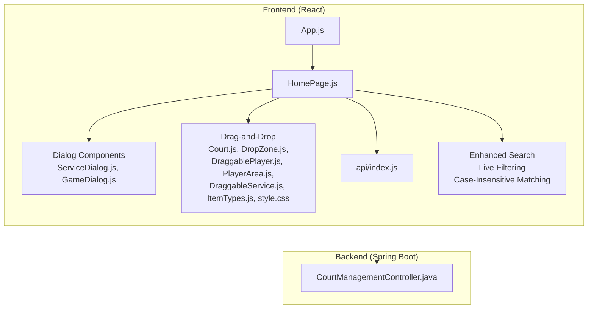

**Diagram sources**
- [App.js:20-101](file://bad-court-mana-ui/src/App.js#L20-L101)
- [HomePage.js:32-932](file://bad-court-mana-ui/src/page/HomePage.js#L32-L932)
- [api/index.js:1-101](file://bad-court-mana-ui/src/api/index.js#L1-L101)
- [CourtManagementController.java:25-164](file://BadmintonCourtManagement/src/main/java/com/badminton/controller/CourtManagementController.java#L25-L164)

**Section sources**
- [App.js:20-101](file://bad-court-mana-ui/src/App.js#L20-L101)
- [package.json:1-59](file://bad-court-mana-ui/package.json#L1-L59)

## Core Components
- HomePage: Orchestrates state, fetches initial data, manages drag-and-drop callbacks, coordinates dialogs for services, game results, payments, and cancellations, and implements enhanced search functionality.
- Drag-and-drop subsystem:
  - ItemTypes: Defines draggable categories (PLAYER, SERVICE).
  - DraggablePlayer: Represents a player with drag hooks, service drop targets, and click-to-open dialog functionality.
  - DropZone: Enhanced with click-to-search, live filtering, and dropdown suggestions for player assignment.
  - PlayerArea: Manages available players with dual-mode search (add vs search), live filtering, and enhanced interaction capabilities.
  - DraggableService: Allows dragging services to players with integrated search functionality.
  - Court: Renders a court grid with four positions A–D, action buttons, and enhanced player interaction.
- Dialogs:
  - ServiceDialog: Enhanced with service search, live filtering, and integrated dropdown suggestions for service assignment.
  - GameDialog: Collects winner and per-player expenses, validates totals, and confirms results.

**Section sources**
- [HomePage.js:32-932](file://bad-court-mana-ui/src/page/HomePage.js#L32-L932)
- [ItemTypes.js:1-4](file://bad-court-mana-ui/src/page/ItemTypes.js#L1-L4)
- [DraggablePlayer.js:6-53](file://bad-court-mana-ui/src/page/dragNdrop/DraggablePlayer.js#L6-L53)
- [DropZone.js:6-257](file://bad-court-mana-ui/src/page/dragNdrop/DropZone.js#L6-L257)
- [PlayerArea.js:9-174](file://bad-court-mana-ui/src/page/dragNdrop/PlayerArea.js#L9-L174)
- [DraggableService.js:7-43](file://bad-court-mana-ui/src/page/dragNdrop/DraggableService.js#L7-L43)
- [Court.js:11-130](file://bad-court-mana-ui/src/page/dragNdrop/Court.js#L11-L130)
- [ServiceDialog.js:18-237](file://bad-court-mana-ui/src/page/dialog/ServiceDialog.js#L18-L237)
- [GameDialog.js:19-455](file://bad-court-mana-ui/src/page/dialog/GameDialog.js#L19-L455)

## Architecture Overview
The system follows a layered architecture with enhanced search capabilities:
- Frontend: React components with React DnD for drag-and-drop, Material UI for UI, and comprehensive search functionality.
- Backend: REST endpoints for court management, services, players, and game state transitions.
- Communication: Axios-based API module handles requests/responses and interceptors for CSRF and error handling.

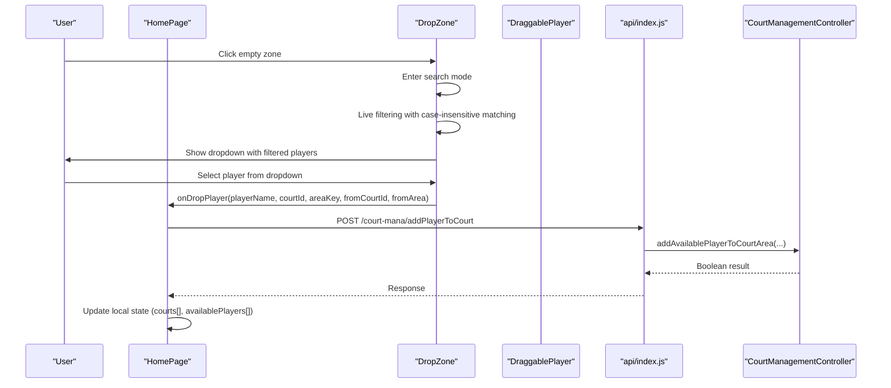

**Diagram sources**
- [HomePage.js:131-184](file://bad-court-mana-ui/src/page/HomePage.js#L131-L184)
- [DropZone.js:73-96](file://bad-court-mana-ui/src/page/dragNdrop/DropZone.js#L73-L96)
- [DraggablePlayer.js:7-27](file://bad-court-mana-ui/src/page/dragNdrop/DraggablePlayer.js#L7-L27)
- [api/index.js:13-25](file://bad-court-mana-ui/src/api/index.js#L13-L25)
- [CourtManagementController.java:124-130](file://BadmintonCourtManagement/src/main/java/com/badminton/controller/CourtManagementController.java#L124-L130)

## Detailed Component Analysis

### HomePage: Main Interface and State Management
- Responsibilities:
  - Fetches active courts, services, shuttle balls, and available players on mount.
  - Maintains local state for courts (positions A–D), locked courts, available players, selected shuttle ball, and player-service mapping.
  - Implements drag-and-drop callbacks for moving players between courts and assigning services to players.
  - Integrates dialogs for game result confirmation, payment/cancellation, and shuttle ball management.
  - Manages enhanced search functionality across all components.
- Key flows:
  - Initialization: Loads data from /court-mana endpoints and populates state with search capabilities.
  - Player movement: Validates current shuttle ball selection, removes player from previous location if needed, assigns to new court area, and updates UI state with live search feedback.
  - Services: Adds services to players via drag-and-drop or dialog, persists to backend, and updates local mapping with integrated search.
  - Game lifecycle: Starts matches, retrieves results, confirms outcomes, resets players, and updates service records.

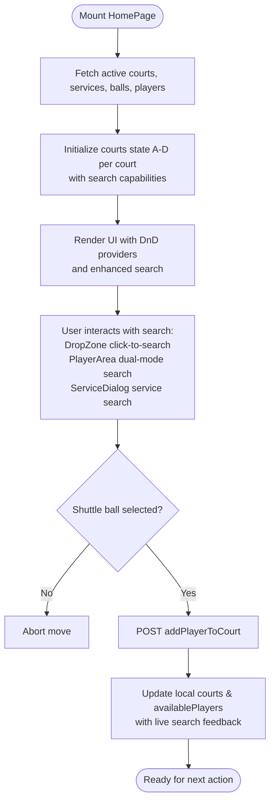

**Diagram sources**
- [HomePage.js:521-681](file://bad-court-mana-ui/src/page/HomePage.js#L521-L681)
- [HomePage.js:131-184](file://bad-court-mana-ui/src/page/HomePage.js#L131-L184)

**Section sources**
- [HomePage.js:32-932](file://bad-court-mana-ui/src/page/HomePage.js#L32-L932)

### Enhanced Drag-and-Drop Components

#### DraggablePlayer
- Purpose: Wraps a player with drag hooks, accepts service drops, and supports click-to-open dialog functionality.
- Behavior:
  - Prevents dragging when the court is locked.
  - Accepts service drops and triggers a highlight animation.
  - Supports click to open service dialog for player interaction.

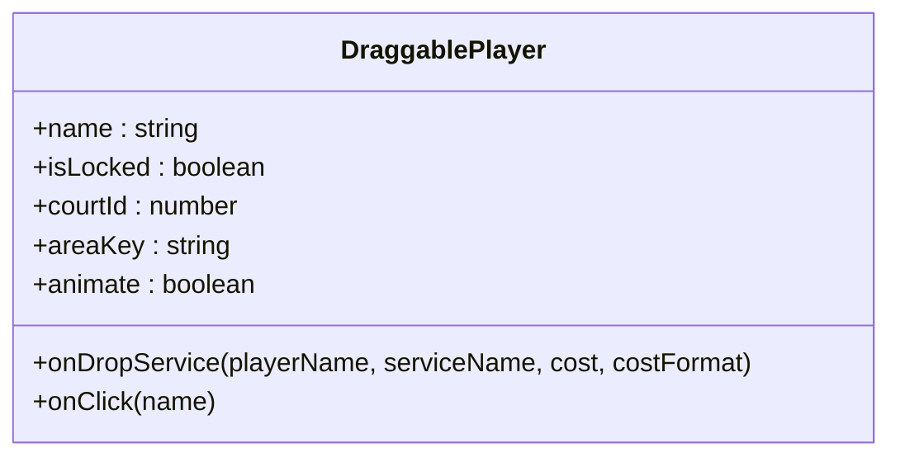

**Diagram sources**
- [DraggablePlayer.js:6-53](file://bad-court-mana-ui/src/page/dragNdrop/DraggablePlayer.js#L6-L53)

**Section sources**
- [DraggablePlayer.js:6-53](file://bad-court-mana-ui/src/page/dragNdrop/DraggablePlayer.js#L6-L53)
- [style.css:1-30](file://bad-court-mana-ui/src/page/dragNdrop/style.css#L1-L30)

#### DropZone
- Purpose: Enhanced with comprehensive search functionality, accepts players with visual feedback, prevents drops on locked courts, and provides live filtering.
- Behavior:
  - Highlights when a player is dragged over.
  - Enters search mode on click when empty and unlocked.
  - Provides live filtering with case-insensitive matching.
  - Shows dropdown with filtered player suggestions.
  - Supports keyboard navigation and Enter key submission.
  - Invokes onDropPlayer callback with origin and destination context.

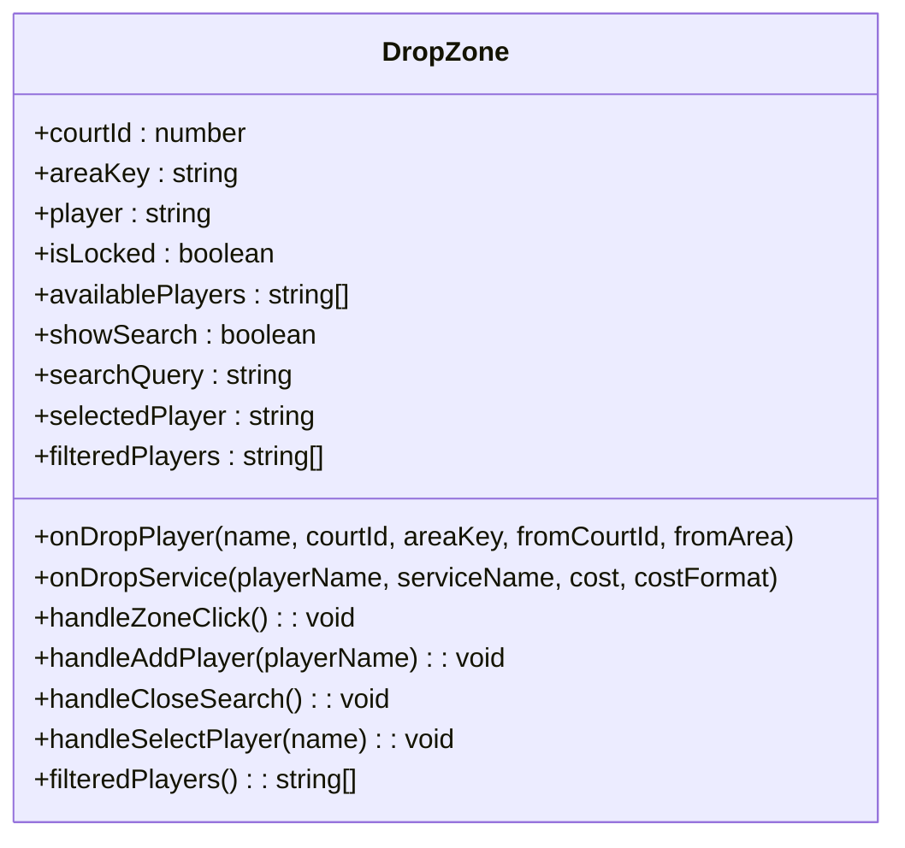

**Diagram sources**
- [DropZone.js:13-257](file://bad-court-mana-ui/src/page/dragNdrop/DropZone.js#L13-L257)

**Section sources**
- [DropZone.js:13-257](file://bad-court-mana-ui/src/page/dragNdrop/DropZone.js#L13-L257)

#### PlayerArea
- Purpose: Enhanced with dual-mode search functionality, manages available players, supports adding new players, and handles removal back to availability.
- Behavior:
  - Supports two modes: add mode and search mode.
  - Dual-mode search with live filtering and case-insensitive matching.
  - Toggle between add and search modes with dedicated icons.
  - Validates duplicates against the current availablePlayers list.
  - Handles Enter key submission and drop-to-remove.
  - Shows search results count and filtering feedback.

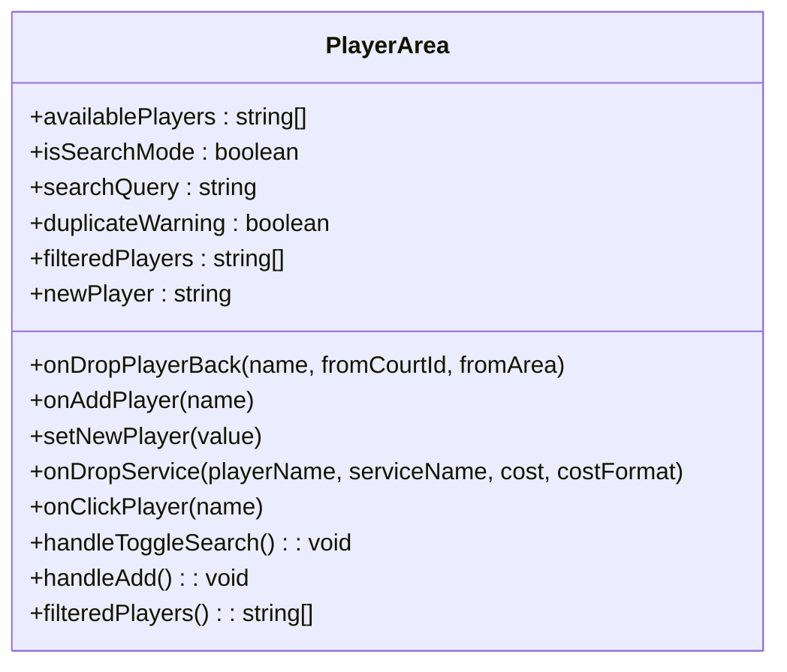

**Diagram sources**
- [PlayerArea.js:13-174](file://bad-court-mana-ui/src/page/dragNdrop/PlayerArea.js#L13-L174)

**Section sources**
- [PlayerArea.js:13-174](file://bad-court-mana-ui/src/page/dragNdrop/PlayerArea.js#L13-L174)

#### DraggableService
- Purpose: Allows dragging services to players for assignment with integrated search functionality.
- Behavior:
  - Provides drag hooks with item metadata (serviceName, cost, costFormat).
  - Supports click-to-open dialog for service management.

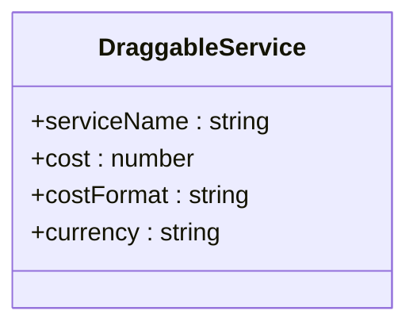

**Diagram sources**
- [DraggableService.js:7-43](file://bad-court-mana-ui/src/page/dragNdrop/DraggableService.js#L7-L43)

**Section sources**
- [DraggableService.js:7-43](file://bad-court-mana-ui/src/page/dragNdrop/DraggableService.js#L7-L43)

#### Court
- Purpose: Visualizes a single court with a 2x2 grid of DropZones labeled A–D and enhanced player interaction capabilities.
- Behavior:
  - Shows start button when unlocked and action buttons when locked (finish/cancel).
  - Displays hover controls to add shuttle balls during active games.
  - Supports enhanced player interaction through integrated search functionality.

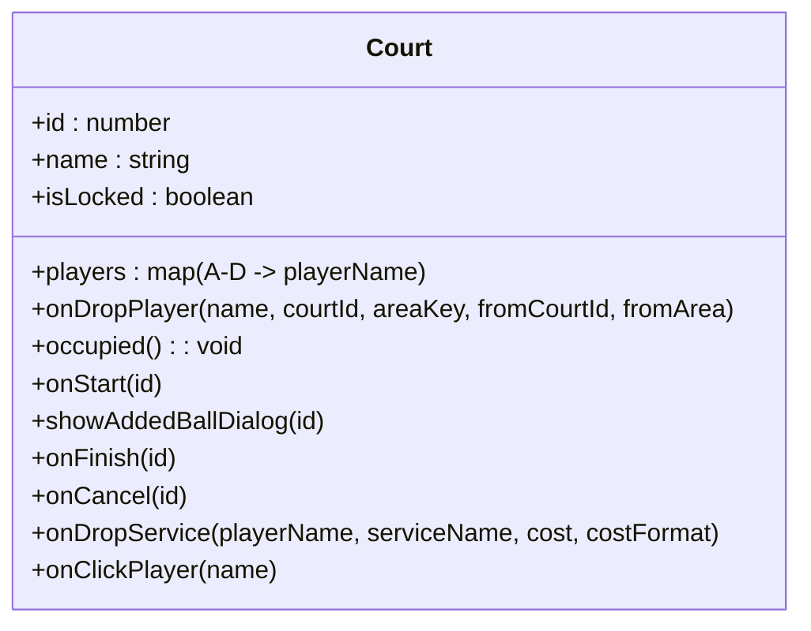

**Diagram sources**
- [Court.js:11-130](file://bad-court-mana-ui/src/page/dragNdrop/Court.js#L11-L130)

**Section sources**
- [Court.js:11-130](file://bad-court-mana-ui/src/page/dragNdrop/Court.js#L11-L130)

### Enhanced Dialog Components

#### ServiceDialog
- Purpose: Enhanced with comprehensive service search functionality, manage per-player services, compute totals, and trigger payment/cancellation actions.
- Behavior:
  - Adds/removes services and updates backend via updateServiceToPlayer.
  - Computes total cost and opens payment/cancel confirmation.
  - Provides live filtering of service options with case-insensitive matching.
  - Shows dropdown with matching service suggestions.
  - Supports keyboard navigation and Enter key submission.

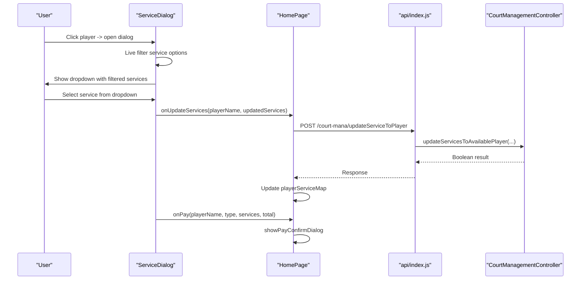

**Diagram sources**
- [ServiceDialog.js:18-237](file://bad-court-mana-ui/src/page/dialog/ServiceDialog.js#L18-L237)
- [HomePage.js:683-703](file://bad-court-mana-ui/src/page/HomePage.js#L683-L703)
- [CourtManagementController.java:108-114](file://BadmintonCourtManagement/src/main/java/com/badminton/controller/CourtManagementController.java#L108-L114)

**Section sources**
- [ServiceDialog.js:18-237](file://bad-court-mana-ui/src/page/dialog/ServiceDialog.js#L18-L237)

#### GameDialog
- Purpose: Capture winner and per-player expenses, validate totals, and confirm game results.
- Behavior:
  - Parses ball usage, computes totals, and distributes loser team's cost.
  - Posts confirmGameResult and resets players on completion.

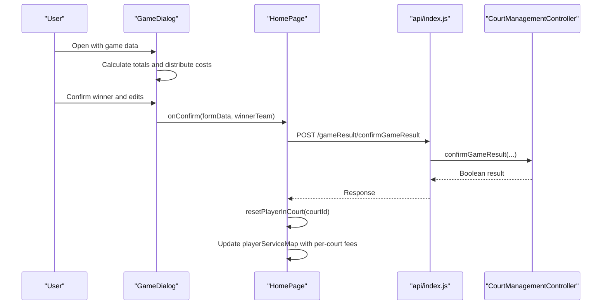

**Diagram sources**
- [GameDialog.js:19-455](file://bad-court-mana-ui/src/page/dialog/GameDialog.js#L19-L455)
- [HomePage.js:369-445](file://bad-court-mana-ui/src/page/HomePage.js#L369-L445)
- [CourtManagementController.java:145-153](file://BadmintonCourtManagement/src/main/java/com/badminton/controller/CourtManagementController.java#L145-L153)

**Section sources**
- [GameDialog.js:19-455](file://bad-court-mana-ui/src/page/dialog/GameDialog.js#L19-L455)

## Enhanced Search Capabilities

### Comprehensive Search Implementation
The system now features integrated search capabilities across multiple components with the following key features:

#### Live Filtering and Case-Insensitive Matching
- All search implementations use case-insensitive matching for improved user experience
- Real-time filtering updates as users type, providing immediate feedback
- Debounced search operations to optimize performance during rapid typing

#### Integrated Search Modes
- **DropZone Click-to-Search**: Users can click on empty court zones to activate search mode
- **PlayerArea Dual-Mode**: Toggle between add mode and search mode with dedicated icons
- **ServiceDialog Service Search**: Live filtering of available services for quick selection

#### Enhanced User Interaction
- Dropdown suggestions with highlighted matches
- Keyboard navigation support (Enter to select, Escape to close)
- Visual feedback for search results and filtering status
- Click-away detection to close search modes appropriately

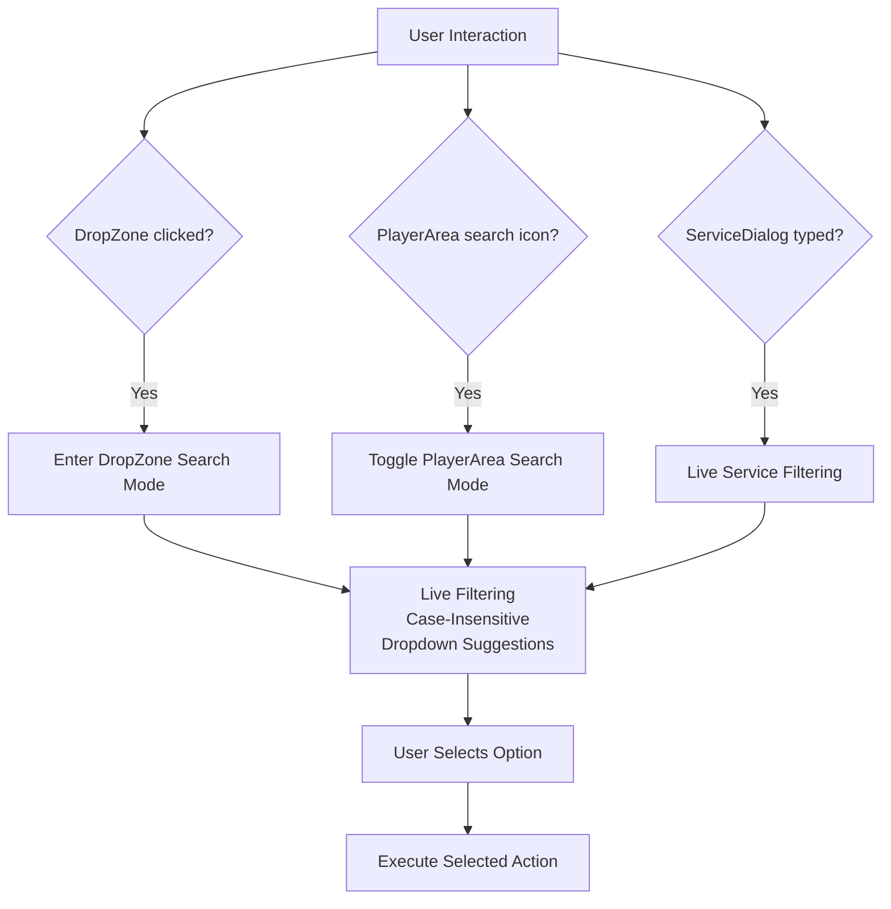

**Diagram sources**
- [DropZone.js:73-101](file://bad-court-mana-ui/src/page/dragNdrop/DropZone.js#L73-L101)
- [PlayerArea.js:44-55](file://bad-court-mana-ui/src/page/dragNdrop/PlayerArea.js#L44-L55)
- [ServiceDialog.js:34-41](file://bad-court-mana-ui/src/page/dialog/ServiceDialog.js#L34-L41)

**Section sources**
- [DropZone.js:65-71](file://bad-court-mana-ui/src/page/dragNdrop/DropZone.js#L65-L71)
- [PlayerArea.js:27-34](file://bad-court-mana-ui/src/page/dragNdrop/PlayerArea.js#L27-L34)
- [ServiceDialog.js:34-41](file://bad-court-mana-ui/src/page/dialog/ServiceDialog.js#L34-L41)

## Dependency Analysis
- Frontend dependencies:
  - React DnD and HTML5 backend enable drag-and-drop with enhanced search.
  - Material UI provides components, styling, and enhanced user interaction.
  - Axios handles HTTP requests with interceptors for CSRF and error handling.
  - Enhanced search functionality built with React hooks (useMemo, useCallback, useRef).
- Backend endpoints:
  - /court-mana/getAllActiveCourt, /getCourtManagement, /getServices, /getShuttleBalls
  - /court-mana/addPlayer, /addPlayerToCourt, /removePlayerFromCourt
  - /court-mana/changeGameState, /changeBallQuantity, /changeSelectedBall
  - /court-mana/addServiceToPlayer, /updateServiceToPlayer

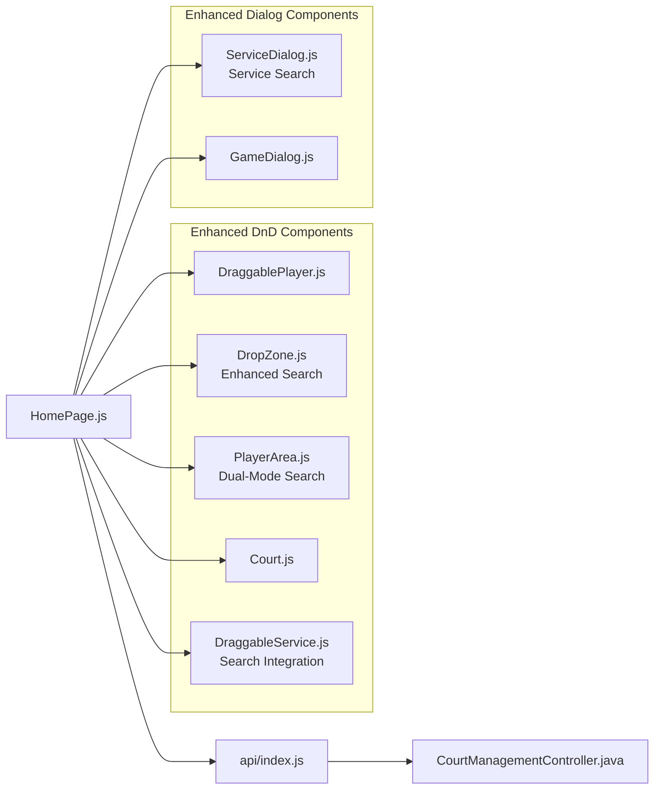

**Diagram sources**
- [package.json:6-29](file://bad-court-mana-ui/package.json#L6-L29)
- [api/index.js:13-25](file://bad-court-mana-ui/src/api/index.js#L13-L25)
- [CourtManagementController.java:25-164](file://BadmintonCourtManagement/src/main/java/com/badminton/controller/CourtManagementController.java#L25-L164)

**Section sources**
- [package.json:6-29](file://bad-court-mana-ui/package.json#L6-L29)
- [CourtManagementController.java:25-164](file://BadmintonCourtManagement/src/main/java/com/badminton/controller/CourtManagementController.java#L25-L164)

## Performance Considerations
- Minimize re-renders by passing memoized callbacks and avoiding unnecessary state updates.
- Use object keys (courtId, areaKey) consistently to ensure deterministic rendering.
- Debounce or batch UI updates after API responses to prevent flicker.
- Lazy-load images and avoid heavy computations in render paths.
- **Enhanced**: Implement efficient search filtering with useMemo for filtered results.
- **Enhanced**: Use useCallback for search handlers to prevent unnecessary re-renders.
- **Enhanced**: Optimize search operations with case-insensitive matching algorithms.

## Troubleshooting Guide
- Dragging does nothing:
  - Verify the court is not locked; locked courts reject drops.
  - Ensure a shuttle ball is selected before moving players.
- Duplicate player warning appears when adding:
  - The player name already exists in the available list; change the name.
- Payment/cancellation dialog shows no effect:
  - Confirm the backend endpoint responses and network connectivity.
- Game result mismatch:
  - Ensure totals match actual cost; adjust per-player expenses accordingly.
- Network errors:
  - Check CSRF token interceptor and server availability; alerts guide resolution.
- **Enhanced**: Search functionality not working:
  - Verify case-insensitive matching is enabled across all search components.
  - Check that search queries are properly debounced and filtered.
  - Ensure dropdown suggestions are appearing for filtered results.

**Section sources**
- [HomePage.js:131-184](file://bad-court-mana-ui/src/page/HomePage.js#L131-L184)
- [PlayerArea.js:73-85](file://bad-court-mana-ui/src/page/dragNdrop/PlayerArea.js#L73-L85)
- [api/index.js:27-95](file://bad-court-mana-ui/src/api/index.js#L27-L95)

## Conclusion
The Court Management Interface provides an intuitive, real-time system for managing badminton courts through enhanced drag-and-drop interactions with comprehensive search capabilities. The system now features integrated search functionality across DropZone, PlayerArea, and ServiceDialog components, offering users efficient ways to locate and manage players and services through click-to-search, live filtering, and case-insensitive matching. It integrates seamlessly with backend APIs to reflect live changes, supports service assignments, and offers robust dialogs for game outcomes and financial settlements. The modular frontend architecture and clear separation of concerns facilitate maintainability and extensibility with enhanced user experience.

## Appendices

### Backend API Reference
- GET /court-mana/getAllActiveCourt
- GET /court-mana/getCourtManagement
- GET /court-mana/getServices
- GET /court-mana/getShuttleBalls
- POST /court-mana/addPlayer
- POST /court-mana/addPlayerToCourt
- POST /court-mana/removePlayerFromCourt
- POST /court-mana/changeGameState
- POST /court-mana/changeBallQuantity
- POST /court-mana/changeSelectedBall
- POST /court-mana/addServiceToPlayer
- POST /court-mana/updateServiceToPlayer

**Section sources**
- [CourtManagementController.java:33-160](file://BadmintonCourtManagement/src/main/java/com/badminton/controller/CourtManagementController.java#L33-L160)