# Court Management Interface

<cite>
**Referenced Files in This Document**
- [App.js](file://bad-court-mana-ui/src/App.js)
- [package.json](file://bad-court-mana-ui/package.json)
- [api/index.js](file://bad-court-mana-ui/src/api/index.js)
- [HomePage.js](file://bad-court-mana-ui/src/page/HomePage.js)
- [ItemTypes.js](file://bad-court-mana-ui/src/page/ItemTypes.js)
- [Court.js](file://bad-court-mana-ui/src/page/dragNdrop/Court.js)
- [DropZone.js](file://bad-court-mana-ui/src/page/dragNdrop/DropZone.js)
- [DraggablePlayer.js](file://bad-court-mana-ui/src/page/dragNdrop/DraggablePlayer.js)
- [PlayerArea.js](file://bad-court-mana-ui/src/page/dragNdrop/PlayerArea.js)
- [DraggableService.js](file://bad-court-mana-ui/src/page/dragNdrop/DraggableService.js)
- [style.css](file://bad-court-mana-ui/src/page/dragNdrop/style.css)
- [ServiceDialog.js](file://bad-court-mana-ui/src/page/dialog/ServiceDialog.js)
- [GameDialog.js](file://bad-court-mana-ui/src/page/dialog/GameDialog.js)
- [CourtManagementController.java](file://BadmintonCourtManagement/src/main/java/com/badminton/controller/CourtManagementController.java)
</cite>

## Table of Contents
1. [Introduction](#introduction)
2. [Project Structure](#project-structure)
3. [Core Components](#core-components)
4. [Architecture Overview](#architecture-overview)
5. [Detailed Component Analysis](#detailed-component-analysis)
6. [Dependency Analysis](#dependency-analysis)
7. [Performance Considerations](#performance-considerations)
8. [Troubleshooting Guide](#troubleshooting-guide)
9. [Conclusion](#conclusion)
10. [Appendices](#appendices)

## Introduction
This document describes the Court Management Interface, a React-based application enabling interactive drag-and-drop operations for managing badminton courts. It covers the HomePage main interface and specialized components for court visualization, player areas, draggable items, and service assignments. The system integrates with a Spring Boot backend via REST APIs for real-time updates, including starting matches, assigning players to positions A–D, adding/removing shuttle balls, and recording game outcomes.

## Project Structure
The frontend is a React application configured with routing, Material UI, and drag-and-drop libraries. The backend exposes REST endpoints under the /court-mana context for retrieving active courts, available players, services, and managing game states and player assignments.

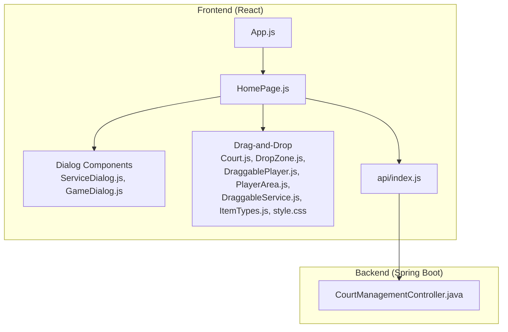

**Diagram sources**
- [App.js:20-101](file://bad-court-mana-ui/src/App.js#L20-L101)
- [HomePage.js:32-904](file://bad-court-mana-ui/src/page/HomePage.js#L32-L904)
- [api/index.js:1-101](file://bad-court-mana-ui/src/api/index.js#L1-L101)
- [CourtManagementController.java:25-164](file://BadmintonCourtManagement/src/main/java/com/badminton/controller/CourtManagementController.java#L25-L164)

**Section sources**
- [App.js:20-101](file://bad-court-mana-ui/src/App.js#L20-L101)
- [package.json:1-59](file://bad-court-mana-ui/package.json#L1-L59)

## Core Components
- HomePage: Orchestrates state, fetches initial data, manages drag-and-drop callbacks, and coordinates dialogs for services, game results, payments, and cancellations.
- Drag-and-drop subsystem:
  - ItemTypes: Defines draggable categories (PLAYER, SERVICE).
  - DraggablePlayer: Represents a player with drag hooks and service drop targets.
  - DropZone: Accepts players and highlights drop zones.
  - PlayerArea: Manages available players, adds new players, and handles removal back to availability.
  - DraggableService: Allows dragging services to players.
  - Court: Renders a court grid with four positions A–D and action buttons.
- Dialogs:
  - ServiceDialog: Adds/removes services for a player and initiates payment/cancellation actions.
  - GameDialog: Collects winner and per-player expenses, validates totals, and confirms results.

**Section sources**
- [HomePage.js:32-904](file://bad-court-mana-ui/src/page/HomePage.js#L32-L904)
- [ItemTypes.js:1-4](file://bad-court-mana-ui/src/page/ItemTypes.js#L1-L4)
- [DraggablePlayer.js:6-53](file://bad-court-mana-ui/src/page/dragNdrop/DraggablePlayer.js#L6-L53)
- [DropZone.js:6-71](file://bad-court-mana-ui/src/page/dragNdrop/DropZone.js#L6-L71)
- [PlayerArea.js:9-113](file://bad-court-mana-ui/src/page/dragNdrop/PlayerArea.js#L9-L113)
- [DraggableService.js:7-43](file://bad-court-mana-ui/src/page/dragNdrop/DraggableService.js#L7-L43)
- [Court.js:11-130](file://bad-court-mana-ui/src/page/dragNdrop/Court.js#L11-L130)
- [ServiceDialog.js:18-178](file://bad-court-mana-ui/src/page/dialog/ServiceDialog.js#L18-L178)
- [GameDialog.js:19-455](file://bad-court-mana-ui/src/page/dialog/GameDialog.js#L19-L455)

## Architecture Overview
The system follows a layered architecture:
- Frontend: React components with React DnD for drag-and-drop and MUI for UI.
- Backend: REST endpoints for court management, services, players, and game state transitions.
- Communication: Axios-based API module handles requests/responses and interceptors for CSRF and error handling.

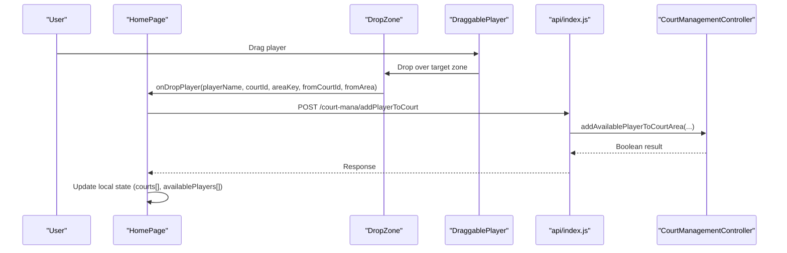

**Diagram sources**
- [HomePage.js:130-183](file://bad-court-mana-ui/src/page/HomePage.js#L130-L183)
- [DropZone.js:17-30](file://bad-court-mana-ui/src/page/dragNdrop/DropZone.js#L17-L30)
- [DraggablePlayer.js:7-27](file://bad-court-mana-ui/src/page/dragNdrop/DraggablePlayer.js#L7-L27)
- [api/index.js:13-25](file://bad-court-mana-ui/src/api/index.js#L13-L25)
- [CourtManagementController.java:124-130](file://BadmintonCourtManagement/src/main/java/com/badminton/controller/CourtManagementController.java#L124-L130)

## Detailed Component Analysis

### HomePage: Main Interface and State Management
- Responsibilities:
  - Fetches active courts, services, shuttle balls, and available players on mount.
  - Maintains local state for courts (positions A–D), locked courts, available players, selected shuttle ball, and player-service mapping.
  - Implements drag-and-drop callbacks for moving players between courts and assigning services to players.
  - Integrates dialogs for game result confirmation, payment/cancellation, and shuttle ball management.
- Key flows:
  - Initialization: Loads data from /court-mana endpoints and populates state.
  - Player movement: Validates current shuttle ball selection, removes player from previous location if needed, assigns to new court area, and updates UI state.
  - Services: Adds services to players via drag-and-drop or dialog, persists to backend, and updates local mapping.
  - Game lifecycle: Starts matches, retrieves results, confirms outcomes, resets players, and updates service records.

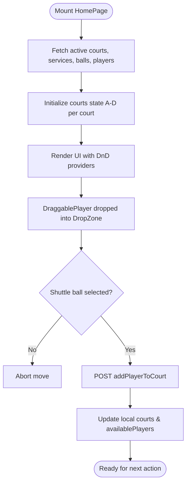

**Diagram sources**
- [HomePage.js:511-659](file://bad-court-mana-ui/src/page/HomePage.js#L511-L659)
- [HomePage.js:130-183](file://bad-court-mana-ui/src/page/HomePage.js#L130-L183)

**Section sources**
- [HomePage.js:32-904](file://bad-court-mana-ui/src/page/HomePage.js#L32-L904)

### Drag-and-Drop Components

#### DraggablePlayer
- Purpose: Wraps a player with drag hooks and accepts service drops.
- Behavior:
  - Prevents dragging when the court is locked.
  - Accepts service drops and triggers a highlight animation.
  - Supports click to open service dialog.

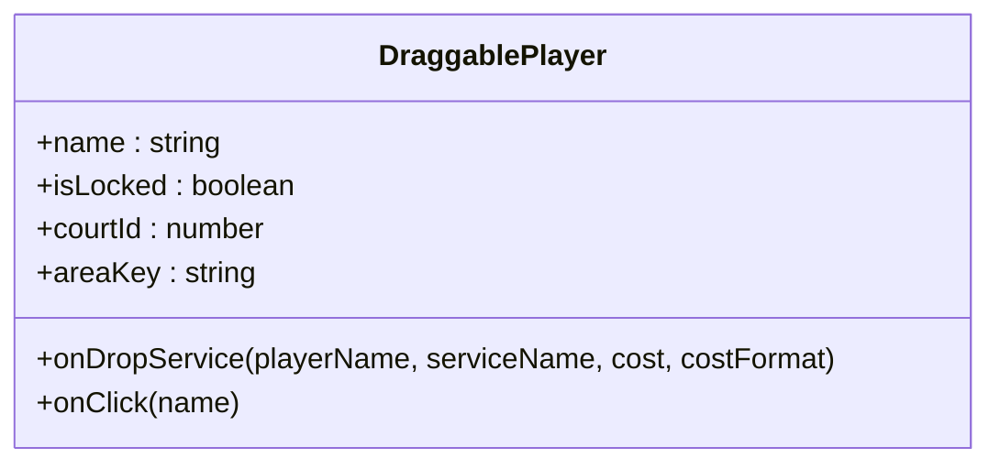

**Diagram sources**
- [DraggablePlayer.js:6-53](file://bad-court-mana-ui/src/page/dragNdrop/DraggablePlayer.js#L6-L53)

**Section sources**
- [DraggablePlayer.js:6-53](file://bad-court-mana-ui/src/page/dragNdrop/DraggablePlayer.js#L6-L53)
- [style.css:1-30](file://bad-court-mana-ui/src/page/dragNdrop/style.css#L1-L30)

#### DropZone
- Purpose: Accepts players with visual feedback and prevents drops on locked courts.
- Behavior:
  - Highlights when a player is dragged over.
  - Invokes onDropPlayer callback with origin and destination context.

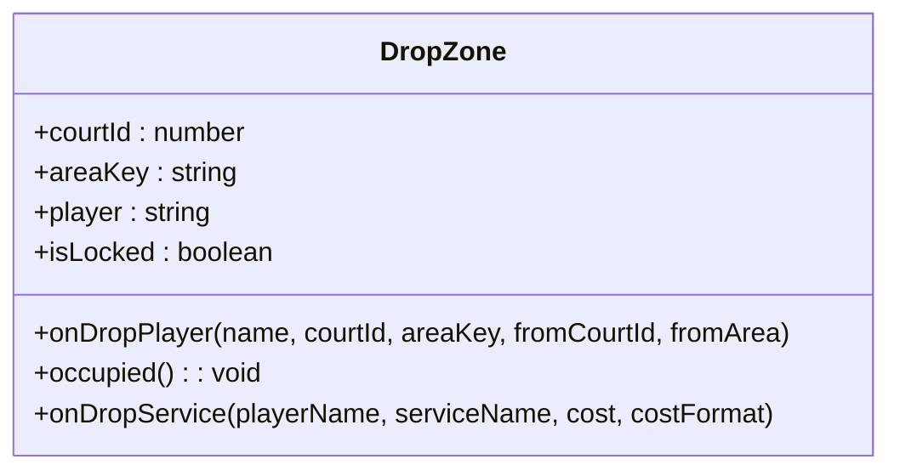

**Diagram sources**
- [DropZone.js:6-71](file://bad-court-mana-ui/src/page/dragNdrop/DropZone.js#L6-L71)

**Section sources**
- [DropZone.js:6-71](file://bad-court-mana-ui/src/page/dragNdrop/DropZone.js#L6-L71)

#### PlayerArea
- Purpose: Manages available players, supports adding new players, and dropping players back to availability.
- Behavior:
  - Validates duplicates against the current availablePlayers list.
  - Handles Enter key submission and drop-to-remove.

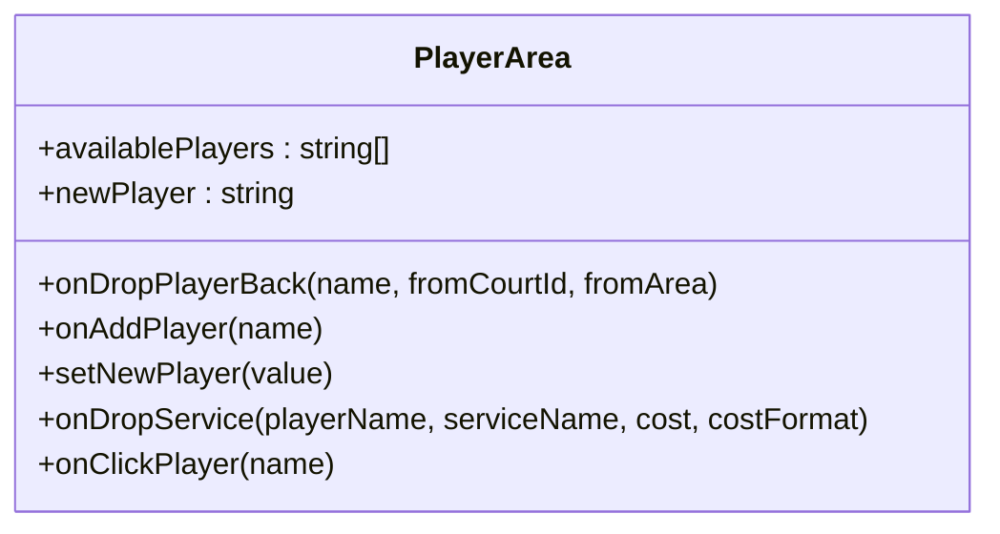

**Diagram sources**
- [PlayerArea.js:9-113](file://bad-court-mana-ui/src/page/dragNdrop/PlayerArea.js#L9-L113)

**Section sources**
- [PlayerArea.js:9-113](file://bad-court-mana-ui/src/page/dragNdrop/PlayerArea.js#L9-L113)

#### DraggableService
- Purpose: Allows dragging services to players for assignment.
- Behavior:
  - Provides drag hooks with item metadata (serviceName, cost, costFormat).

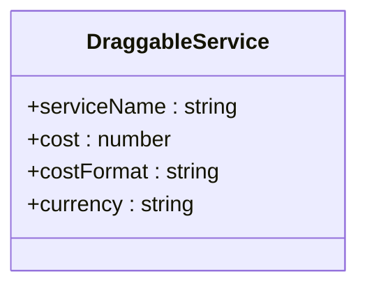

**Diagram sources**
- [DraggableService.js:7-43](file://bad-court-mana-ui/src/page/dragNdrop/DraggableService.js#L7-L43)

**Section sources**
- [DraggableService.js:7-43](file://bad-court-mana-ui/src/page/dragNdrop/DraggableService.js#L7-L43)

#### Court
- Purpose: Visualizes a single court with a 2x2 grid of DropZones labeled A–D.
- Behavior:
  - Shows start button when unlocked and action buttons when locked (finish/cancel).
  - Displays hover controls to add shuttle balls during active games.

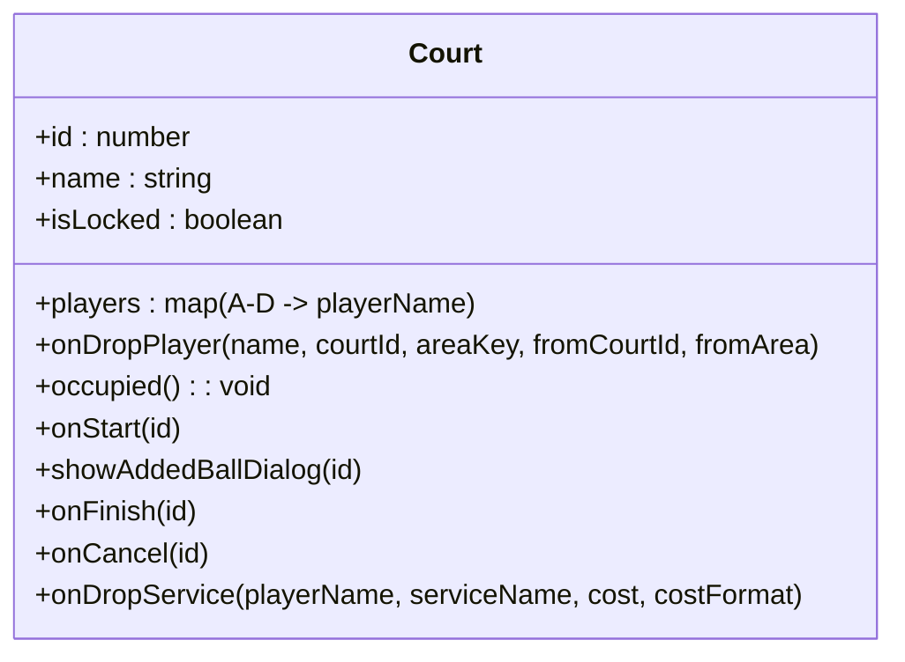

**Diagram sources**
- [Court.js:11-130](file://bad-court-mana-ui/src/page/dragNdrop/Court.js#L11-L130)

**Section sources**
- [Court.js:11-130](file://bad-court-mana-ui/src/page/dragNdrop/Court.js#L11-L130)

### Dialog Components

#### ServiceDialog
- Purpose: Manage per-player services, compute totals, and trigger payment/cancellation actions.
- Behavior:
  - Adds/removes services and updates backend via updateServiceToPlayer.
  - Computes total cost and opens payment/cancel confirmation.

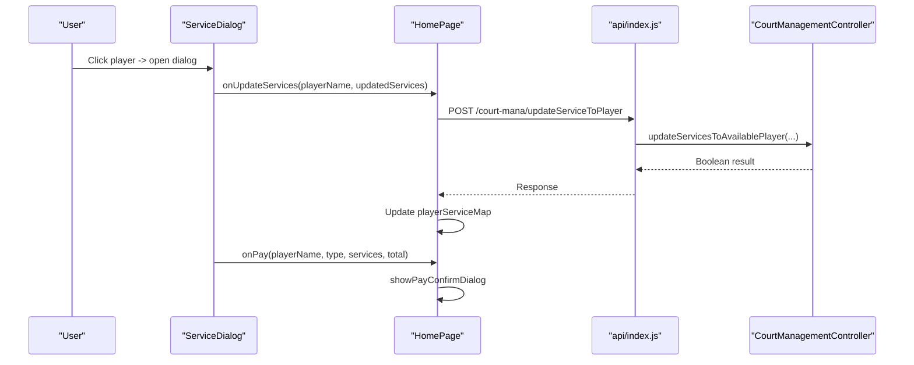

**Diagram sources**
- [ServiceDialog.js:18-178](file://bad-court-mana-ui/src/page/dialog/ServiceDialog.js#L18-L178)
- [HomePage.js:661-681](file://bad-court-mana-ui/src/page/HomePage.js#L661-L681)
- [CourtManagementController.java:108-114](file://BadmintonCourtManagement/src/main/java/com/badminton/controller/CourtManagementController.java#L108-L114)

**Section sources**
- [ServiceDialog.js:18-178](file://bad-court-mana-ui/src/page/dialog/ServiceDialog.js#L18-L178)

#### GameDialog
- Purpose: Capture winner and per-player expenses, validate totals, and confirm game results.
- Behavior:
  - Parses ball usage, computes totals, and distributes loser team’s cost.
  - Posts confirmGameResult and resets players on completion.

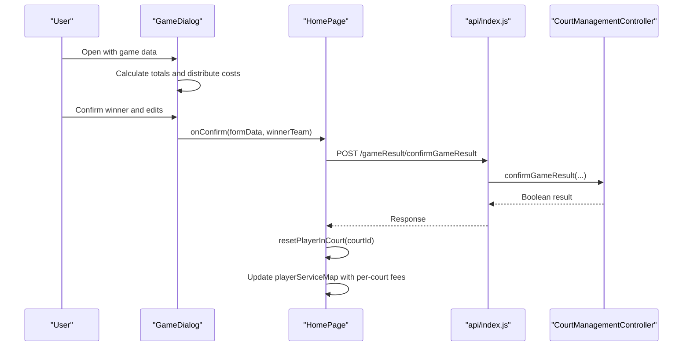

**Diagram sources**
- [GameDialog.js:19-455](file://bad-court-mana-ui/src/page/dialog/GameDialog.js#L19-L455)
- [HomePage.js:369-445](file://bad-court-mana-ui/src/page/HomePage.js#L369-L445)
- [CourtManagementController.java:145-153](file://BadmintonCourtManagement/src/main/java/com/badminton/controller/CourtManagementController.java#L145-L153)

**Section sources**
- [GameDialog.js:19-455](file://bad-court-mana-ui/src/page/dialog/GameDialog.js#L19-L455)

## Dependency Analysis
- Frontend dependencies:
  - React DnD and HTML5 backend enable drag-and-drop.
  - Material UI provides components and styling.
  - Axios handles HTTP requests with interceptors for CSRF and error handling.
- Backend endpoints:
  - /court-mana/getAllActiveCourt, /getCourtManagement, /getServices, /getShuttleBalls
  - /court-mana/addPlayer, /addPlayerToCourt, /removePlayerFromCourt
  - /court-mana/changeGameState, /changeBallQuantity, /changeSelectedBall
  - /court-mana/addServiceToPlayer, /updateServiceToPlayer

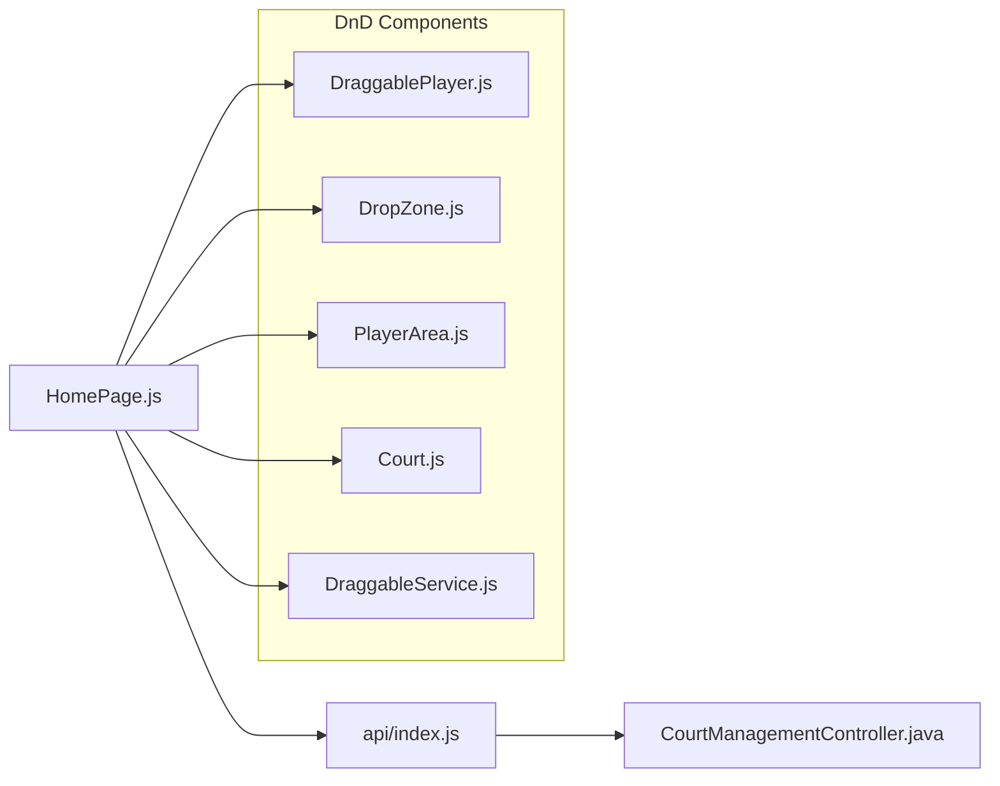

**Diagram sources**
- [package.json:6-29](file://bad-court-mana-ui/package.json#L6-L29)
- [api/index.js:13-25](file://bad-court-mana-ui/src/api/index.js#L13-L25)
- [CourtManagementController.java:25-164](file://BadmintonCourtManagement/src/main/java/com/badminton/controller/CourtManagementController.java#L25-L164)

**Section sources**
- [package.json:6-29](file://bad-court-mana-ui/package.json#L6-L29)
- [CourtManagementController.java:25-164](file://BadmintonCourtManagement/src/main/java/com/badminton/controller/CourtManagementController.java#L25-L164)

## Performance Considerations
- Minimize re-renders by passing memoized callbacks and avoiding unnecessary state updates.
- Use object keys (courtId, areaKey) consistently to ensure deterministic rendering.
- Debounce or batch UI updates after API responses to prevent flicker.
- Lazy-load images and avoid heavy computations in render paths.

## Troubleshooting Guide
- Dragging does nothing:
  - Verify the court is not locked; locked courts reject drops.
  - Ensure a shuttle ball is selected before moving players.
- Duplicate player warning appears when adding:
  - The player name already exists in the available list; change the name.
- Payment/cancellation dialog shows no effect:
  - Confirm the backend endpoint responses and network connectivity.
- Game result mismatch:
  - Ensure totals match actual cost; adjust per-player expenses accordingly.
- Network errors:
  - Check CSRF token interceptor and server availability; alerts guide resolution.

**Section sources**
- [HomePage.js:130-183](file://bad-court-mana-ui/src/page/HomePage.js#L130-L183)
- [PlayerArea.js:20-50](file://bad-court-mana-ui/src/page/dragNdrop/PlayerArea.js#L20-L50)
- [api/index.js:27-95](file://bad-court-mana-ui/src/api/index.js#L27-L95)

## Conclusion
The Court Management Interface provides an intuitive, real-time system for managing badminton courts through drag-and-drop interactions. It integrates seamlessly with backend APIs to reflect live changes, supports service assignments, and offers robust dialogs for game outcomes and financial settlements. The modular frontend architecture and clear separation of concerns facilitate maintainability and extensibility.

## Appendices

### Backend API Reference
- GET /court-mana/getAllActiveCourt
- GET /court-mana/getCourtManagement
- GET /court-mana/getServices
- GET /court-mana/getShuttleBalls
- POST /court-mana/addPlayer
- POST /court-mana/addPlayerToCourt
- POST /court-mana/removePlayerFromCourt
- POST /court-mana/changeGameState
- POST /court-mana/changeBallQuantity
- POST /court-mana/changeSelectedBall
- POST /court-mana/addServiceToPlayer
- POST /court-mana/updateServiceToPlayer

**Section sources**
- [CourtManagementController.java:33-160](file://BadmintonCourtManagement/src/main/java/com/badminton/controller/CourtManagementController.java#L33-L160)