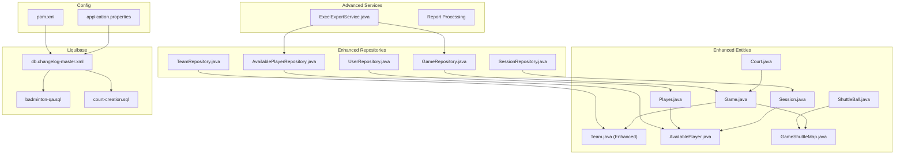
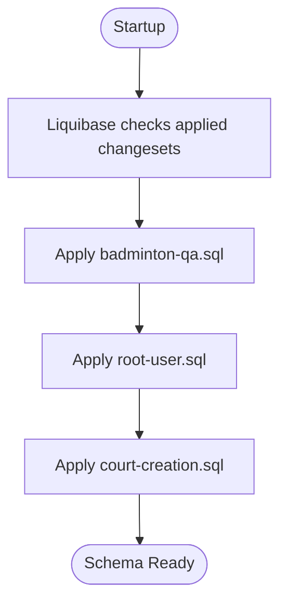
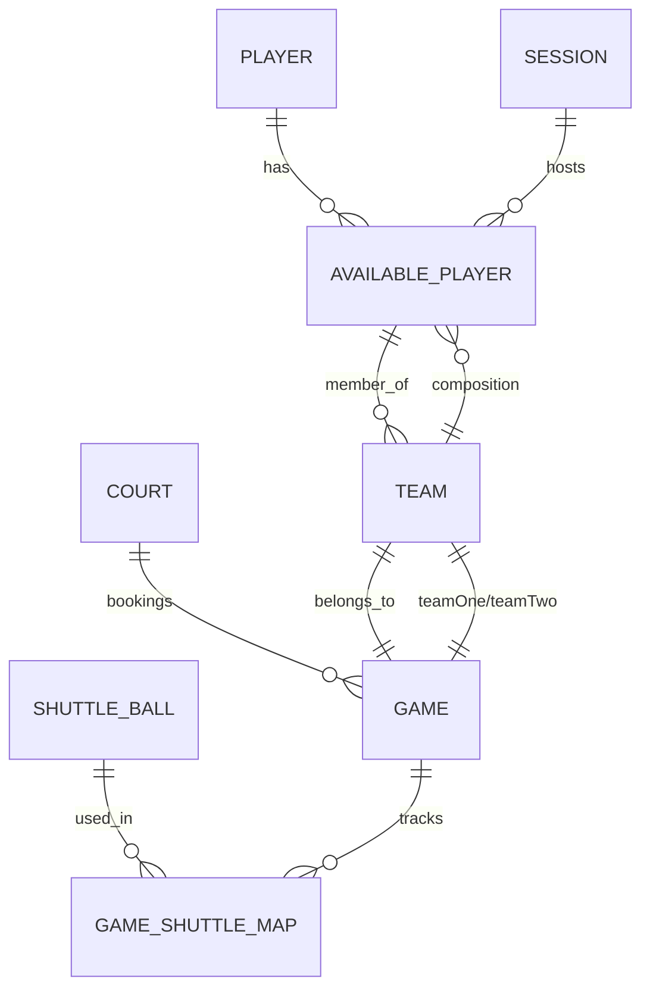
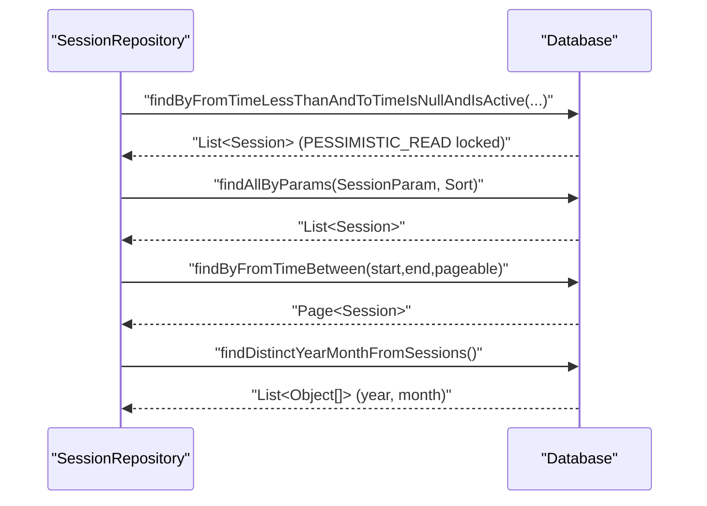
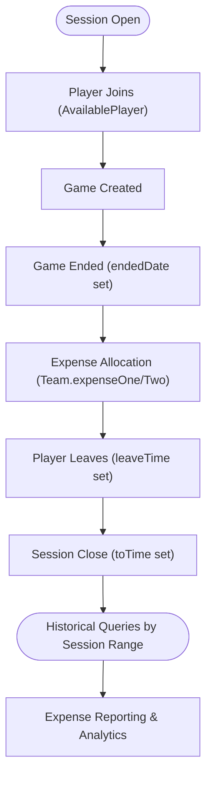
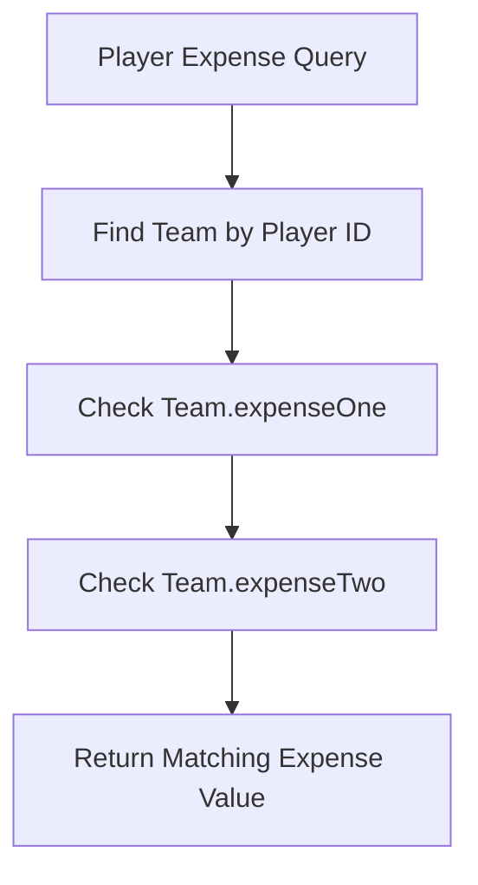
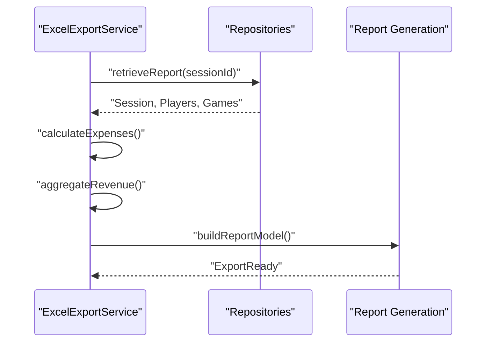
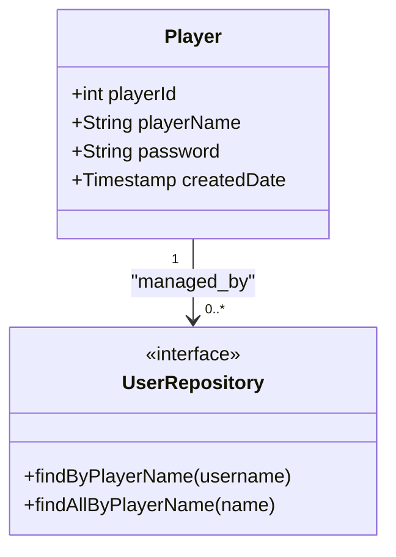
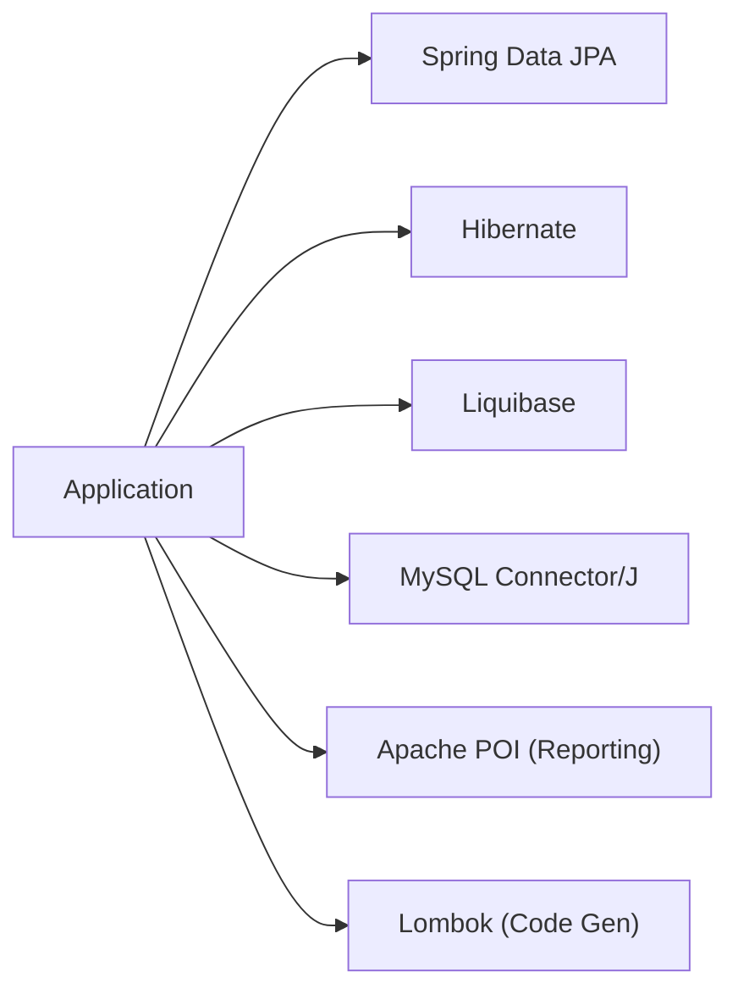

# Data Management & Persistence

<cite>
**Referenced Files in This Document**
- [Session.java](file://BadmintonCourtManagement/src/main/java/com/badminton/entity/Session.java)
- [Game.java](file://BadmintonCourtManagement/src/main/java/com/badminton/entity/Game.java)
- [Player.java](file://BadmintonCourtManagement/src/main/java/com/badminton/entity/Player.java)
- [Team.java](file://BadmintonCourtManagement/src/main/java/com/badminton/entity/Team.java)
- [Court.java](file://BadmintonCourtManagement/src/main/java/com/badminton/entity/Court.java)
- [ShuttleBall.java](file://BadmintonCourtManagement/src/main/java/com/badminton/entity/ShuttleBall.java)
- [AvailablePlayer.java](file://BadmintonCourtManagement/src/main/java/com/badminton/entity/AvailablePlayer.java)
- [GameShuttleMap.java](file://BadmintonCourtManagement/src/main/java/com/badminton/entity/GameShuttleMap.java)
- [SessionRepository.java](file://BadmintonCourtManagement/src/main/java/com/badminton/repository/SessionRepository.java)
- [GameRepository.java](file://BadmintonCourtManagement/src/main/java/com/badminton/repository/GameRepository.java)
- [AvailablePlayerRepository.java](file://BadmintonCourtManagement/src/main/java/com/badminton/repository/AvailablePlayerRepository.java)
- [TeamRepository.java](file://BadmintonCourtManagement/src/main/java/com/badminton/repository/TeamRepository.java)
- [UserRepository.java](file://BadmintonCourtManagement/src/main/java/com/badminton/repository/UserRepository.java)
- [SessionParam.java](file://BadmintonCourtManagement/src/main/java/com/badminton/repository/filter/SessionParam.java)
- [ExcelExportService.java](file://BadmintonCourtManagement/src/main/java/com/badminton/service/impl/ExcelExportService.java)
- [ReportCost.java](file://BadmintonCourtManagement/src/main/java/com/badminton/model/dto/ReportCost.java)
- [TeamDTO.java](file://BadmintonCourtManagement/src/main/java/com/badminton/model/dto/TeamDTO.java)
- [TeamResult.java](file://BadmintonCourtManagement/src/main/java/com/badminton/response/result/TeamResult.java)
- [RptModel.java](file://BadmintonCourtManagement/src/main/java/com/badminton/model/report/RptModel.java)
- [db.changelog-master.xml](file://BadmintonCourtManagement/src/main/resources/db/changelog/db.changelog-master.xml)
- [badminton-qa.sql](file://BadmintonCourtManagement/src/main/resources/db/changelog/badminton-qa.sql)
- [court-creation.sql](file://BadmintonCourtManagement/src/main/resources/db/changelog/court-creation.sql)
- [application.properties](file://BadmintonCourtManagement/src/main/resources/application.properties)
- [pom.xml](file://BadmintonCourtManagement/pom.xml)
</cite>

## Update Summary
**Changes Made**
- Enhanced Team entity with dedicated expense tracking columns (expenseOne, expenseTwo) and win status indicator
- Added comprehensive user management infrastructure with Player entity and UserRepository
- Implemented advanced reporting capabilities with expense tracking and team composition analysis
- Expanded repository patterns with specialized query methods for expense calculations and team analytics
- Integrated service layer enhancements for player expense tracking and revenue calculation

## Table of Contents
1. [Introduction](#introduction)
2. [Project Structure](#project-structure)
3. [Core Components](#core-components)
4. [Architecture Overview](#architecture-overview)
5. [Detailed Component Analysis](#detailed-component-analysis)
6. [Enhanced Querying Capabilities](#enhanced-querying-capabilities)
7. [Advanced Reporting and Analytics](#advanced-reporting-and-analytics)
8. [User Management Patterns](#user-management-patterns)
9. [Dependency Analysis](#dependency-analysis)
10. [Performance Considerations](#performance-considerations)
11. [Troubleshooting Guide](#troubleshooting-guide)
12. [Conclusion](#conclusion)
13. [Appendices](#appendices)

## Introduction
This document explains the data management and persistence layer of the Badminton Court Management system. It covers the database schema design, JPA entity relationships, repository patterns, and Liquibase migration strategy. The system now features enhanced capabilities for player expense tracking, team composition analysis, and user management patterns, providing comprehensive support for financial tracking and operational analytics.

## Project Structure
The persistence layer is organized around:
- Entities under the entity package representing domain objects and their JPA mappings
- Repositories under the repository package implementing Spring Data JPA interfaces
- Liquibase changelogs under resources/db/changelog for schema initialization and evolution
- Application configuration for JPA/Hibernate and Liquibase behavior
- Service layer with advanced reporting and analytics capabilities



**Diagram sources**
- [Session.java:17-41](file://BadmintonCourtManagement/src/main/java/com/badminton/entity/Session.java#L17-L41)
- [Game.java:13-79](file://BadmintonCourtManagement/src/main/java/com/badminton/entity/Game.java#L13-L79)
- [Player.java:15-39](file://BadmintonCourtManagement/src/main/java/com/badminton/entity/Player.java#L15-L39)
- [Team.java:8-40](file://BadmintonCourtManagement/src/main/java/com/badminton/entity/Team.java#L8-L40)
- [Court.java:11-43](file://BadmintonCourtManagement/src/main/java/com/badminton/entity/Court.java#L11-L43)
- [ShuttleBall.java:11-62](file://BadmintonCourtManagement/src/main/java/com/badminton/entity/ShuttleBall.java#L11-L62)
- [AvailablePlayer.java:12-58](file://BadmintonCourtManagement/src/main/java/com/badminton/entity/AvailablePlayer.java#L12-L58)
- [GameShuttleMap.java:7-31](file://BadmintonCourtManagement/src/main/java/com/badminton/entity/GameShuttleMap.java#L7-L31)
- [TeamRepository.java:1-10](file://BadmintonCourtManagement/src/main/java/com/badminton/repository/TeamRepository.java#L1-L10)
- [UserRepository.java:1-16](file://BadmintonCourtManagement/src/main/java/com/badminton/repository/UserRepository.java#L1-L16)
- [ExcelExportService.java:1-714](file://BadmintonCourtManagement/src/main/java/com/badminton/service/impl/ExcelExportService.java#L1-L714)

**Section sources**
- [application.properties:1-19](file://BadmintonCourtManagement/src/main/resources/application.properties#L1-L19)
- [pom.xml:37-112](file://BadmintonCourtManagement/pom.xml#L37-L112)

## Core Components
This section documents the core entities and their relationships, highlighting JPA annotations, foreign keys, and cascade behaviors with enhanced expense tracking capabilities.

- Session
  - Identity column mapped via generated value
  - Timestamp fields for session window
  - Bidirectional relationship with AvailablePlayer using cascade-all
  - Default active flag set on construction

- Game
  - Identity column mapped via generated value
  - Many-to-one to Court
  - One-to-one to Team for both teams with cascade-all
  - Collection of GameShuttleMap with cascade-all and orphan removal
  - State and type fields with defaults

- Team (Enhanced)
  - Identity column mapped via generated value
  - Two AvailablePlayer relationships for player composition
  - Dedicated expense tracking: expenseOne and expenseTwo columns
  - Win status indicator (is_status) for match results
  - One-to-one relationship with Game (mapped-by)

- Court
  - Identity column mapped via generated value
  - Active flag and creation timestamp
  - Collection of Games mapped by

- ShuttleBall
  - Identity column mapped via generated value
  - Name, cost, activity flags, selection flag
  - Creation timestamp

- AvailablePlayer
  - Identity column mapped via generated value
  - Many-to-one to Player and Session
  - Optional leave time, services, payment amount, and type
  - Enhanced with expense tracking integration

- GameShuttleMap
  - Identity column mapped via generated value
  - Many-to-one to Game
  - One-to-one to ShuttleBall with cascade-detach
  - Quantity field

- Player (New)
  - Identity column mapped via generated value
  - Username and password fields for authentication
  - Timestamp for account creation
  - Supports user management and access control

**Section sources**
- [Session.java:17-41](file://BadmintonCourtManagement/src/main/java/com/badminton/entity/Session.java#L17-L41)
- [Game.java:13-79](file://BadmintonCourtManagement/src/main/java/com/badminton/entity/Game.java#L13-L79)
- [Team.java:8-40](file://BadmintonCourtManagement/src/main/java/com/badminton/entity/Team.java#L8-L40)
- [Court.java:11-43](file://BadmintonCourtManagement/src/main/java/com/badminton/entity/Court.java#L11-L43)
- [ShuttleBall.java:11-62](file://BadmintonCourtManagement/src/main/java/com/badminton/entity/ShuttleBall.java#L11-L62)
- [AvailablePlayer.java:12-58](file://BadmintonCourtManagement/src/main/java/com/badminton/entity/AvailablePlayer.java#L12-L58)
- [GameShuttleMap.java:7-31](file://BadmintonCourtManagement/src/main/java/com/badminton/entity/GameShuttleMap.java#L7-L31)
- [Player.java:15-39](file://BadmintonCourtManagement/src/main/java/com/badminton/entity/Player.java#L15-L39)

## Architecture Overview
The persistence architecture follows a layered design with enhanced capabilities:
- Entities encapsulate domain data, relationships, and expense tracking
- Repositories define data access contracts with specialized query methods
- Advanced service layer provides reporting and analytics capabilities
- Liquibase manages schema initialization and evolution
- Spring Data JPA and Hibernate handle persistence operations

```mermaid
classDiagram
class Session {
+int sessionId
+Instant fromTime
+Instant toTime
+boolean isActive
}
class AvailablePlayer {
+long avaId
+Player player
+Session session
+Instant leaveTime
+String services
+Float payAmount
+String payType
}
class Player {
+int playerId
+String playerName
+String password
+Timestamp createdDate
}
class Court {
+int courtId
+String courtName
+boolean isActive
}
class Game {
+int gameId
+Court court
+Team teamOne
+Team teamTwo
+Instant createdDate
+Instant endedDate
+String state
+String gtype
}
class Team {
+int teamId
+AvailablePlayer playerOne
+float expenseOne
+AvailablePlayer playerTwo
+float expenseTwo
+boolean win
}
class ShuttleBall {
+int shuttleId
+String shuttleName
+float cost
+boolean isActive
+boolean isSelected
}
class GameShuttleMap {
+int id
+Game game
+ShuttleBall shuttleBall
+int shuttleNumber
}
class TeamRepository {
<<interface>>
}
class UserRepository {
<<interface>>
}
Session "1" --> "*" AvailablePlayer : "mappedBy"
Player "1" --> "*" AvailablePlayer : "mappedBy"
Court "1" --> "*" Game : "mappedBy"
Game "1" --> "1..2" Team : "teamOne/teamTwo"
Game "1" --> "*" GameShuttleMap : "mappedBy"
ShuttleBall "1" --> "*" GameShuttleMap : "mappedBy"
TeamRepository "1" --> "Team" : "CRUD"
UserRepository "1" --> "Player" : "CRUD"
```

**Diagram sources**
- [Session.java:17-41](file://BadmintonCourtManagement/src/main/java/com/badminton/entity/Session.java#L17-L41)
- [AvailablePlayer.java:12-58](file://BadmintonCourtManagement/src/main/java/com/badminton/entity/AvailablePlayer.java#L12-L58)
- [Player.java:15-39](file://BadmintonCourtManagement/src/main/java/com/badminton/entity/Player.java#L15-L39)
- [Court.java:11-43](file://BadmintonCourtManagement/src/main/java/com/badminton/entity/Court.java#L11-L43)
- [Game.java:13-79](file://BadmintonCourtManagement/src/main/java/com/badminton/entity/Game.java#L13-L79)
- [Team.java:8-40](file://BadmintonCourtManagement/src/main/java/com/badminton/entity/Team.java#L8-L40)
- [ShuttleBall.java:11-62](file://BadmintonCourtManagement/src/main/java/com/badminton/entity/ShuttleBall.java#L11-L62)
- [GameShuttleMap.java:7-31](file://BadmintonCourtManagement/src/main/java/com/badminton/entity/GameShuttleMap.java#L7-L31)
- [TeamRepository.java:1-10](file://BadmintonCourtManagement/src/main/java/com/badminton/repository/TeamRepository.java#L1-L10)
- [UserRepository.java:1-16](file://BadmintonCourtManagement/src/main/java/com/badminton/repository/UserRepository.java#L1-L16)

## Detailed Component Analysis

### Database Schema Design and Liquibase Migration Strategy
- Master changelog orchestrates initial schema and seed data
  - Includes QA schema SQL, root user creation, and default courts
- QA schema script defines tables and constraints:
  - player, session, available_player, court, team, shuttle_ball, game, game_shuttle_map, service
  - Foreign keys enforce referential integrity across entities
  - Indexes on frequently filtered/joined columns
- Initialization scripts:
  - Insert default courts during QA provisioning



**Diagram sources**
- [db.changelog-master.xml:7-15](file://BadmintonCourtManagement/src/main/resources/db/changelog/db.changelog-master.xml#L7-L15)
- [badminton-qa.sql:18-220](file://BadmintonCourtManagement/src/main/resources/db/changelog/badminton-qa.sql#L18-L220)
- [court-creation.sql:1-3](file://BadmintonCourtManagement/src/main/resources/db/changelog/court-creation.sql#L1-L3)

**Section sources**
- [db.changelog-master.xml:1-17](file://BadmintonCourtManagement/src/main/resources/db/changelog/db.changelog-master.xml#L1-L17)
- [badminton-qa.sql:18-220](file://BadmintonCourtManagement/src/main/resources/db/changelog/badminton-qa.sql#L18-L220)
- [court-creation.sql:1-3](file://BadmintonCourtManagement/src/main/resources/db/changelog/court-creation.sql#L1-L3)

### JPA Entity Relationships and Cascade Operations
- Session to AvailablePlayer: one-to-many with cascade-all; ensures availability records persist with session lifecycle
- Player to AvailablePlayer: many-to-one; cascading deletes propagate to availability records
- Court to Game: one-to-many; games reference courts via foreign key
- Game to Team: one-to-one for both teams with cascade-all; orphan removal for cleanup
- Game to GameShuttleMap: one-to-many with cascade-all and orphan removal
- ShuttleBall to GameShuttleMap: one-to-one with cascade-detach to decouple shuttle updates from game lifecycle
- Team to AvailablePlayer: many-to-one relationships for player composition with expense tracking



**Diagram sources**
- [Player.java:15-39](file://BadmintonCourtManagement/src/main/java/com/badminton/entity/Player.java#L15-L39)
- [AvailablePlayer.java:12-58](file://BadmintonCourtManagement/src/main/java/com/badminton/entity/AvailablePlayer.java#L12-L58)
- [Session.java:17-41](file://BadmintonCourtManagement/src/main/java/com/badminton/entity/Session.java#L17-L41)
- [Court.java:11-43](file://BadmintonCourtManagement/src/main/java/com/badminton/entity/Court.java#L11-L43)
- [Game.java:13-79](file://BadmintonCourtManagement/src/main/java/com/badminton/entity/Game.java#L13-L79)
- [Team.java:8-40](file://BadmintonCourtManagement/src/main/java/com/badminton/entity/Team.java#L8-L40)
- [ShuttleBall.java:11-62](file://BadmintonCourtManagement/src/main/java/com/badminton/entity/ShuttleBall.java#L11-L62)
- [GameShuttleMap.java:7-31](file://BadmintonCourtManagement/src/main/java/com/badminton/entity/GameShuttleMap.java#L7-L31)

**Section sources**
- [Session.java:35-36](file://BadmintonCourtManagement/src/main/java/com/badminton/entity/Session.java#L35-L36)
- [AvailablePlayer.java:22-28](file://BadmintonCourtManagement/src/main/java/com/badminton/entity/AvailablePlayer.java#L22-L28)
- [Game.java:23-42](file://BadmintonCourtManagement/src/main/java/com/badminton/entity/Game.java#L23-L42)
- [Game.java:33-34](file://BadmintonCourtManagement/src/main/java/com/badminton/entity/Game.java#L33-L34)
- [GameShuttleMap.java:15-21](file://BadmintonCourtManagement/src/main/java/com/badminton/entity/GameShuttleMap.java#L15-L21)
- [Team.java:18-33](file://BadmintonCourtManagement/src/main/java/com/badminton/entity/Team.java#L18-L33)

### Repository Pattern Implementation
- SessionRepository
  - Derived queries for active sessions within time windows
  - Pessimistic locking for concurrent access control
  - Parameterized filtering with SessionParam
  - Range queries with pagination and counting variants
  - Year/Month aggregation for reporting
- GameRepository
  - Find active games by court and state
  - Fetch games with eager joins for teams and court
  - Filter by player availability identifiers
  - Specialized query for player-based game retrieval
- AvailablePlayerRepository
  - Locking reads for session availability
  - Selective updates with pessimistic write locks
  - Exclusion lists and presence filters
- TeamRepository (New)
  - Standard CRUD operations for team entities
  - Supports team composition management
- UserRepository (New)
  - User authentication and management
  - Username-based lookup and user listing



**Diagram sources**
- [SessionRepository.java:22-34](file://BadmintonCourtManagement/src/main/java/com/badminton/repository/SessionRepository.java#L22-L34)
- [SessionRepository.java:26-27](file://BadmintonCourtManagement/src/main/java/com/badminton/repository/SessionRepository.java#L26-L27)
- [SessionRepository.java:35-41](file://BadmintonCourtManagement/src/main/java/com/badminton/repository/SessionRepository.java#L35-L41)
- [SessionRepository.java:46-54](file://BadmintonCourtManagement/src/main/java/com/badminton/repository/SessionRepository.java#L46-L54)

**Section sources**
- [SessionRepository.java:19-55](file://BadmintonCourtManagement/src/main/java/com/badminton/repository/SessionRepository.java#L19-L55)
- [GameRepository.java:13-32](file://BadmintonCourtManagement/src/main/java/com/badminton/repository/GameRepository.java#L13-L32)
- [AvailablePlayerRepository.java:15-35](file://BadmintonCourtManagement/src/main/java/com/badminton/repository/AvailablePlayerRepository.java#L15-L35)
- [TeamRepository.java:1-10](file://BadmintonCourtManagement/src/main/java/com/badminton/repository/TeamRepository.java#L1-L10)
- [UserRepository.java:1-16](file://BadmintonCourtManagement/src/main/java/com/badminton/repository/UserRepository.java#L1-L16)
- [SessionParam.java:8-14](file://BadmintonCourtManagement/src/main/java/com/badminton/repository/filter/SessionParam.java#L8-L14)

### Transaction Management and Concurrency Control
- Pessimistic locking is used in repositories to prevent race conditions when checking availability or updating records
- Lock hints specify timeout behavior for long-running queries
- Repository methods annotated with locking semantics ensure consistent reads/writes under contention
- Service layer transactions wrap complex reporting operations

**Section sources**
- [SessionRepository.java:22-24](file://BadmintonCourtManagement/src/main/java/com/badminton/repository/SessionRepository.java#L22-L24)
- [AvailablePlayerRepository.java:17-34](file://BadmintonCourtManagement/src/main/java/com/badminton/repository/AvailablePlayerRepository.java#L17-L34)

### Session-Centric Data Storage and Historical Preservation
- Sessions capture time windows and activity flags
- AvailablePlayer links players to sessions, capturing join/leave timestamps and payment attributes
- Enhanced team composition tracking with individual expense allocation
- Historical insights:
  - Session range queries enable monthly aggregation
  - Game state and ended date support lifecycle analytics
  - Shuttle usage tracked per game via GameShuttleMap
  - Expense tracking supports financial reporting and analysis



**Diagram sources**
- [Session.java:27-31](file://BadmintonCourtManagement/src/main/java/com/badminton/entity/Session.java#L27-L31)
- [AvailablePlayer.java:30-31](file://BadmintonCourtManagement/src/main/java/com/badminton/entity/AvailablePlayer.java#L30-L31)
- [Game.java:47-48](file://BadmintonCourtManagement/src/main/java/com/badminton/entity/Game.java#L47-L48)
- [Team.java:22-30](file://BadmintonCourtManagement/src/main/java/com/badminton/entity/Team.java#L22-L30)
- [SessionRepository.java:53-54](file://BadmintonCourtManagement/src/main/java/com/badminton/repository/SessionRepository.java#L53-L54)

**Section sources**
- [SessionRepository.java:29-54](file://BadmintonCourtManagement/src/main/java/com/badminton/repository/SessionRepository.java#L29-L54)
- [Game.java:50-58](file://BadmintonCourtManagement/src/main/java/com/badminton/entity/Game.java#L50-L58)

### Typical Data Access Scenarios and Query Optimization
- Find active sessions overlapping current time with pessimistic read lock
- Filter sessions by inclusive start and exclusive end bounds with pagination
- Count sessions within a time range for reporting
- Retrieve games by court with optional ended-date null predicate
- Fetch games with joined entities to avoid N+1 selects
- Locate players currently present in a session with locking for update
- Aggregate distinct year/month from session timestamps for reporting
- Calculate total expenses for session-based reporting
- Extract individual player expenses from team composition data

Optimization techniques:
- Use JOIN FETCH to eagerly load associated entities where needed
- Prefer indexed columns in WHERE clauses (e.g., from_time, to_time, ended_date)
- Apply pagination and range queries to limit result sets
- Employ pessimistic locking only where necessary to minimize contention
- Utilize specialized repository methods for complex aggregations

**Section sources**
- [SessionRepository.java:20-34](file://BadmintonCourtManagement/src/main/java/com/badminton/repository/SessionRepository.java#L20-L34)
- [SessionRepository.java:35-41](file://BadmintonCourtManagement/src/main/java/com/badminton/repository/SessionRepository.java#L35-L41)
- [SessionRepository.java:46-54](file://BadmintonCourtManagement/src/main/java/com/badminton/repository/SessionRepository.java#L46-L54)
- [GameRepository.java:18-30](file://BadmintonCourtManagement/src/main/java/com/badminton/repository/GameRepository.java#L18-L30)
- [AvailablePlayerRepository.java:29-34](file://BadmintonCourtManagement/src/main/java/com/badminton/repository/AvailablePlayerRepository.java#L29-L34)
- [ExcelExportService.java:631-646](file://BadmintonCourtManagement/src/main/java/com/badminton/service/impl/ExcelExportService.java#L631-L646)

## Enhanced Querying Capabilities

### Advanced Expense Tracking Queries
The system now supports sophisticated expense tracking through enhanced Team entities with dedicated expense columns:

- Individual player expense extraction from team composition
- Team win/loss status tracking for performance analysis
- Revenue calculation across multiple sessions and players
- Expense distribution algorithms for team-based cost allocation



**Diagram sources**
- [ExcelExportService.java:631-646](file://BadmintonCourtManagement/src/main/java/com/badminton/service/impl/ExcelExportService.java#L631-L646)
- [Team.java:22-30](file://BadmintonCourtManagement/src/main/java/com/badminton/entity/Team.java#L22-L30)

### Team Composition Analysis
Enhanced team relationships enable comprehensive composition analysis:

- Player pairing analysis for team formation patterns
- Expense distribution tracking across team members
- Win/loss statistics by team composition
- Performance metrics based on team dynamics

**Section sources**
- [Team.java:18-33](file://BadmintonCourtManagement/src/main/java/com/badminton/entity/Team.java#L18-L33)
- [ExcelExportService.java:582-598](file://BadmintonCourtManagement/src/main/java/com/badminton/service/impl/ExcelExportService.java#L582-L598)

## Advanced Reporting and Analytics

### Comprehensive Expense Reporting
The ExcelExportService provides advanced reporting capabilities:

- Multi-session expense aggregation
- Team composition-based expense allocation
- Revenue tracking across player activities
- Service usage analysis beyond court fees



**Diagram sources**
- [ExcelExportService.java:648-656](file://BadmintonCourtManagement/src/main/java/com/badminton/service/impl/ExcelExportService.java#L648-L656)
- [ExcelExportService.java:658-662](file://BadmintonCourtManagement/src/main/java/com/badminton/service/impl/ExcelExportService.java#L658-L662)

### Revenue Calculation and Analysis
Advanced revenue tracking mechanisms:

- Gross revenue calculation from player payments
- Individual player expense tracking per game
- Team-based cost allocation algorithms
- Service usage revenue integration

**Section sources**
- [ExcelExportService.java:616-618](file://BadmintonCourtManagement/src/main/java/com/badminton/service/impl/ExcelExportService.java#L616-L618)
- [ExcelExportService.java:631-646](file://BadmintonCourtManagement/src/main/java/com/badminton/service/impl/ExcelExportService.java#L631-L646)
- [ExcelExportService.java:687-708](file://BadmintonCourtManagement/src/main/java/com/badminton/service/impl/ExcelExportService.java#L687-L708)

## User Management Patterns

### Authentication and Authorization Infrastructure
The system now includes comprehensive user management:

- Player entity with authentication credentials
- UserRepository for user operations
- Password security considerations
- User-based access patterns



**Diagram sources**
- [Player.java:15-39](file://BadmintonCourtManagement/src/main/java/com/badminton/entity/Player.java#L15-L39)
- [UserRepository.java:1-16](file://BadmintonCourtManagement/src/main/java/com/badminton/repository/UserRepository.java#L1-16)

### User-Based Data Access Patterns
User management enables role-based data access:

- Player-specific availability tracking
- Personal expense history
- Team composition analysis by user
- Access control through user authentication

**Section sources**
- [Player.java:25-35](file://BadmintonCourtManagement/src/main/java/com/badminton/entity/Player.java#L25-L35)
- [UserRepository.java:12-14](file://BadmintonCourtManagement/src/main/java/com/badminton/repository/UserRepository.java#L12-L14)

## Dependency Analysis
External dependencies supporting persistence and enhanced features:
- Spring Data JPA for repository abstractions
- Hibernate ORM for JPA provider
- Liquibase for declarative schema management
- MySQL Connector/J for database connectivity
- Apache POI for advanced reporting capabilities
- Lombok for code generation and boilerplate reduction



**Diagram sources**
- [pom.xml:37-112](file://BadmintonCourtManagement/pom.xml#L37-L112)

**Section sources**
- [pom.xml:37-112](file://BadmintonCourtManagement/pom.xml#L37-L112)

## Performance Considerations
- Use pagination-aware queries for large datasets (e.g., SessionRepository range queries)
- Leverage JOIN FETCH judiciously to reduce lazy-loading overhead
- Index foreign keys and frequently queried columns (session timestamps, game ended date)
- Apply pessimistic locks only for critical sections to avoid blocking
- Monitor SQL logs and adjust queries based on execution plans
- Optimize reporting queries with specialized repository methods
- Cache frequently accessed user and team data
- Implement efficient expense calculation algorithms

## Troubleshooting Guide
Common issues and resolutions:
- Liquibase parsing warnings: secure parsing disabled in configuration; verify schema changesets are applied
- Schema mismatch after refactor: ensure foreign keys and indexes remain intact; re-run Liquibase
- Deadlocks on concurrent availability updates: review locking strategies and reduce lock scope
- N+1 select problems: confirm JOIN FETCH usage in repository queries
- Expense calculation discrepancies: verify team composition and expense allocation logic
- User authentication failures: check password encoding and user validation processes
- Reporting performance issues: optimize aggregation queries and implement appropriate indexing

**Section sources**
- [application.properties:18-19](file://BadmintonCourtManagement/src/main/resources/application.properties#L18-L19)
- [GameRepository.java:24-30](file://BadmintonCourtManagement/src/main/java/com/badminton/repository/GameRepository.java#L24-L30)
- [ExcelExportService.java:631-646](file://BadmintonCourtManagement/src/main/java/com/badminton/service/impl/ExcelExportService.java#L631-L646)

## Conclusion
The enhanced persistence layer combines robust JPA entities, Spring Data repositories, and Liquibase migrations to support session-centric operations, player tracking, team composition analysis, and comprehensive expense tracking. The addition of user management capabilities and advanced reporting features provides a complete solution for financial tracking and operational analytics. Proper indexing, locking, and pagination ensure scalability and reliability for enterprise-level usage.

## Appendices
- Configuration highlights:
  - Hibernate dialect and SQL logging enabled
  - Liquibase logging configured
  - Profiles for dev/qa/prod environments
  - Apache POI dependencies for reporting
  - Lombok annotation processing enabled

**Section sources**
- [application.properties:4-19](file://BadmintonCourtManagement/src/main/resources/application.properties#L4-L19)
- [pom.xml:37-112](file://BadmintonCourtManagement/pom.xml#L37-L112)