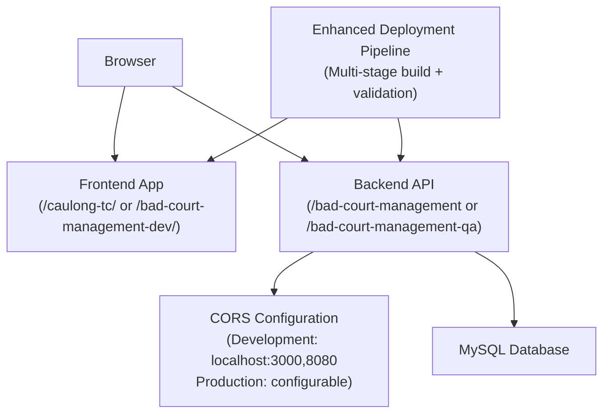
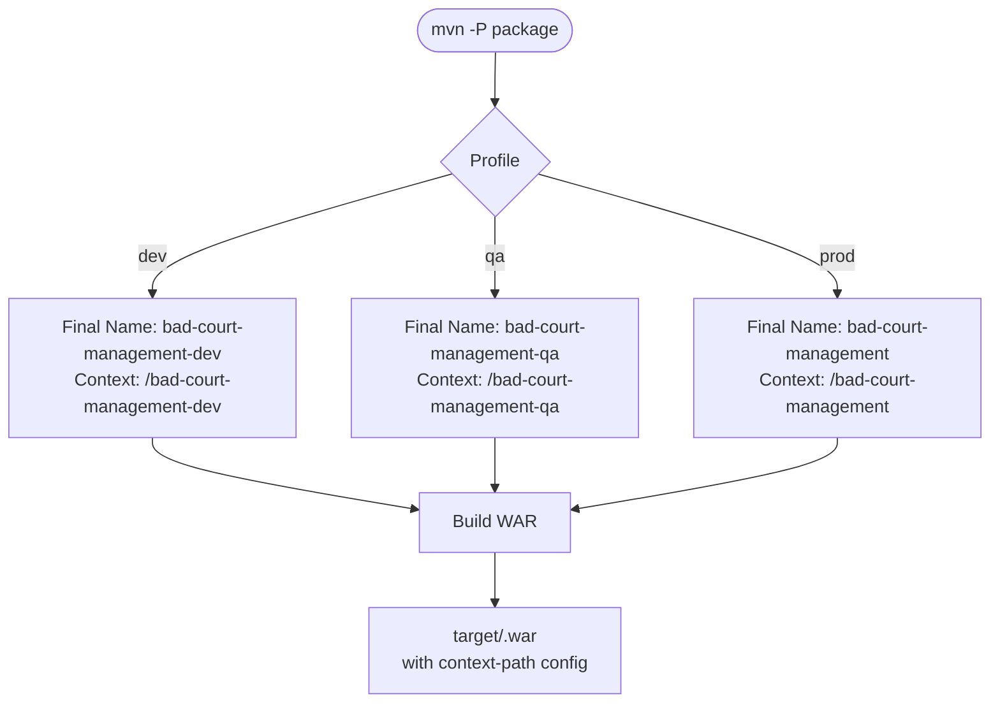
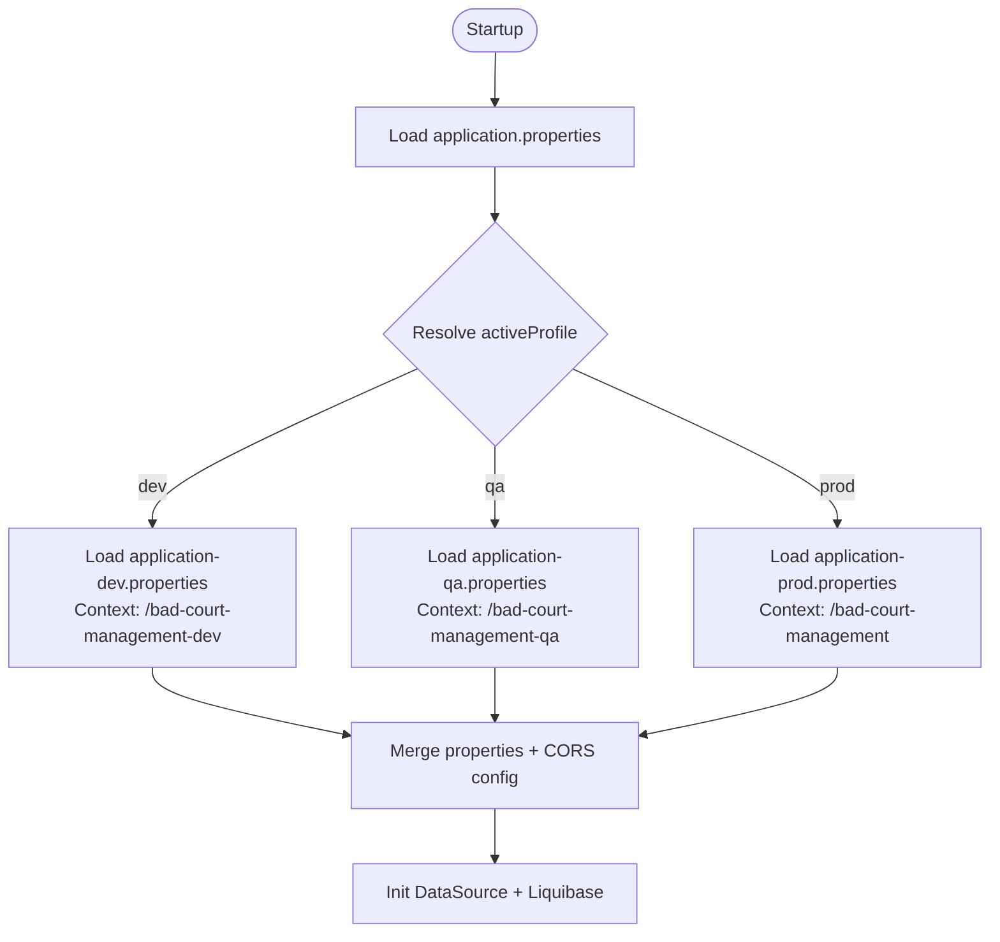
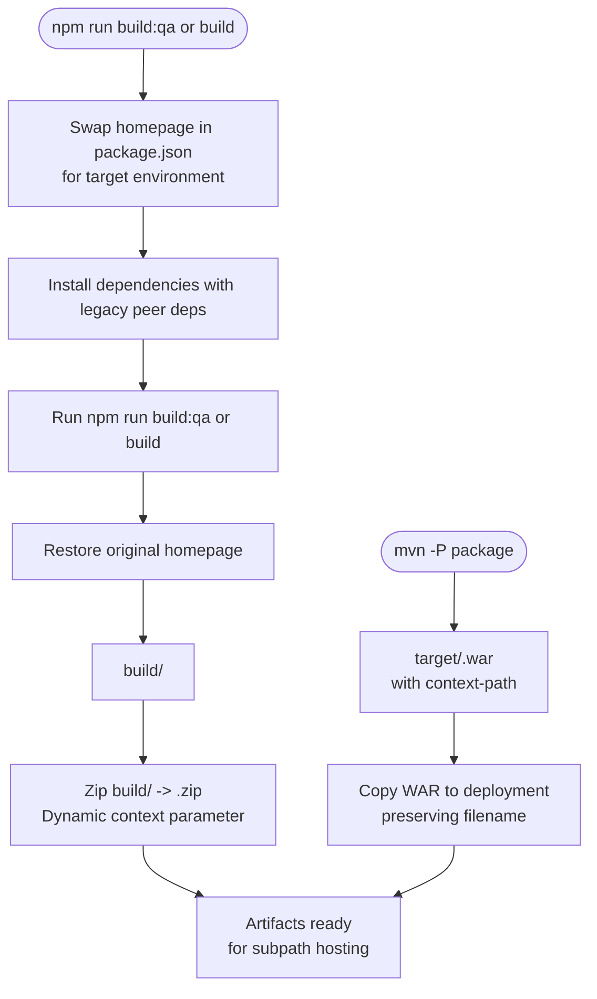
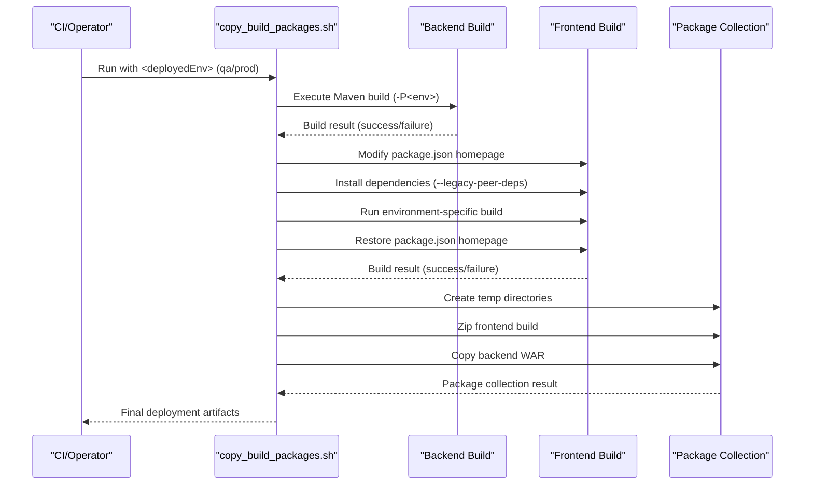
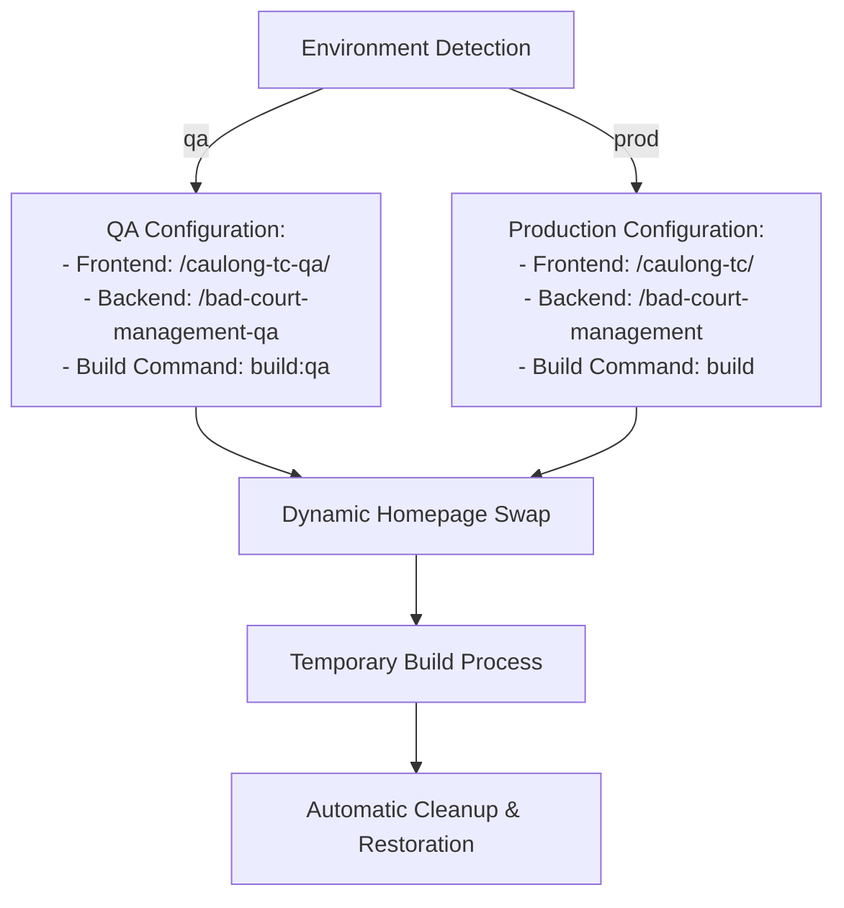
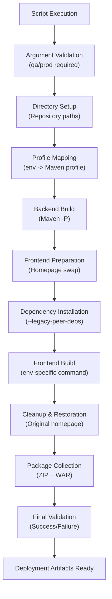
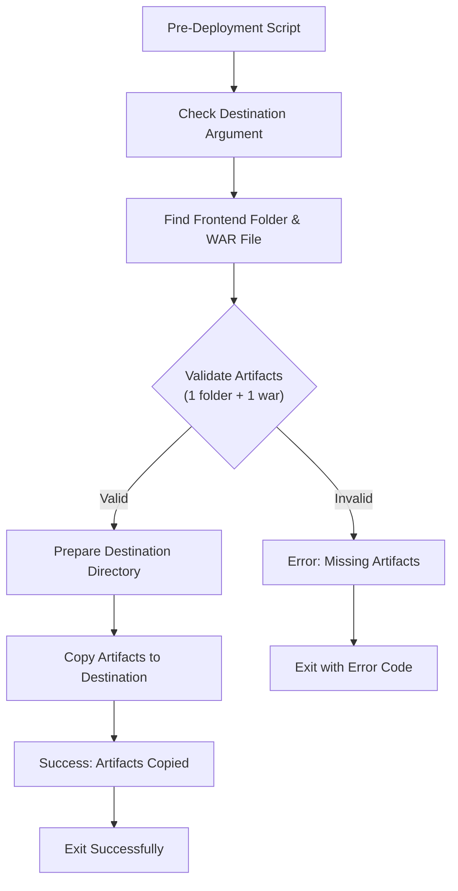
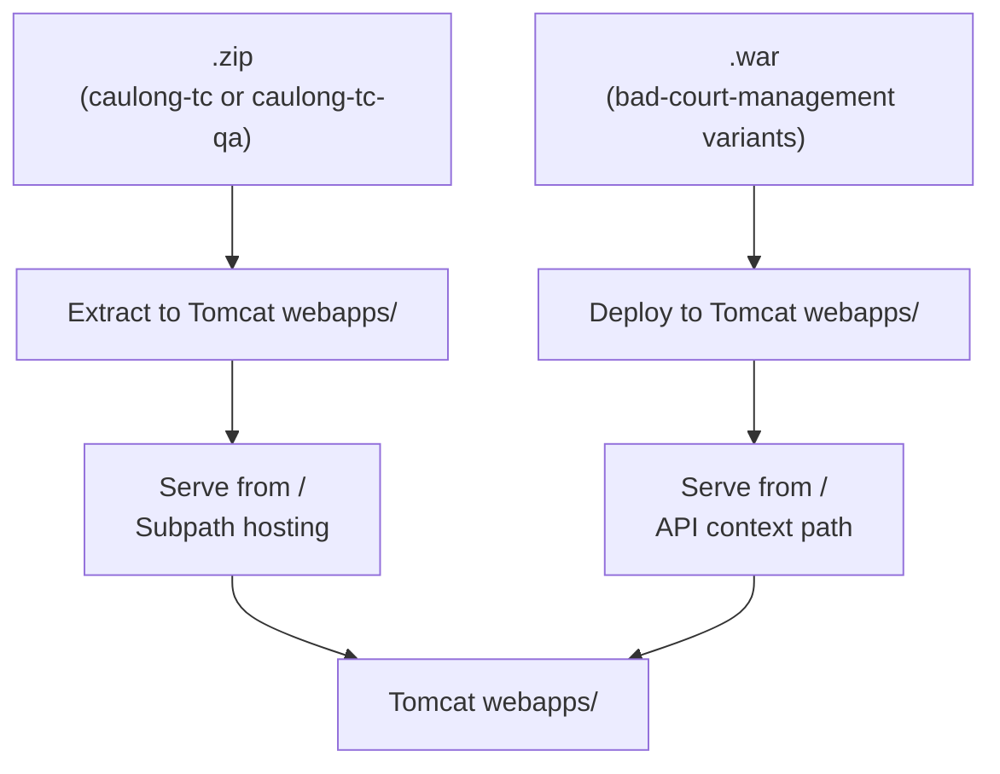

# Deployment & Operations

<cite>
**Referenced Files in This Document**
- [pom.xml](file://BadmintonCourtManagement/pom.xml)
- [application.properties](file://BadmintonCourtManagement/src/main/resources/application.properties)
- [application-dev.properties](file://BadmintonCourtManagement/src/main/resources/application-dev.properties)
- [application-qa.properties](file://BadmintonCourtManagement/src/main/resources/application-qa.properties)
- [application-prod.properties](file://BadmintonCourtManagement/src/main/resources/application-prod.properties)
- [SecurityConfig.java](file://BadmintonCourtManagement/src/main/java/com/badminton/config/SecurityConfig.java)
- [copy_build_packages.sh](file://deployment/copy_build_packages.sh)
- [pre-deployment.sh](file://deployment/pre-deployment.sh)
- [deployment-note.txt](file://deployment/deployment-note.txt)
- [deployment-note-qa.txt](file://deployment/deployment-note-qa.txt)
- [package.json](file://bad-court-mana-ui/package.json)
- [index.html](file://bad-court-mana-ui/public/index.html)
- [README.md](file://README.md)
</cite>

## Update Summary
**Changes Made**
- Enhanced deployment script with multi-stage build process and environment-specific configurations
- Updated deployment pipeline documentation to cover new copy_build_packages.sh capabilities
- Improved error handling and validation in deployment scripts
- Added dynamic frontend context handling for QA/production environments
- Updated build process documentation with environment-specific build commands

## Table of Contents
1. [Introduction](#introduction)
2. [Project Structure](#project-structure)
3. [Core Components](#core-components)
4. [Architecture Overview](#architecture-overview)
5. [Detailed Component Analysis](#detailed-component-analysis)
6. [Enhanced Deployment Pipeline](#enhanced-deployment-pipeline)
7. [Multi-Stage Build Process](#multi-stage-build-process)
8. [Environment-Specific Configuration Management](#environment-specific-configuration-management)
9. [Automated Deployment Scripts](#automated-deployment-scripts)
10. [Tomcat Deployment and Context Paths](#tomcat-deployment-and-context-paths)
11. [Performance Considerations](#performance-considerations)
12. [Troubleshooting Guide](#troubleshooting-guide)
13. [Conclusion](#conclusion)
14. [Appendices](#appendices)

## Introduction
This document provides comprehensive deployment and operations guidance for the Badminton Court Management system. It covers environment-specific builds using Maven profiles, automated multi-stage deployment processes, enhanced error handling, Tomcat deployment configuration, environment property management, and operational best practices including performance tuning, monitoring, backups, rollbacks, and disaster recovery.

**Updated** Enhanced with improved deployment topology documentation for subpath hosting, advanced CORS handling mechanisms, environment-specific build configurations, and sophisticated automated deployment workflows with multi-stage build processes.

## Project Structure
The repository follows a monorepo-style layout with enhanced deployment automation:
- Backend: Spring Boot 3.5.x application packaged as a WAR for external Tomcat deployment with enhanced CORS configuration and environment-specific Maven profiles.
- Frontend: React SPA built with Create React App, designed for subpath hosting with dynamic context-path configuration and environment-specific build scripts.
- Deployment automation: Enhanced shell scripts orchestrate multi-stage packaging and pre-deployment tasks with environment-specific parameters and robust error handling.
- Configuration: Environment-specific properties and Liquibase changelogs with dynamic context-path management.

```mermaid
graph TB
subgraph "Backend (Spring Boot)"
POM["pom.xml<br/>Maven profiles dev/qa/prod<br/>Multi-stage build"]
APP_PROPS["application.properties<br/>common settings + CORS"]
SECURITY_CONFIG["SecurityConfig.java<br/>CORS + CSRF configuration"]
ENV_DEV["application-dev.properties<br/>context-path: /bad-court-management-dev"]
ENV_QA["application-qa.properties<br/>context-path: /bad-court-management-qa"]
ENV_PROD["application-prod.properties<br/>context-path: /bad-court-management"]
TARGET["target/<finalName>.war"]
end
subgraph "Frontend (React)"
PKG["package.json<br/>homepage, scripts<br/>env-cmd support"]
PUBLIC_HTML["public/index.html"]
BUILD["build/ (generated)"]
ZIP["<frontend-context>.zip"]
end
subgraph "Enhanced Deployment"
COPY["copy_build_packages.sh<br/>Multi-stage build<br/>Environment validation"]
PRE["pre-deployment.sh<br/>Validation + deployment"]
TOMCAT["Tomcat webapps/<br/>subpath hosting"]
end
POM --> TARGET
APP_PROPS --> TARGET
SECURITY_CONFIG --> TARGET
ENV_DEV --> TARGET
ENV_QA --> TARGET
ENV_PROD --> TARGET
BUILD --> ZIP
COPY --> ZIP
COPY --> TARGET
PRE --> TOMCAT
```

**Diagram sources**
- [pom.xml:115-222](file://BadmintonCourtManagement/pom.xml#L115-L222)
- [application.properties:1-19](file://BadmintonCourtManagement/src/main/resources/application.properties#L1-L19)
- [SecurityConfig.java:112-136](file://BadmintonCourtManagement/src/main/java/com/badminton/config/SecurityConfig.java#L112-L136)
- [application-dev.properties:1-12](file://BadmintonCourtManagement/src/main/resources/application-dev.properties#L1-L12)
- [application-qa.properties:1-9](file://BadmintonCourtManagement/src/main/resources/application-qa.properties#L1-L9)
- [application-prod.properties:1-9](file://BadmintonCourtManagement/src/main/resources/application-prod.properties#L1-L9)
- [package.json:1-59](file://bad-court-mana-ui/package.json#L1-L59)
- [index.html:1-44](file://bad-court-mana-ui/public/index.html#L1-L44)
- [copy_build_packages.sh:1-165](file://deployment/copy_build_packages.sh#L1-L165)
- [pre-deployment.sh:1-41](file://deployment/pre-deployment.sh#L1-L41)

**Section sources**
- [README.md:82-126](file://README.md#L82-L126)
- [pom.xml:115-222](file://BadmintonCourtManagement/pom.xml#L115-L222)
- [package.json:1-59](file://bad-court-mana-ui/package.json#L1-L59)

## Core Components
- Enhanced Maven profiles define environment-specific build outputs with multi-stage deployment support:
  - dev: finalName bad-court-management-dev, context-path /bad-court-management-dev
  - qa: finalName bad-court-management-qa, context-path /bad-court-management-qa
  - prod: finalName bad-court-management, context-path /bad-court-management
- Advanced CORS configuration in SecurityConfig.java provides environment-aware origin patterns:
  - Development: localhost:3000 (frontend dev server) and localhost:8080 (Tomcat)
  - Production: configurable origins with credential support
- Environment properties manage context-path, datasource, driver, and Liquibase change log.
- Frontend packaging with flexible homepage configuration and environment-specific build scripts using env-cmd.
- Enhanced deployment scripts with environment parameterization, multi-stage build processes, and robust error handling for automated deployment workflows.

**Section sources**
- [pom.xml:115-222](file://BadmintonCourtManagement/pom.xml#L115-L222)
- [application.properties:1-19](file://BadmintonCourtManagement/src/main/resources/application.properties#L1-L19)
- [SecurityConfig.java:112-136](file://BadmintonCourtManagement/src/main/java/com/badminton/config/SecurityConfig.java#L112-L136)
- [application-dev.properties:1-12](file://BadmintonCourtManagement/src/main/resources/application-dev.properties#L1-L12)
- [application-qa.properties:1-9](file://BadmintonCourtManagement/src/main/resources/application-qa.properties#L1-L9)
- [application-prod.properties:1-9](file://BadmintonCourtManagement/src/main/resources/application-prod.properties#L1-L9)
- [package.json:1-59](file://bad-court-mana-ui/package.json#L1-L59)
- [copy_build_packages.sh:1-165](file://deployment/copy_build_packages.sh#L1-L165)
- [pre-deployment.sh:1-41](file://deployment/pre-deployment.sh#L1-L41)

## Architecture Overview
The system deploys two independent components with enhanced subpath hosting capabilities and sophisticated deployment automation:
- Static frontend hosted under a configurable subpath (e.g., caulong-tc, bad-court-management-dev).
- Spring Boot WAR deployed to Tomcat with environment-specific API context paths.
- Advanced CORS configuration supporting both development and production scenarios.
- Multi-stage deployment pipeline with automated validation and error handling.

**Diagram sources**
- [deployment-note.txt:3-39](file://deployment/deployment-note.txt#L3-L39)
- [SecurityConfig.java:112-136](file://BadmintonCourtManagement/src/main/java/com/badminton/config/SecurityConfig.java#L112-L136)
- [application-dev.properties:1-12](file://BadmintonCourtManagement/src/main/resources/application-dev.properties#L1-L12)
- [application-qa.properties:1-9](file://BadmintonCourtManagement/src/main/resources/application-qa.properties#L1-L9)
- [application-prod.properties:1-9](file://BadmintonCourtManagement/src/main/resources/application-prod.properties#L1-L9)
- [copy_build_packages.sh:54-165](file://deployment/copy_build_packages.sh#L54-L165)

## Detailed Component Analysis

### Enhanced Maven Profiles and Artifact Naming
- Profiles with multi-stage deployment support:
  - dev: default, finalName bad-court-management-dev, context-path /bad-court-management-dev
  - qa: finalName bad-court-management-qa, context-path /bad-court-management-qa
  - prod: finalName bad-court-management, context-path /bad-court-management
- Packaging: war with Spring Boot plugin; Tomcat runtime scope retained as provided.
- Multi-stage build process ensures consistent artifact generation across environments.

**Diagram sources**
- [pom.xml:115-222](file://BadmintonCourtManagement/pom.xml#L115-L222)

**Section sources**
- [pom.xml:115-222](file://BadmintonCourtManagement/pom.xml#L115-L222)

### Environment Configuration Management
- Active profile placeholder in application.properties selects the environment-specific properties file at runtime.
- Environment files define:
  - context-path for frontend and API subpath hosting.
  - datasource URL, username, password, driver.
  - Liquibase change log location and enabled flag.
- Enhanced CORS configuration supports environment-specific origin patterns.

**Diagram sources**
- [application.properties:1-19](file://BadmintonCourtManagement/src/main/resources/application.properties#L1-L19)
- [SecurityConfig.java:112-136](file://BadmintonCourtManagement/src/main/java/com/badminton/config/SecurityConfig.java#L112-L136)
- [application-dev.properties:1-12](file://BadmintonCourtManagement/src/main/resources/application-dev.properties#L1-L12)
- [application-qa.properties:1-9](file://BadmintonCourtManagement/src/main/resources/application-qa.properties#L1-L9)
- [application-prod.properties:1-9](file://BadmintonCourtManagement/src/main/resources/application-prod.properties#L1-L9)

**Section sources**
- [application.properties:1-19](file://BadmintonCourtManagement/src/main/resources/application.properties#L1-L19)
- [SecurityConfig.java:112-136](file://BadmintonCourtManagement/src/main/java/com/badminton/config/SecurityConfig.java#L112-L136)
- [application-dev.properties:1-12](file://BadmintonCourtManagement/src/main/resources/application-dev.properties#L1-L12)
- [application-qa.properties:1-9](file://BadmintonCourtManagement/src/main/resources/application-qa.properties#L1-L9)
- [application-prod.properties:1-9](file://BadmintonCourtManagement/src/main/resources/application-prod.properties#L1-L9)

### Enhanced Frontend Build and Packaging
- Homepage in package.json determines the deployed frontend folder name for subpath hosting.
- React build produces build/.
- Enhanced copy_build_packages.sh with multi-stage build process:
  - Validates environment argument for flexible deployment contexts.
  - Dynamically swaps homepage in package.json for target environment.
  - Supports environment-specific build commands (build vs build:qa).
  - Implements robust error handling with automatic cleanup.
  - Zips frontend build and copies backend WAR to deployment directory.

**Diagram sources**
- [package.json:1-59](file://bad-court-mana-ui/package.json#L1-L59)
- [copy_build_packages.sh:81-109](file://deployment/copy_build_packages.sh#L81-L109)

**Section sources**
- [package.json:1-59](file://bad-court-mana-ui/package.json#L1-L59)
- [copy_build_packages.sh:1-165](file://deployment/copy_build_packages.sh#L1-L165)

## Enhanced Deployment Pipeline

### Multi-Stage Build Process
The enhanced deployment pipeline implements a sophisticated multi-stage build process with comprehensive error handling and validation:

#### Stage 1: Backend Build (Spring Boot WAR)
- Executes Maven build with environment-specific profile
- Skips tests for faster deployment cycles
- Validates build success and exits on failure
- Generates environment-specific WAR artifacts

#### Stage 2: Frontend Build (React UI)
- Dynamically modifies package.json homepage for target environment
- Installs dependencies with legacy peer dependencies support
- Executes environment-specific build command
- Automatically restores original package.json configuration
- Validates build completion and handles errors gracefully

#### Stage 3: Package Collection
- Creates temporary directories for organized packaging
- Zips frontend build output with dynamic context naming
- Copies backend WAR file with preserved filename
- Implements atomic replacement of existing WAR files
- Provides comprehensive success/failure feedback

**Diagram sources**
- [copy_build_packages.sh:54-165](file://deployment/copy_build_packages.sh#L54-L165)

**Section sources**
- [copy_build_packages.sh:1-165](file://deployment/copy_build_packages.sh#L1-L165)

## Environment-Specific Configuration Management

### Dynamic Context Path Configuration
The deployment system supports dynamic context path configuration through multiple layers:

#### Backend Context Paths
- Development: `/bad-court-management-dev`
- QA: `/bad-court-management-qa`
- Production: `/bad-court-management`

#### Frontend Context Paths
- QA Environment: `/caulong-tc-qa/`
- Production Environment: `/caulong-tc/`

#### Dynamic Configuration Management
- Automatic homepage swapping in package.json during build process
- Environment-specific build commands (build vs build:qa)
- Temporary configuration changes with automatic restoration
- Comprehensive validation at each configuration step

**Diagram sources**
- [copy_build_packages.sh:36-47](file://deployment/copy_build_packages.sh#L36-L47)
- [package.json:32-34](file://bad-court-mana-ui/package.json#L32-L34)

**Section sources**
- [copy_build_packages.sh:36-47](file://deployment/copy_build_packages.sh#L36-L47)
- [package.json:32-34](file://bad-court-mana-ui/package.json#L32-L34)

## Automated Deployment Scripts

### Enhanced copy_build_packages.sh
The enhanced deployment script implements a comprehensive multi-stage build process with robust error handling:

#### Key Features
- **Environment Validation**: Strict argument validation for 'qa' or 'prod' parameters
- **Dynamic Configuration**: Automatic homepage swapping and restoration
- **Error Handling**: Comprehensive error detection with cleanup and restoration
- **Atomic Operations**: Safe file replacement with backup preservation
- **Cross-Platform Compatibility**: Uses BSD-compatible sed syntax for macOS

#### Multi-Stage Process
1. **Argument Validation**: Ensures proper environment specification
2. **Directory Setup**: Establishes repository structure and paths
3. **Profile Configuration**: Maps environment to Maven profile and build commands
4. **Backend Build**: Executes Maven build with environment-specific profile
5. **Frontend Build**: Dynamically configures and builds React application
6. **Package Collection**: Organizes and packages deployment artifacts

**Diagram sources**
- [copy_build_packages.sh:13-165](file://deployment/copy_build_packages.sh#L13-L165)

**Section sources**
- [copy_build_packages.sh:1-165](file://deployment/copy_build_packages.sh#L1-L165)

### Enhanced pre-deployment.sh
The pre-deployment script provides robust validation and preparation for deployment:

#### Key Features
- **Argument Validation**: Ensures destination location is specified
- **Artifact Validation**: Verifies presence of exactly one frontend folder and one .war file
- **Destination Preparation**: Creates destination directory if needed
- **Atomic Copying**: Safely copies artifacts with error handling
- **Comprehensive Logging**: Provides detailed feedback on operation status

#### Validation Logic
- Checks for exactly one directory (excluding hidden directories and specific folders)
- Validates presence of at least one .war file
- Ensures destination directory creation and artifact copying
- Provides clear error messages for validation failures

**Diagram sources**
- [pre-deployment.sh:14-38](file://deployment/pre-deployment.sh#L14-L38)

**Section sources**
- [pre-deployment.sh:1-41](file://deployment/pre-deployment.sh#L1-L41)

## Tomcat Deployment and Context Paths

### Enhanced Deployment Architecture
- Frontend context path configured in application-dev.properties, application-qa.properties, application-prod.properties for subpath hosting.
- Backend WAR finalName defines the API context path with environment-specific naming.
- Enhanced deployment notes document:
  - Frontend folder name mapping to homepage for subpath hosting.
  - Backend WAR finalName mapping to API context path.
  - Tomcat extraction and placement steps for both development and production contexts.
  - Improved error handling and validation in deployment process.

**Diagram sources**
- [deployment-note.txt:88-113](file://deployment/deployment-note.txt#L88-L113)
- [pom.xml:115-222](file://BadmintonCourtManagement/pom.xml#L115-L222)
- [application-dev.properties:1-12](file://BadmintonCourtManagement/src/main/resources/application-dev.properties#L1-L12)
- [application-qa.properties:1-9](file://BadmintonCourtManagement/src/main/resources/application-qa.properties#L1-L9)
- [application-prod.properties:1-9](file://BadmintonCourtManagement/src/main/resources/application-prod.properties#L1-L9)

**Section sources**
- [deployment-note.txt:88-113](file://deployment/deployment-note.txt#L88-L113)

## Performance Considerations
- JVM and Tomcat tuning:
  - Set JAVA_HOME and CATALINA_OPTS as documented in deployment notes.
  - Consider heap sizing and GC tuning for production throughput.
  - Enhanced CORS configuration reduces cross-origin overhead.
- Database connection pooling and queries:
  - Tune MySQL connection pool settings externally.
  - Monitor slow SQL via Hibernate logs configured in application.properties.
  - Environment-specific database connections optimize resource allocation.
- Static asset delivery:
  - Serve frontend via Tomcat or CDN with compression and caching headers.
  - Subpath hosting enables CDN optimization and edge caching.
- Enhanced deployment pipeline:
  - Multi-stage build process reduces deployment time through parallelizable stages.
  - Atomic file operations minimize downtime during updates.
  - Comprehensive error handling prevents partial deployments.
- Liquibase:
  - Keep secureParsing disabled only during controlled deployments as noted in deployment notes.

## Troubleshooting Guide
- Missing environment argument in scripts:
  - copy_build_packages.sh requires exactly one argument: 'qa' or 'prod'.
  - pre-deployment.sh requires destination location argument.
- Frontend build failures:
  - Verify npm dependencies installation with --legacy-peer-deps flag.
  - Check environment-specific build commands (build vs build:qa).
  - Ensure package.json homepage swapping completes successfully.
- Backend build failures:
  - Verify Maven profile availability (dev/qa/prod).
  - Check for compilation errors in Spring Boot application.
  - Validate database connectivity for environment-specific configurations.
- Missing artifacts:
  - Ensure build/ directory exists before packaging.
  - Verify Maven build generates .war file in target/ directory.
  - Check that pre-deployment.sh finds exactly one frontend folder and one .war file.
- Context path issues:
  - Confirm frontend homepage matches deployed folder name for subpath hosting.
  - Verify backend finalName matches API context path.
  - Check CORS configuration for development vs production origins.
- Database connectivity:
  - Validate datasource URL, credentials, and plugin configuration as per deployment notes.
  - Ensure environment-specific database connections are properly configured.
- Tomcat startup:
  - Ensure Java 21 is configured and CATALINA_OPTS includes liquibase flag if needed.
  - Verify subpath hosting configuration in Tomcat.
  - Check that deployment artifacts are placed in correct Tomcat webapps/ directory.

**Section sources**
- [copy_build_packages.sh:14-27](file://deployment/copy_build_packages.sh#L14-L27)
- [pre-deployment.sh:4-8](file://deployment/pre-deployment.sh#L4-L8)
- [SecurityConfig.java:112-136](file://BadmintonCourtManagement/src/main/java/com/badminton/config/SecurityConfig.java#L112-L136)
- [deployment-note.txt:88-113](file://deployment/deployment-note.txt#L88-L113)

## Conclusion
The enhanced deployment pipeline leverages sophisticated multi-stage build processes to produce environment-specific WAR artifacts with dynamic context-path configuration, complements by packaging the React frontend into context-aligned archives with subpath hosting support, and automates pre-deployment validation with robust error handling. Enhanced CORS configuration provides environment-aware cross-origin support, while proper environment property management, consistent context paths, and adherence to the documented Tomcat steps ensure reliable production deployments across development, QA, and production environments. The new deployment scripts provide comprehensive validation, error handling, and atomic operations that improve deployment reliability and reduce manual intervention requirements.

## Appendices

### Enhanced Build and Deployment Commands
- Backend build with multi-stage process:
  - `./copy_build_packages.sh qa` (generates caulong-tc-qa.zip + bad-court-management-qa.war)
  - `./copy_build_packages.sh prod` (generates caulong-tc.zip + bad-court-management.war)
- Frontend build with environment-specific configuration:
  - `npm install` (installs dependencies with legacy peer deps)
  - `npm run build:qa` (QA environment build with env-cmd)
  - `npm run build` (Production environment build)
- Package collection with enhanced validation:
  - `cd deployment`
  - `./copy_build_packages.sh <qa|prod>` (validates environment, builds, packages)
- Pre-deployment with comprehensive validation:
  - `./pre-deployment.sh <destination>` (validates artifacts, copies to destination)

**Section sources**
- [README.md:105-126](file://README.md#L105-L126)
- [deployment-note.txt:21-39](file://deployment/deployment-note.txt#L21-L39)
- [copy_build_packages.sh:8-11](file://deployment/copy_build_packages.sh#L8-L11)

### Enhanced Environment Configuration Reference
- dev: context-path /bad-court-management-dev, datasource, driver, Liquibase change log.
- qa: context-path /bad-court-management-qa, datasource, driver, Liquibase change log.
- prod: context-path /bad-court-management, datasource, driver, Liquibase change log.

**Section sources**
- [application-dev.properties:1-12](file://BadmintonCourtManagement/src/main/resources/application-dev.properties#L1-L12)
- [application-qa.properties:1-9](file://BadmintonCourtManagement/src/main/resources/application-qa.properties#L1-L9)
- [application-prod.properties:1-9](file://BadmintonCourtManagement/src/main/resources/application-prod.properties#L1-L9)

### Enhanced CORS Configuration Reference
- Development: localhost:3000 (frontend), localhost:8080 (Tomcat), credentials enabled.
- Production: configurable origins, restricted by default, credentials supported.
- Methods: GET, POST, PUT, DELETE, OPTIONS.
- Headers: All headers permitted.
- Exposed headers: Content-Disposition for file downloads.

**Section sources**
- [SecurityConfig.java:112-136](file://BadmintonCourtManagement/src/main/java/com/badminton/config/SecurityConfig.java#L112-L136)

### Enhanced Rollback, Backup, and Disaster Recovery
- Rollback:
  - Keep previous WAR and frontend archives with environment-specific naming.
  - Redeploy the prior <finalName>.war and <frontend-context>.zip with correct context paths.
  - Use enhanced pre-deployment.sh for validation during rollback process.
- Backup:
  - Back up database schemas and users as outlined in deployment notes.
  - Back up Tomcat logs and application data directories.
  - Preserve environment-specific configuration files and deployment scripts.
- Disaster Recovery:
  - Recreate database users and schemas for target environment.
  - Restore WAR and frontend archives to Tomcat webapps with correct context paths.
  - Reconfigure CORS settings for target environment.
  - Execute enhanced deployment scripts with proper environment validation.

**Section sources**
- [deployment-note.txt:40-87](file://deployment/deployment-note.txt#L40-L87)
- [copy_build_packages.sh:13-27](file://deployment/copy_build_packages.sh#L13-L27)
- [pre-deployment.sh:14-38](file://deployment/pre-deployment.sh#L14-L38)