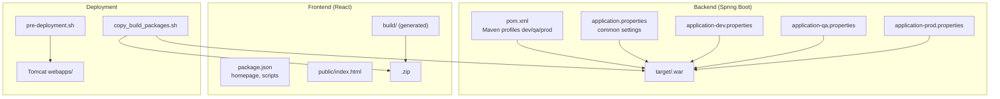
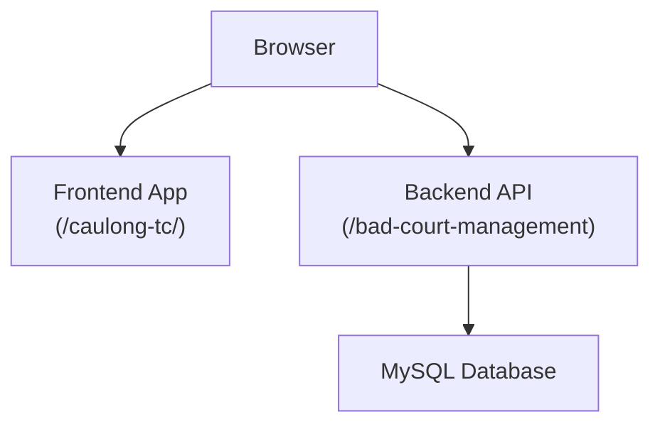
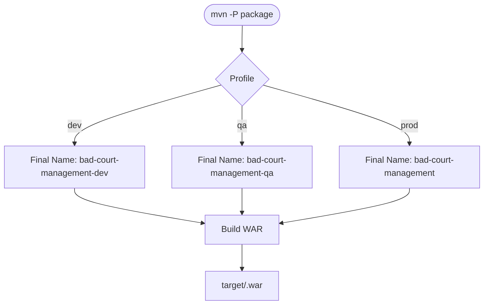
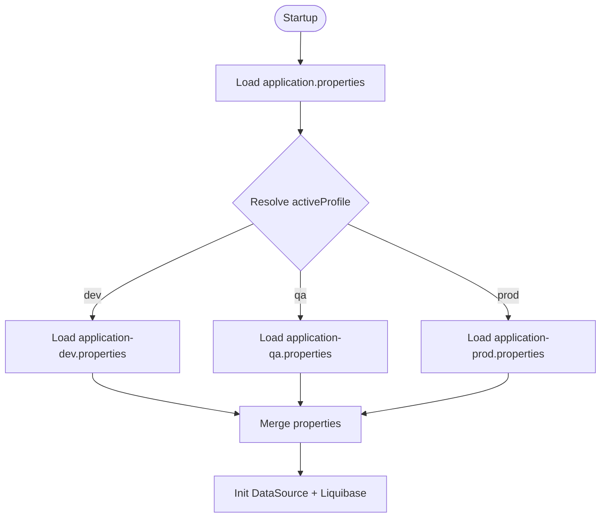
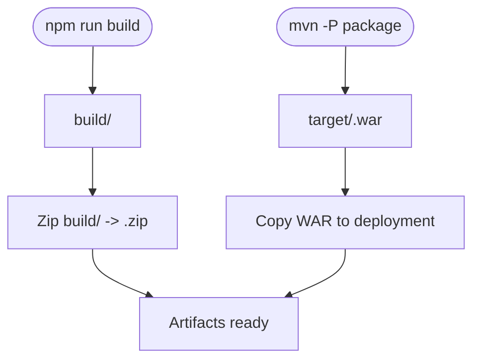
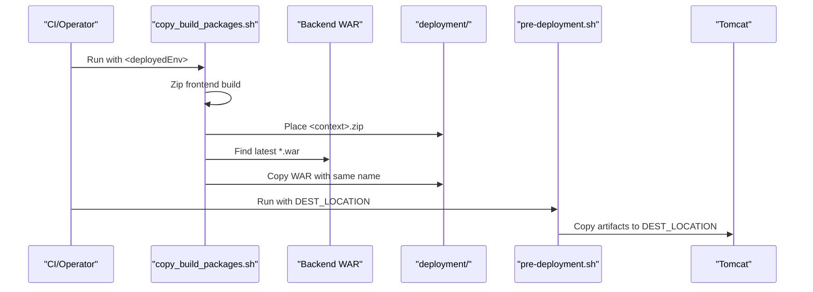
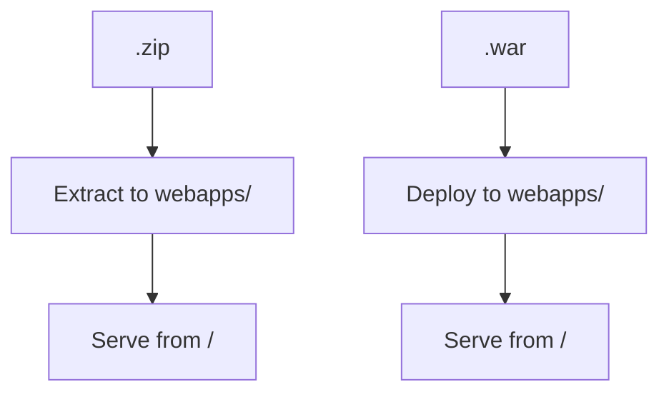
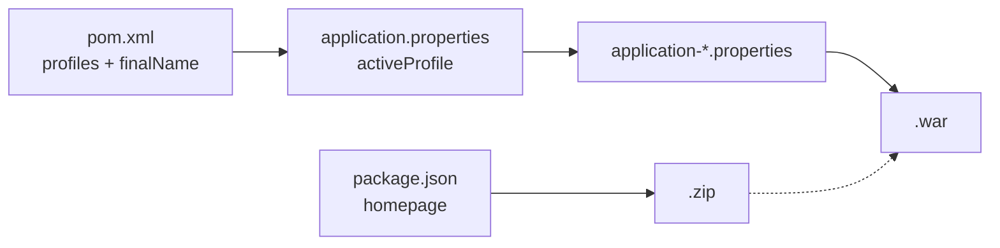

# Deployment & Operations

<cite>
**Referenced Files in This Document**
- [pom.xml](file://BadmintonCourtManagement/pom.xml)
- [application.properties](file://BadmintonCourtManagement/src/main/resources/application.properties)
- [application-dev.properties](file://BadmintonCourtManagement/src/main/resources/application-dev.properties)
- [application-qa.properties](file://BadmintonCourtManagement/src/main/resources/application-qa.properties)
- [application-prod.properties](file://BadmintonCourtManagement/src/main/resources/application-prod.properties)
- [copy_build_packages.sh](file://deployment/copy_build_packages.sh)
- [pre-deployment.sh](file://deployment/pre-deployment.sh)
- [deployment-note.txt](file://deployment/deployment-note.txt)
- [deployment-note-qa.txt](file://deployment/deployment-note-qa.txt)
- [package.json](file://bad-court-mana-ui/package.json)
- [index.html](file://bad-court-mana-ui/public/index.html)
- [README.md](file://README.md)
</cite>

## Table of Contents
1. [Introduction](#introduction)
2. [Project Structure](#project-structure)
3. [Core Components](#core-components)
4. [Architecture Overview](#architecture-overview)
5. [Detailed Component Analysis](#detailed-component-analysis)
6. [Dependency Analysis](#dependency-analysis)
7. [Performance Considerations](#performance-considerations)
8. [Troubleshooting Guide](#troubleshooting-guide)
9. [Conclusion](#conclusion)
10. [Appendices](#appendices)

## Introduction
This document provides comprehensive deployment and operations guidance for the Badminton Court Management system. It covers environment-specific builds using Maven profiles, artifact generation and packaging, Tomcat deployment configuration, environment property management, automated deployment scripts, and operational best practices including performance tuning, monitoring, backups, rollbacks, and disaster recovery.

## Project Structure
The repository follows a monorepo-style layout:
- Backend: Spring Boot 3.5.x application packaged as a WAR for external Tomcat deployment.
- Frontend: React SPA built with Create React App, designed for subpath hosting.
- Deployment automation: Shell scripts orchestrate packaging and pre-deployment tasks.
- Configuration: Environment-specific properties and Liquibase changelogs.

**Diagram sources**
- [pom.xml:115-201](file://BadmintonCourtManagement/pom.xml#L115-L201)
- [application.properties:1-19](file://BadmintonCourtManagement/src/main/resources/application.properties#L1-L19)
- [application-dev.properties:1-12](file://BadmintonCourtManagement/src/main/resources/application-dev.properties#L1-L12)
- [application-qa.properties:1-9](file://BadmintonCourtManagement/src/main/resources/application-qa.properties#L1-L9)
- [application-prod.properties:1-9](file://BadmintonCourtManagement/src/main/resources/application-prod.properties#L1-L9)
- [package.json:1-59](file://bad-court-mana-ui/package.json#L1-L59)
- [index.html:1-44](file://bad-court-mana-ui/public/index.html#L1-L44)
- [copy_build_packages.sh:1-60](file://deployment/copy_build_packages.sh#L1-L60)
- [pre-deployment.sh:1-41](file://deployment/pre-deployment.sh#L1-L41)

**Section sources**
- [README.md:82-126](file://README.md#L82-L126)
- [pom.xml:115-201](file://BadmintonCourtManagement/pom.xml#L115-L201)
- [package.json:1-59](file://bad-court-mana-ui/package.json#L1-L59)

## Core Components
- Maven profiles define environment-specific build outputs:
  - dev: finalName bad-court-management-dev
  - qa: finalName bad-court-management-qa
  - prod: finalName bad-court-management
- Environment properties:
  - application.properties sets active profile placeholder and logging.
  - application-dev.properties, application-qa.properties, application-prod.properties set context-path, datasource, driver, and Liquibase change log.
- Frontend packaging:
  - homepage in package.json aligns with deployed frontend folder.
  - React build generates build/ for static assets.
- Deployment scripts:
  - copy_build_packages.sh collects frontend build and backend WAR into deployment-ready artifacts.
  - pre-deployment.sh validates and moves collected artifacts to a destination for Tomcat.

**Section sources**
- [pom.xml:115-201](file://BadmintonCourtManagement/pom.xml#L115-L201)
- [application.properties:1-19](file://BadmintonCourtManagement/src/main/resources/application.properties#L1-L19)
- [application-dev.properties:1-12](file://BadmintonCourtManagement/src/main/resources/application-dev.properties#L1-L12)
- [application-qa.properties:1-9](file://BadmintonCourtManagement/src/main/resources/application-qa.properties#L1-L9)
- [application-prod.properties:1-9](file://BadmintonCourtManagement/src/main/resources/application-prod.properties#L1-L9)
- [package.json:1-59](file://bad-court-mana-ui/package.json#L1-L59)
- [copy_build_packages.sh:1-60](file://deployment/copy_build_packages.sh#L1-L60)
- [pre-deployment.sh:1-41](file://deployment/pre-deployment.sh#L1-L41)

## Architecture Overview
The system deploys two independent components:
- Static frontend hosted under a subpath (e.g., caulong-tc).
- Spring Boot WAR deployed to Tomcat with a dedicated API context path (e.g., bad-court-management).

**Diagram sources**
- [deployment-note.txt:3-39](file://deployment/deployment-note.txt#L3-L39)
- [application-dev.properties:1-12](file://BadmintonCourtManagement/src/main/resources/application-dev.properties#L1-L12)
- [application-qa.properties:1-9](file://BadmintonCourtManagement/src/main/resources/application-qa.properties#L1-L9)
- [application-prod.properties:1-9](file://BadmintonCourtManagement/src/main/resources/application-prod.properties#L1-L9)

## Detailed Component Analysis

### Maven Profiles and Artifact Naming
- Profiles:
  - dev: default, finalName bad-court-management-dev
  - qa: finalName bad-court-management-qa
  - prod: finalName bad-court-management
- Packaging: war with Spring Boot plugin; Tomcat runtime scope retained as provided.

**Diagram sources**
- [pom.xml:115-201](file://BadmintonCourtManagement/pom.xml#L115-L201)

**Section sources**
- [pom.xml:115-201](file://BadmintonCourtManagement/pom.xml#L115-L201)

### Environment Configuration Management
- Active profile placeholder in application.properties selects the environment-specific properties file at runtime.
- Environment files define:
  - context-path for frontend and API.
  - datasource URL, username, password, driver.
  - Liquibase change log location and enabled flag.

**Diagram sources**
- [application.properties:1-19](file://BadmintonCourtManagement/src/main/resources/application.properties#L1-L19)
- [application-dev.properties:1-12](file://BadmintonCourtManagement/src/main/resources/application-dev.properties#L1-L12)
- [application-qa.properties:1-9](file://BadmintonCourtManagement/src/main/resources/application-qa.properties#L1-L9)
- [application-prod.properties:1-9](file://BadmintonCourtManagement/src/main/resources/application-prod.properties#L1-L9)

**Section sources**
- [application.properties:1-19](file://BadmintonCourtManagement/src/main/resources/application.properties#L1-L19)
- [application-dev.properties:1-12](file://BadmintonCourtManagement/src/main/resources/application-dev.properties#L1-L12)
- [application-qa.properties:1-9](file://BadmintonCourtManagement/src/main/resources/application-qa.properties#L1-L9)
- [application-prod.properties:1-9](file://BadmintonCourtManagement/src/main/resources/application-prod.properties#L1-L9)

### Frontend Build and Packaging
- Homepage in package.json determines the deployed frontend folder name.
- React build produces build/.
- copy_build_packages.sh:
  - Zips build/ into <frontend-context>.zip.
  - Copies the latest backend WAR to deployment output.

**Diagram sources**
- [package.json:1-59](file://bad-court-mana-ui/package.json#L1-L59)
- [copy_build_packages.sh:24-56](file://deployment/copy_build_packages.sh#L24-L56)

**Section sources**
- [package.json:1-59](file://bad-court-mana-ui/package.json#L1-L59)
- [copy_build_packages.sh:24-56](file://deployment/copy_build_packages.sh#L24-L56)

### Automated Deployment Scripts
- copy_build_packages.sh:
  - Validates environment argument.
  - Zips frontend build and copies backend WAR to deployment directory.
  - Preserves existing WAR filenames and replaces only the WAR file.
- pre-deployment.sh:
  - Validates presence of exactly one frontend folder and one .war file.
  - Creates destination and copies artifacts.

**Diagram sources**
- [copy_build_packages.sh:1-60](file://deployment/copy_build_packages.sh#L1-L60)
- [pre-deployment.sh:1-41](file://deployment/pre-deployment.sh#L1-L41)

**Section sources**
- [copy_build_packages.sh:1-60](file://deployment/copy_build_packages.sh#L1-L60)
- [pre-deployment.sh:1-41](file://deployment/pre-deployment.sh#L1-L41)

### Tomcat Deployment and Context Paths
- Frontend context path configured in application-dev.properties, application-qa.properties, application-prod.properties.
- Backend WAR finalName defines the API context path.
- deployment-note.txt documents:
  - Frontend folder name mapping to homepage.
  - Backend WAR finalName mapping to API context path.
  - Tomcat extraction and placement steps.

**Diagram sources**
- [deployment-note.txt:3-39](file://deployment/deployment-note.txt#L3-L39)
- [pom.xml:115-201](file://BadmintonCourtManagement/pom.xml#L115-L201)
- [application-dev.properties:1-12](file://BadmintonCourtManagement/src/main/resources/application-dev.properties#L1-L12)
- [application-qa.properties:1-9](file://BadmintonCourtManagement/src/main/resources/application-qa.properties#L1-L9)
- [application-prod.properties:1-9](file://BadmintonCourtManagement/src/main/resources/application-prod.properties#L1-L9)

**Section sources**
- [deployment-note.txt:88-113](file://deployment/deployment-note.txt#L88-L113)

## Dependency Analysis
- Maven profiles control finalName and activeProfile property, which in turn select environment-specific properties.
- Frontend homepage must match the deployed frontend folder name.
- Liquibase is configured via properties; secure parsing flag is set in deployment notes.

**Diagram sources**
- [pom.xml:115-201](file://BadmintonCourtManagement/pom.xml#L115-L201)
- [application.properties:1-19](file://BadmintonCourtManagement/src/main/resources/application.properties#L1-L19)
- [application-dev.properties:1-12](file://BadmintonCourtManagement/src/main/resources/application-dev.properties#L1-L12)
- [application-qa.properties:1-9](file://BadmintonCourtManagement/src/main/resources/application-qa.properties#L1-L9)
- [application-prod.properties:1-9](file://BadmintonCourtManagement/src/main/resources/application-prod.properties#L1-L9)
- [package.json:1-59](file://bad-court-mana-ui/package.json#L1-L59)

**Section sources**
- [pom.xml:115-201](file://BadmintonCourtManagement/pom.xml#L115-L201)
- [application.properties:1-19](file://BadmintonCourtManagement/src/main/resources/application.properties#L1-L19)
- [package.json:1-59](file://bad-court-mana-ui/package.json#L1-L59)

## Performance Considerations
- JVM and Tomcat tuning:
  - Set JAVA_HOME and CATALINA_OPTS as documented in deployment notes.
  - Consider heap sizing and GC tuning for production throughput.
- Database connection pooling and queries:
  - Tune MySQL connection pool settings externally.
  - Monitor slow SQL via Hibernate logs configured in application.properties.
- Static asset delivery:
  - Serve frontend via Tomcat or CDN with compression and caching headers.
- Liquibase:
  - Keep secureParsing disabled only during controlled deployments as noted in deployment notes.

[No sources needed since this section provides general guidance]

## Troubleshooting Guide
- Missing environment argument in scripts:
  - copy_build_packages.sh requires <deployedEnv>.
  - pre-deployment.sh requires <location>.
- Missing frontend build:
  - Ensure build/ exists before zipping.
- No WAR found:
  - Verify Maven build completed and target contains a .war file.
- Incorrect context paths:
  - Confirm frontend homepage matches deployed folder name.
  - Confirm backend finalName matches API context path.
- Database connectivity:
  - Validate datasource URL, credentials, and plugin configuration as per deployment notes.
- Tomcat startup:
  - Ensure Java 21 is configured and CATALINA_OPTS includes liquibase flag if needed.

**Section sources**
- [copy_build_packages.sh:5-10](file://deployment/copy_build_packages.sh#L5-L10)
- [pre-deployment.sh:3-8](file://deployment/pre-deployment.sh#L3-L8)
- [deployment-note.txt:88-113](file://deployment/deployment-note.txt#L88-L113)

## Conclusion
The deployment pipeline leverages Maven profiles to produce environment-specific WAR artifacts, complements by packaging the React frontend into a context-aligned archive, and automates pre-deployment validation. Proper environment property management, consistent context paths, and adherence to the documented Tomcat steps ensure reliable production deployments.

[No sources needed since this section summarizes without analyzing specific files]

## Appendices

### Build and Deployment Commands
- Backend build:
  - mvn -Pdev clean package
  - mvn -Pqa clean package
  - mvn -Pprod clean package
- Frontend build:
  - npm install
  - npm run build
- Package collection:
  - cd deployment
  - ./copy_build_packages.sh <frontend-context>
- Pre-deployment:
  - ./pre-deployment.sh <destination>

**Section sources**
- [README.md:105-126](file://README.md#L105-L126)
- [deployment-note.txt:21-39](file://deployment/deployment-note.txt#L21-L39)

### Environment Configuration Reference
- dev: context-path, datasource, driver, Liquibase change log.
- qa: context-path, datasource, driver, Liquibase change log.
- prod: context-path, datasource, driver, Liquibase change log.

**Section sources**
- [application-dev.properties:1-12](file://BadmintonCourtManagement/src/main/resources/application-dev.properties#L1-L12)
- [application-qa.properties:1-9](file://BadmintonCourtManagement/src/main/resources/application-qa.properties#L1-L9)
- [application-prod.properties:1-9](file://BadmintonCourtManagement/src/main/resources/application-prod.properties#L1-L9)

### Rollback, Backup, and Disaster Recovery
- Rollback:
  - Keep previous WAR and frontend archives.
  - Redeploy the prior <finalName>.war and <frontend-context>.zip.
- Backup:
  - Back up database schemas and users as outlined in deployment notes.
  - Back up Tomcat logs and application data directories.
- Disaster Recovery:
  - Recreate database users and schemas.
  - Restore WAR and frontend archives to Tomcat webapps/.

**Section sources**
- [deployment-note.txt:40-87](file://deployment/deployment-note.txt#L40-L87)