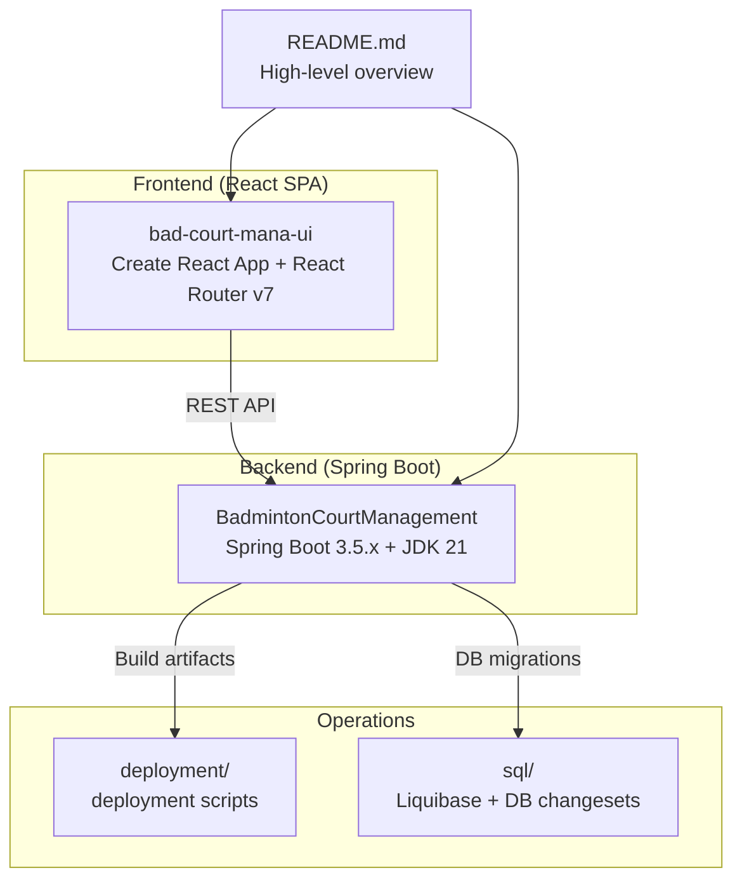
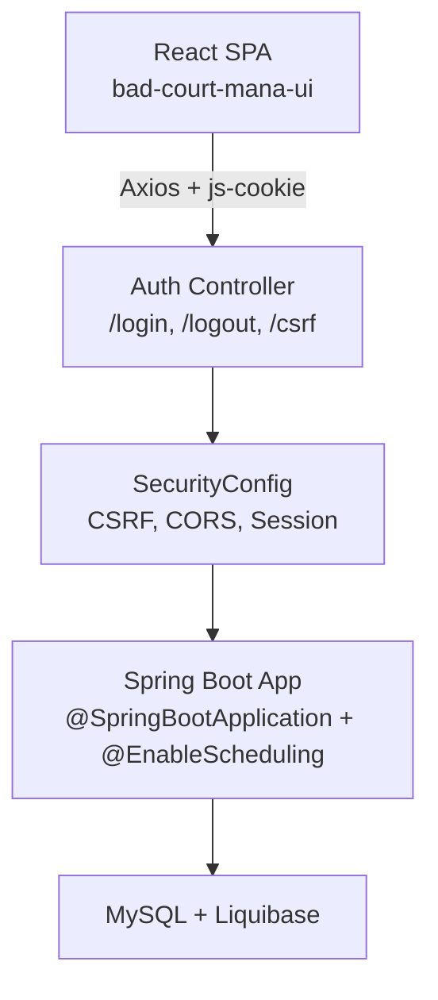
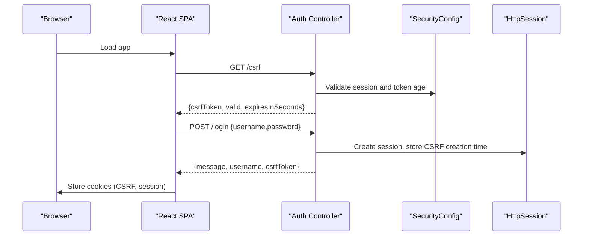
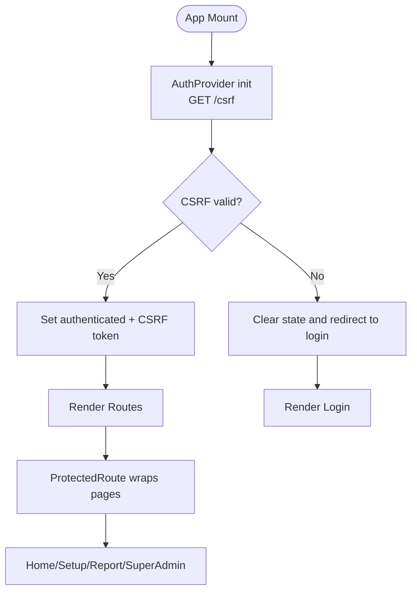
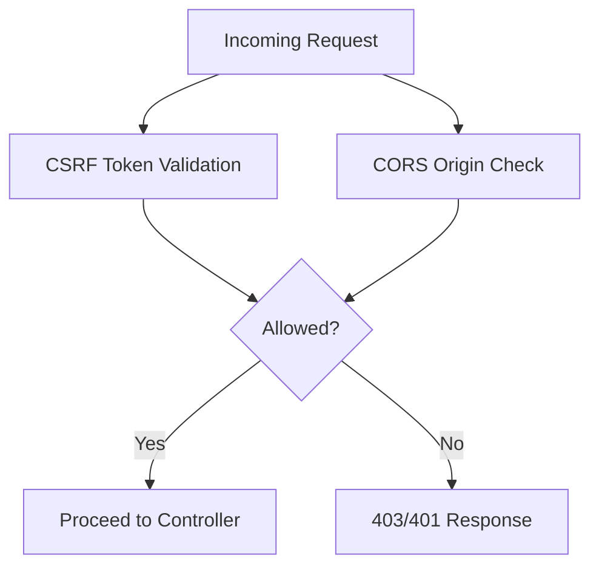
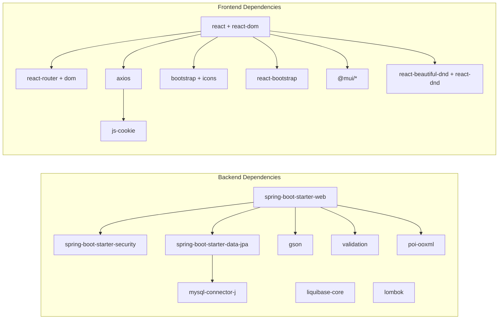

# Development Guidelines

<cite>
**Referenced Files in This Document**
- [README.md](file://README.md)
- [JDK21_SETUP.md](file://BadmintonCourtManagement/JDK21_SETUP.md)
- [setup-jdk21.sh](file://BadmintonCourtManagement/setup-jdk21.sh)
- [check-jdk21.sh](file://BadmintonCourtManagement/check-jdk21.sh)
- [pom.xml](file://BadmintonCourtManagement/pom.xml)
- [application.properties](file://BadmintonCourtManagement/src/main/resources/application.properties)
- [application-dev.properties](file://BadmintonCourtManagement/src/main/resources/application-dev.properties)
- [BadmintonCourtManagementApplication.java](file://BadmintonCourtManagement/src/main/java/com/badminton/BadmintonCourtManagementApplication.java)
- [SecurityConfig.java](file://BadmintonCourtManagement/src/main/java/com/badminton/config/SecurityConfig.java)
- [AuthenController.java](file://BadmintonCourtManagement/src/main/java/com/badminton/controller/AuthenController.java)
- [package.json](file://bad-court-mana-ui/package.json)
- [App.js](file://bad-court-mana-ui/src/App.js)
- [index.js](file://bad-court-mana-ui/src/index.js)
- [AuthContext.js](file://bad-court-mana-ui/src/context/AuthContext.js)
</cite>

## Table of Contents
1. [Introduction](#introduction)
2. [Project Structure](#project-structure)
3. [Core Components](#core-components)
4. [Architecture Overview](#architecture-overview)
5. [Detailed Component Analysis](#detailed-component-analysis)
6. [Dependency Analysis](#dependency-analysis)
7. [Performance Considerations](#performance-considerations)
8. [Troubleshooting Guide](#troubleshooting-guide)
9. [Conclusion](#conclusion)
10. [Appendices](#appendices)

## Introduction
This document provides comprehensive development guidelines for the Badminton Court Management system. It covers JDK 21 setup, development environment configuration, Maven project structure and build optimization, React frontend organization and best practices, code style and naming conventions, code review and branching workflows, and the end-to-end development lifecycle from feature implementation to testing and deployment. The system follows a monorepo-style layout with a Spring Boot backend and a React SPA frontend communicating over REST APIs with CORS configured for local development.

## Project Structure
The repository is organized as a monorepo containing:
- Backend: Spring Boot application under BadmintonCourtManagement
- Frontend: React SPA under bad-court-mana-ui
- Deployment scripts and SQL assets under deployment and sql
- Top-level documentation and notes

**Diagram sources**
- [README.md:105-126](file://README.md#L105-L126)
- [pom.xml:1-204](file://BadmintonCourtManagement/pom.xml#L1-L204)
- [package.json:1-59](file://bad-court-mana-ui/package.json#L1-L59)

**Section sources**
- [README.md:54-103](file://README.md#L54-L103)
- [pom.xml:1-204](file://BadmintonCourtManagement/pom.xml#L1-L204)
- [package.json:1-59](file://bad-court-mana-ui/package.json#L1-L59)

## Core Components
- Backend application entrypoint initializes Spring Boot and enables scheduling.
- Security configuration defines CSRF and CORS policies, session management, and authentication provider.
- Authentication controller handles login and CSRF token validation.
- Frontend app bootstraps routing, theming, and protected routes with an authentication context provider.

Key implementation references:
- Application bootstrap: [BadmintonCourtManagementApplication.java:1-16](file://BadmintonCourtManagement/src/main/java/com/badminton/BadmintonCourtManagementApplication.java#L1-L16)
- Security configuration: [SecurityConfig.java:1-193](file://BadmintonCourtManagement/src/main/java/com/badminton/config/SecurityConfig.java#L1-L193)
- Authentication controller: [AuthenController.java:1-111](file://BadmintonCourtManagement/src/main/java/com/badminton/controller/AuthenController.java#L1-L111)
- Frontend app routing and providers: [App.js:1-104](file://bad-court-mana-ui/src/App.js#L1-L104)
- Frontend auth provider and session handling: [AuthContext.js:1-91](file://bad-court-mana-ui/src/context/AuthContext.js#L1-L91)

**Section sources**
- [BadmintonCourtManagementApplication.java:1-16](file://BadmintonCourtManagement/src/main/java/com/badminton/BadmintonCourtManagementApplication.java#L1-L16)
- [SecurityConfig.java:1-193](file://BadmintonCourtManagement/src/main/java/com/badminton/config/SecurityConfig.java#L1-L193)
- [AuthenController.java:1-111](file://BadmintonCourtManagement/src/main/java/com/badminton/controller/AuthenController.java#L1-L111)
- [App.js:1-104](file://bad-court-mana-ui/src/App.js#L1-L104)
- [AuthContext.js:1-91](file://bad-court-mana-ui/src/context/AuthContext.js#L1-L91)

## Architecture Overview
The system uses a session-centric domain model with a clear separation between frontend and backend:
- Backend exposes REST endpoints for authentication, session management, court/game administration, payment, and reporting.
- Frontend is a React SPA that authenticates via CSRF-enabled endpoints and interacts with the backend through Axios.
- CORS is configured for local development (frontend on port 3000, backend on 8080) and secured for production.

**Diagram sources**
- [README.md:105-126](file://README.md#L105-L126)
- [SecurityConfig.java:44-92](file://BadmintonCourtManagement/src/main/java/com/badminton/config/SecurityConfig.java#L44-L92)
- [AuthenController.java:78-111](file://BadmintonCourtManagement/src/main/java/com/badminton/controller/AuthenController.java#L78-L111)
- [application-dev.properties:1-12](file://BadmintonCourtManagement/src/main/resources/application-dev.properties#L1-L12)

**Section sources**
- [README.md:89-103](file://README.md#L89-L103)
- [SecurityConfig.java:112-140](file://BadmintonCourtManagement/src/main/java/com/badminton/config/SecurityConfig.java#L112-L140)
- [AuthenController.java:45-73](file://BadmintonCourtManagement/src/main/java/com/badminton/controller/AuthenController.java#L45-L73)

## Detailed Component Analysis

### Backend: Authentication Flow
The authentication flow integrates Spring Security with CSRF protection and session management. The frontend obtains a CSRF token and stores it in cookies, then logs in to establish a session.

**Diagram sources**
- [AuthenController.java:45-111](file://BadmintonCourtManagement/src/main/java/com/badminton/controller/AuthenController.java#L45-L111)
- [SecurityConfig.java:44-92](file://BadmintonCourtManagement/src/main/java/com/badminton/config/SecurityConfig.java#L44-L92)
- [AuthContext.js:14-32](file://bad-court-mana-ui/src/context/AuthContext.js#L14-L32)

**Section sources**
- [AuthenController.java:78-111](file://BadmintonCourtManagement/src/main/java/com/badminton/controller/AuthenController.java#L78-L111)
- [AuthContext.js:14-32](file://bad-court-mana-ui/src/context/AuthContext.js#L14-L32)

### Frontend: Routing and Protected Routes
The React app sets up routing with protected routes and an authentication context provider. Theming is centralized via Material-UI.

**Diagram sources**
- [App.js:43-94](file://bad-court-mana-ui/src/App.js#L43-L94)
- [AuthContext.js:14-50](file://bad-court-mana-ui/src/context/AuthContext.js#L14-L50)
- [index.js:10-18](file://bad-court-mana-ui/src/index.js#L10-L18)

**Section sources**
- [App.js:1-104](file://bad-court-mana-ui/src/App.js#L1-L104)
- [AuthContext.js:1-91](file://bad-court-mana-ui/src/context/AuthContext.js#L1-L91)
- [index.js:1-21](file://bad-court-mana-ui/src/index.js#L1-L21)

### Backend: CORS and CSRF Configuration
SecurityConfig configures CSRF and CORS for local development. Origins include both frontend (port 3000) and backend (port 8080) during development.

**Diagram sources**
- [SecurityConfig.java:44-92](file://BadmintonCourtManagement/src/main/java/com/badminton/config/SecurityConfig.java#L44-L92)
- [SecurityConfig.java:112-140](file://BadmintonCourtManagement/src/main/java/com/badminton/config/SecurityConfig.java#L112-L140)

**Section sources**
- [SecurityConfig.java:112-140](file://BadmintonCourtManagement/src/main/java/com/badminton/config/SecurityConfig.java#L112-L140)

## Dependency Analysis
- Backend dependencies include Spring Web, Security, Data JPA, Liquibase, MySQL driver, Gson, validation, Apache POI, and Lombok.
- Frontend dependencies include React, React Router, Axios, js-cookie, Bootstrap, React Bootstrap, Material-UI, and drag-and-drop libraries.

**Diagram sources**
- [pom.xml:37-113](file://BadmintonCourtManagement/pom.xml#L37-L113)
- [package.json:6-29](file://bad-court-mana-ui/package.json#L6-L29)

**Section sources**
- [pom.xml:37-113](file://BadmintonCourtManagement/pom.xml#L37-L113)
- [package.json:6-29](file://bad-court-mana-ui/package.json#L6-L29)

## Performance Considerations
- Backend
  - Enable DevTools selectively for faster iteration; keep off in CI/production.
  - Use Liquibase migrations to manage schema changes efficiently.
  - Keep database queries optimized; leverage pagination for report endpoints.
- Frontend
  - Minimize unnecessary re-renders; memoize heavy computations.
  - Lazy-load routes/components to improve initial load time.
  - Use Material-UI tree-shaking and avoid importing entire libraries.

[No sources needed since this section provides general guidance]

## Troubleshooting Guide
- JDK 21 verification and setup
  - Use the provided scripts to detect and configure JDK 21, JAVA_HOME, and Maven.
  - Verify versions and profile activation.
- Backend
  - Confirm active profile and context path in application properties.
  - Check CSRF token age and session timeout alignment.
- Frontend
  - Ensure cookies are readable and CSRF token is present.
  - Validate router configuration and protected route wrappers.

**Section sources**
- [check-jdk21.sh:1-111](file://BadmintonCourtManagement/check-jdk21.sh#L1-L111)
- [setup-jdk21.sh:1-40](file://BadmintonCourtManagement/setup-jdk21.sh#L1-L40)
- [application.properties:1-19](file://BadmintonCourtManagement/src/main/resources/application.properties#L1-L19)
- [application-dev.properties:1-12](file://BadmintonCourtManagement/src/main/resources/application-dev.properties#L1-L12)
- [AuthenController.java:29-73](file://BadmintonCourtManagement/src/main/java/com/badminton/controller/AuthenController.java#L29-L73)
- [AuthContext.js:14-32](file://bad-court-mana-ui/src/context/AuthContext.js#L14-L32)

## Conclusion
This document outlines the development guidelines for the Badminton Court Management system, focusing on JDK 21 setup, Maven configuration, React SPA organization, security and authentication, and operational workflows. Following these standards ensures consistent development, reliable builds, secure integrations, and maintainable code across the monorepo.

[No sources needed since this section summarizes without analyzing specific files]

## Appendices

### A. JDK 21 Setup Requirements
- Install JDK 21 (Temurin/OpenJDK/Oracle) and Maven 3.8+.
- Configure JAVA_HOME and PATH; verify with provided scripts.
- Use Maven wrapper for consistent builds across environments.

**Section sources**
- [JDK21_SETUP.md:1-142](file://BadmintonCourtManagement/JDK21_SETUP.md#L1-L142)
- [check-jdk21.sh:1-111](file://BadmintonCourtManagement/check-jdk21.sh#L1-L111)
- [setup-jdk21.sh:1-40](file://BadmintonCourtManagement/setup-jdk21.sh#L1-L40)

### B. Development Environment Configuration
- Backend
  - Profiles: dev (default), qa, prod; WAR names differ per profile.
  - Properties: currency, session timeout, Liquibase settings.
- Frontend
  - Scripts: start, build, build:qa, test.
  - Theming and routing via Material-UI and React Router.

**Section sources**
- [pom.xml:115-201](file://BadmintonCourtManagement/pom.xml#L115-L201)
- [application.properties:1-19](file://BadmintonCourtManagement/src/main/resources/application.properties#L1-L19)
- [application-dev.properties:1-12](file://BadmintonCourtManagement/src/main/resources/application-dev.properties#L1-L12)
- [package.json:30-36](file://bad-court-mana-ui/package.json#L30-L36)
- [index.js:8-18](file://bad-court-mana-ui/src/index.js#L8-L18)

### C. Maven Project Structure and Build Optimization
- Properties define Java 21 compiler targets and release.
- Profiles customize artifact names and plugin configurations.
- Recommended optimization: parallel builds, dependency updates, minimal DevTools in CI.

**Section sources**
- [pom.xml:31-36](file://BadmintonCourtManagement/pom.xml#L31-L36)
- [pom.xml:115-201](file://BadmintonCourtManagement/pom.xml#L115-L201)

### D. React Development Guidelines
- Component organization: page/, dialog/, dragNdrop/, context/.
- Theming: Material-UI ThemeProvider and CssBaseline.
- Routing: React Router v7 with protected routes and lazy loading.
- State management: Context API for authentication and global state.

**Section sources**
- [App.js:1-104](file://bad-court-mana-ui/src/App.js#L1-L104)
- [AuthContext.js:1-91](file://bad-court-mana-ui/src/context/AuthContext.js#L1-L91)
- [index.js:1-21](file://bad-court-mana-ui/src/index.js#L1-L21)
- [package.json:1-59](file://bad-court-mana-ui/package.json#L1-L59)

### E. Coding Standards and Naming Conventions
- Java
  - Package naming: com.badminton.*
  - Controllers: @RestController, clear HTTP verb mapping, consistent DTO usage.
  - Services: interface + impl separation, calculator packages for domain logic.
  - Entities: JPA annotations, naming aligned with DB schema.
  - Exceptions: centralized GlobalExceptionHandler, Business/ElementNotExist exceptions.
- JavaScript/React
  - Components: PascalCase, folder-per-feature under src/page and src/dialog.
  - Hooks/state: centralized in Context providers.
  - Styling: Material-UI components, consistent spacing and theme.

**Section sources**
- [AuthenController.java:1-111](file://BadmintonCourtManagement/src/main/java/com/badminton/controller/AuthenController.java#L1-L111)
- [SecurityConfig.java:1-193](file://BadmintonCourtManagement/src/main/java/com/badminton/config/SecurityConfig.java#L1-L193)
- [App.js:1-104](file://bad-court-mana-ui/src/App.js#L1-L104)
- [AuthContext.js:1-91](file://bad-court-mana-ui/src/context/AuthContext.js#L1-L91)

### F. Code Review and Branching Workflow
- Branching: feature branches merged via pull requests with reviewers.
- Code review: enforce naming conventions, security (CSRF/CORS), and test coverage.
- CI: build with Maven wrapper, run tests, linting, and dependency checks.

[No sources needed since this section provides general guidance]

### G. Development Lifecycle: From Feature to Deployment
- Feature implementation: implement backend endpoints/controllers, React components/pages, and DTOs.
- Testing: unit tests for services, integration tests for controllers, frontend component tests.
- Build: Maven profiles for dev/qa/prod; React build for production.
- Deployment: package WAR artifacts and deploy to Tomcat; ensure Liquibase migrations run.

**Section sources**
- [README.md:105-126](file://README.md#L105-L126)
- [pom.xml:115-201](file://BadmintonCourtManagement/pom.xml#L115-L201)
- [package.json:30-36](file://bad-court-mana-ui/package.json#L30-L36)