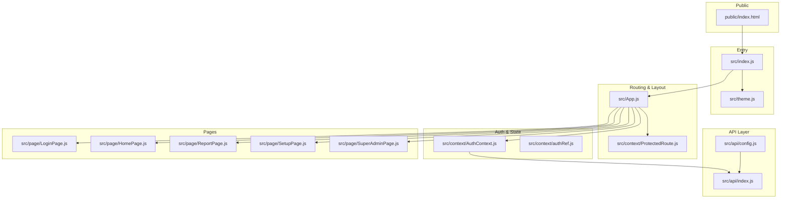
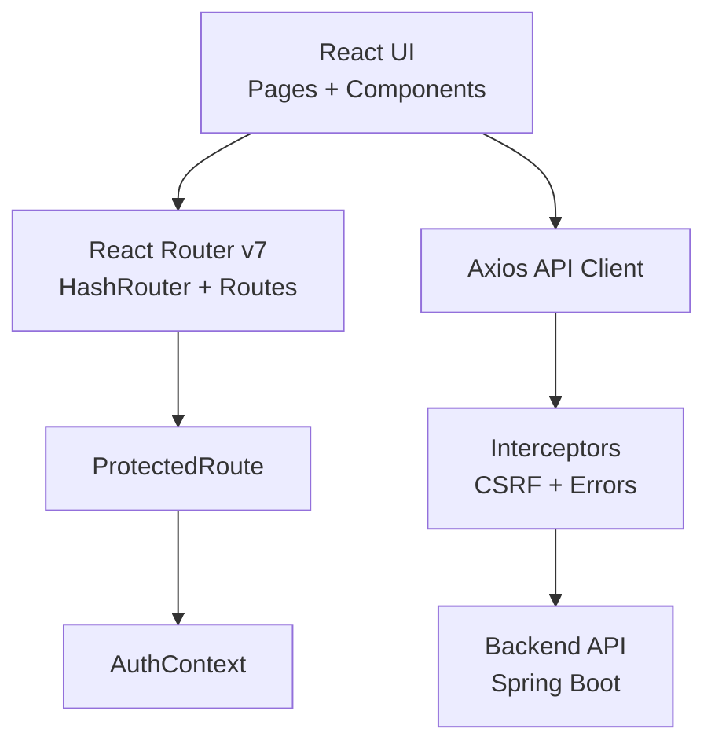
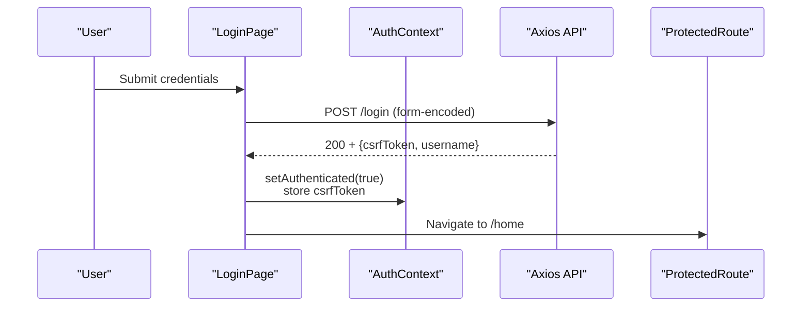
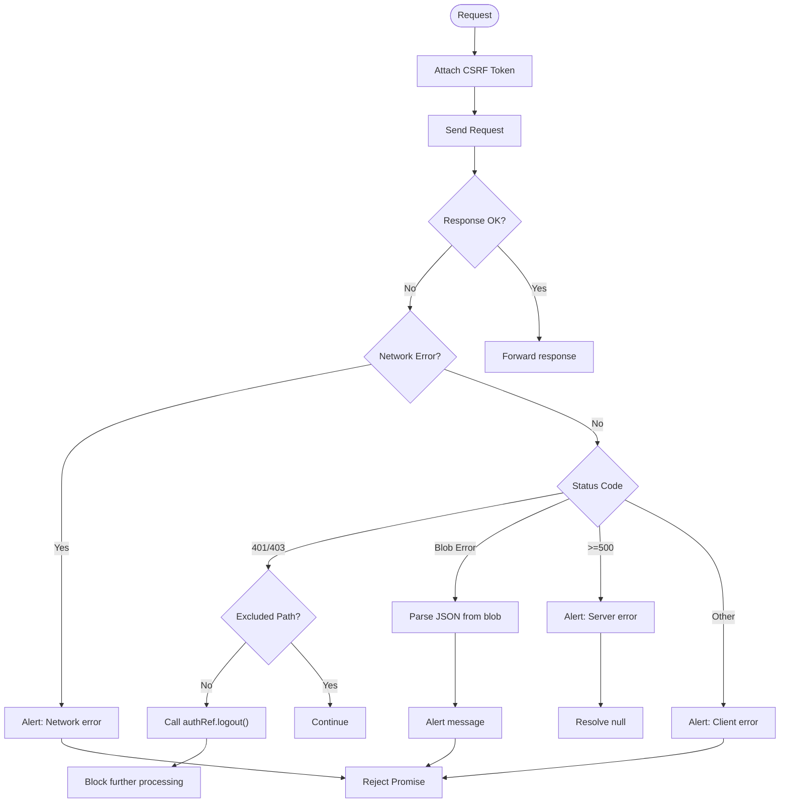
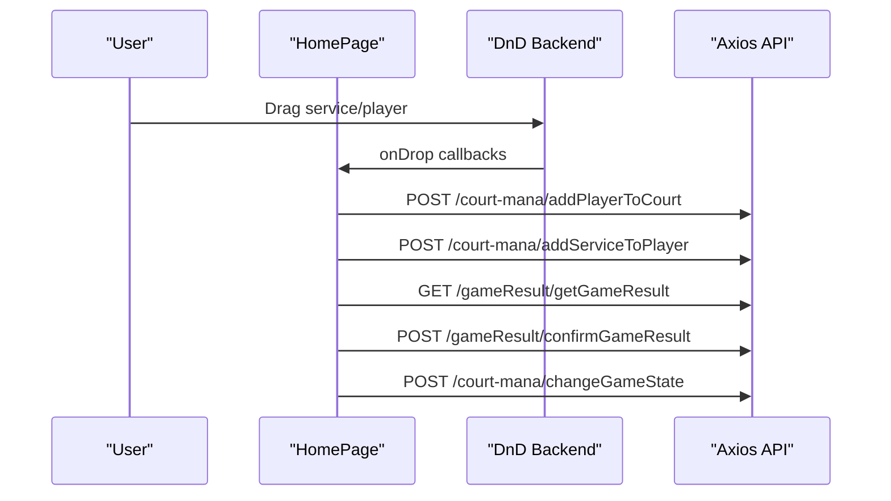
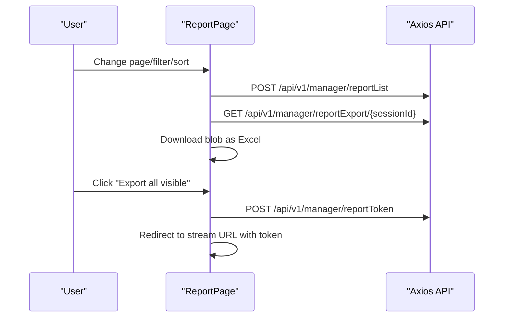
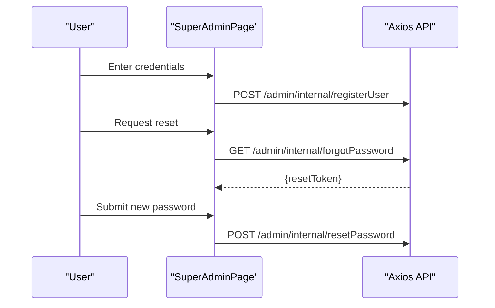
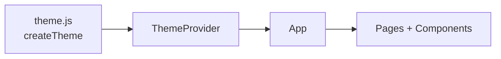
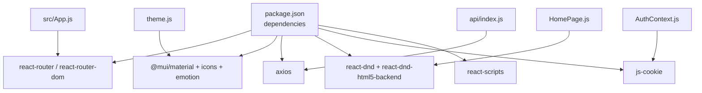

# Frontend Architecture

<cite>
**Referenced Files in This Document**
- [package.json](file://bad-court-mana-ui/package.json)
- [public/index.html](file://bad-court-mana-ui/public/index.html)
- [src/index.js](file://bad-court-mana-ui/src/index.js)
- [src/App.js](file://bad-court-mana-ui/src/App.js)
- [src/theme.js](file://bad-court-mana-ui/src/theme.js)
- [src/context/AuthContext.js](file://bad-court-mana-ui/src/context/AuthContext.js)
- [src/context/ProtectedRoute.js](file://bad-court-mana-ui/src/context/ProtectedRoute.js)
- [src/context/authRef.js](file://bad-court-mana-ui/src/context/authRef.js)
- [src/api/config.js](file://bad-court-mana-ui/src/api/config.js)
- [src/api/index.js](file://bad-court-mana-ui/src/api/index.js)
- [src/page/LoginPage.js](file://bad-court-mana-ui/src/page/LoginPage.js)
- [src/page/HomePage.js](file://bad-court-mana-ui/src/page/HomePage.js)
- [src/page/ReportPage.js](file://bad-court-mana-ui/src/page/ReportPage.js)
- [src/page/SetupPage.js](file://bad-court-mana-ui/src/page/SetupPage.js)
- [src/page/SuperAdminPage.js](file://bad-court-mana-ui/src/page/SuperAdminPage.js)
</cite>

## Table of Contents
1. [Introduction](#introduction)
2. [Project Structure](#project-structure)
3. [Core Components](#core-components)
4. [Architecture Overview](#architecture-overview)
5. [Detailed Component Analysis](#detailed-component-analysis)
6. [Dependency Analysis](#dependency-analysis)
7. [Performance Considerations](#performance-considerations)
8. [Troubleshooting Guide](#troubleshooting-guide)
9. [Conclusion](#conclusion)
10. [Appendices](#appendices)

## Introduction
This document describes the frontend architecture of the React-based user interface for the Badminton Court Management system. It covers component organization by functionality (Home, Report, Setup, Super Admin), authentication and state management via context providers, routing with React Router v7, API integration using Axios with cookie-based CSRF protection, drag-and-drop implementation, theming and responsive design with Material-UI, build configuration for subpath hosting, environment-specific configuration, and frontend-backend integration patterns.

## Project Structure
The frontend is a Create React App project under bad-court-mana-ui with the following high-level layout:
- Public assets and entry HTML
- Application bootstrap and theming
- Routing and top-level layout
- Context providers for authentication and protected routes
- API configuration and interceptors
- Feature pages organized by domain (Home, Report, Setup, Super Admin)
- Drag-and-drop components for player and service management
- Theming and responsive design with Material-UI

**Diagram sources**
- [public/index.html:1-44](file://bad-court-mana-ui/public/index.html#L1-L44)
- [src/index.js:1-21](file://bad-court-mana-ui/src/index.js#L1-L21)
- [src/theme.js:1-28](file://bad-court-mana-ui/src/theme.js#L1-L28)
- [src/App.js:1-104](file://bad-court-mana-ui/src/App.js#L1-L104)
- [src/context/ProtectedRoute.js:1-36](file://bad-court-mana-ui/src/context/ProtectedRoute.js#L1-L36)
- [src/context/AuthContext.js:1-91](file://bad-court-mana-ui/src/context/AuthContext.js#L1-L91)
- [src/context/authRef.js:1-2](file://bad-court-mana-ui/src/context/authRef.js#L1-L2)
- [src/api/config.js:1-7](file://bad-court-mana-ui/src/api/config.js#L1-L7)
- [src/api/index.js:1-101](file://bad-court-mana-ui/src/api/index.js#L1-L101)
- [src/page/LoginPage.js:1-94](file://bad-court-mana-ui/src/page/LoginPage.js#L1-L94)
- [src/page/HomePage.js:1-904](file://bad-court-mana-ui/src/page/HomePage.js#L1-L904)
- [src/page/ReportPage.js:1-347](file://bad-court-mana-ui/src/page/ReportPage.js#L1-L347)
- [src/page/SetupPage.js:1-576](file://bad-court-mana-ui/src/page/SetupPage.js#L1-L576)
- [src/page/SuperAdminPage.js:1-249](file://bad-court-mana-ui/src/page/SuperAdminPage.js#L1-L249)

**Section sources**
- [package.json:1-59](file://bad-court-mana-ui/package.json#L1-L59)
- [public/index.html:1-44](file://bad-court-mana-ui/public/index.html#L1-L44)
- [src/index.js:1-21](file://bad-court-mana-ui/src/index.js#L1-L21)
- [src/App.js:1-104](file://bad-court-mana-ui/src/App.js#L1-L104)

## Core Components
- Authentication Provider: Centralizes session validation, CSRF token handling, and logout actions. Exposes state and methods to child components.
- Protected Route: Guards routes by checking authentication state and rendering a loader until session resolution completes.
- API Client: Axios instance configured with credentials, base URL from environment, request/response interceptors, and centralized error handling.
- Pages:
  - Home: Drag-and-drop arena for managing players, services, and games across courts.
  - Report: Paginated reporting with filtering, sorting, and Excel export.
  - Setup: Administrative configuration of services, shuttle balls, and pricing.
  - Super Admin: User registration and password reset flows with token TTL.
  - Login: Form-based authentication with CSRF propagation.

**Section sources**
- [src/context/AuthContext.js:1-91](file://bad-court-mana-ui/src/context/AuthContext.js#L1-L91)
- [src/context/ProtectedRoute.js:1-36](file://bad-court-mana-ui/src/context/ProtectedRoute.js#L1-L36)
- [src/api/config.js:1-7](file://bad-court-mana-ui/src/api/config.js#L1-L7)
- [src/api/index.js:1-101](file://bad-court-mana-ui/src/api/index.js#L1-L101)
- [src/page/HomePage.js:1-904](file://bad-court-mana-ui/src/page/HomePage.js#L1-L904)
- [src/page/ReportPage.js:1-347](file://bad-court-mana-ui/src/page/ReportPage.js#L1-L347)
- [src/page/SetupPage.js:1-576](file://bad-court-mana-ui/src/page/SetupPage.js#L1-L576)
- [src/page/SuperAdminPage.js:1-249](file://bad-court-mana-ui/src/page/SuperAdminPage.js#L1-L249)
- [src/page/LoginPage.js:1-94](file://bad-court-mana-ui/src/page/LoginPage.js#L1-L94)

## Architecture Overview
The frontend follows a layered architecture:
- Presentation Layer: Pages and UI components (Material-UI).
- Routing Layer: React Router v7 with HashRouter and ProtectedRoute guards.
- State Layer: Context providers for authentication and shared UI state.
- Integration Layer: Axios-based API client with interceptors for CSRF, network, and server errors.
- Backend Integration: Cookie-based session and CSRF tokens, with centralized base URL and timeout.

**Diagram sources**
- [src/App.js:1-104](file://bad-court-mana-ui/src/App.js#L1-L104)
- [src/context/ProtectedRoute.js:1-36](file://bad-court-mana-ui/src/context/ProtectedRoute.js#L1-L36)
- [src/context/AuthContext.js:1-91](file://bad-court-mana-ui/src/context/AuthContext.js#L1-L91)
- [src/api/index.js:1-101](file://bad-court-mana-ui/src/api/index.js#L1-L101)

## Detailed Component Analysis

### Authentication and Protected Routing
- AuthContext initializes session validation on mount, retrieves CSRF token, and stores it in session storage. It exposes logout and forceLogout to trigger global session invalidation.
- ProtectedRoute renders a spinner while loading and redirects unauthenticated users to the login page. It allows passing children or outlet rendering.
- LoginPage handles form submission, sets CSRF token in session storage, and navigates to the home route upon success.

**Diagram sources**
- [src/page/LoginPage.js:1-94](file://bad-court-mana-ui/src/page/LoginPage.js#L1-L94)
- [src/context/AuthContext.js:1-91](file://bad-court-mana-ui/src/context/AuthContext.js#L1-L91)
- [src/api/index.js:1-101](file://bad-court-mana-ui/src/api/index.js#L1-L101)

**Section sources**
- [src/context/AuthContext.js:1-91](file://bad-court-mana-ui/src/context/AuthContext.js#L1-L91)
- [src/context/ProtectedRoute.js:1-36](file://bad-court-mana-ui/src/context/ProtectedRoute.js#L1-L36)
- [src/page/LoginPage.js:1-94](file://bad-court-mana-ui/src/page/LoginPage.js#L1-L94)

### API Integration Layer
- Centralized configuration reads the base URL from environment variables and applies a timeout.
- Axios instance enables credentials and attaches X-XSRF-TOKEN from session storage on requests.
- Response interceptor:
  - Handles network errors with user feedback.
  - Forces logout on 401/403 outside excluded paths.
  - Parses blob errors for exports and surfaces messages.
  - Surfaces generic 500 errors and client errors with alerts.

**Diagram sources**
- [src/api/config.js:1-7](file://bad-court-mana-ui/src/api/config.js#L1-L7)
- [src/api/index.js:1-101](file://bad-court-mana-ui/src/api/index.js#L1-L101)

**Section sources**
- [src/api/config.js:1-7](file://bad-court-mana-ui/src/api/config.js#L1-L7)
- [src/api/index.js:1-101](file://bad-court-mana-ui/src/api/index.js#L1-L101)

### Home Page: Drag-and-Drop Arena
- Uses react-dnd with HTML5 backend for draggable services and player areas.
- Manages state for active courts, players, services, shuttle balls, and per-player service lists.
- Integrates with backend APIs for:
  - Fetching active courts and management data
  - Adding/removing players from courts
  - Updating services per player
  - Starting and finishing games
  - Exporting game results

**Diagram sources**
- [src/page/HomePage.js:1-904](file://bad-court-mana-ui/src/page/HomePage.js#L1-L904)
- [src/api/index.js:1-101](file://bad-court-mana-ui/src/api/index.js#L1-L101)

**Section sources**
- [src/page/HomePage.js:1-904](file://bad-court-mana-ui/src/page/HomePage.js#L1-L904)

### Report Page: Filtering, Sorting, and Export
- Implements pagination, sorting, and filtering with debounced search.
- Supports per-row and bulk Excel export via blob downloads and token-based streaming.

**Diagram sources**
- [src/page/ReportPage.js:1-347](file://bad-court-mana-ui/src/page/ReportPage.js#L1-L347)
- [src/api/index.js:1-101](file://bad-court-mana-ui/src/api/index.js#L1-L101)

**Section sources**
- [src/page/ReportPage.js:1-347](file://bad-court-mana-ui/src/page/ReportPage.js#L1-L347)

### Setup Page: Services and Shuttle Balls
- Allows adding/removing services and shuttle balls, with duplicate detection and formatted currency inputs.
- Persists updates via a single endpoint and refreshes local state accordingly.

**Diagram sources**
- [src/page/SetupPage.js:1-576](file://bad-court-mana-ui/src/page/SetupPage.js#L1-L576)
- [src/api/index.js:1-101](file://bad-court-mana-ui/src/api/index.js#L1-L101)

**Section sources**
- [src/page/SetupPage.js:1-576](file://bad-court-mana-ui/src/page/SetupPage.js#L1-L576)

### Super Admin Page: Registration and Password Reset
- Provides admin registration and a two-stage password reset with token TTL and countdown.

**Diagram sources**
- [src/page/SuperAdminPage.js:1-249](file://bad-court-mana-ui/src/page/SuperAdminPage.js#L1-L249)
- [src/api/index.js:1-101](file://bad-court-mana-ui/src/api/index.js#L1-L101)

**Section sources**
- [src/page/SuperAdminPage.js:1-249](file://bad-court-mana-ui/src/page/SuperAdminPage.js#L1-L249)

### Theming and Responsive Design
- Material-UI theme defines a light palette aligned with Bootstrap-like colors, custom button styles, and shape defaults.
- Root index wraps the app with ThemeProvider and CssBaseline to normalize and apply theme globally.
- Pages use Material-UI components with responsive props and adaptive layouts.

**Diagram sources**
- [src/theme.js:1-28](file://bad-court-mana-ui/src/theme.js#L1-L28)
- [src/index.js:1-21](file://bad-court-mana-ui/src/index.js#L1-L21)

**Section sources**
- [src/theme.js:1-28](file://bad-court-mana-ui/src/theme.js#L1-L28)
- [src/index.js:1-21](file://bad-court-mana-ui/src/index.js#L1-L21)

## Dependency Analysis
- Routing: React Router v7 used with HashRouter and Routes for SPA navigation.
- State: React Context for authentication and shared UI state.
- UI: Material-UI for components, theming, and responsive grid.
- Drag-and-drop: react-dnd with HTML5 backend for drag-and-drop interactions.
- HTTP: Axios for API calls with interceptors and cookie-based CSRF.
- Environment: Environment variables for base URL and build-time subpath configuration.

**Diagram sources**
- [package.json:1-59](file://bad-court-mana-ui/package.json#L1-L59)
- [src/App.js:1-104](file://bad-court-mana-ui/src/App.js#L1-L104)
- [src/context/AuthContext.js:1-91](file://bad-court-mana-ui/src/context/AuthContext.js#L1-L91)
- [src/api/index.js:1-101](file://bad-court-mana-ui/src/api/index.js#L1-L101)
- [src/page/HomePage.js:1-904](file://bad-court-mana-ui/src/page/HomePage.js#L1-L904)
- [src/theme.js:1-28](file://bad-court-mana-ui/src/theme.js#L1-L28)

**Section sources**
- [package.json:1-59](file://bad-court-mana-ui/package.json#L1-L59)
- [src/App.js:1-104](file://bad-court-mana-ui/src/App.js#L1-L104)

## Performance Considerations
- Memoization: HomePage uses useMemo to compute column splits and avoid unnecessary re-renders.
- Local state updates: Immediate UI updates on drag/drop and service changes reduce perceived latency; backend calls are asynchronous.
- Interceptors: Centralized error handling prevents cascading failures and reduces error-handling duplication.
- Responsive props: Material-UI responsive breakpoints minimize layout thrashing on small screens.

[No sources needed since this section provides general guidance]

## Troubleshooting Guide
- Authentication issues:
  - Verify CSRF token presence and session validity on load.
  - Use forceLogout to clear stale sessions and redirect to login.
- API errors:
  - Network errors: Confirm backend availability and CORS settings.
  - 401/403: Ensure non-excluded paths trigger logout; check interceptor logic.
  - 500: Surface generic server error; inspect backend logs.
  - Blob export errors: Parse JSON from blob and display message.
- Drag-and-drop:
  - Ensure DndProvider is present at the page level.
  - Validate draggable types and drop zones are correctly wired.
- Reports:
  - Confirm pagination payload structure matches backend expectations.
  - For export failures, check blob parsing and filename extraction.

**Section sources**
- [src/context/AuthContext.js:1-91](file://bad-court-mana-ui/src/context/AuthContext.js#L1-L91)
- [src/api/index.js:1-101](file://bad-court-mana-ui/src/api/index.js#L1-L101)
- [src/page/HomePage.js:1-904](file://bad-court-mana-ui/src/page/HomePage.js#L1-L904)
- [src/page/ReportPage.js:1-347](file://bad-court-mana-ui/src/page/ReportPage.js#L1-L347)

## Conclusion
The frontend employs a clean separation of concerns with React Router v7 for navigation, Material-UI for consistent UI and responsiveness, and a robust Axios-based API layer with centralized interceptors. Authentication is handled via cookies and CSRF tokens through a dedicated context provider with protected routes. The Home page integrates drag-and-drop for dynamic court management, while Report, Setup, and Super Admin pages address operational and administrative needs. The build configuration supports subpath hosting, and environment-specific settings enable flexible deployments.

[No sources needed since this section summarizes without analyzing specific files]

## Appendices

### Build Configuration and Deployment Notes
- Subpath hosting: The homepage field in package.json configures the app to serve under a subpath.
- Environment-specific builds: Additional script targets support QA builds using env-cmd.
- Public HTML: The root div and meta tags are configured for client-side routing and manifest usage.

**Section sources**
- [package.json:1-59](file://bad-court-mana-ui/package.json#L1-L59)
- [public/index.html:1-44](file://bad-court-mana-ui/public/index.html#L1-L44)