# Frontend Architecture

<cite>
**Referenced Files in This Document**
- [package.json](file://bad-court-mana-ui/package.json)
- [.env.qa](file://bad-court-mana-ui/.env.qa)
- [public/index.html](file://bad-court-mana-ui/public/index.html)
- [src/index.js](file://bad-court-mana-ui/src/index.js)
- [src/App.js](file://bad-court-mana-ui/src/App.js)
- [src/theme.js](file://bad-court-mana-ui/src/theme.js)
- [src/context/AuthContext.js](file://bad-court-mana-ui/src/context/AuthContext.js)
- [src/context/ProtectedRoute.js](file://bad-court-mana-ui/src/context/ProtectedRoute.js)
- [src/context/authRef.js](file://bad-court-mana-ui/src/context/authRef.js)
- [src/api/config.js](file://bad-court-mana-ui/src/api/config.js)
- [src/api/index.js](file://bad-court-mana-ui/src/api/index.js)
- [src/page/LoginPage.js](file://bad-court-mana-ui/src/page/LoginPage.js)
- [src/page/HomePage.js](file://bad-court-mana-ui/src/page/HomePage.js)
- [src/page/HomePage_error.js](file://bad-court-mana-ui/src/page/HomePage_error.js)
- [src/page/HomePage_mess.js](file://bad-court-mana-ui/src/page/HomePage_mess.js)
- [src/page/ReportPage.js](file://bad-court-mana-ui/src/page/ReportPage.js)
- [src/page/SetupPage.js](file://bad-court-mana-ui/src/page/SetupPage.js)
- [src/page/SuperAdminPage.js](file://bad-court-mana-ui/src/page/SuperAdminPage.js)
- [src/page/dragNdrop/PlayerArea.js](file://bad-court-mana-ui/src/page/dragNdrop/PlayerArea.js)
- [src/page/dragNdrop/DropZone.js](file://bad-court-mana-ui/src/page/dragNdrop/DropZone.js)
- [src/page/dragNdrop/style.css](file://bad-court-mana-ui/src/page/dragNdrop/style.css)
- [deployment/pre-deployment.sh](file://deployment/pre-deployment.sh)
- [deployment/deployment-note-qa.txt](file://deployment/deployment-note-qa.txt)
</cite>

## Update Summary
**Changes Made**
- Enhanced build system with environment-specific QA builds using env-cmd
- Added dedicated build:qa script in package.json for QA environment deployment
- Integrated .env.qa file for QA-specific API base URL configuration
- Updated deployment pipeline documentation with environment-specific build capabilities
- Enhanced build configuration for better integration with deployment processes

## Table of Contents
1. [Introduction](#introduction)
2. [Project Structure](#project-structure)
3. [Core Components](#core-components)
4. [Architecture Overview](#architecture-overview)
5. [Build System and Environment Management](#build-system-and-environment-management)
6. [Detailed Component Analysis](#detailed-component-analysis)
7. [Enhanced PlayerArea Component](#enhanced-playerarea-component)
8. [Improved Error Handling](#improved-error-handling)
9. [Dependency Analysis](#dependency-analysis)
10. [Performance Considerations](#performance-considerations)
11. [Troubleshooting Guide](#troubleshooting-guide)
12. [Conclusion](#conclusion)
13. [Appendices](#appendices)

## Introduction
This document describes the frontend architecture of the React-based user interface for the Badminton Court Management system. It covers component organization by functionality (Home, Report, Setup, Super Admin), authentication and state management via context providers, routing with React Router v7, API integration using Axios with cookie-based CSRF protection, drag-and-drop implementation, theming and responsive design with Material-UI, build configuration for subpath hosting, environment-specific configuration, and frontend-backend integration patterns.

**Updated** Enhanced with comprehensive search functionality in PlayerArea component, improved error handling mechanisms throughout the application, and advanced build system capabilities for environment-specific deployments.

## Project Structure
The frontend is a Create React App project under bad-court-mana-ui with the following high-level layout:
- Public assets and entry HTML
- Application bootstrap and theming
- Routing and top-level layout
- Context providers for authentication and protected routes
- API configuration and interceptors
- Feature pages organized by domain (Home, Report, Setup, Super Admin)
- Drag-and-drop components for player and service management with enhanced search capabilities
- Theming and responsive design with Material-UI
- Environment-specific build configurations for QA and production deployments

```mermaid
graph TB
subgraph "Public"
P1["public/index.html"]
end
subgraph "Entry"
E1["src/index.js"]
E2["src/theme.js"]
end
subgraph "Routing & Layout"
R1["src/App.js"]
R2["src/context/ProtectedRoute.js"]
end
subgraph "Auth & State"
A1["src/context/AuthContext.js"]
A2["src/context/authRef.js"]
end
subgraph "API Layer"
API1["src/api/config.js"]
API2["src/api/index.js"]
end
subgraph "Pages"
PG1["src/page/LoginPage.js"]
PG2["src/page/HomePage.js"]
PG3["src/page/ReportPage.js"]
PG4["src/page/SetupPage.js"]
PG5["src/page/SuperAdminPage.js"]
end
subgraph "Drag & Drop"
DA1["src/page/dragNdrop/PlayerArea.js"]
DA2["src/page/dragNdrop/DropZone.js"]
DA3["src/page/dragNdrop/style.css"]
end
subgraph "Environment Config"
ENV1[".env.qa"]
ENVS["QA Environment"]
END
P1 --> E1
E1 --> E2
E1 --> R1
R1 --> A1
R1 --> R2
R1 --> PG1
R1 --> PG2
R1 --> PG3
R1 --> PG4
R1 --> PG5
A1 --> API2
API1 --> API2
DA1 --> DA3
DA2 --> DA3
ENV1 --> ENVS
ENVS --> API1
```

**Diagram sources**
- [public/index.html:1-44](file://bad-court-mana-ui/public/index.html#L1-L44)
- [src/index.js:1-21](file://bad-court-mana-ui/src/index.js#L1-L21)
- [src/theme.js:1-28](file://bad-court-mana-ui/src/theme.js#L1-L28)
- [src/App.js:1-104](file://bad-court-mana-ui/src/App.js#L1-L104)
- [src/context/ProtectedRoute.js:1-36](file://bad-court-mana-ui/src/context/ProtectedRoute.js#L1-L36)
- [src/context/AuthContext.js:1-91](file://bad-court-mana-ui/src/context/AuthContext.js#L1-L91)
- [src/context/authRef.js:1-2](file://bad-court-mana-ui/src/context/authRef.js#L1-L2)
- [src/api/config.js:1-7](file://bad-court-mana-ui/src/api/config.js#L1-L7)
- [src/api/index.js:1-101](file://bad-court-mana-ui/src/api/index.js#L1-L101)
- [src/page/LoginPage.js:1-94](file://bad-court-mana-ui/src/page/LoginPage.js#L1-L94)
- [src/page/HomePage.js:1-932](file://bad-court-mana-ui/src/page/HomePage.js#L1-L932)
- [src/page/ReportPage.js:1-347](file://bad-court-mana-ui/src/page/ReportPage.js#L1-L347)
- [src/page/SetupPage.js:1-576](file://bad-court-mana-ui/src/page/SetupPage.js#L1-L576)
- [src/page/SuperAdminPage.js:1-249](file://bad-court-mana-ui/src/page/SuperAdminPage.js#L1-L249)
- [src/page/dragNdrop/PlayerArea.js:1-174](file://bad-court-mana-ui/src/page/dragNdrop/PlayerArea.js#L1-L174)
- [src/page/dragNdrop/DropZone.js:1-257](file://bad-court-mana-ui/src/page/dragNdrop/DropZone.js#L1-L257)
- [src/page/dragNdrop/style.css:1-30](file://bad-court-mana-ui/src/page/dragNdrop/style.css#L1-L30)
- [.env.qa:1-1](file://bad-court-mana-ui/.env.qa#L1-L1)

**Section sources**
- [package.json:1-59](file://bad-court-mana-ui/package.json#L1-L59)
- [public/index.html:1-44](file://bad-court-mana-ui/public/index.html#L1-L44)
- [src/index.js:1-21](file://bad-court-mana-ui/src/index.js#L1-L21)
- [src/App.js:1-104](file://bad-court-mana-ui/src/App.js#L1-L104)

## Core Components
- Authentication Provider: Centralizes session validation, CSRF token handling, and logout actions. Exposes state and methods to child components.
- Protected Route: Guards routes by checking authentication state and rendering a loader until session resolution completes.
- API Client: Axios instance configured with credentials, base URL from environment, request/response interceptors, and centralized error handling.
- Pages:
  - Home: Drag-and-drop arena for managing players, services, and games across courts with enhanced search functionality.
  - Report: Paginated reporting with filtering, sorting, and Excel export.
  - Setup: Administrative configuration of services, shuttle balls, and pricing.
  - Super Admin: User registration and password reset flows with token TTL.
  - Login: Form-based authentication with CSRF propagation.
- **Enhanced** Environment Configuration: Support for multiple environments (development, QA, production) with dedicated build scripts and configuration files.

**Updated** Enhanced with environment-specific build capabilities and improved deployment pipeline integration.

**Section sources**
- [src/context/AuthContext.js:1-91](file://bad-court-mana-ui/src/context/AuthContext.js#L1-L91)
- [src/context/ProtectedRoute.js:1-36](file://bad-court-mana-ui/src/context/ProtectedRoute.js#L1-L36)
- [src/api/config.js:1-7](file://bad-court-mana-ui/src/api/config.js#L1-L7)
- [src/api/index.js:1-101](file://bad-court-mana-ui/src/api/index.js#L1-L101)
- [src/page/HomePage.js:1-932](file://bad-court-mana-ui/src/page/HomePage.js#L1-L932)
- [src/page/ReportPage.js:1-347](file://bad-court-mana-ui/src/page/ReportPage.js#L1-L347)
- [src/page/SetupPage.js:1-576](file://bad-court-mana-ui/src/page/SetupPage.js#L1-L576)
- [src/page/SuperAdminPage.js:1-249](file://bad-court-mana-ui/src/page/SuperAdminPage.js#L1-L249)
- [src/page/LoginPage.js:1-94](file://bad-court-mana-ui/src/page/LoginPage.js#L1-L94)

## Architecture Overview
The frontend follows a layered architecture:
- Presentation Layer: Pages and UI components (Material-UI).
- Routing Layer: React Router v7 with HashRouter and ProtectedRoute guards.
- State Layer: Context providers for authentication and shared UI state.
- Integration Layer: Axios-based API client with interceptors for CSRF, network, and server errors.
- Backend Integration: Cookie-based session and CSRF tokens, with centralized base URL and timeout.
- **Enhanced** Environment Management: Multi-environment support with dedicated build configurations and deployment pipelines.

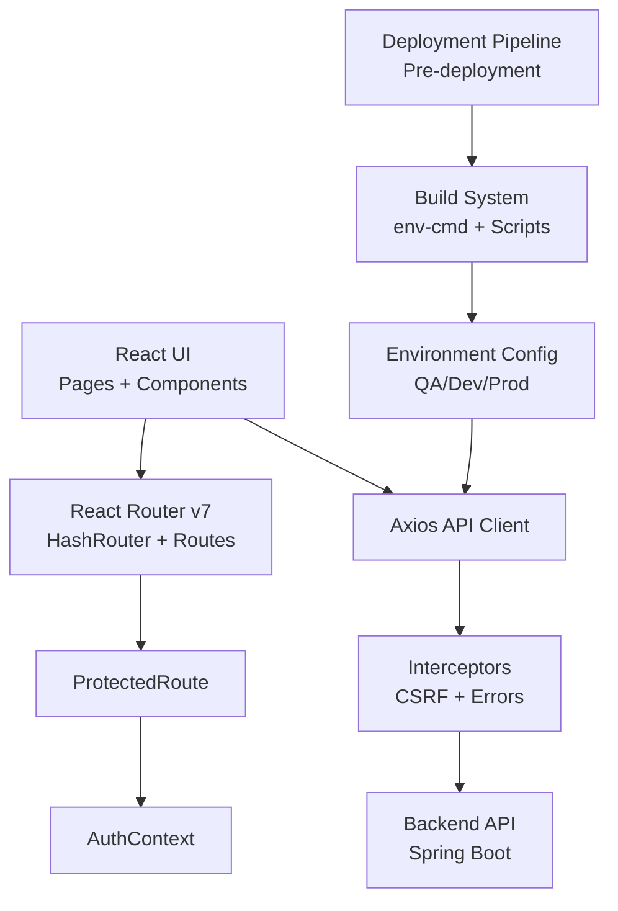

**Diagram sources**
- [src/App.js:1-104](file://bad-court-mana-ui/src/App.js#L1-L104)
- [src/context/ProtectedRoute.js:1-36](file://bad-court-mana-ui/src/context/ProtectedRoute.js#L1-L36)
- [src/context/AuthContext.js:1-91](file://bad-court-mana-ui/src/context/AuthContext.js#L1-L91)
- [src/api/index.js:1-101](file://bad-court-mana-ui/src/api/index.js#L1-L101)
- [package.json:30-36](file://bad-court-mana-ui/package.json#L30-L36)

## Build System and Environment Management

### Enhanced Build Configuration
The frontend now features a sophisticated build system with environment-specific configurations:

- **Multi-Environment Support**: Dedicated build scripts for development and QA environments
- **env-cmd Integration**: Uses env-cmd package to load environment-specific configuration files
- **QA Build Script**: `build:qa` script specifically designed for QA environment deployment
- **Environment Variables**: Separate configuration files for different deployment environments

### Environment-Specific Configuration
- **Development Environment**: Default configuration loaded from `.env` files
- **QA Environment**: Specialized configuration via `.env.qa` file with QA-specific API endpoints
- **Production Environment**: Standard production build with optimized settings

### Build Scripts and Commands
The package.json now includes enhanced build capabilities:

```json
{
  "scripts": {
    "start": "react-scripts start",
    "build": "react-scripts build",
    "build:qa": "env-cmd -f .env.qa react-scripts build",
    "test": "react-scripts test",
    "eject": "react-scripts eject"
  }
}
```

### Deployment Pipeline Integration
The build system integrates seamlessly with the deployment pipeline:

- **Pre-deployment Validation**: Automated scripts verify package integrity before deployment
- **Environment-Aware Builds**: Build system automatically selects appropriate environment configuration
- **QA Testing Support**: Dedicated QA build script enables testing in isolated environments

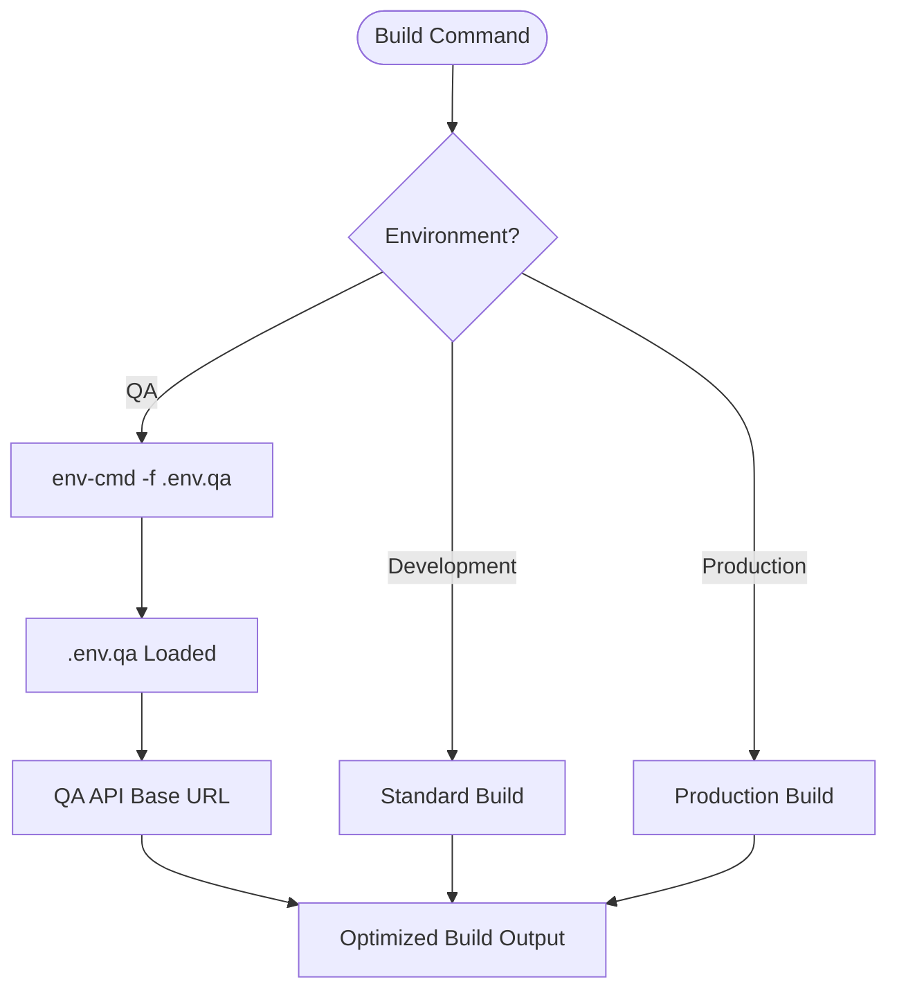

**Diagram sources**
- [package.json:30-36](file://bad-court-mana-ui/package.json#L30-L36)
- [.env.qa:1-1](file://bad-court-mana-ui/.env.qa#L1-L1)

**Section sources**
- [package.json:30-36](file://bad-court-mana-ui/package.json#L30-L36)
- [.env.qa:1-1](file://bad-court-mana-ui/.env.qa#L1-L1)
- [deployment/pre-deployment.sh:1-41](file://deployment/pre-deployment.sh#L1-L41)

### API Configuration and Environment Variables
The API configuration system supports environment-specific base URLs:

- **Dynamic Base URL**: `process.env.REACT_APP_API_BASE_URL` determines backend endpoint
- **QA Environment**: Points to QA database and services (`/bad-court-management-qa`)
- **Development Environment**: Typically points to local development server
- **Production Environment**: Points to production backend services

**Section sources**
- [src/api/config.js:1-7](file://bad-court-mana-ui/src/api/config.js#L1-L7)
- [src/api/index.js:1-101](file://bad-court-mana-ui/src/api/index.js#L1-L101)

## Detailed Component Analysis

### Authentication and Protected Routing
- AuthContext initializes session validation on mount, retrieves CSRF token, and stores it in session storage. It exposes logout and forceLogout to trigger global session invalidation.
- ProtectedRoute renders a spinner while loading and redirects unauthenticated users to the login page. It allows passing children or outlet rendering.
- LoginPage handles form submission, sets CSRF token in session storage, and navigates to the home route upon success.

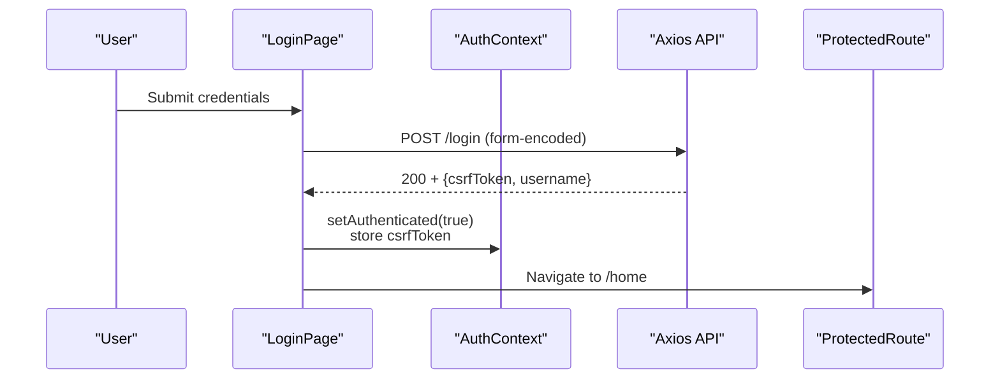

**Diagram sources**
- [src/page/LoginPage.js:1-94](file://bad-court-mana-ui/src/page/LoginPage.js#L1-L94)
- [src/context/AuthContext.js:1-91](file://bad-court-mana-ui/src/context/AuthContext.js#L1-L91)
- [src/api/index.js:1-101](file://bad-court-mana-ui/src/api/index.js#L1-L101)

**Section sources**
- [src/context/AuthContext.js:1-91](file://bad-court-mana-ui/src/context/AuthContext.js#L1-L91)
- [src/context/ProtectedRoute.js:1-36](file://bad-court-mana-ui/src/context/ProtectedRoute.js#L1-L36)
- [src/page/LoginPage.js:1-94](file://bad-court-mana-ui/src/page/LoginPage.js#L1-L94)

### API Integration Layer
- Centralized configuration reads the base URL from environment variables and applies a timeout.
- Axios instance enables credentials and attaches X-XSRF-TOKEN from session storage on requests.
- Response interceptor:
  - Handles network errors with user feedback.
  - Forces logout on 401/403 outside excluded paths.
  - Parses blob errors for exports and surfaces messages.
  - Surfaces generic 500 errors and client errors with alerts.


**Diagram sources**
- [src/api/config.js:1-7](file://bad-court-mana-ui/src/api/config.js#L1-L7)
- [src/api/index.js:1-101](file://bad-court-mana-ui/src/api/index.js#L1-L101)

**Section sources**
- [src/api/config.js:1-7](file://bad-court-mana-ui/src/api/config.js#L1-L7)
- [src/api/index.js:1-101](file://bad-court-mana-ui/src/api/index.js#L1-L101)

### Enhanced PlayerArea Component
**Updated** The PlayerArea component now features comprehensive search functionality with real-time filtering and enhanced user experience.

- **Search Mode**: Toggle between add mode and search mode using the search icon button
- **Real-time Filtering**: Automatic filtering of available players as the user types
- **Duplicate Detection**: Visual warnings and error states for duplicate player names
- **Keyboard Navigation**: Support for Enter key to submit in both modes
- **Focus Management**: Automatic focus on search input when entering search mode
- **Visual Feedback**: Animated highlighting and status indicators for search results
- **Performance Optimization**: Uses useMemo for efficient filtering and useCallback for stable function references

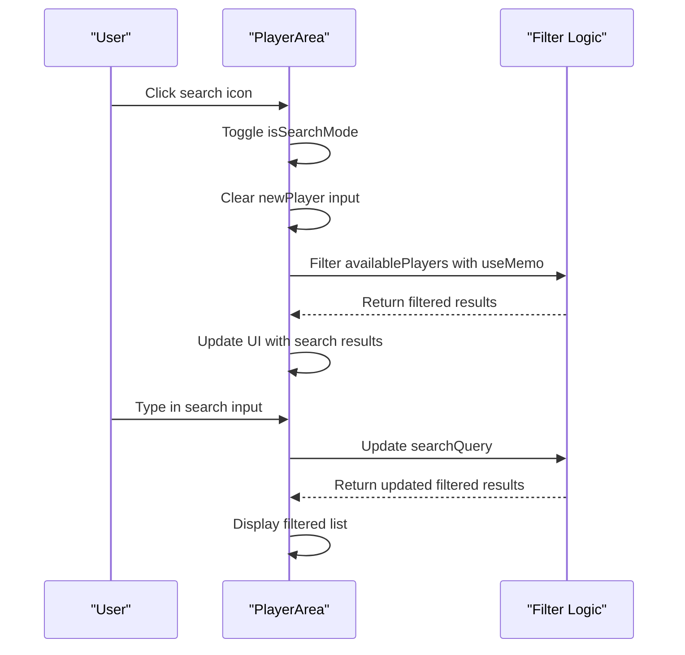

**Diagram sources**
- [src/page/dragNdrop/PlayerArea.js:22-61](file://bad-court-mana-ui/src/page/dragNdrop/PlayerArea.js#L22-L61)
- [src/page/dragNdrop/PlayerArea.js:103-144](file://bad-court-mana-ui/src/page/dragNdrop/PlayerArea.js#L103-L144)

**Section sources**
- [src/page/dragNdrop/PlayerArea.js:1-174](file://bad-court-mana-ui/src/page/dragNdrop/PlayerArea.js#L1-L174)

### Improved Error Handling in HomePage
**Updated** Enhanced error handling throughout HomePage with improved response validation and user feedback mechanisms.

- **Response Validation**: Centralized `responseSuccess` and `responseDataTrue` utility functions for consistent API response checking
- **Structured Error Handling**: Comprehensive try-catch blocks with specific error handling for different operations
- **User-Friendly Alerts**: Informative error messages with clear guidance for users
- **Console Logging**: Detailed logging for debugging while maintaining user-friendly error messages
- **Graceful Degradation**: Error handling that prevents application crashes and maintains functionality

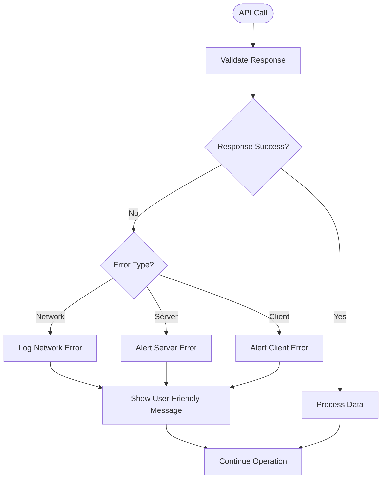

**Diagram sources**
- [src/page/HomePage.js:74-80](file://bad-court-mana-ui/src/page/HomePage.js#L74-L80)
- [src/page/HomePage.js:204-215](file://bad-court-mana-ui/src/page/HomePage.js#L204-L215)
- [src/page/HomePage.js:386-393](file://bad-court-mana-ui/src/page/HomePage.js#L386-L393)

**Section sources**
- [src/page/HomePage.js:74-80](file://bad-court-mana-ui/src/page/HomePage.js#L74-L80)
- [src/page/HomePage.js:204-215](file://bad-court-mana-ui/src/page/HomePage.js#L204-L215)
- [src/page/HomePage.js:386-393](file://bad-court-mana-ui/src/page/HomePage.js#L386-L393)

### Home Page: Drag-and-Drop Arena
- Uses react-dnd with HTML5 backend for draggable services and player areas.
- Manages state for active courts, players, services, shuttle balls, and per-player service lists.
- Integrates with backend APIs for:
  - Fetching active courts and management data
  - Adding/removing players from courts
  - Updating services per player
  - Starting and finishing games
  - Exporting game results

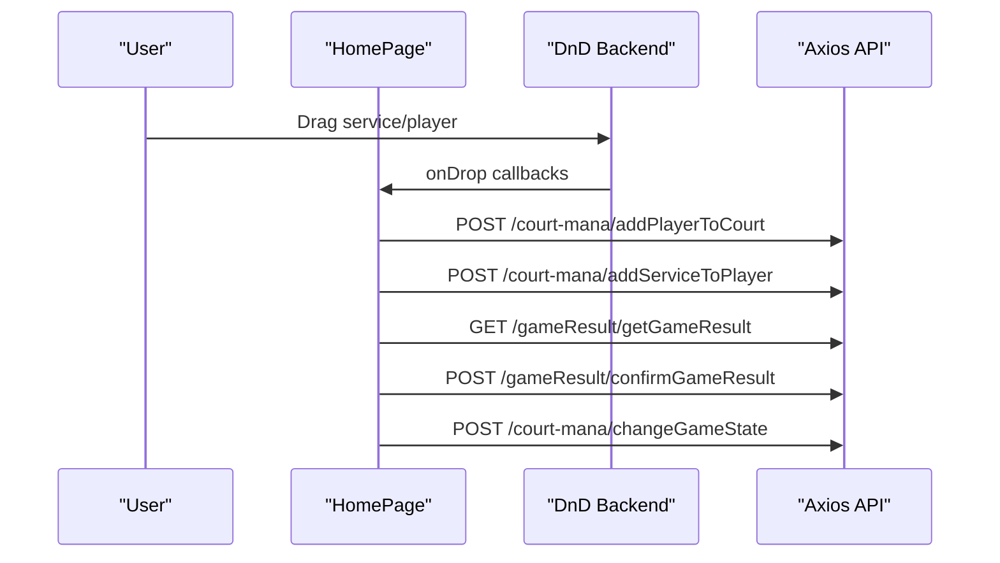

**Diagram sources**
- [src/page/HomePage.js:1-932](file://bad-court-mana-ui/src/page/HomePage.js#L1-L932)
- [src/api/index.js:1-101](file://bad-court-mana-ui/src/api/index.js#L1-L101)

**Section sources**
- [src/page/HomePage.js:1-932](file://bad-court-mana-ui/src/page/HomePage.js#L1-L932)

### Report Page: Filtering, Sorting, and Export
- Implements pagination, sorting, and filtering with debounced search.
- Supports per-row and bulk Excel export via blob downloads and token-based streaming.

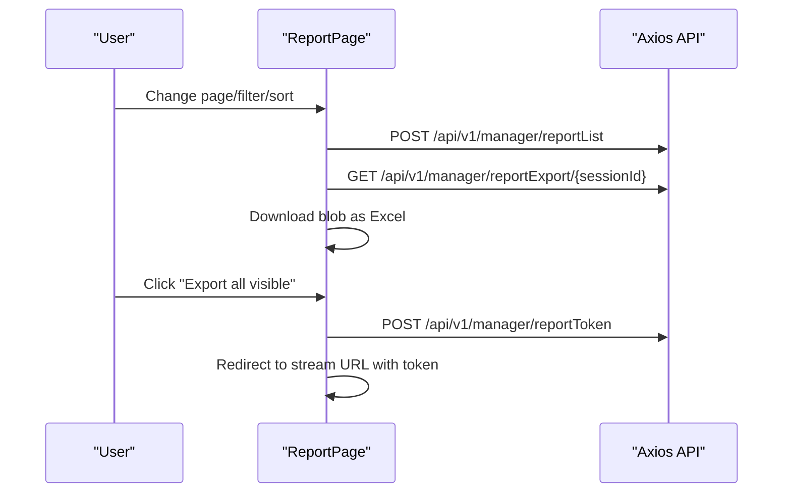

**Diagram sources**
- [src/page/ReportPage.js:1-347](file://bad-court-mana-ui/src/page/ReportPage.js#L1-L347)
- [src/api/index.js:1-101](file://bad-court-mana-ui/src/api/index.js#L1-L101)

**Section sources**
- [src/page/ReportPage.js:1-347](file://bad-court-mana-ui/src/page/ReportPage.js#L1-L347)

### Setup Page: Services and Shuttle Balls
- Allows adding/removing services and shuttle balls, with duplicate detection and formatted currency inputs.
- Persists updates via a single endpoint and refreshes local state accordingly.

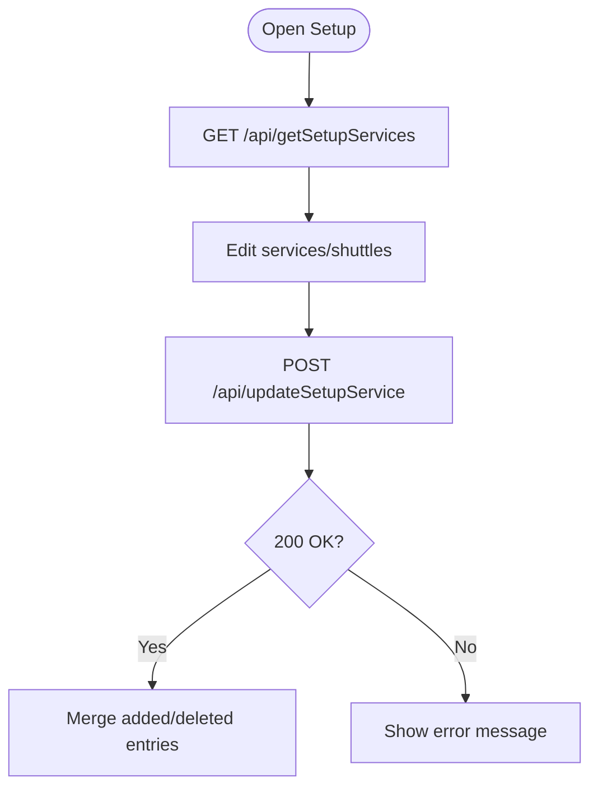

**Diagram sources**
- [src/page/SetupPage.js:1-576](file://bad-court-mana-ui/src/page/SetupPage.js#L1-L576)
- [src/api/index.js:1-101](file://bad-court-mana-ui/src/api/index.js#L1-L101)

**Section sources**
- [src/page/SetupPage.js:1-576](file://bad-court-mana-ui/src/page/SetupPage.js#L1-L576)

### Super Admin Page: Registration and Password Reset
- Provides admin registration and a two-stage password reset with token TTL and countdown.

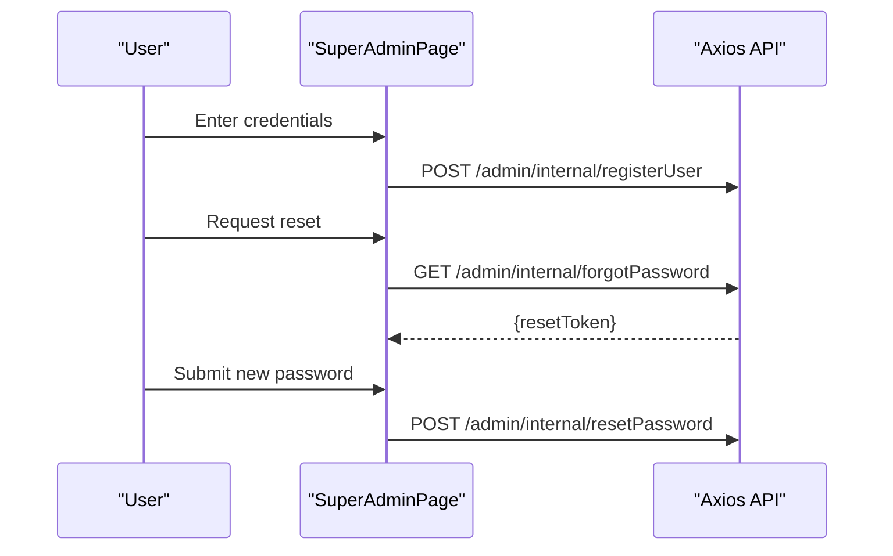

**Diagram sources**
- [src/page/SuperAdminPage.js:1-249](file://bad-court-mana-ui/src/page/SuperAdminPage.js#L1-L249)
- [src/api/index.js:1-101](file://bad-court-mana-ui/src/api/index.js#L1-L101)

**Section sources**
- [src/page/SuperAdminPage.js:1-249](file://bad-court-mana-ui/src/page/SuperAdminPage.js#L1-L249)

### Theming and Responsive Design
- Material-UI theme defines a light palette aligned with Bootstrap-like colors, custom button styles, and shape defaults.
- Root index wraps the app with ThemeProvider and CssBaseline to normalize and apply theme globally.
- Pages use Material-UI components with responsive props and adaptive layouts.

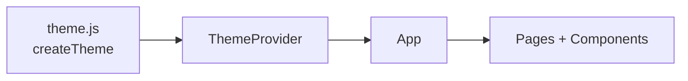

**Diagram sources**
- [src/theme.js:1-28](file://bad-court-mana-ui/src/theme.js#L1-L28)
- [src/index.js:1-21](file://bad-court-mana-ui/src/index.js#L1-L21)

**Section sources**
- [src/theme.js:1-28](file://bad-court-mana-ui/src/theme.js#L1-L28)
- [src/index.js:1-21](file://bad-court-mana-ui/src/index.js#L1-L21)

## Enhanced PlayerArea Component

### Search Functionality Implementation
The PlayerArea component now provides sophisticated search capabilities through a toggle-based interface:

- **Search Mode Toggle**: Users can switch between add mode and search mode using the search icon button
- **Real-time Filtering**: Players are filtered instantly as the user types in the search input
- **Smart Matching**: Case-insensitive partial matching with trimming of whitespace
- **Visual Indicators**: Status displays showing total count vs filtered count during search

### State Management Enhancements
- **Search State**: Dedicated state for search mode, query, and input focus management
- **Duplicate Prevention**: Enhanced duplicate detection with immediate visual feedback
- **Mode Persistence**: Proper state management when switching between search and add modes

### Performance Optimizations
**Updated** The PlayerArea component implements several performance optimizations:

- **Memoized Filtering**: Uses `useMemo` hook to cache filtered results based on availablePlayers and searchQuery dependencies
- **Stable Callbacks**: Uses `useCallback` for event handlers to prevent unnecessary re-renders
- **Efficient State Updates**: Minimizes state updates by clearing search query when exiting search mode
- **Focused Rendering**: Only re-renders the filtered list portion when search parameters change

### User Experience Improvements
- **Keyboard Shortcuts**: Enter key support for submitting in both modes
- **Focus Management**: Automatic focus shifting when entering search mode
- **Visual Feedback**: Smooth transitions and hover effects for better user interaction
- **Accessibility**: Proper ARIA labels and keyboard navigation support

**Section sources**
- [src/page/dragNdrop/PlayerArea.js:1-174](file://bad-court-mana-ui/src/page/dragNdrop/PlayerArea.js#L1-L174)
- [src/page/dragNdrop/style.css:1-30](file://bad-court-mana-ui/src/page/dragNdrop/style.css#L1-L30)

## Improved Error Handling

### Response Validation Patterns
The HomePage now implements structured error handling through utility functions:

- **responseSuccess**: Centralized validation for successful API responses
- **responseDataTrue**: Specific validation for boolean response data
- **Consistent Error Checking**: Uniform error handling across all API operations

### Error Handling Strategies
- **Try-Catch Blocks**: Comprehensive error handling for async operations
- **User-Friendly Messages**: Informative alerts with clear guidance for recovery
- **Console Logging**: Detailed logging for debugging without exposing sensitive information
- **Graceful Degradation**: Operations continue even when individual API calls fail

### Specific Error Scenarios
- **Player Addition**: Dedicated error handling for player creation failures
- **Game Operations**: Structured error handling for game start/finish/cancel operations
- **Service Management**: Error handling for service updates and payments
- **API Communication**: Comprehensive error handling for all backend interactions

**Section sources**
- [src/page/HomePage.js:74-80](file://bad-court-mana-ui/src/page/HomePage.js#L74-L80)
- [src/page/HomePage.js:204-215](file://bad-court-mana-ui/src/page/HomePage.js#L204-L215)
- [src/page/HomePage.js:386-393](file://bad-court-mana-ui/src/page/HomePage.js#L386-L393)

## Dependency Analysis
- Routing: React Router v7 used with HashRouter and Routes for SPA navigation.
- State: React Context for authentication and shared UI state.
- UI: Material-UI for components, theming, and responsive grid.
- Drag-and-drop: react-dnd with HTML5 backend for drag-and-drop interactions.
- HTTP: Axios for API calls with interceptors and cookie-based CSRF.
- Environment: Environment variables for base URL and build-time subpath configuration.
- **Enhanced** Build Tools: env-cmd for environment-specific configuration loading.

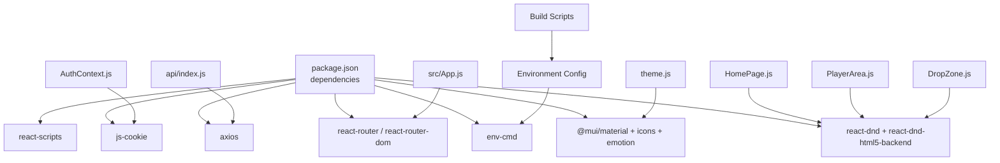

**Diagram sources**
- [package.json:1-59](file://bad-court-mana-ui/package.json#L1-L59)
- [src/App.js:1-104](file://bad-court-mana-ui/src/App.js#L1-L104)
- [src/context/AuthContext.js:1-91](file://bad-court-mana-ui/src/context/AuthContext.js#L1-L91)
- [src/api/index.js:1-101](file://bad-court-mana-ui/src/api/index.js#L1-L101)
- [src/page/HomePage.js:1-932](file://bad-court-mana-ui/src/page/HomePage.js#L1-L932)
- [src/theme.js:1-28](file://bad-court-mana-ui/src/theme.js#L1-L28)
- [src/page/dragNdrop/PlayerArea.js:1-174](file://bad-court-mana-ui/src/page/dragNdrop/PlayerArea.js#L1-L174)
- [src/page/dragNdrop/DropZone.js:1-257](file://bad-court-mana-ui/src/page/dragNdrop/DropZone.js#L1-L257)

**Section sources**
- [package.json:1-59](file://bad-court-mana-ui/package.json#L1-L59)
- [src/App.js:1-104](file://bad-court-mana-ui/src/App.js#L1-L104)

## Performance Considerations
- Memoization: HomePage uses useMemo to compute column splits and avoid unnecessary re-renders.
- Local state updates: Immediate UI updates on drag/drop and service changes reduce perceived latency; backend calls are asynchronous.
- Interceptors: Centralized error handling prevents cascading failures and reduces error-handling duplication.
- Responsive props: Material-UI responsive breakpoints minimize layout thrashing on small screens.
- **Enhanced** PlayerArea search functionality uses efficient filtering algorithms with proper memoization to prevent performance issues during real-time search. The component implements:
  - `useMemo` for caching filtered player lists
  - `useCallback` for stable event handlers
  - Optimized state updates to minimize re-renders
  - Efficient search algorithm with case-insensitive matching
- **Enhanced** Build System Performance: Environment-specific builds with env-cmd optimize build times and reduce configuration overhead.

**Updated** Both PlayerArea.js and DropZone.js implement useMemo for filtering operations, ensuring optimal performance during real-time search operations. The build system now supports faster environment switching with cached configuration loading.

**Section sources**
- [src/page/dragNdrop/PlayerArea.js:27-34](file://bad-court-mana-ui/src/page/dragNdrop/PlayerArea.js#L27-L34)
- [src/page/dragNdrop/DropZone.js:65-71](file://bad-court-mana-ui/src/page/dragNdrop/DropZone.js#L65-L71)

## Troubleshooting Guide
- Authentication issues:
  - Verify CSRF token presence and session validity on load.
  - Use forceLogout to clear stale sessions and redirect to login.
- API errors:
  - Network errors: Confirm backend availability and CORS settings.
  - 401/403: Ensure non-excluded paths trigger logout; check interceptor logic.
  - 500: Surface generic server error; inspect backend logs.
  - Blob export errors: Parse JSON from blob and display message.
- Drag-and-drop:
  - Ensure DndProvider is present at the page level.
  - Validate draggable types and drop zones are correctly wired.
- Reports:
  - Confirm pagination payload structure matches backend expectations.
  - For export failures, check blob parsing and filename extraction.
- **Enhanced** PlayerArea search:
  - Verify search input focus management works correctly.
  - Check that duplicate detection triggers appropriate visual warnings.
  - Ensure search mode toggle functions properly without data loss.
  - Monitor performance with large player lists using memoized filtering.
- **Enhanced** Error handling:
  - Monitor console logs for detailed error information.
  - Verify user-friendly error messages appear appropriately.
  - Check that error handling doesn't interfere with normal application flow.
- **Enhanced** Build System Issues:
  - Verify env-cmd installation for environment-specific builds
  - Check .env.qa file syntax and API base URL configuration
  - Ensure build:qa script executes without environment variable errors
  - Validate deployment pipeline integration with pre-deployment scripts
- **Performance Issues**:
  - Verify useMemo dependencies are correctly specified in PlayerArea.js
  - Check that useCallback wrappers are properly implemented
  - Monitor React DevTools for unnecessary re-renders in search-heavy scenarios
  - Validate environment-specific build configurations don't introduce performance regressions

**Section sources**
- [src/context/AuthContext.js:1-91](file://bad-court-mana-ui/src/context/AuthContext.js#L1-L91)
- [src/api/index.js:1-101](file://bad-court-mana-ui/src/api/index.js#L1-L101)
- [src/page/HomePage.js:1-932](file://bad-court-mana-ui/src/page/HomePage.js#L1-L932)
- [src/page/ReportPage.js:1-347](file://bad-court-mana-ui/src/page/ReportPage.js#L1-L347)
- [src/page/dragNdrop/PlayerArea.js:1-174](file://bad-court-mana-ui/src/page/dragNdrop/PlayerArea.js#L1-L174)
- [src/page/dragNdrop/DropZone.js:1-257](file://bad-court-mana-ui/src/page/dragNdrop/DropZone.js#L1-L257)

## Conclusion
The frontend employs a clean separation of concerns with React Router v7 for navigation, Material-UI for consistent UI and responsiveness, and a robust Axios-based API layer with centralized interceptors. Authentication is handled via cookies and CSRF tokens through a dedicated context provider with protected routes. The Home page integrates drag-and-drop for dynamic court management with enhanced search functionality, while Report, Setup, and Super Admin pages address operational and administrative needs. The build configuration supports subpath hosting and environment-specific deployments with enhanced QA build capabilities using env-cmd. Recent enhancements include comprehensive search capabilities in the PlayerArea component, improved error handling mechanisms throughout the application, and advanced build system features for better deployment pipeline integration. The environment-specific configuration system enables seamless deployment across development, QA, and production environments with dedicated build scripts and configuration management.

## Appendices

### Build Configuration and Deployment Notes
- Subpath hosting: The homepage field in package.json configures the app to serve under a subpath.
- Environment-specific builds: Enhanced with dedicated build:qa script using env-cmd for QA environment deployment.
- Environment files: Separate configuration files (.env.qa) for different deployment environments.
- Public HTML: The root div and meta tags are configured for client-side routing and manifest usage.
- **Enhanced** Deployment pipeline: Integration with pre-deployment scripts validates package integrity and supports environment-specific builds.

**Section sources**
- [package.json:1-59](file://bad-court-mana-ui/package.json#L1-L59)
- [public/index.html:1-44](file://bad-court-mana-ui/public/index.html#L1-L44)
- [deployment/pre-deployment.sh:1-41](file://deployment/pre-deployment.sh#L1-L41)
- [deployment/deployment-note-qa.txt:1-61](file://deployment/deployment-note-qa.txt#L1-L61)