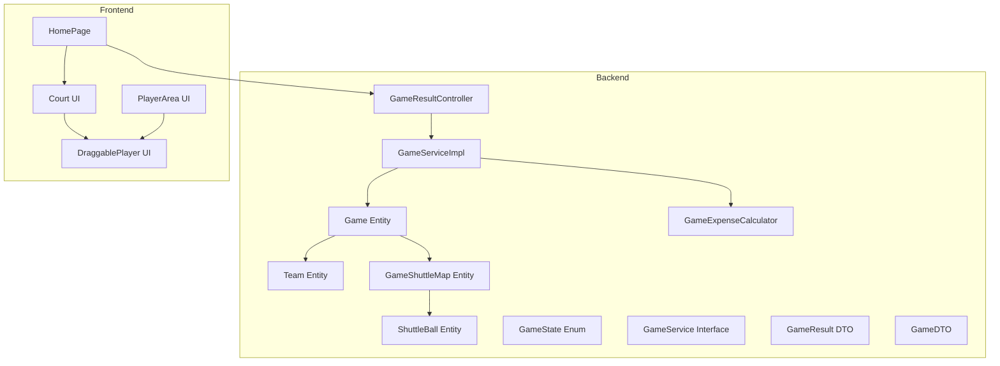
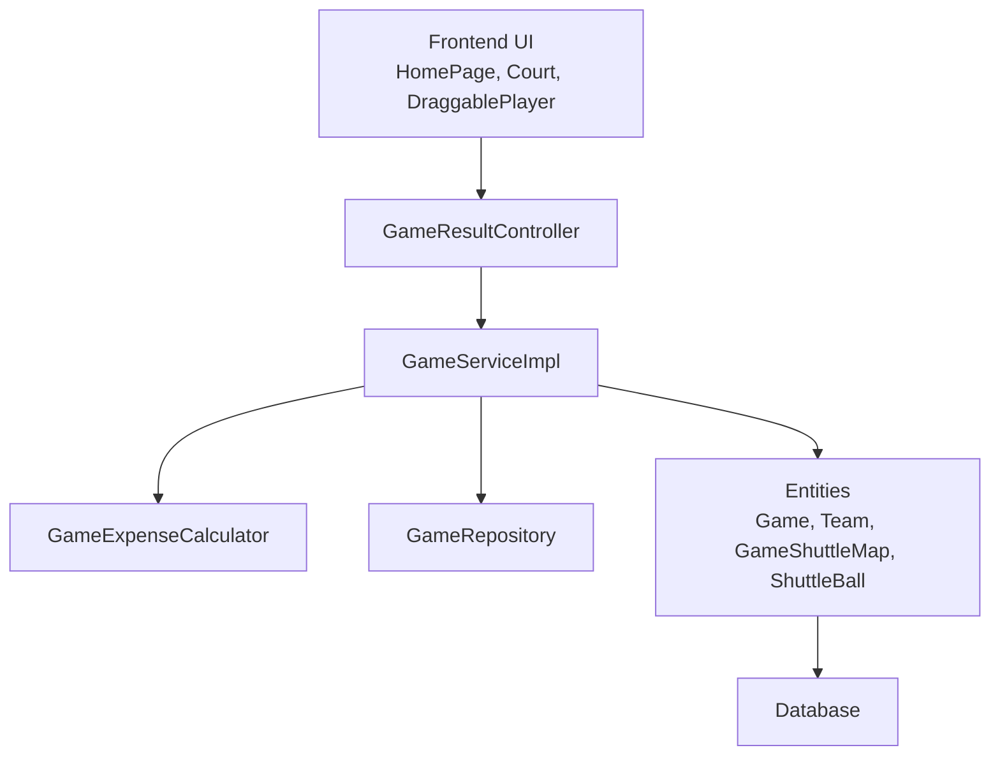
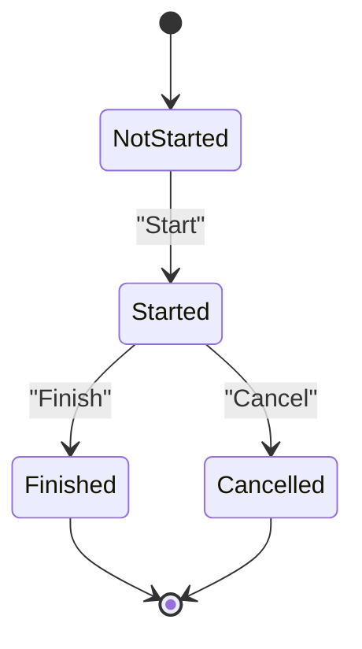
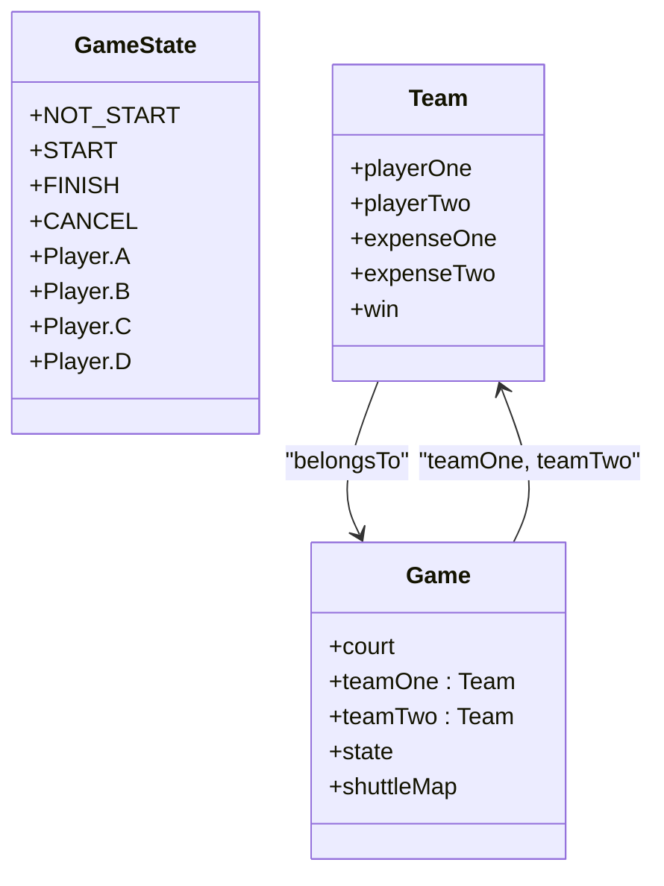
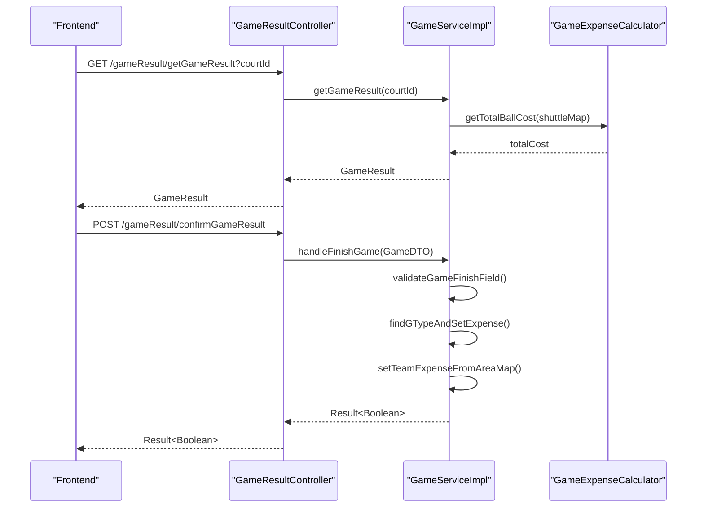
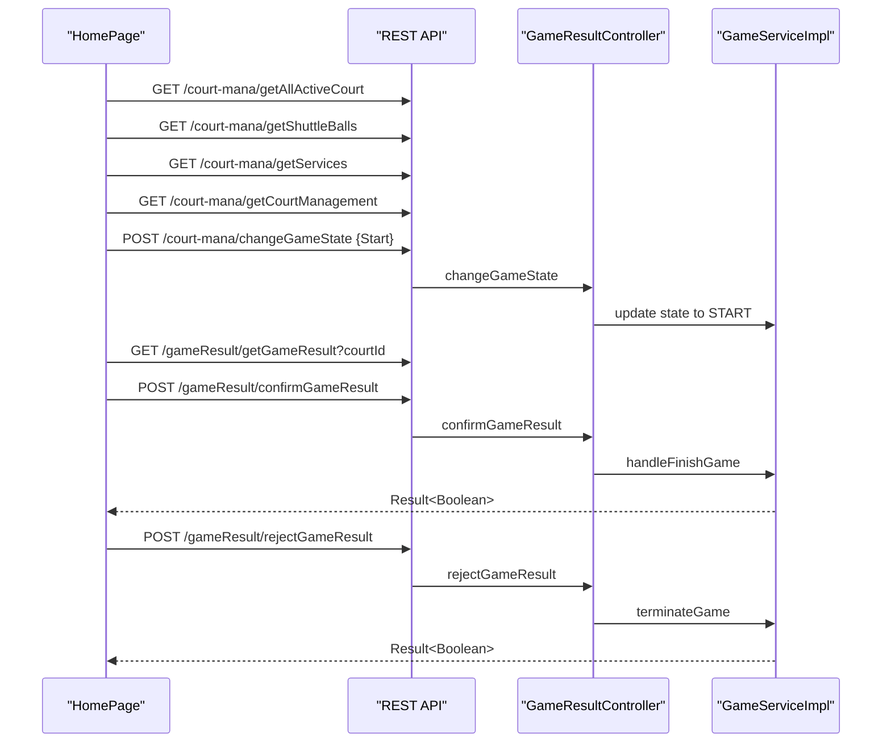
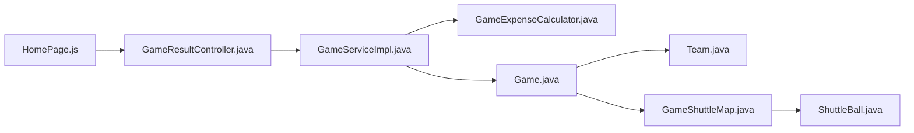

# Game Management System

<cite>
**Referenced Files in This Document**
- [Game.java](file://BadmintonCourtManagement/src/main/java/com/badminton/entity/Game.java)
- [Team.java](file://BadmintonCourtManagement/src/main/java/com/badminton/entity/Team.java)
- [GameShuttleMap.java](file://BadmintonCourtManagement/src/main/java/com/badminton/entity/GameShuttleMap.java)
- [ShuttleBall.java](file://BadmintonCourtManagement/src/main/java/com/badminton/entity/ShuttleBall.java)
- [GameState.java](file://BadmintonCourtManagement/src/main/java/com/badminton/constant/GameState.java)
- [GameService.java](file://BadmintonCourtManagement/src/main/java/com/badminton/service/GameService.java)
- [GameServiceImpl.java](file://BadmintonCourtManagement/src/main/java/com/badminton/service/impl/GameServiceImpl.java)
- [GameExpenseCalculator.java](file://BadmintonCourtManagement/src/main/java/com/badminton/service/calculator/GameExpenseCalculator.java)
- [GameResultController.java](file://BadmintonCourtManagement/src/main/java/com/badminton/controller/GameResultController.java)
- [GameResult.java](file://BadmintonCourtManagement/src/main/java/com/badminton/response/result/GameResult.java)
- [GameDTO.java](file://BadmintonCourtManagement/src/main/java/com/badminton/requestmodel/GameDTO.java)
- [Court.js](file://bad-court-mana-ui/src/page/dragNdrop/Court.js)
- [DraggablePlayer.js](file://bad-court-mana-ui/src/page/dragNdrop/DraggablePlayer.js)
- [PlayerArea.js](file://bad-court-mana-ui/src/page/dragNdrop/PlayerArea.js)
- [HomePage.js](file://bad-court-mana-ui/src/page/HomePage.js)
</cite>

## Table of Contents
1. [Introduction](#introduction)
2. [Project Structure](#project-structure)
3. [Core Components](#core-components)
4. [Architecture Overview](#architecture-overview)
5. [Detailed Component Analysis](#detailed-component-analysis)
6. [Dependency Analysis](#dependency-analysis)
7. [Performance Considerations](#performance-considerations)
8. [Troubleshooting Guide](#troubleshooting-guide)
9. [Conclusion](#conclusion)
10. [Appendices](#appendices)

## Introduction
This document describes the Game Management System that governs the lifecycle of a badminton match from initiation to completion. It covers state transitions (not started → in progress → finished/cancelled), player assignment to court positions A–B vs C–D, validation rules ensuring minimum player requirements, the expense calculation engine, shuttle ball tracking, and service integration. It also documents the game result recording process, winner determination, cost splitting algorithms, and validation for total reconciliation. Finally, it explains the frontend drag-and-drop court interface, real-time player movement, and interactive game controls, along with business rules for match cancellation, player removal restrictions, and automatic session boundary handling.

## Project Structure
The system comprises:
- Backend Java Spring Boot application with entities, services, controllers, and calculators.
- Frontend React application implementing drag-and-drop UI for court management and game controls.

**Diagram sources**
- [Game.java:18-79](file://BadmintonCourtManagement/src/main/java/com/badminton/entity/Game.java#L18-L79)
- [Team.java:14-39](file://BadmintonCourtManagement/src/main/java/com/badminton/entity/Team.java#L14-L39)
- [GameShuttleMap.java:10-30](file://BadmintonCourtManagement/src/main/java/com/badminton/entity/GameShuttleMap.java#L10-L30)
- [ShuttleBall.java:17-61](file://BadmintonCourtManagement/src/main/java/com/badminton/entity/ShuttleBall.java#L17-L61)
- [GameState.java:11-56](file://BadmintonCourtManagement/src/main/java/com/badminton/constant/GameState.java#L11-L56)
- [GameService.java:10-20](file://BadmintonCourtManagement/src/main/java/com/badminton/service/GameService.java#L10-L20)
- [GameServiceImpl.java:36-367](file://BadmintonCourtManagement/src/main/java/com/badminton/service/impl/GameServiceImpl.java#L36-L367)
- [GameExpenseCalculator.java:17-82](file://BadmintonCourtManagement/src/main/java/com/badminton/service/calculator/GameExpenseCalculator.java#L17-L82)
- [GameResultController.java:16-42](file://BadmintonCourtManagement/src/main/java/com/badminton/controller/GameResultController.java#L16-L42)
- [GameResult.java:14-32](file://BadmintonCourtManagement/src/main/java/com/badminton/response/result/GameResult.java#L14-L32)
- [GameDTO.java:20-43](file://BadmintonCourtManagement/src/main/java/com/badminton/requestmodel/GameDTO.java#L20-L43)
- [Court.js:11-129](file://bad-court-mana-ui/src/page/dragNdrop/Court.js#L11-L129)
- [DraggablePlayer.js:6-52](file://bad-court-mana-ui/src/page/dragNdrop/DraggablePlayer.js#L6-L52)
- [PlayerArea.js:9-112](file://bad-court-mana-ui/src/page/dragNdrop/PlayerArea.js#L9-L112)
- [HomePage.js:32-904](file://bad-court-mana-ui/src/page/HomePage.js#L32-L904)

**Section sources**
- [Game.java:18-79](file://BadmintonCourtManagement/src/main/java/com/badminton/entity/Game.java#L18-L79)
- [GameServiceImpl.java:36-367](file://BadmintonCourtManagement/src/main/java/com/badminton/service/impl/GameServiceImpl.java#L36-L367)
- [GameResultController.java:16-42](file://BadmintonCourtManagement/src/main/java/com/badminton/controller/GameResultController.java#L16-L42)
- [Court.js:11-129](file://bad-court-mana-ui/src/page/dragNdrop/Court.js#L11-L129)
- [HomePage.js:32-904](file://bad-court-mana-ui/src/page/HomePage.js#L32-L904)

## Core Components
- Game entity encapsulates court association, teams, state, and shuttle ball mapping. It initializes to “not started” and maintains a list of GameShuttleMap entries.
- Team entity holds two players, per-player expenses, and win status linked to a Game.
- GameShuttleMap links a Game to a ShuttleBall with a quantity used during the game.
- GameState enum defines lifecycle states and constants for court positions A–D.
- GameService and GameServiceImpl orchestrate match lifecycle actions, validation, and expense computation.
- GameExpenseCalculator computes total ball costs and splits expenses between teams.
- GameResultController exposes endpoints to fetch and confirm game results.
- Frontend components implement drag-and-drop UI for player placement and interactive controls.

**Section sources**
- [Game.java:18-79](file://BadmintonCourtManagement/src/main/java/com/badminton/entity/Game.java#L18-L79)
- [Team.java:14-39](file://BadmintonCourtManagement/src/main/java/com/badminton/entity/Team.java#L14-L39)
- [GameShuttleMap.java:10-30](file://BadmintonCourtManagement/src/main/java/com/badminton/entity/GameShuttleMap.java#L10-L30)
- [GameState.java:11-56](file://BadmintonCourtManagement/src/main/java/com/badminton/constant/GameState.java#L11-L56)
- [GameService.java:10-20](file://BadmintonCourtManagement/src/main/java/com/badminton/service/GameService.java#L10-L20)
- [GameServiceImpl.java:36-367](file://BadmintonCourtManagement/src/main/java/com/badminton/service/impl/GameServiceImpl.java#L36-L367)
- [GameExpenseCalculator.java:17-82](file://BadmintonCourtManagement/src/main/java/com/badminton/service/calculator/GameExpenseCalculator.java#L17-L82)
- [GameResultController.java:16-42](file://BadmintonCourtManagement/src/main/java/com/badminton/controller/GameResultController.java#L16-L42)

## Architecture Overview
The system follows a layered architecture:
- Presentation layer (React): Drag-and-drop UI for court management and game controls.
- Application layer (Spring): Controllers expose REST endpoints for game result operations.
- Domain and service layer: Business logic for state transitions, validations, and expense calculations.
- Persistence: Entities mapped to database tables via JPA/Hibernate.

**Diagram sources**
- [GameResultController.java:16-42](file://BadmintonCourtManagement/src/main/java/com/badminton/controller/GameResultController.java#L16-L42)
- [GameServiceImpl.java:36-367](file://BadmintonCourtManagement/src/main/java/com/badminton/service/impl/GameServiceImpl.java#L36-L367)
- [GameExpenseCalculator.java:17-82](file://BadmintonCourtManagement/src/main/java/com/badminton/service/calculator/GameExpenseCalculator.java#L17-L82)
- [Game.java:18-79](file://BadmintonCourtManagement/src/main/java/com/badminton/entity/Game.java#L18-L79)
- [Team.java:14-39](file://BadmintonCourtManagement/src/main/java/com/badminton/entity/Team.java#L14-L39)
- [GameShuttleMap.java:10-30](file://BadmintonCourtManagement/src/main/java/com/badminton/entity/GameShuttleMap.java#L10-L30)
- [ShuttleBall.java:17-61](file://BadmintonCourtManagement/src/main/java/com/badminton/entity/ShuttleBall.java#L17-L61)

## Detailed Component Analysis

### Game State Machine and Lifecycle
- Initial state: “Not start”
- Transition to “Start” occurs when the frontend triggers start with a selected shuttle ball.
- Finalization: “Finish” sets ended date and determines game type (share/negotiated) and winner.
- Cancellation: “Cancel” ends all ongoing games on a court.

**Diagram sources**
- [GameState.java:11-38](file://BadmintonCourtManagement/src/main/java/com/badminton/constant/GameState.java#L11-L38)
- [GameServiceImpl.java:83-148](file://BadmintonCourtManagement/src/main/java/com/badminton/service/impl/GameServiceImpl.java#L83-L148)

**Section sources**
- [GameState.java:11-38](file://BadmintonCourtManagement/src/main/java/com/badminton/constant/GameState.java#L11-L38)
- [GameServiceImpl.java:83-148](file://BadmintonCourtManagement/src/main/java/com/badminton/service/impl/GameServiceImpl.java#L83-L148)

### Player Assignment and Position Mapping (A–B vs C–D)
- Positions A and B belong to Team One; C and D belong to Team Two.
- During match start, players are placed into areas A–D.
- During result confirmation, the system reads area assignments to compute per-player expenses and winner.

**Diagram sources**
- [GameState.java:11-56](file://BadmintonCourtManagement/src/main/java/com/badminton/constant/GameState.java#L11-L56)
- [Team.java:14-39](file://BadmintonCourtManagement/src/main/java/com/badminton/entity/Team.java#L14-L39)
- [Game.java:18-79](file://BadmintonCourtManagement/src/main/java/com/badminton/entity/Game.java#L18-L79)

**Section sources**
- [GameState.java:40-55](file://BadmintonCourtManagement/src/main/java/com/badminton/constant/GameState.java#L40-L55)
- [GameServiceImpl.java:264-286](file://BadmintonCourtManagement/src/main/java/com/badminton/service/impl/GameServiceImpl.java#L264-L286)

### Validation Rules and Minimum Player Requirements
- Winner must be declared; otherwise, the operation fails.
- Each team must have exactly one player assigned to positions A–B and one to C–D respectively.
- Total ball cost computed from shuttle balls must equal the sum of reported expenses.

**Diagram sources**
- [GameServiceImpl.java:293-329](file://BadmintonCourtManagement/src/main/java/com/badminton/service/impl/GameServiceImpl.java#L293-L329)

**Section sources**
- [GameServiceImpl.java:293-329](file://BadmintonCourtManagement/src/main/java/com/badminton/service/impl/GameServiceImpl.java#L293-L329)

### Expense Calculation Engine and Cost Splitting
- Total ball cost is derived from the map of shuttle balls and quantities used.
- In “Finish,” the system determines game type (share or negotiated) and sets per-team expenses.
- For share games, expenses are split equally between teams; per-player expenses are recorded per position.

**Diagram sources**
- [GameResultController.java:21-35](file://BadmintonCourtManagement/src/main/java/com/badminton/controller/GameResultController.java#L21-L35)
- [GameServiceImpl.java:64-116](file://BadmintonCourtManagement/src/main/java/com/badminton/service/impl/GameServiceImpl.java#L64-L116)
- [GameExpenseCalculator.java:24-40](file://BadmintonCourtManagement/src/main/java/com/badminton/service/calculator/GameExpenseCalculator.java#L24-L40)

**Section sources**
- [GameExpenseCalculator.java:24-81](file://BadmintonCourtManagement/src/main/java/com/badminton/service/calculator/GameExpenseCalculator.java#L24-L81)
- [GameServiceImpl.java:216-286](file://BadmintonCourtManagement/src/main/java/com/badminton/service/impl/GameServiceImpl.java#L216-L286)

### Frontend Drag-and-Drop Court Interface and Real-Time Controls
- The homepage fetches active courts, shuttle balls, and services, and initializes the UI state.
- Players can be dragged from the available list to positions A–D on the court.
- On start, the system validates player counts and transitions the court to “Start.”
- On finish, it retrieves the game result, allows manual adjustments, and confirms to finalize.
- On cancel, it terminates all ongoing games on the selected court.

**Diagram sources**
- [HomePage.js:511-659](file://bad-court-mana-ui/src/page/HomePage.js#L511-L659)
- [Court.js:11-129](file://bad-court-mana-ui/src/page/dragNdrop/Court.js#L11-L129)
- [DraggablePlayer.js:6-52](file://bad-court-mana-ui/src/page/dragNdrop/DraggablePlayer.js#L6-L52)
- [PlayerArea.js:9-112](file://bad-court-mana-ui/src/page/dragNdrop/PlayerArea.js#L9-L112)
- [GameResultController.java:21-35](file://BadmintonCourtManagement/src/main/java/com/badminton/controller/GameResultController.java#L21-L35)

**Section sources**
- [HomePage.js:130-183](file://bad-court-mana-ui/src/page/HomePage.js#L130-L183)
- [HomePage.js:249-278](file://bad-court-mana-ui/src/page/HomePage.js#L249-L278)
- [HomePage.js:359-445](file://bad-court-mana-ui/src/page/HomePage.js#L359-L445)
- [HomePage.js:447-467](file://bad-court-mana-ui/src/page/HomePage.js#L447-L467)
- [Court.js:11-129](file://bad-court-mana-ui/src/page/dragNdrop/Court.js#L11-L129)
- [DraggablePlayer.js:6-52](file://bad-court-mana-ui/src/page/dragNdrop/DraggablePlayer.js#L6-L52)
- [PlayerArea.js:9-112](file://bad-court-mana-ui/src/page/dragNdrop/PlayerArea.js#L9-L112)

### Business Rules Summary
- Match cancellation: All currently running games on a court are canceled with a single action.
- Player removal restrictions: While a court is locked (in progress), dragging players out is disabled; removal requires cancellation or end of the game.
- Automatic session boundary handling: The UI checks for a valid session on load and proceeds only if a session exists.

**Section sources**
- [GameServiceImpl.java:119-148](file://BadmintonCourtManagement/src/main/java/com/badminton/service/impl/GameServiceImpl.java#L119-L148)
- [DraggablePlayer.js:7-15](file://bad-court-mana-ui/src/page/dragNdrop/DraggablePlayer.js#L7-L15)
- [HomePage.js:527-531](file://bad-court-mana-ui/src/page/HomePage.js#L527-L531)

## Dependency Analysis
- GameServiceImpl depends on GameExpenseCalculator for cost computations and on GameRepository for persistence.
- GameResultController delegates to GameService for business operations.
- Frontend components depend on REST endpoints for state updates and result retrieval.

**Diagram sources**
- [HomePage.js:32-904](file://bad-court-mana-ui/src/page/HomePage.js#L32-L904)
- [GameResultController.java:16-42](file://BadmintonCourtManagement/src/main/java/com/badminton/controller/GameResultController.java#L16-L42)
- [GameServiceImpl.java:36-367](file://BadmintonCourtManagement/src/main/java/com/badminton/service/impl/GameServiceImpl.java#L36-L367)
- [GameExpenseCalculator.java:17-82](file://BadmintonCourtManagement/src/main/java/com/badminton/service/calculator/GameExpenseCalculator.java#L17-L82)
- [Game.java:18-79](file://BadmintonCourtManagement/src/main/java/com/badminton/entity/Game.java#L18-L79)
- [Team.java:14-39](file://BadmintonCourtManagement/src/main/java/com/badminton/entity/Team.java#L14-L39)
- [GameShuttleMap.java:10-30](file://BadmintonCourtManagement/src/main/java/com/badminton/entity/GameShuttleMap.java#L10-L30)
- [ShuttleBall.java:17-61](file://BadmintonCourtManagement/src/main/java/com/badminton/entity/ShuttleBall.java#L17-L61)

**Section sources**
- [GameServiceImpl.java:36-367](file://BadmintonCourtManagement/src/main/java/com/badminton/service/impl/GameServiceImpl.java#L36-L367)
- [GameResultController.java:16-42](file://BadmintonCourtManagement/src/main/java/com/badminton/controller/GameResultController.java#L16-L42)

## Performance Considerations
- Minimize repeated network calls by batching UI updates and caching shuttle ball and service lists locally.
- Use efficient stream-based aggregations for total ball cost and per-team expense computations.
- Avoid unnecessary re-renders in the frontend by passing stable references and memoizing derived values.

## Troubleshooting Guide
Common issues and resolutions:
- Winner not found during result confirmation: Ensure one of the four positions is marked as winning.
- Player count mismatch: Verify exactly one player per team (positions A–B and C–D).
- Expense mismatch: Confirm total reported expenses equal the computed ball cost.
- Invalid court ID or empty court areas: Validate input before invoking finish or cancel endpoints.
- Session not initialized: The UI checks for a valid session on load; refresh if initialization fails.

**Section sources**
- [GameServiceImpl.java:293-329](file://BadmintonCourtManagement/src/main/java/com/badminton/service/impl/GameServiceImpl.java#L293-L329)
- [GameResultController.java:21-35](file://BadmintonCourtManagement/src/main/java/com/badminton/controller/GameResultController.java#L21-L35)
- [HomePage.js:527-531](file://bad-court-mana-ui/src/page/HomePage.js#L527-L531)

## Conclusion
The Game Management System provides a robust lifecycle for managing badminton matches, enforcing strict validation rules, and enabling accurate cost allocation. The backend ensures state integrity and precise expense computations, while the frontend delivers an intuitive drag-and-drop experience with real-time controls for start, finish, and cancel actions.

## Appendices

### Typical Game Scenarios and Edge Cases
- Scenario 1: Normal match
  - Start with two players per team; finish with a declared winner; confirm result; split costs equally.
- Scenario 2: Negotiated pricing
  - At least one player’s position has a non-default expense; system records negotiated game type and preserves individual expenses.
- Scenario 3: Cancellation
  - Cancel mid-match; all ongoing games on the court are terminated; players are returned to the available list.
- Edge Case 1: No winner
  - Attempting to finish without a winner fails validation.
- Edge Case 2: Uneven teams
  - Assignments must have one player per team; otherwise, validation fails.
- Edge Case 3: Expense mismatch
  - If total reported expenses differ from computed ball cost, the confirmation is rejected.

[No sources needed since this section provides scenario summaries without analyzing specific files]