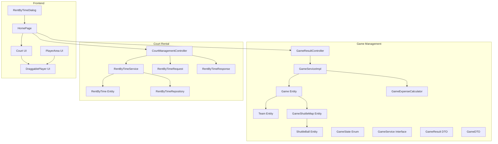
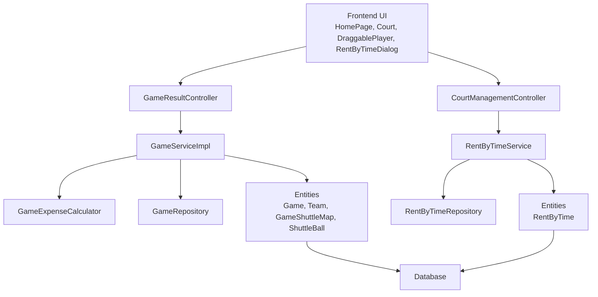
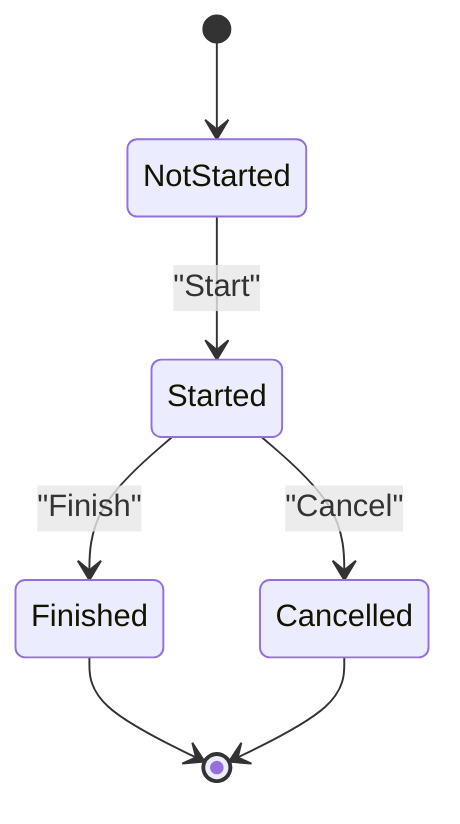
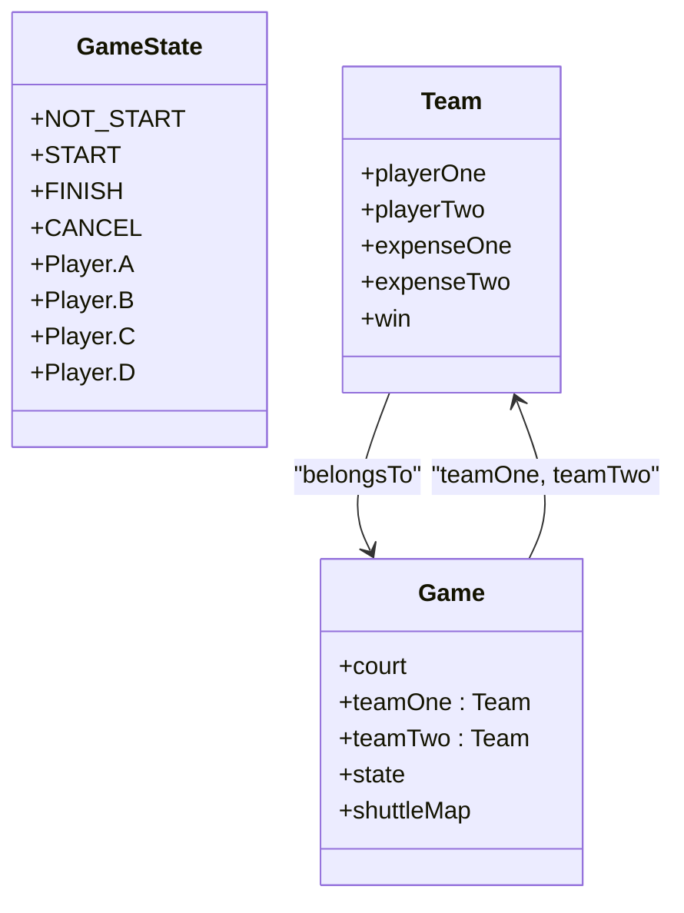
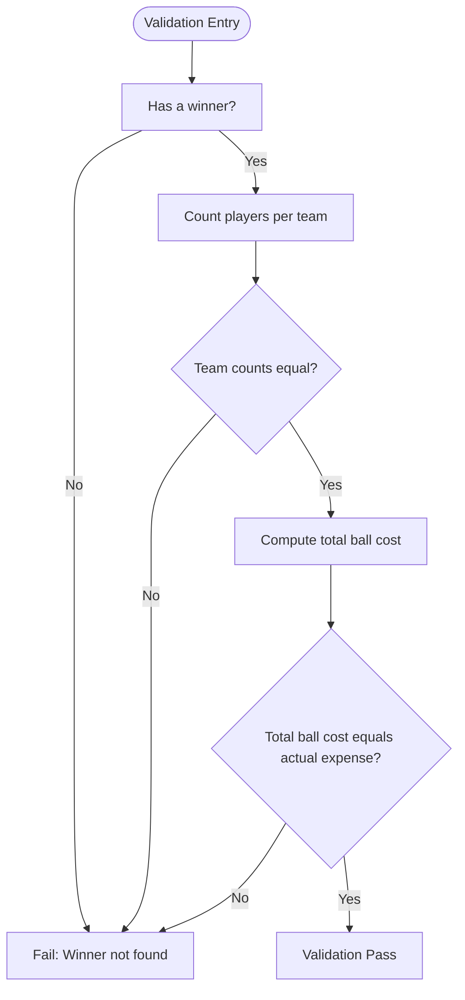
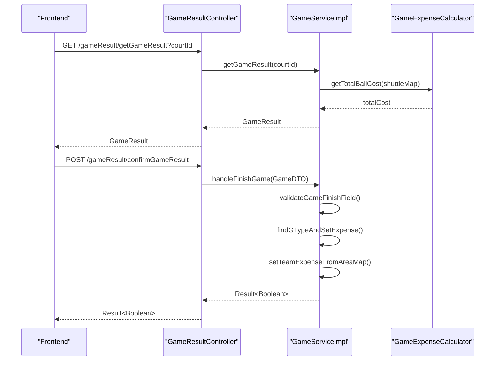
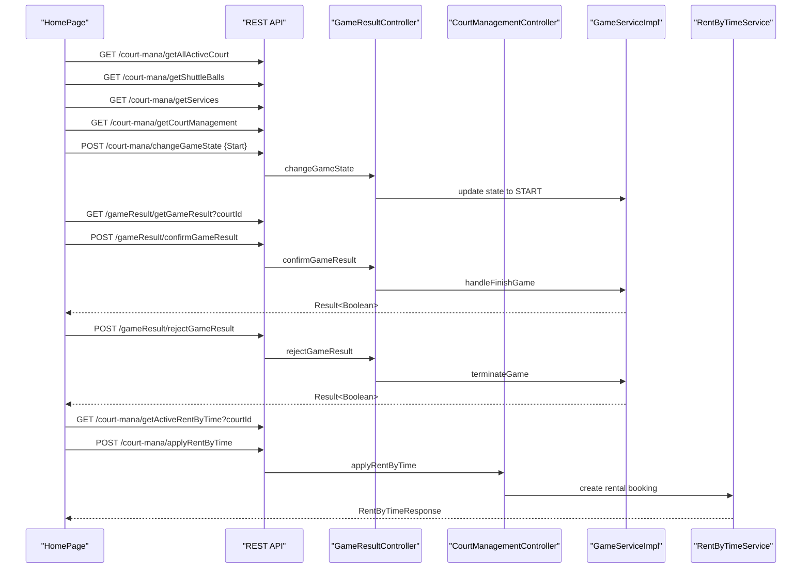
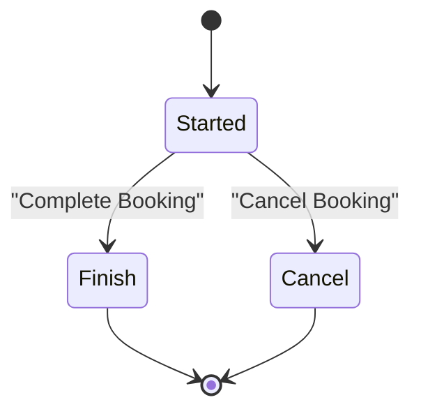
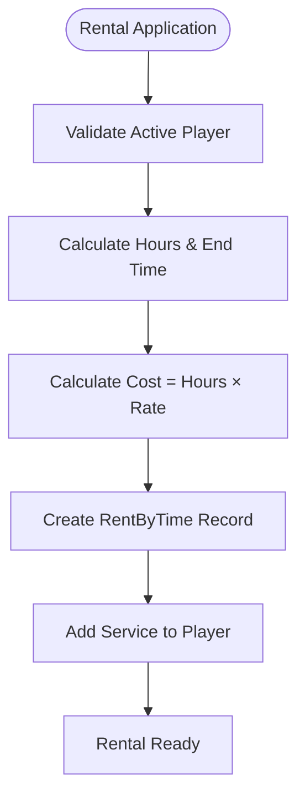
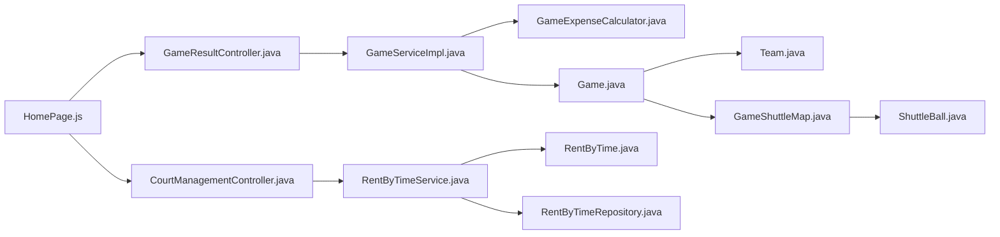

# Game Management System

<cite>
**Referenced Files in This Document**
- [Game.java](file://BadmintonCourtManagement/src/main/java/com/badminton/entity/Game.java)
- [Team.java](file://BadmintonCourtManagement/src/main/java/com/badminton/entity/Team.java)
- [GameShuttleMap.java](file://BadmintonCourtManagement/src/main/java/com/badminton/entity/GameShuttleMap.java)
- [ShuttleBall.java](file://BadmintonCourtManagement/src/main/java/com/badminton/entity/ShuttleBall.java)
- [GameState.java](file://BadmintonCourtManagement/src/main/java/com/badminton/constant/GameState.java)
- [GameService.java](file://BadmintonCourtManagement/src/main/java/com/badminton/service/GameService.java)
- [GameServiceImpl.java](file://BadmintonCourtManagement/src/main/java/com/badminton/service/impl/GameServiceImpl.java)
- [GameExpenseCalculator.java](file://BadmintonCourtManagement/src/main/java/com/badminton/service/calculator/GameExpenseCalculator.java)
- [GameResultController.java](file://BadmintonCourtManagement/src/main/java/com/badminton/controller/GameResultController.java)
- [GameResult.java](file://BadmintonCourtManagement/src/main/java/com/badminton/response/result/GameResult.java)
- [GameDTO.java](file://BadmintonCourtManagement/src/main/java/com/badminton/requestmodel/GameDTO.java)
- [RentByTime.java](file://BadmintonCourtManagement/src/main/java/com/badminton/entity/RentByTime.java)
- [RentByTimeService.java](file://BadmintonCourtManagement/src/main/java/com/badminton/service/RentByTimeService.java)
- [RentByTimeRequest.java](file://BadmintonCourtManagement/src/main/java/com/badminton/requestmodel/RentByTimeRequest.java)
- [RentByTimeResponse.java](file://BadmintonCourtManagement/src/main/java/com/badminton/response/RentByTimeResponse.java)
- [RentByTimeRepository.java](file://BadmintonCourtManagement/src/main/java/com/badminton/repository/RentByTimeRepository.java)
- [CourtManagementController.java](file://BadmintonCourtManagement/src/main/java/com/badminton/controller/CourtManagementController.java)
- [Court.js](file://bad-court-mana-ui/src/page/dragNdrop/Court.js)
- [DraggablePlayer.js](file://bad-court-mana-ui/src/page/dragNdrop/DraggablePlayer.js)
- [PlayerArea.js](file://bad-court-mana-ui/src/page/dragNdrop/PlayerArea.js)
- [HomePage.js](file://bad-court-mana-ui/src/page/HomePage.js)
- [RentByTimeDialog.js](file://bad-court-mana-ui/src/page/dialog/RentByTimeDialog.js)
</cite>

## Update Summary
**Changes Made**
- Added comprehensive RentByTime court rental functionality alongside existing game management features
- Integrated new court rental endpoints in CourtManagementController
- Implemented RentByTimeService for rental lifecycle management
- Added RentByTime entity, repository, request/response models
- Enhanced frontend with RentByTimeDialog for rental management
- Updated architecture to support dual functionality: game management and court rentals

## Table of Contents
1. [Introduction](#introduction)
2. [Project Structure](#project-structure)
3. [Core Components](#core-components)
4. [Architecture Overview](#architecture-overview)
5. [Detailed Component Analysis](#detailed-component-analysis)
6. [RentByTime Court Rental System](#rentbytime-court-rental-system)
7. [Dependency Analysis](#dependency-analysis)
8. [Performance Considerations](#performance-considerations)
9. [Troubleshooting Guide](#troubleshooting-guide)
10. [Conclusion](#conclusion)
11. [Appendices](#appendices)

## Introduction
This document describes the Game Management System that governs the lifecycle of a badminton match from initiation to completion, now enhanced with comprehensive court rental functionality. The system manages both competitive games (with state transitions from not started to in progress to finished/cancelled) and court rental bookings (with hourly rate billing and real-time tracking). It covers player assignment to court positions A–B vs C–D, validation rules ensuring minimum player requirements, the expense calculation engine, shuttle ball tracking, and service integration. The new RentByTime feature enables hourly court bookings with automatic cost calculation, real-time tracking, and seamless integration with the existing game management workflow.

## Project Structure
The system now comprises:
- Backend Java Spring Boot application with entities, services, controllers, and calculators for both game management and court rentals.
- Frontend React application implementing drag-and-drop UI for court management, game controls, and rental booking interfaces.

**Diagram sources**
- [Game.java:18-79](file://BadmintonCourtManagement/src/main/java/com/badminton/entity/Game.java#L18-L79)
- [Team.java:14-39](file://BadmintonCourtManagement/src/main/java/com/badminton/entity/Team.java#L14-L39)
- [GameShuttleMap.java:10-30](file://BadmintonCourtManagement/src/main/java/com/badminton/entity/GameShuttleMap.java#L10-L30)
- [ShuttleBall.java:17-61](file://BadmintonCourtManagement/src/main/java/com/badminton/entity/ShuttleBall.java#L17-L61)
- [GameState.java:11-56](file://BadmintonCourtManagement/src/main/java/com/badminton/constant/GameState.java#L11-L56)
- [GameService.java:10-20](file://BadmintonCourtManagement/src/main/java/com/badminton/service/GameService.java#L10-L20)
- [GameServiceImpl.java:36-367](file://BadmintonCourtManagement/src/main/java/com/badminton/service/impl/GameServiceImpl.java#L36-L367)
- [GameExpenseCalculator.java:17-82](file://BadmintonCourtManagement/src/main/java/com/badminton/service/calculator/GameExpenseCalculator.java#L17-L82)
- [GameResultController.java:16-42](file://BadmintonCourtManagement/src/main/java/com/badminton/controller/GameResultController.java#L16-L42)
- [RentByTime.java:18-79](file://BadmintonCourtManagement/src/main/java/com/badminton/entity/RentByTime.java#L18-L79)
- [RentByTimeService.java:35-255](file://BadmintonCourtManagement/src/main/java/com/badminton/service/RentByTimeService.java#L35-L255)
- [RentByTimeRequest.java:18-60](file://BadmintonCourtManagement/src/main/java/com/badminton/requestmodel/RentByTimeRequest.java#L18-L60)
- [RentByTimeResponse.java:18-60](file://BadmintonCourtManagement/src/main/java/com/badminton/response/RentByTimeResponse.java#L18-L60)
- [RentByTimeRepository.java:18-40](file://BadmintonCourtManagement/src/main/java/com/badminton/repository/RentByTimeRepository.java#L18-L40)
- [CourtManagementController.java:176-214](file://BadmintonCourtManagement/src/main/java/com/badminton/controller/CourtManagementController.java#L176-L214)
- [Court.js:11-129](file://bad-court-mana-ui/src/page/dragNdrop/Court.js#L11-L129)
- [DraggablePlayer.js:6-52](file://bad-court-mana-ui/src/page/dragNdrop/DraggablePlayer.js#L6-L52)
- [PlayerArea.js:9-112](file://bad-court-mana-ui/src/page/dragNdrop/PlayerArea.js#L9-L112)
- [HomePage.js:32-904](file://bad-court-mana-ui/src/page/HomePage.js#L32-L904)
- [RentByTimeDialog.js](file://bad-court-mana-ui/src/page/dialog/RentByTimeDialog.js)

**Section sources**
- [Game.java:18-79](file://BadmintonCourtManagement/src/main/java/com/badminton/entity/Game.java#L18-L79)
- [RentByTime.java:18-79](file://BadmintonCourtManagement/src/main/java/com/badminton/entity/RentByTime.java#L18-L79)
- [RentByTimeService.java:35-255](file://BadmintonCourtManagement/src/main/java/com/badminton/service/RentByTimeService.java#L35-L255)
- [CourtManagementController.java:176-214](file://BadmintonCourtManagement/src/main/java/com/badminton/controller/CourtManagementController.java#L176-L214)
- [GameServiceImpl.java:36-367](file://BadmintonCourtManagement/src/main/java/com/badminton/service/impl/GameServiceImpl.java#L36-L367)
- [GameResultController.java:16-42](file://BadmintonCourtManagement/src/main/java/com/badminton/controller/GameResultController.java#L16-L42)
- [Court.js:11-129](file://bad-court-mana-ui/src/page/dragNdrop/Court.js#L11-L129)
- [HomePage.js:32-904](file://bad-court-mana-ui/src/page/HomePage.js#L32-L904)

## Core Components
- Game entity encapsulates court association, teams, state, and shuttle ball mapping. It initializes to "not started" and maintains a list of GameShuttleMap entries.
- Team entity holds two players, per-player expenses, and win status linked to a Game.
- GameShuttleMap links a Game to a ShuttleBall with a quantity used during the game.
- GameState enum defines lifecycle states and constants for court positions A–D.
- GameService and GameServiceImpl orchestrate match lifecycle actions, validation, and expense computation.
- GameExpenseCalculator computes total ball costs and splits expenses between teams.
- GameResultController exposes endpoints to fetch and confirm game results.
- RentByTime entity manages court rental bookings with hourly rate calculation, start/end times, and state tracking.
- RentByTimeService handles rental lifecycle operations including application, payment processing, cancellation, and updates.
- RentByTimeRequest and RentByTimeResponse provide data transfer objects for rental operations.
- Frontend components implement drag-and-drop UI for player placement, interactive game controls, and rental booking interfaces.

**Section sources**
- [Game.java:18-79](file://BadmintonCourtManagement/src/main/java/com/badminton/entity/Game.java#L18-L79)
- [Team.java:14-39](file://BadmintonCourtManagement/src/main/java/com/badminton/entity/Team.java#L14-L39)
- [GameShuttleMap.java:10-30](file://BadmintonCourtManagement/src/main/java/com/badminton/entity/GameShuttleMap.java#L10-L30)
- [GameState.java:11-56](file://BadmintonCourtManagement/src/main/java/com/badminton/constant/GameState.java#L11-L56)
- [GameService.java:10-20](file://BadmintonCourtManagement/src/main/java/com/badminton/service/GameService.java#L10-L20)
- [GameServiceImpl.java:36-367](file://BadmintonCourtManagement/src/main/java/com/badminton/service/impl/GameServiceImpl.java#L36-L367)
- [GameExpenseCalculator.java:17-82](file://BadmintonCourtManagement/src/main/java/com/badminton/service/calculator/GameExpenseCalculator.java#L17-L82)
- [GameResultController.java:16-42](file://BadmintonCourtManagement/src/main/java/com/badminton/controller/GameResultController.java#L16-L42)
- [RentByTime.java:18-79](file://BadmintonCourtManagement/src/main/java/com/badminton/entity/RentByTime.java#L18-L79)
- [RentByTimeService.java:35-255](file://BadmintonCourtManagement/src/main/java/com/badminton/service/RentByTimeService.java#L35-L255)
- [RentByTimeRequest.java:18-60](file://BadmintonCourtManagement/src/main/java/com/badminton/requestmodel/RentByTimeRequest.java#L18-L60)
- [RentByTimeResponse.java:18-60](file://BadmintonCourtManagement/src/main/java/com/badminton/response/RentByTimeResponse.java#L18-L60)

## Architecture Overview
The system follows a layered architecture with dual functionality:
- Presentation layer (React): Drag-and-drop UI for court management, game controls, and rental booking interfaces.
- Application layer (Spring): Controllers expose REST endpoints for both game result operations and rental management.
- Domain and service layer: Business logic for state transitions, validations, expense calculations, and rental lifecycle management.
- Persistence: Entities mapped to database tables via JPA/Hibernate.

**Diagram sources**
- [GameResultController.java:16-42](file://BadmintonCourtManagement/src/main/java/com/badminton/controller/GameResultController.java#L16-L42)
- [CourtManagementController.java:176-214](file://BadmintonCourtManagement/src/main/java/com/badminton/controller/CourtManagementController.java#L176-L214)
- [GameServiceImpl.java:36-367](file://BadmintonCourtManagement/src/main/java/com/badminton/service/impl/GameServiceImpl.java#L36-L367)
- [RentByTimeService.java:35-255](file://BadmintonCourtManagement/src/main/java/com/badminton/service/RentByTimeService.java#L35-L255)
- [GameExpenseCalculator.java:17-82](file://BadmintonCourtManagement/src/main/java/com/badminton/service/calculator/GameExpenseCalculator.java#L17-L82)
- [Game.java:18-79](file://BadmintonCourtManagement/src/main/java/com/badminton/entity/Game.java#L18-L79)
- [RentByTime.java:18-79](file://BadmintonCourtManagement/src/main/java/com/badminton/entity/RentByTime.java#L18-L79)

## Detailed Component Analysis

### Game State Machine and Lifecycle
- Initial state: "Not start"
- Transition to "Start" occurs when the frontend triggers start with a selected shuttle ball.
- Finalization: "Finish" sets ended date and determines game type (share/negotiated) and winner.
- Cancellation: "Cancel" ends all ongoing games on a court.

**Diagram sources**
- [GameState.java:11-38](file://BadmintonCourtManagement/src/main/java/com/badminton/constant/GameState.java#L11-L38)
- [GameServiceImpl.java:83-148](file://BadmintonCourtManagement/src/main/java/com/badminton/service/impl/GameServiceImpl.java#L83-L148)

**Section sources**
- [GameState.java:11-38](file://BadmintonCourtManagement/src/main/java/com/badminton/constant/GameState.java#L11-L38)
- [GameServiceImpl.java:83-148](file://BadmintonCourtManagement/src/main/java/com/badminton/service/impl/GameServiceImpl.java#L83-L148)

### Player Assignment and Position Mapping (A–B vs C–D)
- Positions A and B belong to Team One; C and D belong to Team Two.
- During match start, players are placed into areas A–D.
- During result confirmation, the system reads area assignments to compute per-player expenses and winner.

**Diagram sources**
- [GameState.java:11-56](file://BadmintonCourtManagement/src/main/java/com/badminton/constant/GameState.java#L11-L56)
- [Team.java:14-39](file://BadmintonCourtManagement/src/main/java/com/badminton/entity/Team.java#L14-L39)
- [Game.java:18-79](file://BadmintonCourtManagement/src/main/java/com/badminton/entity/Game.java#L18-L79)

**Section sources**
- [GameState.java:40-55](file://BadmintonCourtManagement/src/main/java/com/badminton/constant/GameState.java#L40-L55)
- [GameServiceImpl.java:264-286](file://BadmintonCourtManagement/src/main/java/com/badminton/service/impl/GameServiceImpl.java#L264-L286)

### Validation Rules and Minimum Player Requirements
- Winner must be declared; otherwise, the operation fails.
- Each team must have exactly one player assigned to positions A–B and one to C–D respectively.
- Total ball cost computed from shuttle balls must equal the sum of reported expenses.

**Diagram sources**
- [GameServiceImpl.java:293-329](file://BadmintonCourtManagement/src/main/java/com/badminton/service/impl/GameServiceImpl.java#L293-L329)

**Section sources**
- [GameServiceImpl.java:293-329](file://BadmintonCourtManagement/src/main/java/com/badminton/service/impl/GameServiceImpl.java#L293-L329)

### Expense Calculation Engine and Cost Splitting
- Total ball cost is derived from the map of shuttle balls and quantities used.
- In "Finish," the system determines game type (share or negotiated) and sets per-team expenses.
- For share games, expenses are split equally between teams; per-player expenses are recorded per position.

**Diagram sources**
- [GameResultController.java:21-35](file://BadmintonCourtManagement/src/main/java/com/badminton/controller/GameResultController.java#L21-L35)
- [GameServiceImpl.java:64-116](file://BadmintonCourtManagement/src/main/java/com/badminton/service/impl/GameServiceImpl.java#L64-L116)
- [GameExpenseCalculator.java:24-40](file://BadmintonCourtManagement/src/main/java/com/badminton/service/calculator/GameExpenseCalculator.java#L24-L40)

**Section sources**
- [GameExpenseCalculator.java:24-81](file://BadmintonCourtManagement/src/main/java/com/badminton/service/calculator/GameExpenseCalculator.java#L24-L81)
- [GameServiceImpl.java:216-286](file://BadmintonCourtManagement/src/main/java/com/badminton/service/impl/GameServiceImpl.java#L216-L286)

### Frontend Drag-and-Drop Court Interface and Real-Time Controls
- The homepage fetches active courts, shuttle balls, services, and rental information, and initializes the UI state.
- Players can be dragged from the available list to positions A–D on the court.
- On start, the system validates player counts and transitions the court to "Start."
- On finish, it retrieves the game result, allows manual adjustments, and confirms to finalize.
- On cancel, it terminates all ongoing games on the selected court.

**Diagram sources**
- [HomePage.js:511-659](file://bad-court-mana-ui/src/page/HomePage.js#L511-L659)
- [Court.js:11-129](file://bad-court-mana-ui/src/page/dragNdrop/Court.js#L11-L129)
- [DraggablePlayer.js:6-52](file://bad-court-mana-ui/src/page/dragNdrop/DraggablePlayer.js#L6-L52)
- [PlayerArea.js:9-112](file://bad-court-mana-ui/src/page/dragNdrop/PlayerArea.js#L9-L112)
- [GameResultController.java:21-35](file://BadmintonCourtManagement/src/main/java/com/badminton/controller/GameResultController.java#L21-L35)
- [CourtManagementController.java:176-214](file://BadmintonCourtManagement/src/main/java/com/badminton/controller/CourtManagementController.java#L176-L214)

**Section sources**
- [HomePage.js:130-183](file://bad-court-mana-ui/src/page/HomePage.js#L130-L183)
- [HomePage.js:249-278](file://bad-court-mana-ui/src/page/HomePage.js#L249-L278)
- [HomePage.js:359-445](file://bad-court-mana-ui/src/page/HomePage.js#L359-L445)
- [HomePage.js:447-467](file://bad-court-mana-ui/src/page/HomePage.js#L447-L467)
- [Court.js:11-129](file://bad-court-mana-ui/src/page/dragNdrop/Court.js#L11-L129)
- [DraggablePlayer.js:6-52](file://bad-court-mana-ui/src/page/dragNdrop/DraggablePlayer.js#L6-L52)
- [PlayerArea.js:9-112](file://bad-court-mana-ui/src/page/dragNdrop/PlayerArea.js#L9-L112)

### Business Rules Summary
- Match cancellation: All currently running games on a court are canceled with a single action.
- Player removal restrictions: While a court is locked (in progress), dragging players out is disabled; removal requires cancellation or end of the game.
- Automatic session boundary handling: The UI checks for a valid session on load and proceeds only if a session exists.
- Rental state management: RentByTime bookings progress through "Started", "Finish", and "Cancel" states with automatic time tracking.

**Section sources**
- [GameServiceImpl.java:119-148](file://BadmintonCourtManagement/src/main/java/com/badminton/service/impl/GameServiceImpl.java#L119-L148)
- [DraggablePlayer.js:7-15](file://bad-court-mana-ui/src/page/dragNdrop/DraggablePlayer.js#L7-L15)
- [HomePage.js:527-531](file://bad-court-mana-ui/src/page/HomePage.js#L527-L531)
- [RentByTimeService.java:39-42](file://BadmintonCourtManagement/src/main/java/com/badminton/service/RentByTimeService.java#L39-L42)

## RentByTime Court Rental System

### Rental Lifecycle Management
The RentByTime system manages hourly court bookings with comprehensive lifecycle tracking:
- Application: Creates new rental bookings with player validation and time calculation
- Payment Processing: Handles payment collection with optional custom fee adjustment
- Cancellation: Manages booking cancellations with proper state transitions
- Updates: Allows modification of existing rental bookings
- Real-time Tracking: Monitors remaining time and automatically calculates costs

**Diagram sources**
- [RentByTimeService.java:39-42](file://BadmintonCourtManagement/src/main/java/com/badminton/service/RentByTimeService.java#L39-L42)
- [RentByTime.java:18-79](file://BadmintonCourtManagement/src/main/java/com/badminton/entity/RentByTime.java#L18-L79)

### Hourly Rate Calculation and Cost Management
- Default hourly rate: 100,000 currency units (configurable via Service entity)
- Cost calculation: `numTime × hourlyRate` with rounding to whole numbers
- Service integration: Automatically adds rental service to player's service list
- Shuttle ball inclusion: Optional shuttle balls can be bundled with rental bookings

**Diagram sources**
- [RentByTimeService.java:64-94](file://BadmintonCourtManagement/src/main/java/com/badminton/service/RentByTimeService.java#L64-L94)
- [RentByTimeService.java:55-61](file://BadmintonCourtManagement/src/main/java/com/badminton/service/RentByTimeService.java#L55-L61)

### Frontend Rental Management Interface
The RentByTimeDialog provides comprehensive rental booking management:
- Rental application with player selection and duration input
- Real-time cost calculation and payment processing
- Active rental monitoring with remaining time display
- Rental history and status tracking
- Integration with existing court management workflows

**Section sources**
- [RentByTime.java:18-79](file://BadmintonCourtManagement/src/main/java/com/badminton/entity/RentByTime.java#L18-L79)
- [RentByTimeService.java:35-255](file://BadmintonCourtManagement/src/main/java/com/badminton/service/RentByTimeService.java#L35-L255)
- [RentByTimeRequest.java:18-60](file://BadmintonCourtManagement/src/main/java/com/badminton/requestmodel/RentByTimeRequest.java#L18-L60)
- [RentByTimeResponse.java:18-60](file://BadmintonCourtManagement/src/main/java/com/badminton/response/RentByTimeResponse.java#L18-L60)
- [RentByTimeRepository.java:18-40](file://BadmintonCourtManagement/src/main/java/com/badminton/repository/RentByTimeRepository.java#L18-L40)
- [CourtManagementController.java:176-214](file://BadmintonCourtManagement/src/main/java/com/badminton/controller/CourtManagementController.java#L176-L214)
- [RentByTimeDialog.js](file://bad-court-mana-ui/src/page/dialog/RentByTimeDialog.js)

## Dependency Analysis
- GameServiceImpl depends on GameExpenseCalculator for cost computations and on GameRepository for persistence.
- RentByTimeService depends on RentByTimeRepository, CourtRepositoty, AvailablePlayerRepository, ServiceRepositoty, and SessionServiceImpl.
- GameResultController and CourtManagementController both delegate to their respective service implementations.
- Frontend components depend on REST endpoints for state updates, result retrieval, and rental management.

**Diagram sources**
- [HomePage.js:32-904](file://bad-court-mana-ui/src/page/HomePage.js#L32-L904)
- [GameResultController.java:16-42](file://BadmintonCourtManagement/src/main/java/com/badminton/controller/GameResultController.java#L16-L42)
- [CourtManagementController.java:176-214](file://BadmintonCourtManagement/src/main/java/com/badminton/controller/CourtManagementController.java#L176-L214)
- [GameServiceImpl.java:36-367](file://BadmintonCourtManagement/src/main/java/com/badminton/service/impl/GameServiceImpl.java#L36-L367)
- [RentByTimeService.java:35-255](file://BadmintonCourtManagement/src/main/java/com/badminton/service/RentByTimeService.java#L35-L255)
- [GameExpenseCalculator.java:17-82](file://BadmintonCourtManagement/src/main/java/com/badminton/service/calculator/GameExpenseCalculator.java#L17-L82)
- [Game.java:18-79](file://BadmintonCourtManagement/src/main/java/com/badminton/entity/Game.java#L18-L79)
- [RentByTime.java:18-79](file://BadmintonCourtManagement/src/main/java/com/badminton/entity/RentByTime.java#L18-L79)
- [Team.java:14-39](file://BadmintonCourtManagement/src/main/java/com/badminton/entity/Team.java#L14-L39)
- [GameShuttleMap.java:10-30](file://BadmintonCourtManagement/src/main/java/com/badminton/entity/GameShuttleMap.java#L10-L30)
- [ShuttleBall.java:17-61](file://BadmintonCourtManagement/src/main/java/com/badminton/entity/ShuttleBall.java#L17-L61)

**Section sources**
- [GameServiceImpl.java:36-367](file://BadmintonCourtManagement/src/main/java/com/badminton/service/impl/GameServiceImpl.java#L36-L367)
- [RentByTimeService.java:35-255](file://BadmintonCourtManagement/src/main/java/com/badminton/service/RentByTimeService.java#L35-L255)
- [GameResultController.java:16-42](file://BadmintonCourtManagement/src/main/java/com/badminton/controller/GameResultController.java#L16-L42)
- [CourtManagementController.java:176-214](file://BadmintonCourtManagement/src/main/java/com/badminton/controller/CourtManagementController.java#L176-L214)

## Performance Considerations
- Minimize repeated network calls by batching UI updates and caching shuttle ball, service lists, and rental information locally.
- Use efficient stream-based aggregations for total ball cost, per-team expense computations, and rental cost calculations.
- Avoid unnecessary re-renders in the frontend by passing stable references, memoizing derived values, and implementing proper state management for rental dialogs.
- Implement proper indexing on RentByTimeRepository for court-based queries and time-based filtering.

## Troubleshooting Guide
Common issues and resolutions:
- Winner not found during result confirmation: Ensure one of the four positions is marked as winning.
- Player count mismatch: Verify exactly one player per team (positions A–B and C–D).
- Expense mismatch: Confirm total reported expenses equal the computed ball cost.
- Invalid court ID or empty court areas: Validate input before invoking finish or cancel endpoints.
- Session not initialized: The UI checks for a valid session on load; refresh if initialization fails.
- Rental booking errors: Verify player availability in active session, valid court ID, and proper time duration input.
- Payment processing failures: Check rental state is "Started" and ensure sufficient balance for payment.
- Cost calculation discrepancies: Confirm hourly rate configuration and proper rounding in cost calculations.

**Section sources**
- [GameServiceImpl.java:293-329](file://BadmintonCourtManagement/src/main/java/com/badminton/service/impl/GameServiceImpl.java#L293-L329)
- [RentByTimeService.java:64-94](file://BadmintonCourtManagement/src/main/java/com/badminton/service/RentByTimeService.java#L64-L94)
- [GameResultController.java:21-35](file://BadmintonCourtManagement/src/main/java/com/badminton/controller/GameResultController.java#L21-L35)
- [HomePage.js:527-531](file://bad-court-mana-ui/src/page/HomePage.js#L527-L531)

## Conclusion
The Game Management System now provides a comprehensive solution for both competitive badminton matches and court rental bookings. The enhanced system maintains robust lifecycle management for games with strict validation rules and precise expense computations, while seamlessly integrating RentByTime functionality for hourly court reservations. The backend ensures state integrity for both game management and rental operations, while the frontend delivers intuitive drag-and-drop experiences with real-time controls for start, finish, cancel actions, and rental management. This dual functionality creates a unified platform for all court usage scenarios.

## Appendices

### Typical Game Scenarios and Edge Cases
- Scenario 1: Normal match
  - Start with two players per team; finish with a declared winner; confirm result; split costs equally.
- Scenario 2: Negotiated pricing
  - At least one player's position has a non-default expense; system records negotiated game type and preserves individual expenses.
- Scenario 3: Cancellation
  - Cancel mid-match; all ongoing games on the court are terminated; players are returned to the available list.
- Scenario 4: Court Rental Booking
  - Apply for hourly court rental with player validation; system calculates cost based on duration and hourly rate; tracks remaining time in real-time.
- Edge Case 1: No winner
  - Attempting to finish without a winner fails validation.
- Edge Case 2: Uneven teams
  - Assignments must have one player per team; otherwise, validation fails.
- Edge Case 3: Expense mismatch
  - If total reported expenses differ from computed ball cost, the confirmation is rejected.
- Edge Case 4: Rental conflicts
  - Multiple concurrent bookings for the same court are prevented through proper state management and validation.
- Edge Case 5: Payment processing
  - Rental payments require valid "Started" state and sufficient player balance.