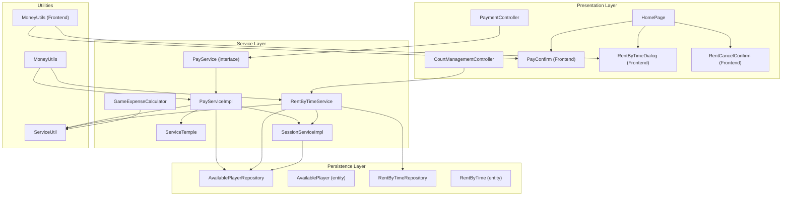
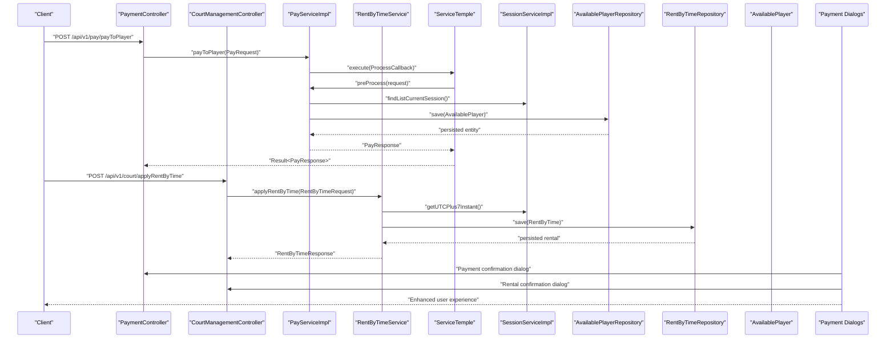
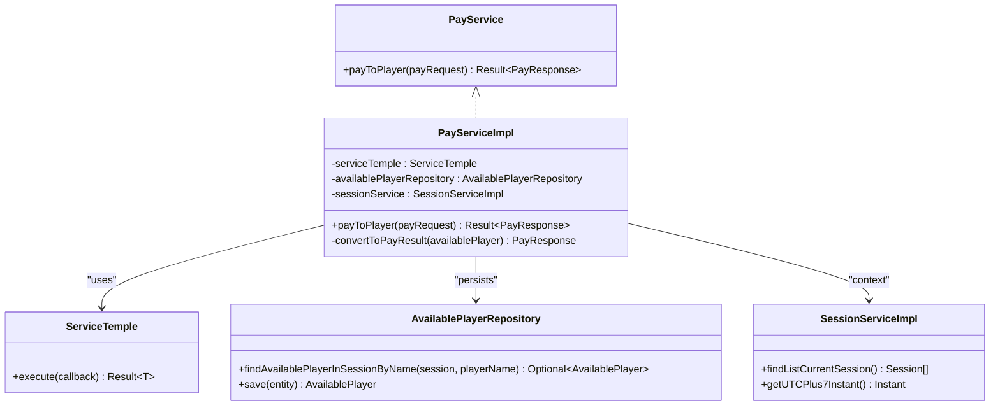
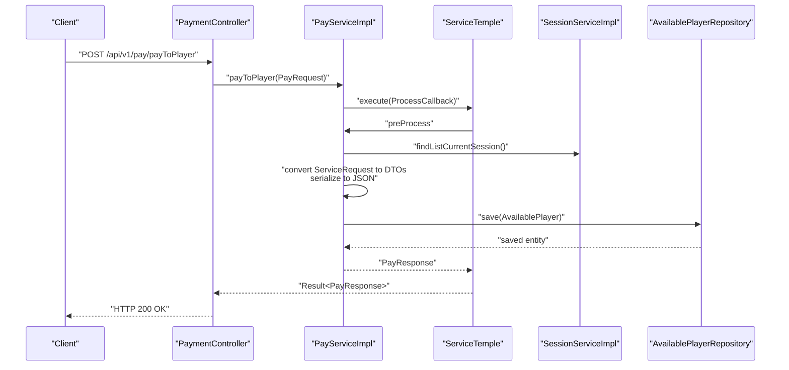
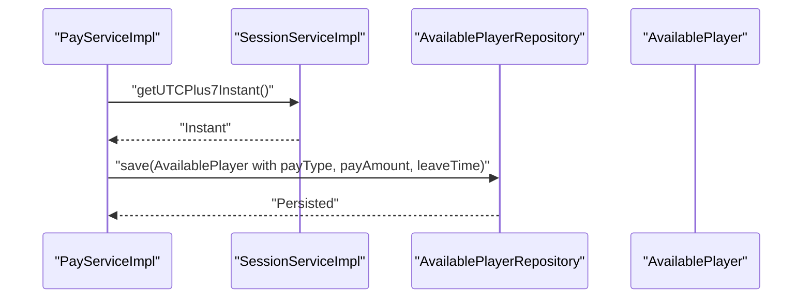
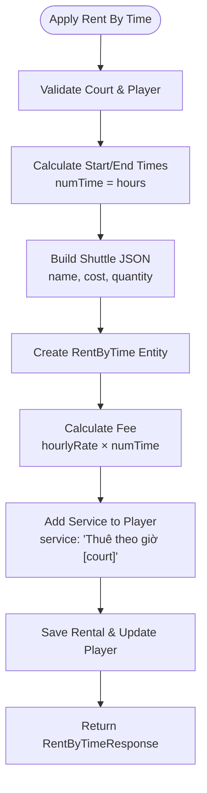
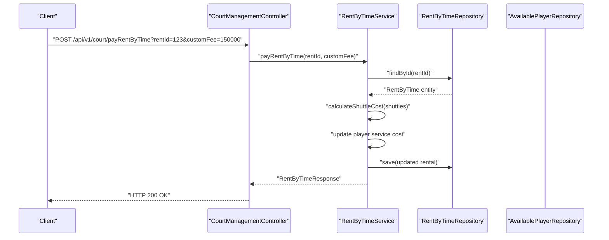
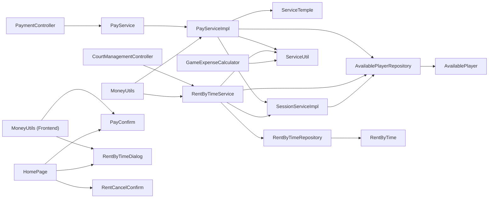

# Payment & Financial System

<cite>
**Referenced Files in This Document**
- [PayService.java](file://BadmintonCourtManagement/src/main/java/com/badminton/service/PayService.java)
- [PayServiceImpl.java](file://BadmintonCourtManagement/src/main/java/com/badminton/service/impl/PayServiceImpl.java)
- [ServiceTemple.java](file://BadmintonCourtManagement/src/main/java/com/badminton/service/ServiceTemple.java)
- [PaymentController.java](file://BadmintonCourtManagement/src/main/java/com/badminton/controller/PaymentController.java)
- [PayRequest.java](file://BadmintonCourtManagement/src/main/java/com/badminton/requestmodel/PayRequest.java)
- [PayResponse.java](file://BadmintonCourtManagement/src/main/java/com/badminton/response/PayResponse.java)
- [AvailablePlayer.java](file://BadmintonCourtManagement/src/main/java/com/badminton/entity/AvailablePlayer.java)
- [AvailablePlayerRepository.java](file://BadmintonCourtManagement/src/main/java/com/badminton/repository/AvailablePlayerRepository.java)
- [SessionServiceImpl.java](file://BadmintonCourtManagement/src/main/java/com/badminton/service/SessionServiceImpl.java)
- [GameExpenseCalculator.java](file://BadmintonCourtManagement/src/main/java/com/badminton/service/calculator/GameExpenseCalculator.java)
- [MoneyUtils.java](file://BadmintonCourtManagement/src/main/java/com/badminton/util/MoneyUtils.java)
- [ServiceUtil.java](file://BadmintonCourtManagement/src/main/java/com/badminton/util/ServiceUtil.java)
- [ServiceRequest.java](file://BadmintonCourtManagement/src/main/java/com/badminton/requestmodel/ServiceRequest.java)
- [PayType.java](file://BadmintonCourtManagement/src/main/java/com/badminton/constant/PayType.java)
- [ProcessCallback.java](file://BadmintonCourtManagement/src/main/java/com/badminton/service/ProcessCallback.java)
- [PayConfirm.js](file://bad-court-mana-ui/src/page/dialog/PayConfirm.js)
- [MoneyUtils.js](file://bad-court-mana-ui/src/page/MoneyUtils.js)
- [HomePage.js](file://bad-court-mana-ui/src/page/HomePage.js)
- [RentByTimeService.java](file://BadmintonCourtManagement/src/main/java/com/badminton/service/RentByTimeService.java)
- [RentByTime.java](file://BadmintonCourtManagement/src/main/java/com/badminton/entity/RentByTime.java)
- [RentByTimeRepository.java](file://BadmintonCourtManagement/src/main/java/com/badminton/repository/RentByTimeRepository.java)
- [RentByTimeRequest.java](file://BadmintonCourtManagement/src/main/java/com/badminton/requestmodel/RentByTimeRequest.java)
- [RentByTimeResponse.java](file://BadmintonCourtManagement/src/main/java/com/badminton/response/RentByTimeResponse.java)
- [RentShuttleDTO.java](file://BadmintonCourtManagement/src/main/java/com/badminton/model/dto/RentShuttleDTO.java)
- [CourtManagementController.java](file://BadmintonCourtManagement/src/main/java/com/badminton/controller/CourtManagementController.java)
- [RentByTimeDialog.js](file://bad-court-mana-ui/src/page/dialog/RentByTimeDialog.js)
- [RentCancelConfirm.js](file://bad-court-mana-ui/src/page/dialog/RentCancelConfirm.js)
- [ExcelExportService.java](file://BadmintonCourtManagement/src/main/java/com/badminton/service/impl/ExcelExportService.java)
</cite>

## Update Summary
**Changes Made**
- Added comprehensive documentation for RentByTime payment processing system
- Integrated rental fee calculation with hourly rate management
- Documented shuttle ball cost management within rental workflows
- Added payment workflow documentation for rental services
- Updated financial reporting to include rental revenue tracking
- Enhanced service integration patterns with rental-specific service handling

## Table of Contents
1. [Introduction](#introduction)
2. [Project Structure](#project-structure)
3. [Core Components](#core-components)
4. [Architecture Overview](#architecture-overview)
5. [Detailed Component Analysis](#detailed-component-analysis)
6. [RentByTime Payment Processing](#rentbytime-payment-processing)
7. [Dependency Analysis](#dependency-analysis)
8. [Performance Considerations](#performance-considerations)
9. [Troubleshooting Guide](#troubleshooting-guide)
10. [Conclusion](#conclusion)
11. [Appendices](#appendices)

## Introduction
This document explains the Payment and Financial System responsible for automated billing, payment processing, and revenue tracking. It covers the PayService implementation, the end-to-end payment workflow from total confirmation to payment completion, integration with ServiceTemple for transactional processing, billing calculation logic, currency handling with VND, and expense aggregation across games and services. It also documents payment method tracking, timestamp recording, session-based revenue consolidation, MoneyUtils utility functions, amount formatting, financial precision handling, payment confirmation dialogs, service integration patterns, error handling for payment failures, and the relationship between game completion, service usage, and automated billing generation.

**Updated** The system now includes comprehensive RentByTime payment processing capabilities, enabling hourly court rentals with integrated shuttle ball cost management and seamless payment workflows that extend beyond traditional game-based billing.

## Project Structure
The payment and financial system spans several layers with expanded rental functionality:
- Controller layer exposes both payment and rental endpoints.
- Service layer implements payment processing and rental management with transactional integrity.
- Repository layer persists available player records and rental transactions.
- Utility and calculator layers handle formatting, JSON serialization/deserialization, and expense calculations.
- Constants define payment types and rental states.
- Frontend layer provides enhanced user interfaces for both payment and rental workflows.

**Diagram sources**
- [PaymentController.java:1-29](file://BadmintonCourtManagement/src/main/java/com/badminton/controller/PaymentController.java#L1-L29)
- [CourtManagementController.java:176-214](file://BadmintonCourtManagement/src/main/java/com/badminton/controller/CourtManagementController.java#L176-L214)
- [PayService.java:1-12](file://BadmintonCourtManagement/src/main/java/com/badminton/service/PayService.java#L1-L12)
- [PayServiceImpl.java:1-81](file://BadmintonCourtManagement/src/main/java/com/badminton/service/impl/PayServiceImpl.java#L1-L81)
- [RentByTimeService.java:35-255](file://BadmintonCourtManagement/src/main/java/com/badminton/service/RentByTimeService.java#L35-L255)
- [ServiceTemple.java:1-44](file://BadmintonCourtManagement/src/main/java/com/badminton/service/ServiceTemple.java#L1-L44)
- [SessionServiceImpl.java:1-322](file://BadmintonCourtManagement/src/main/java/com/badminton/service/SessionServiceImpl.java#L1-L322)
- [AvailablePlayerRepository.java:1-35](file://BadmintonCourtManagement/src/main/java/com/badminton/repository/AvailablePlayerRepository.java#L1-L35)
- [AvailablePlayer.java:1-58](file://BadmintonCourtManagement/src/main/java/com/badminton/entity/AvailablePlayer.java#L1-L58)
- [RentByTimeRepository.java:1-20](file://BadmintonCourtManagement/src/main/java/com/badminton/repository/RentByTimeRepository.java#L1-L20)
- [RentByTime.java:11-55](file://BadmintonCourtManagement/src/main/java/com/badminton/entity/RentByTime.java#L11-L55)
- [GameExpenseCalculator.java:1-83](file://BadmintonCourtManagement/src/main/java/com/badminton/service/calculator/GameExpenseCalculator.java#L1-L83)
- [MoneyUtils.java:1-27](file://BadmintonCourtManagement/src/main/java/com/badminton/util/MoneyUtils.java#L1-L27)
- [ServiceUtil.java:1-175](file://BadmintonCourtManagement/src/main/java/com/badminton/util/ServiceUtil.java#L1-L175)
- [PayConfirm.js:1-210](file://bad-court-mana-ui/src/page/dialog/PayConfirm.js#L1-L210)
- [RentByTimeDialog.js:77-239](file://bad-court-mana-ui/src/page/dialog/RentByTimeDialog.js#L77-L239)
- [RentCancelConfirm.js:1-48](file://bad-court-mana-ui/src/page/dialog/RentCancelConfirm.js#L1-L48)
- [MoneyUtils.js:1-21](file://bad-court-mana-ui/src/page/MoneyUtils.js#L1-L21)
- [HomePage.js:1-932](file://bad-court-mana-ui/src/page/HomePage.js#L1-L932)

**Section sources**
- [PaymentController.java:1-29](file://BadmintonCourtManagement/src/main/java/com/badminton/controller/PaymentController.java#L1-L29)
- [CourtManagementController.java:176-214](file://BadmintonCourtManagement/src/main/java/com/badminton/controller/CourtManagementController.java#L176-L214)
- [PayService.java:1-12](file://BadmintonCourtManagement/src/main/java/com/badminton/service/PayService.java#L1-L12)
- [PayServiceImpl.java:1-81](file://BadmintonCourtManagement/src/main/java/com/badminton/service/impl/PayServiceImpl.java#L1-L81)
- [RentByTimeService.java:35-255](file://BadmintonCourtManagement/src/main/java/com/badminton/service/RentByTimeService.java#L35-L255)
- [ServiceTemple.java:1-44](file://BadmintonCourtManagement/src/main/java/com/badminton/service/ServiceTemple.java#L1-L44)
- [SessionServiceImpl.java:1-322](file://BadmintonCourtManagement/src/main/java/com/badminton/service/SessionServiceImpl.java#L1-L322)
- [AvailablePlayerRepository.java:1-35](file://BadmintonCourtManagement/src/main/java/com/badminton/repository/AvailablePlayerRepository.java#L1-L35)
- [AvailablePlayer.java:1-58](file://BadmintonCourtManagement/src/main/java/com/badminton/entity/AvailablePlayer.java#L1-L58)
- [RentByTimeRepository.java:1-20](file://BadmintonCourtManagement/src/main/java/com/badminton/repository/RentByTimeRepository.java#L1-L20)
- [RentByTime.java:11-55](file://BadmintonCourtManagement/src/main/java/com/badminton/entity/RentByTime.java#L11-L55)
- [GameExpenseCalculator.java:1-83](file://BadmintonCourtManagement/src/main/java/com/badminton/service/calculator/GameExpenseCalculator.java#L1-L83)
- [MoneyUtils.java:1-27](file://BadmintonCourtManagement/src/main/java/com/badminton/util/MoneyUtils.java#L1-L27)
- [ServiceUtil.java:1-175](file://BadmintonCourtManagement/src/main/java/com/badminton/util/ServiceUtil.java#L1-L175)
- [PayConfirm.js:1-210](file://bad-court-mana-ui/src/page/dialog/PayConfirm.js#L1-L210)
- [RentByTimeDialog.js:77-239](file://bad-court-mana-ui/src/page/dialog/RentByTimeDialog.js#L77-L239)
- [RentCancelConfirm.js:1-48](file://bad-court-mana-ui/src/page/dialog/RentCancelConfirm.js#L1-L48)
- [MoneyUtils.js:1-21](file://bad-court-mana-ui/src/page/MoneyUtils.js#L1-L21)
- [HomePage.js:1-932](file://bad-court-mana-ui/src/page/HomePage.js#L1-L932)

## Core Components
- PaymentController: Exposes the payment endpoint and delegates to PayService.
- PayService and PayServiceImpl: Implement payment processing, validation, and persistence of payment metadata on available players.
- RentByTimeService: Manages hourly court rental operations including rental creation, payment processing, and cancellation.
- ServiceTemple: Provides a generic transactional wrapper around process callbacks with standardized error handling.
- SessionServiceImpl: Manages session lifecycle and provides current session context and timestamps.
- AvailablePlayer and AvailablePlayerRepository: Persist player availability, services, payment type, amount, and timestamps.
- RentByTime and RentByTimeRepository: Track rental transactions, court usage, and rental metadata.
- GameExpenseCalculator: Computes per-game expenses based on shuttle usage.
- MoneyUtils: Formats amounts in Vietnamese Dong (VND).
- ServiceUtil: Serializes/deserializes service lists and supports JSON manipulation for both regular services and rental shuttles.
- PayRequest and PayResponse: Request/response DTOs for payment operations.
- RentByTimeRequest and RentByTimeResponse: Request/response DTOs for rental operations.
- RentShuttleDTO: Data transfer object for shuttle ball information within rental contexts.
- PayType: Enumerates payment actions (e.g., PAY, CANCEL).
- PayConfirm (Frontend): Modern banking-style dialog for payment confirmation with enhanced user experience.
- RentByTimeDialog (Frontend): Specialized dialog for creating and managing hourly court rentals.
- RentCancelConfirm (Frontend): Confirmation dialog for canceling rental operations.
- MoneyUtils (Frontend): Improved currency formatting utilities for frontend display.

**Updated** The system now includes comprehensive RentByTime payment processing capabilities with specialized dialogs and workflows for hourly court rentals, integrating seamlessly with the existing payment infrastructure.

**Section sources**
- [PaymentController.java:1-29](file://BadmintonCourtManagement/src/main/java/com/badminton/controller/PaymentController.java#L1-L29)
- [CourtManagementController.java:176-214](file://BadmintonCourtManagement/src/main/java/com/badminton/controller/CourtManagementController.java#L176-L214)
- [PayService.java:1-12](file://BadmintonCourtManagement/src/main/java/com/badminton/service/PayService.java#L1-L12)
- [PayServiceImpl.java:1-81](file://BadmintonCourtManagement/src/main/java/com/badminton/service/impl/PayServiceImpl.java#L1-L81)
- [RentByTimeService.java:35-255](file://BadmintonCourtManagement/src/main/java/com/badminton/service/RentByTimeService.java#L35-L255)
- [ServiceTemple.java:1-44](file://BadmintonCourtManagement/src/main/java/com/badminton/service/ServiceTemple.java#L1-L44)
- [SessionServiceImpl.java:1-322](file://BadmintonCourtManagement/src/main/java/com/badminton/service/SessionServiceImpl.java#L1-L322)
- [AvailablePlayer.java:1-58](file://BadmintonCourtManagement/src/main/java/com/badminton/entity/AvailablePlayer.java#L1-L58)
- [AvailablePlayerRepository.java:1-35](file://BadmintonCourtManagement/src/main/java/com/badminton/repository/AvailablePlayerRepository.java#L1-L35)
- [RentByTime.java:11-55](file://BadmintonCourtManagement/src/main/java/com/badminton/entity/RentByTime.java#L11-L55)
- [RentByTimeRepository.java:1-20](file://BadmintonCourtManagement/src/main/java/com/badminton/repository/RentByTimeRepository.java#L1-L20)
- [GameExpenseCalculator.java:1-83](file://BadmintonCourtManagement/src/main/java/com/badminton/service/calculator/GameExpenseCalculator.java#L1-L83)
- [MoneyUtils.java:1-27](file://BadmintonCourtManagement/src/main/java/com/badminton/util/MoneyUtils.java#L1-L27)
- [ServiceUtil.java:1-175](file://BadmintonCourtManagement/src/main/java/com/badminton/util/ServiceUtil.java#L1-L175)
- [RentByTimeRequest.java:9-20](file://BadmintonCourtManagement/src/main/java/com/badminton/requestmodel/RentByTimeRequest.java#L9-L20)
- [RentByTimeResponse.java:1-23](file://BadmintonCourtManagement/src/main/java/com/badminton/response/RentByTimeResponse.java#L1-L23)
- [RentShuttleDTO.java:1-17](file://BadmintonCourtManagement/src/main/java/com/badminton/model/dto/RentShuttleDTO.java#L1-L17)
- [PayRequest.java:1-16](file://BadmintonCourtManagement/src/main/java/com/badminton/requestmodel/PayRequest.java#L1-L16)
- [PayResponse.java:1-15](file://BadmintonCourtManagement/src/main/java/com/badminton/response/PayResponse.java#L1-L15)
- [PayType.java:1-9](file://BadmintonCourtManagement/src/main/java/com/badminton/constant/PayType.java#L1-L9)
- [PayConfirm.js:1-210](file://bad-court-mana-ui/src/page/dialog/PayConfirm.js#L1-L210)
- [RentByTimeDialog.js:77-239](file://bad-court-mana-ui/src/page/dialog/RentByTimeDialog.js#L77-L239)
- [RentCancelConfirm.js:1-48](file://bad-court-mana-ui/src/page/dialog/RentCancelConfirm.js#L1-L48)
- [MoneyUtils.js:1-21](file://bad-court-mana-ui/src/page/MoneyUtils.js#L1-L21)

## Architecture Overview
The payment workflow is orchestrated by the controller, validated and executed via PayServiceImpl, wrapped in ServiceTemple for consistent error handling, and persisted through AvailablePlayerRepository. SessionServiceImpl supplies the current session context and accurate timestamps. RentByTimeService extends this architecture to handle hourly court rentals with specialized payment processing. GameExpenseCalculator supports per-game expense computation, while MoneyUtils and ServiceUtil support currency formatting and JSON-based service aggregation. The frontend provides enhanced user experience through redesigned dialogs including PayConfirm and RentByTimeDialog with banking-style UI.

**Diagram sources**
- [PaymentController.java:24-27](file://BadmintonCourtManagement/src/main/java/com/badminton/controller/PaymentController.java#L24-L27)
- [CourtManagementController.java:176-214](file://BadmintonCourtManagement/src/main/java/com/badminton/controller/CourtManagementController.java#L176-L214)
- [PayServiceImpl.java:36-72](file://BadmintonCourtManagement/src/main/java/com/badminton/service/impl/PayServiceImpl.java#L36-L72)
- [RentByTimeService.java:63-94](file://BadmintonCourtManagement/src/main/java/com/badminton/service/RentByTimeService.java#L63-L94)
- [ServiceTemple.java:14-39](file://BadmintonCourtManagement/src/main/java/com/badminton/service/ServiceTemple.java#L14-L39)
- [SessionServiceImpl.java:140-144](file://BadmintonCourtManagement/src/main/java/com/badminton/service/SessionServiceImpl.java#L140-L144)
- [AvailablePlayerRepository.java:17-34](file://BadmintonCourtManagement/src/main/java/com/badminton/repository/AvailablePlayerRepository.java#L17-L34)
- [RentByTimeRepository.java:10-20](file://BadmintonCourtManagement/src/main/java/com/badminton/repository/RentByTimeRepository.java#L10-L20)
- [AvailablePlayer.java:1-58](file://BadmintonCourtManagement/src/main/java/com/badminton/entity/AvailablePlayer.java#L1-L58)
- [PayConfirm.js:19-210](file://bad-court-mana-ui/src/page/dialog/PayConfirm.js#L19-L210)
- [RentByTimeDialog.js:77-239](file://bad-court-mana-ui/src/page/dialog/RentByTimeDialog.js#L77-L239)

## Detailed Component Analysis

### PayService and PayServiceImpl
- Responsibilities:
  - Validate incoming payment request (player name, service list, payment type).
  - Resolve the current session and locate the player in that session who has not yet left.
  - Convert service requests to DTOs and serialize them into a JSON array stored in the available player record.
  - Record payment type, total amount, and leave time (as an Instant in UTC+7).
  - Wrap processing in ServiceTemple for consistent success/error handling.
- Data persistence:
  - Uses AvailablePlayerRepository to fetch and save the player's availability record.
- Error handling:
  - Throws business exceptions for missing player or invalid state.
  - Relies on ServiceTemple to translate exceptions into structured Result responses.

**Diagram sources**
- [PayService.java:7-11](file://BadmintonCourtManagement/src/main/java/com/badminton/service/PayService.java#L7-L11)
- [PayServiceImpl.java:28-81](file://BadmintonCourtManagement/src/main/java/com/badminton/service/impl/PayServiceImpl.java#L28-L81)
- [ServiceTemple.java:13-44](file://BadmintonCourtManagement/src/main/java/com/badminton/service/ServiceTemple.java#L13-L44)
- [AvailablePlayerRepository.java:15-34](file://BadmintonCourtManagement/src/main/java/com/badminton/repository/AvailablePlayerRepository.java#L15-L34)
- [SessionServiceImpl.java:41-322](file://BadmintonCourtManagement/src/main/java/com/badminton/service/SessionServiceImpl.java#L41-L322)

**Section sources**
- [PayService.java:1-12](file://BadmintonCourtManagement/src/main/java/com/badminton/service/PayService.java#L1-L12)
- [PayServiceImpl.java:1-81](file://BadmintonCourtManagement/src/main/java/com/badminton/service/impl/PayServiceImpl.java#L1-L81)
- [AvailablePlayerRepository.java:1-35](file://BadmintonCourtManagement/src/main/java/com/badminton/repository/AvailablePlayerRepository.java#L1-L35)
- [SessionServiceImpl.java:140-144](file://BadmintonCourtManagement/src/main/java/com/badminton/service/SessionServiceImpl.java#L140-L144)

### ServiceTemple Transactional Wrapper
- Purpose:
  - Standardizes pre-processing, execution, and error handling across process callbacks.
  - Converts exceptions into structured Result objects with appropriate error codes and messages.
- Behavior:
  - Calls preProcess(request) before invoking process().
  - Sets success flag and data upon successful completion.
  - Captures IllegalArgumentException, BusinessException, and other Throwables with distinct error codes.

**Diagram sources**
- [ServiceTemple.java:14-39](file://BadmintonCourtManagement/src/main/java/com/badminton/service/ServiceTemple.java#L14-L39)

**Section sources**
- [ServiceTemple.java:1-44](file://BadmintonCourtManagement/src/main/java/com/badminton/service/ServiceTemple.java#L1-L44)
- [ProcessCallback.java:1-13](file://BadmintonCourtManagement/src/main/java/com/badminton/service/ProcessCallback.java#L1-L13)

### Payment Workflow: From Total Confirmation to Completion
- Endpoint: POST /api/v1/pay/payToPlayer
- Steps:
  1. Controller receives PayRequest and delegates to PayService.
  2. PayServiceImpl validates request fields and finds the current session.
  3. Service requests are converted to DTOs and serialized into a JSON array stored on the AvailablePlayer.
  4. Payment metadata (type, amount, leave time) is recorded.
  5. Persistence occurs via AvailablePlayerRepository.
  6. Response is returned through ServiceTemple's Result wrapper.

**Diagram sources**
- [PaymentController.java:24-27](file://BadmintonCourtManagement/src/main/java/com/badminton/controller/PaymentController.java#L24-L27)
- [PayServiceImpl.java:36-72](file://BadmintonCourtManagement/src/main/java/com/badminton/service/impl/PayServiceImpl.java#L36-L72)
- [ServiceTemple.java:14-39](file://BadmintonCourtManagement/src/main/java/com/badminton/service/ServiceTemple.java#L14-L39)
- [SessionServiceImpl.java:140-144](file://BadmintonCourtManagement/src/main/java/com/badminton/service/SessionServiceImpl.java#L140-L144)
- [AvailablePlayerRepository.java:17-34](file://BadmintonCourtManagement/src/main/java/com/badminton/repository/AvailablePlayerRepository.java#L17-L34)

**Section sources**
- [PaymentController.java:1-29](file://BadmintonCourtManagement/src/main/java/com/badminton/controller/PaymentController.java#L1-L29)
- [PayServiceImpl.java:36-72](file://BadmintonCourtManagement/src/main/java/com/badminton/service/impl/PayServiceImpl.java#L36-L72)
- [ServiceTemple.java:14-39](file://BadmintonCourtManagement/src/main/java/com/badminton/service/ServiceTemple.java#L14-L39)

### Billing Calculation Logic and Expense Aggregation
- Per-game expenses:
  - GameExpenseCalculator computes total ball cost from shuttle usage and splits evenly between teams depending on the outcome.
  - It builds a map of shuttle balls to quantities and multiplies by unit cost.
- Service-based charges:
  - PayServiceImpl serializes service requests into a JSON array stored on AvailablePlayer.
  - ServiceUtil supports building JSON arrays and merging/removing entries for dynamic service updates.
- Currency handling:
  - MoneyUtils provides VND formatting using Vietnamese locale.
- Precision:
  - Amounts are represented as Float in the domain and response payload.

**Diagram sources**
- [GameExpenseCalculator.java:42-81](file://BadmintonCourtManagement/src/main/java/com/badminton/service/calculator/GameExpenseCalculator.java#L42-L81)
- [ServiceUtil.java:149-152](file://BadmintonCourtManagement/src/main/java/com/badminton/util/ServiceUtil.java#L149-L152)

**Section sources**
- [GameExpenseCalculator.java:1-83](file://BadmintonCourtManagement/src/main/java/com/badminton/service/calculator/GameExpenseCalculator.java#L1-L83)
- [ServiceUtil.java:1-175](file://BadmintonCourtManagement/src/main/java/com/badminton/util/ServiceUtil.java#L1-L175)
- [MoneyUtils.java:1-27](file://BadmintonCourtManagement/src/main/java/com/badminton/util/MoneyUtils.java#L1-L27)

### Payment Method Tracking, Timestamp Recording, and Session-Based Consolidation
- Payment method tracking:
  - PayServiceImpl sets payType from PayRequest onto AvailablePlayer.
- Timestamp recording:
  - Leave time is set to UTC+7 Instant via SessionServiceImpl.getUTCPlus7Instant.
- Session-based consolidation:
  - Current session is resolved via SessionServiceImpl.findListCurrentSession.
  - Closing sessions and removing players are supported for end-of-day consolidation.

**Diagram sources**
- [PayServiceImpl.java:64-69](file://BadmintonCourtManagement/src/main/java/com/badminton/service/impl/PayServiceImpl.java#L64-L69)
- [SessionServiceImpl.java:63-70](file://BadmintonCourtManagement/src/main/java/com/badminton/service/SessionServiceImpl.java#L63-L70)
- [AvailablePlayerRepository.java:17-34](file://BadmintonCourtManagement/src/main/java/com/badminton/repository/AvailablePlayerRepository.java#L17-L34)

**Section sources**
- [PayServiceImpl.java:54-79](file://BadmintonCourtManagement/src/main/java/com/badminton/service/impl/PayServiceImpl.java#L54-L79)
- [SessionServiceImpl.java:63-70](file://BadmintonCourtManagement/src/main/java/com/badminton/service/SessionServiceImpl.java#L63-L70)
- [AvailablePlayer.java:30-37](file://BadmintonCourtManagement/src/main/java/com/badminton/entity/AvailablePlayer.java#L30-L37)

### MoneyUtils and Amount Formatting
- MoneyUtils.formatToVND formats numeric amounts using Vietnamese locale with dot thousand separators.
- Currency code constant is available for consistency.
- Frontend MoneyUtils.formatVND provides enhanced formatting with improved string handling for values with dot thousand separators.

**Updated** The frontend MoneyUtils now includes improved string cleaning for values with dot thousand separators (e.g., "15.000") before parsing, ensuring accurate currency formatting across different input formats.

**Section sources**
- [MoneyUtils.java:10-25](file://BadmintonCourtManagement/src/main/java/com/badminton/util/MoneyUtils.java#L10-L25)
- [MoneyUtils.js:3-17](file://bad-court-mana-ui/src/page/MoneyUtils.js#L3-L17)

### PayConfirm Dialog: Redesigned Banking-Style UI
- Modern banking-style interface with structured layout replacing raw dialog text.
- Colored header banner with circular icon (green checkmark for payment, red cancel for cancellation).
- Hero amount display with prominent VND currency label.
- Player name display with PersonOutlinedIcon.
- Receipt-style service breakdown with individual costs.
- Bold "Tổng cộng" total footer.
- Two full-width, rounded action buttons ("Huỷ" / "Xác nhận thanh toán" or "Xác nhận huỷ").
- MUI v9 icon compatibility with CheckCircleIcon and PersonOutlinedIcon.

**New** The PayConfirm dialog provides an enhanced user experience with a professional banking-style interface that improves clarity and reduces user confusion during payment confirmation workflows.

**Section sources**
- [PayConfirm.js:19-210](file://bad-court-mana-ui/src/page/dialog/PayConfirm.js#L19-L210)
- [HomePage.js:705-737](file://bad-court-mana-ui/src/page/HomePage.js#L705-L737)

### Service Integration Patterns and JSON Serialization
- ServiceUtil.buildJsonArrayStr converts a list of service DTOs into a JSON string.
- ServiceUtil.addServiceToJsonArray appends a new service DTO to an existing JSON array string.
- ServiceUtil.divideServiceFromJsonArray filters out a specific service DTO from an existing JSON array string.
- ServiceUtil.convertShuttlesListToJson converts rental shuttle ball lists to JSON format.
- ServiceUtil.convertShuttlesJsonToList converts rental shuttle ball JSON back to DTO lists.
- These utilities enable dynamic addition/removal of services during a session and specialized handling for rental shuttles.

**Section sources**
- [ServiceUtil.java:56-70](file://BadmintonCourtManagement/src/main/java/com/badminton/util/ServiceUtil.java#L56-L70)
- [ServiceUtil.java:220-231](file://BadmintonCourtManagement/src/main/java/com/badminton/util/ServiceUtil.java#L220-L231)

### Error Handling for Payment Failures
- Validation errors:
  - IllegalArgumentException mapped to BAD_REQUEST with request validation message.
- Business errors:
  - BusinessException mapped to CONFLICT with business error message.
- Unexpected errors:
  - Other Throwables mapped to INTERNAL_SERVER_ERROR with a generic server error message.
- ServiceTemple centralizes error translation and ensures consistent Result responses.

**Section sources**
- [ServiceTemple.java:23-35](file://BadmintonCourtManagement/src/main/java/com/badminton/service/ServiceTemple.java#L23-L35)

### Relationship Between Game Completion, Service Usage, and Automated Billing
- Game completion drives per-game expense calculation via GameExpenseCalculator.
- Services requested by players are aggregated into AvailablePlayer.services as a JSON array.
- At payment time, PayServiceImpl consolidates services and total expense, records payment metadata, and persists the record for billing reconciliation.

**Section sources**
- [GameExpenseCalculator.java:42-81](file://BadmintonCourtManagement/src/main/java/com/badminton/service/calculator/GameExpenseCalculator.java#L42-L81)
- [PayServiceImpl.java:61-69](file://BadmintonCourtManagement/src/main/java/com/badminton/service/impl/PayServiceImpl.java#L61-L69)
- [ServiceUtil.java:56-70](file://BadmintonCourtManagement/src/main/java/com/badminton/util/ServiceUtil.java#L56-L70)

### Typical Payment Scenarios and Financial Reporting Workflows
- Scenario 1: Player pays for services used during the current session
  - Player selects services; PayRequest includes serviceRequests and totalExpense.
  - PayServiceImpl serializes services, records payType, payAmount, and leaveTime.
  - MoneyUtils can format amounts for display/reporting.
  - Enhanced PayConfirm dialog provides clear confirmation interface.
- Scenario 2: End-of-day session closure
  - SessionServiceImpl closes inactive sessions, cancels in-progress games, and removes players who did not check out.
  - Billing records consolidate payments and services for the day.
- Scenario 3: Revenue tracking
  - AvailablePlayer records capture payType and payAmount per player.
  - ServiceUtil JSON arrays enable detailed breakdowns of services consumed.
  - Frontend displays enhanced currency formatting for financial reports.

**Updated** The redesigned PayConfirm dialog significantly improves the user experience for payment confirmation workflows, providing clearer visual cues and professional banking-style presentation that enhances trust and reduces errors.

### Enhanced User Experience Features
- Professional banking-style UI with consistent color schemes and typography.
- Clear visual hierarchy with prominent amount display and service breakdown.
- Intuitive action buttons with appropriate colors (green for payment, red for cancellation).
- Responsive design with full-width buttons and proper spacing.
- Iconography that reinforces the payment/cancellation actions.
- Improved accessibility with proper contrast ratios and readable fonts.

**Section sources**
- [PayConfirm.js:47-204](file://bad-court-mana-ui/src/page/dialog/PayConfirm.js#L47-L204)
- [HomePage.js:705-737](file://bad-court-mana-ui/src/page/HomePage.js#L705-L737)

## RentByTime Payment Processing

### RentByTimeService Overview
RentByTimeService extends the payment system to handle hourly court rentals with integrated shuttle ball management. It provides comprehensive rental lifecycle management including creation, modification, payment processing, and cancellation.

**Key Responsibilities:**
- Validate rental requests and court availability
- Calculate hourly rental fees based on configurable rates
- Manage shuttle ball allocation and costs within rental context
- Update player services with rental charges
- Handle rental state transitions (Started, Finish, Cancel)
- Provide real-time rental status and remaining time tracking

### Rental Fee Calculation and Management
- Hourly rate determination:
  - Retrieves rate from Service entity with name "RENT_BY_TIME"
  - Falls back to default 100,000 VND/hour if service not configured
  - Uses BigDecimal for precise financial calculations with HALF_UP rounding
- Fee calculation:
  - Multiplies numTime (hours) by hourly rate
  - Calculates total cost with zero decimal places for VND precision
  - Supports custom fee override during payment processing
- Shuttle ball cost integration:
  - Processes shuttle ball selections with quantity and unit cost
  - Calculates subtotal for all shuttle balls in rental
  - Adds shuttle costs to base rental fee for final payment amount

**Diagram sources**
- [RentByTimeService.java:63-94](file://BadmintonCourtManagement/src/main/java/com/badminton/service/RentByTimeService.java#L63-L94)
- [RentByTimeService.java:55-61](file://BadmintonCourtManagement/src/main/java/com/badminton/service/RentByTimeService.java#L55-L61)

### Payment Workflow for Rentals
- Endpoint: POST /api/v1/court/payRentByTime
- Steps:
  1. Controller receives rental ID and optional custom fee
  2. RentByTimeService validates rental exists and is in Started state
  3. Calculates total cost (court fee + shuttle costs)
  4. Updates player's service cost with combined total
  5. Marks rental as Finish state with current timestamp
  6. Returns updated rental information with remaining minutes

**Diagram sources**
- [CourtManagementController.java:182-187](file://BadmintonCourtManagement/src/main/java/com/badminton/controller/CourtManagementController.java#L182-L187)
- [RentByTimeService.java:96-129](file://BadmintonCourtManagement/src/main/java/com/badminton/service/RentByTimeService.java#L96-L129)
- [RentByTimeRepository.java:10-20](file://BadmintonCourtManagement/src/main/java/com/badminton/repository/RentByTimeRepository.java#L10-L20)

### Rental State Management
- State transitions:
  - STARTED: Initial rental creation with active court usage
  - FINISH: Successful payment completion with rental termination
  - CANCEL: Cancellation with refund processing and service removal
- Status tracking:
  - Real-time remaining minutes calculation
  - Automatic end time adjustment when rental exceeds scheduled duration
  - Active rental detection per court for availability management

### Frontend Integration for RentByTime
- RentByTimeDialog: Comprehensive rental creation interface with:
  - Time selection (start hour/minute, duration, calculated end time)
  - Hourly rate display and manual fee adjustment
  - Shuttle ball selection with quantity management
  - Real-time cost calculation and validation
- RentCancelConfirm: Dedicated cancellation confirmation dialog
- Integration with HomePage for court management and rental monitoring

**Section sources**
- [RentByTimeService.java:35-255](file://BadmintonCourtManagement/src/main/java/com/badminton/service/RentByTimeService.java#L35-L255)
- [RentByTime.java:11-55](file://BadmintonCourtManagement/src/main/java/com/badminton/entity/RentByTime.java#L11-L55)
- [RentByTimeRepository.java:1-20](file://BadmintonCourtManagement/src/main/java/com/badminton/repository/RentByTimeRepository.java#L1-L20)
- [RentByTimeRequest.java:9-20](file://BadmintonCourtManagement/src/main/java/com/badminton/requestmodel/RentByTimeRequest.java#L9-L20)
- [RentByTimeResponse.java:1-23](file://BadmintonCourtManagement/src/main/java/com/badminton/response/RentByTimeResponse.java#L1-L23)
- [RentShuttleDTO.java:1-17](file://BadmintonCourtManagement/src/main/java/com/badminton/model/dto/RentShuttleDTO.java#L1-L17)
- [CourtManagementController.java:176-214](file://BadmintonCourtManagement/src/main/java/com/badminton/controller/CourtManagementController.java#L176-L214)
- [RentByTimeDialog.js:77-239](file://bad-court-mana-ui/src/page/dialog/RentByTimeDialog.js#L77-L239)
- [RentCancelConfirm.js:1-48](file://bad-court-mana-ui/src/page/dialog/RentCancelConfirm.js#L1-L48)

## Dependency Analysis
The following diagram highlights key dependencies among payment and financial components including the new RentByTime functionality:

**Diagram sources**
- [PaymentController.java:1-29](file://BadmintonCourtManagement/src/main/java/com/badminton/controller/PaymentController.java#L1-L29)
- [CourtManagementController.java:176-214](file://BadmintonCourtManagement/src/main/java/com/badminton/controller/CourtManagementController.java#L176-L214)
- [PayService.java:1-12](file://BadmintonCourtManagement/src/main/java/com/badminton/service/PayService.java#L1-L12)
- [PayServiceImpl.java:1-81](file://BadmintonCourtManagement/src/main/java/com/badminton/service/impl/PayServiceImpl.java#L1-L81)
- [RentByTimeService.java:35-255](file://BadmintonCourtManagement/src/main/java/com/badminton/service/RentByTimeService.java#L35-L255)
- [ServiceTemple.java:1-44](file://BadmintonCourtManagement/src/main/java/com/badminton/service/ServiceTemple.java#L1-L44)
- [AvailablePlayerRepository.java:1-35](file://BadmintonCourtManagement/src/main/java/com/badminton/repository/AvailablePlayerRepository.java#L1-L35)
- [AvailablePlayer.java:1-58](file://BadmintonCourtManagement/src/main/java/com/badminton/entity/AvailablePlayer.java#L1-L58)
- [RentByTimeRepository.java:1-20](file://BadmintonCourtManagement/src/main/java/com/badminton/repository/RentByTimeRepository.java#L1-L20)
- [RentByTime.java:11-55](file://BadmintonCourtManagement/src/main/java/com/badminton/entity/RentByTime.java#L11-L55)
- [SessionServiceImpl.java:1-322](file://BadmintonCourtManagement/src/main/java/com/badminton/service/SessionServiceImpl.java#L1-L322)
- [GameExpenseCalculator.java:1-83](file://BadmintonCourtManagement/src/main/java/com/badminton/service/calculator/GameExpenseCalculator.java#L1-L83)
- [MoneyUtils.java:1-27](file://BadmintonCourtManagement/src/main/java/com/badminton/util/MoneyUtils.java#L1-L27)
- [ServiceUtil.java:1-175](file://BadmintonCourtManagement/src/main/java/com/badminton/util/ServiceUtil.java#L1-L175)
- [PayConfirm.js:1-210](file://bad-court-mana-ui/src/page/dialog/PayConfirm.js#L1-L210)
- [RentByTimeDialog.js:77-239](file://bad-court-mana-ui/src/page/dialog/RentByTimeDialog.js#L77-L239)
- [RentCancelConfirm.js:1-48](file://bad-court-mana-ui/src/page/dialog/RentCancelConfirm.js#L1-L48)
- [MoneyUtils.js:1-21](file://bad-court-mana-ui/src/page/MoneyUtils.js#L1-L21)
- [HomePage.js:1-932](file://bad-court-mana-ui/src/page/HomePage.js#L1-L932)

**Section sources**
- [PayServiceImpl.java:28-81](file://BadmintonCourtManagement/src/main/java/com/badminton/service/impl/PayServiceImpl.java#L28-L81)
- [RentByTimeService.java:63-161](file://BadmintonCourtManagement/src/main/java/com/badminton/service/RentByTimeService.java#L63-L161)
- [AvailablePlayerRepository.java:15-34](file://BadmintonCourtManagement/src/main/java/com/badminton/repository/AvailablePlayerRepository.java#L15-L34)
- [SessionServiceImpl.java:140-144](file://BadmintonCourtManagement/src/main/java/com/badminton/service/SessionServiceImpl.java#L140-L144)

## Performance Considerations
- Transaction boundaries:
  - PayServiceImpl and RentByTimeService are annotated with @Transactional to ensure atomicity of payment and rental persistence.
- Concurrency:
  - AvailablePlayerRepository uses pessimistic locking hints for reads and writes to prevent race conditions when checking out players.
  - RentByTimeRepository provides optimized queries for active rentals and court availability checks.
- Timezone handling:
  - UTC+7 Instant is consistently used for timestamps to align with database expectations and local operations.
- JSON serialization:
  - ServiceUtil uses Gson for efficient serialization/deserialization of service lists and rental shuttle data.
- Frontend performance:
  - PayConfirm and RentByTimeDialog use memoization and efficient rendering with Material UI components.
  - Enhanced currency formatting uses browser's Intl.NumberFormat for optimal performance.
- Rental optimization:
  - Real-time remaining time calculation minimizes database queries through in-memory timestamp comparisons.
  - Shuttle cost calculation uses streaming operations for efficient processing of rental items.

**Updated** The RentByTime system includes optimized queries for active rental tracking and efficient shuttle cost calculations, ensuring responsive user experience even with multiple concurrent rentals.

## Troubleshooting Guide
- Request validation failures:
  - Ensure playerName, serviceRequests, totalExpense, and payType are present and non-blank.
  - IllegalArgumentException will be translated to BAD_REQUEST with a validation message.
- Player not found:
  - Verify the player exists in the current session and has not checked out (leaveTime is null).
- Business rule violations:
  - BusinessException will be translated to CONFLICT with a business-specific message.
- Internal errors:
  - Unexpected exceptions are captured and returned as INTERNAL_SERVER_ERROR with a generic message.
- Frontend currency formatting issues:
  - Ensure values are properly cleaned of thousand separators before parsing.
  - Verify locale support for "vi-VN" formatting.
- Rental-specific issues:
  - Rental not found: Verify rental ID exists and belongs to active session.
  - Invalid state transitions: Ensure rental is in STARTED state before payment processing.
  - Shuttle cost calculation errors: Verify shuttle data format and quantities are valid.

**Updated** The PayConfirm dialog provides clear error feedback through its visual design, with appropriate colors and icons indicating success or failure states. The RentByTime system includes comprehensive validation and error handling for rental operations.

**Section sources**
- [PayServiceImpl.java:46-51](file://BadmintonCourtManagement/src/main/java/com/badminton/service/impl/PayServiceImpl.java#L46-L51)
- [RentByTimeService.java:96-129](file://BadmintonCourtManagement/src/main/java/com/badminton/service/RentByTimeService.java#L96-L129)
- [AvailablePlayerRepository.java:17-19](file://BadmintonCourtManagement/src/main/java/com/badminton/repository/AvailablePlayerRepository.java#L17-L19)
- [ServiceTemple.java:23-35](file://BadmintonCourtManagement/src/main/java/com/badminton/service/ServiceTemple.java#L23-L35)
- [RentByTimeDialog.js:168-176](file://bad-court-mana-ui/src/page/dialog/RentByTimeDialog.js#L168-L176)
- [MoneyUtils.js:3-17](file://bad-court-mana-ui/src/page/MoneyUtils.js#L3-L17)

## Conclusion
The Payment and Financial System provides a robust, transactionally wrapped pipeline for processing payments, aggregating services, and persisting billing metadata. ServiceTemple ensures consistent error handling, SessionServiceImpl provides accurate time context, and ServiceUtil enables flexible service management. MoneyUtils supports VND formatting for financial reporting. The redesigned PayConfirm dialog with banking-style UI significantly enhances the user experience for payment confirmation workflows, providing clear visual cues and professional presentation. 

**Updated** The system now includes comprehensive RentByTime payment processing capabilities that seamlessly integrate hourly court rentals with the existing payment infrastructure. The RentByTimeService provides sophisticated rental lifecycle management with precise fee calculations, shuttle ball cost integration, and real-time status tracking. This extension maintains the system's transactional integrity while adding powerful new functionality for court rental operations. Together, these components deliver automated billing, reliable payment completion, session-based revenue consolidation, and comprehensive rental management with improved user interface design.

## Appendices
- Payment endpoint: POST /api/v1/pay/payToPlayer
- Rental endpoints: 
  - POST /api/v1/court/applyRentByTime (create rental)
  - POST /api/v1/court/payRentByTime (process rental payment)
  - POST /api/v1/court/cancelRentByTime (cancel rental)
  - POST /api/v1/court/updateRentByTime (modify rental)
  - GET /api/v1/court/getActiveRentByTime (check active rental)
  - GET /api/v1/court/getCurrentTime (get server time)
- Payment types: PAY, CANCEL (PayType enum)
- Currency: VND (MoneyUtils.formatToVND, MoneyUtils.formatVND)
- Service requests: ServiceRequest with serviceName and cost
- Response payload: PayResponse with playerName, services, payType, payAmount, payTime
- RentByTime requests: RentByTimeRequest with courtId, playerName, numTime, shuttleBalls
- RentByTime responses: RentByTimeResponse with rental details, state, remaining minutes
- PayConfirm dialog: Enhanced banking-style UI with colored headers, circular icons, and receipt-style service breakdowns
- RentByTimeDialog: Specialized interface for hourly court rentals with time selection and shuttle management
- Frontend integration: HomePage manages both payment and rental dialog states and handles confirmation events