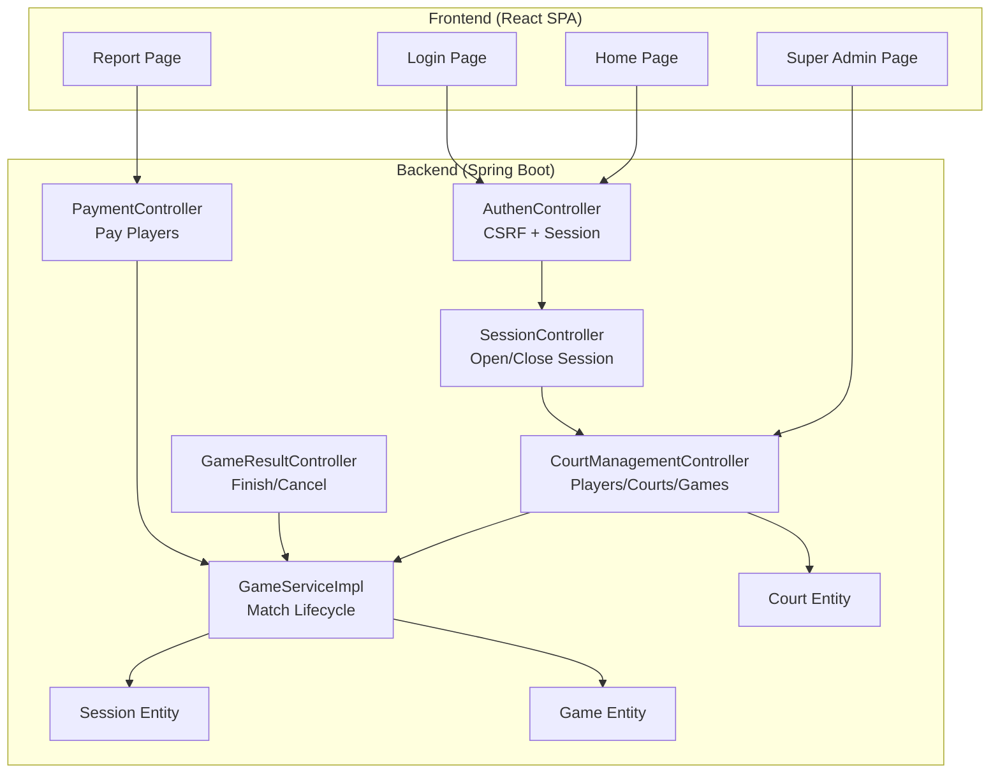
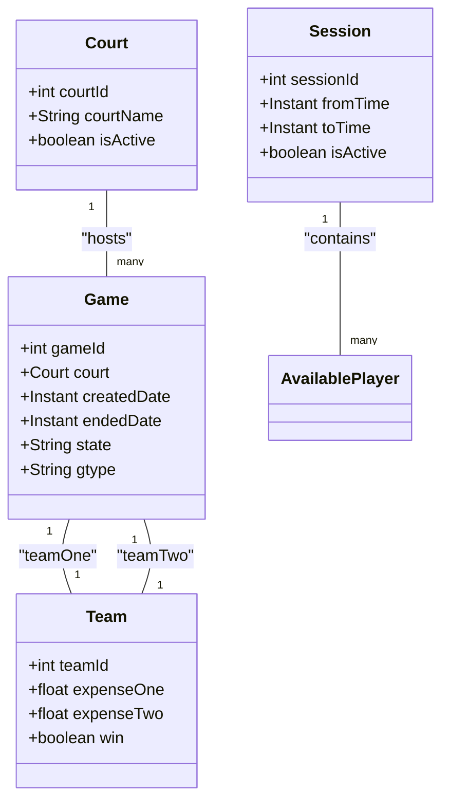
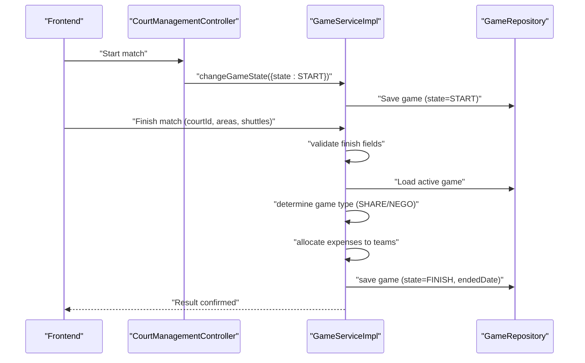
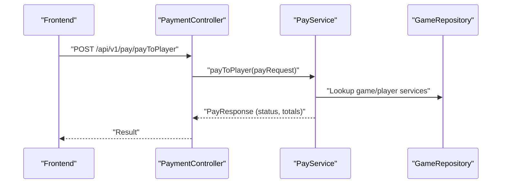
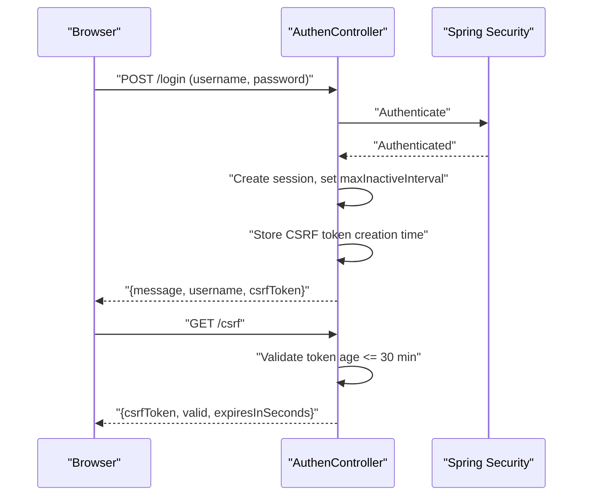
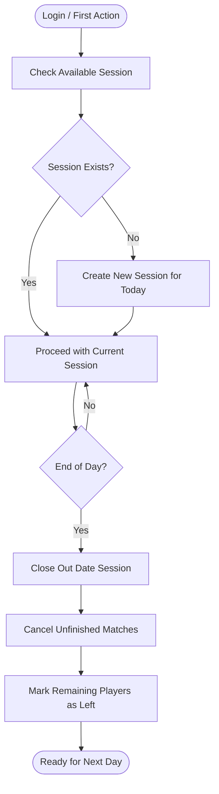
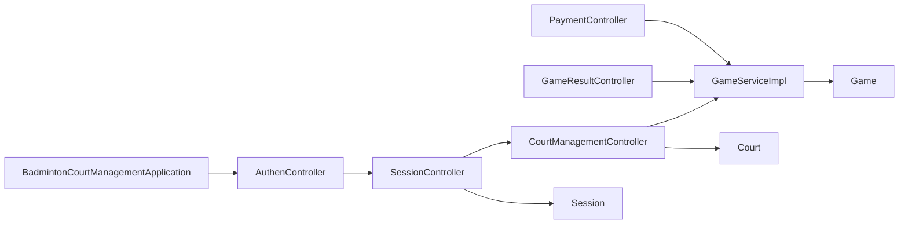

# Project Overview

<cite>
**Referenced Files in This Document**
- [README.md](file://README.md)
- [BadmintonCourtManagementApplication.java](file://BadmintonCourtManagement/src/main/java/com/badminton/BadmintonCourtManagementApplication.java)
- [AuthenController.java](file://BadmintonCourtManagement/src/main/java/com/badminton/controller/AuthenController.java)
- [SessionController.java](file://BadmintonCourtManagement/src/main/java/com/badminton/controller/SessionController.java)
- [CourtManagementController.java](file://BadmintonCourtManagement/src/main/java/com/badminton/controller/CourtManagementController.java)
- [GameResultController.java](file://BadmintonCourtManagement/src/main/java/com/badminton/controller/GameResultController.java)
- [PaymentController.java](file://BadmintonCourtManagement/src/main/java/com/badminton/controller/PaymentController.java)
- [Session.java](file://BadmintonCourtManagement/src/main/java/com/badminton/entity/Session.java)
- [Game.java](file://BadmintonCourtManagement/src/main/java/com/badminton/entity/Game.java)
- [Court.java](file://BadmintonCourtManagement/src/main/java/com/badminton/entity/Court.java)
- [GameServiceImpl.java](file://BadmintonCourtManagement/src/main/java/com/badminton/service/impl/GameServiceImpl.java)
- [application.properties](file://BadmintonCourtManagement/src/main/resources/application.properties)
- [package.json](file://bad-court-mana-ui/package.json)
</cite>

## Table of Contents
1. [Introduction](#introduction)
2. [Project Structure](#project-structure)
3. [Core Components](#core-components)
4. [Architecture Overview](#architecture-overview)
5. [Detailed Component Analysis](#detailed-component-analysis)
6. [Dependency Analysis](#dependency-analysis)
7. [Performance Considerations](#performance-considerations)
8. [Troubleshooting Guide](#troubleshooting-guide)
9. [Conclusion](#conclusion)

## Introduction
Badminton Court Management is a specialized venue operations and settlement tool designed for front-desk staff who manage daily badminton court activities. It focuses on session-centric workflows, real-time court and match state tracking, integrated consumption tracking (shuttles, drinks), per-player cost calculation, and practical Excel reporting for revenue reconciliation. The system is intentionally positioned as a floor operations tool rather than an online booking or membership platform, emphasizing live check-in, match lifecycle management, and cash-oriented payments.

Key value propositions:
- Daily session boundary ensures accurate billing and audit trails.
- Integrated court layout with drag-and-drop player assignment aligns with doubles court geography.
- Match lifecycle captures start, end, cancellation, and result confirmation with cost allocation.
- Built-in Excel export supports owner and accountant workflows.
- Classic session-based authentication with CSRF protection suited for in-venue staff.

**Section sources**
- [README.md:7-27](file://README.md#L7-L27)

## Project Structure
The project follows a monorepo-style layout with two main parts:
- Backend: Spring Boot 3.5.x application providing REST APIs, security, scheduling, and persistence.
- Frontend: React 19 SPA built with Create React App, routing, drag-and-drop, and Bootstrap 5 UI.

High-level structure:
- Backend module: BadmintonCourtManagement
  - Controllers under controller/
  - Services under service/
  - Entities under entity/
  - Repositories under repository/
  - Resources for configuration and Liquibase changelogs
- Frontend module: bad-court-mana-ui
  - Pages, dialogs, and drag-and-drop components
  - API client and authentication context
  - Theming and Bootstrap integration

Technology highlights:
- Backend runtime: Java 21, Spring Boot 3.5.x (WAR packaging), Spring Security, Spring Data JPA, MySQL, Liquibase, Apache POI for Excel export.
- Frontend: React 19, React Router v7, Axios, js-cookie, Bootstrap 5, react-beautiful-dnd, react-dnd.

**Section sources**
- [README.md:54-86](file://README.md#L54-L86)
- [package.json:1-59](file://bad-court-mana-ui/package.json#L1-L59)

## Core Components
- Authentication and session security
  - Session-based login with CSRF token validation and configurable session timeout.
  - CSRF token age enforced against a 30-minute threshold.
- Daily session management
  - Automatic session creation on first login of a new day; closing sessions handles unfinished matches and marks remaining players as left.
- Player and court management
  - Player check-in with deduplication per session; reusable player records; drag-and-drop assignment to court areas A/B vs C/D.
- Match lifecycle
  - States: Not started → In progress → Finished (with result confirmation) or Cancelled; cost allocation per player based on game type (shared or negotiated).
- Payments
  - Payment confirmation with method and timestamp; marks end of play for the person.
- Reporting
  - Monthly session listing, per-session and bulk Excel exports; paginated report APIs.

User roles:
- Court owner: configure courts, shuttle types, add-on services, and default per-player court fee.
- Administrator / cashier: manage sessions, players, courts, matches, shuttles/services, results, costs, payments, and reports.
- Internal super admin: create admin accounts and reset passwords.

Positioning:
- Front-desk operations-oriented, not online booking or membership platforms.

**Section sources**
- [README.md:31-51](file://README.md#L31-L51)
- [AuthenController.java:78-110](file://BadmintonCourtManagement/src/main/java/com/badminton/controller/AuthenController.java#L78-L110)
- [SessionController.java:23-46](file://BadmintonCourtManagement/src/main/java/com/badminton/controller/SessionController.java#L23-L46)
- [CourtManagementController.java:89-160](file://BadmintonCourtManagement/src/main/java/com/badminton/controller/CourtManagementController.java#L89-L160)
- [GameResultController.java:21-35](file://BadmintonCourtManagement/src/main/java/com/badminton/controller/GameResultController.java#L21-L35)
- [PaymentController.java:24-27](file://BadmintonCourtManagement/src/main/java/com/badminton/controller/PaymentController.java#L24-L27)

## Architecture Overview
The system is session-centric. A session represents a business day or shift boundary during which players, courts, games, and payments are tracked. The backend exposes REST endpoints grouped by functional domains (authentication, session, court management, game result, payment). The frontend is a React SPA that communicates with the backend over HTTP, using cookies for session and CSRF tokens.

**Diagram sources**
- [AuthenController.java:26-110](file://BadmintonCourtManagement/src/main/java/com/badminton/controller/AuthenController.java#L26-L110)
- [SessionController.java:16-48](file://BadmintonCourtManagement/src/main/java/com/badminton/controller/SessionController.java#L16-L48)
- [CourtManagementController.java:24-163](file://BadmintonCourtManagement/src/main/java/com/badminton/controller/CourtManagementController.java#L24-L163)
- [GameResultController.java:14-42](file://BadmintonCourtManagement/src/main/java/com/badminton/controller/GameResultController.java#L14-L42)
- [PaymentController.java:17-28](file://BadmintonCourtManagement/src/main/java/com/badminton/controller/PaymentController.java#L17-L28)
- [GameServiceImpl.java:36-366](file://BadmintonCourtManagement/src/main/java/com/badminton/service/impl/GameServiceImpl.java#L36-L366)
- [Session.java:17-41](file://BadmintonCourtManagement/src/main/java/com/badminton/entity/Session.java#L17-L41)
- [Game.java:13-79](file://BadmintonCourtManagement/src/main/java/com/badminton/entity/Game.java#L13-L79)
- [Court.java:11-42](file://BadmintonCourtManagement/src/main/java/com/badminton/entity/Court.java#L11-L42)

## Detailed Component Analysis

### Session-Centric Domain Model
The session is the central business boundary. It tracks availability of players and encapsulates all activity for a given day/shift. Games are associated with courts and teams, and expenses are calculated per match outcome and game type.

**Diagram sources**
- [Session.java:22-41](file://BadmintonCourtManagement/src/main/java/com/badminton/entity/Session.java#L22-L41)
- [Court.java:16-42](file://BadmintonCourtManagement/src/main/java/com/badminton/entity/Court.java#L16-L42)
- [Game.java:18-79](file://BadmintonCourtManagement/src/main/java/com/badminton/entity/Game.java#L18-L79)

**Section sources**
- [Session.java:22-41](file://BadmintonCourtManagement/src/main/java/com/badminton/entity/Session.java#L22-L41)
- [Game.java:18-79](file://BadmintonCourtManagement/src/main/java/com/badminton/entity/Game.java#L18-L79)
- [Court.java:16-42](file://BadmintonCourtManagement/src/main/java/com/badminton/entity/Court.java#L16-L42)

### Match Lifecycle and Cost Allocation
The match lifecycle spans from check-in to result confirmation and payment. The service validates that a match has started (each team has at least one player), supports finishing with winner selection and cost allocation, and handles cancellations.

**Diagram sources**
- [CourtManagementController.java:145-153](file://BadmintonCourtManagement/src/main/java/com/badminton/controller/CourtManagementController.java#L145-L153)
- [GameResultController.java:27-35](file://BadmintonCourtManagement/src/main/java/com/badminton/controller/GameResultController.java#L27-L35)
- [GameServiceImpl.java:83-116](file://BadmintonCourtManagement/src/main/java/com/badminton/service/impl/GameServiceImpl.java#L83-L116)

**Section sources**
- [GameServiceImpl.java:83-116](file://BadmintonCourtManagement/src/main/java/com/badminton/service/impl/GameServiceImpl.java#L83-L116)
- [GameResultController.java:21-35](file://BadmintonCourtManagement/src/main/java/com/badminton/controller/GameResultController.java#L21-L35)

### Payment Processing Flow
Payments are processed per player at the end of their session time. The endpoint confirms totals, payment method/status, and timestamps, marking the end of play for that person.

**Diagram sources**
- [PaymentController.java:24-27](file://BadmintonCourtManagement/src/main/java/com/badminton/controller/PaymentController.java#L24-L27)
- [GameServiceImpl.java:366-366](file://BadmintonCourtManagement/src/main/java/com/badminton/service/impl/GameServiceImpl.java#L366-L366)

**Section sources**
- [PaymentController.java:24-27](file://BadmintonCourtManagement/src/main/java/com/badminton/controller/PaymentController.java#L24-L27)

### Authentication and CSRF Token Lifecycle
The authentication flow establishes a session with a CSRF token and enforces token age limits aligned with the documented 30-minute session behavior.

**Diagram sources**
- [AuthenController.java:78-110](file://BadmintonCourtManagement/src/main/java/com/badminton/controller/AuthenController.java#L78-L110)
- [application.properties:15-17](file://BadmintonCourtManagement/src/main/resources/application.properties#L15-L17)

**Section sources**
- [AuthenController.java:78-110](file://BadmintonCourtManagement/src/main/java/com/badminton/controller/AuthenController.java#L78-L110)
- [application.properties:15-17](file://BadmintonCourtManagement/src/main/resources/application.properties#L15-L17)

### Daily Session Boundary and Close-Out
Sessions automatically close out dated sessions, canceling unfinished matches and marking remaining players as left. This ensures clean accounting and prevents cross-day billing.

**Diagram sources**
- [SessionController.java:23-46](file://BadmintonCourtManagement/src/main/java/com/badminton/controller/SessionController.java#L23-L46)

**Section sources**
- [SessionController.java:23-46](file://BadmintonCourtManagement/src/main/java/com/badminton/controller/SessionController.java#L23-L46)

## Dependency Analysis
- Backend entry point enables scheduling and bootstraps the application.
- Controllers depend on services for business logic; services depend on repositories and calculators/utilities.
- Entities define relationships among session, court, and game, with cascading operations for child entities.
- Frontend depends on React Router for navigation, Axios for HTTP, and Bootstrap for UI components.

**Diagram sources**
- [BadmintonCourtManagementApplication.java:7-15](file://BadmintonCourtManagement/src/main/java/com/badminton/BadmintonCourtManagementApplication.java#L7-L15)
- [AuthenController.java:26-110](file://BadmintonCourtManagement/src/main/java/com/badminton/controller/AuthenController.java#L26-L110)
- [SessionController.java:16-48](file://BadmintonCourtManagement/src/main/java/com/badminton/controller/SessionController.java#L16-L48)
- [CourtManagementController.java:24-163](file://BadmintonCourtManagement/src/main/java/com/badminton/controller/CourtManagementController.java#L24-L163)
- [GameResultController.java:14-42](file://BadmintonCourtManagement/src/main/java/com/badminton/controller/GameResultController.java#L14-L42)
- [PaymentController.java:17-28](file://BadmintonCourtManagement/src/main/java/com/badminton/controller/PaymentController.java#L17-L28)
- [GameServiceImpl.java:36-366](file://BadmintonCourtManagement/src/main/java/com/badminton/service/impl/GameServiceImpl.java#L36-L366)
- [Session.java:17-41](file://BadmintonCourtManagement/src/main/java/com/badminton/entity/Session.java#L17-L41)
- [Game.java:13-79](file://BadmintonCourtManagement/src/main/java/com/badminton/entity/Game.java#L13-L79)
- [Court.java:11-42](file://BadmintonCourtManagement/src/main/java/com/badminton/entity/Court.java#L11-L42)

**Section sources**
- [BadmintonCourtManagementApplication.java:7-15](file://BadmintonCourtManagement/src/main/java/com/badminton/BadmintonCourtManagementApplication.java#L7-L15)
- [GameServiceImpl.java:36-366](file://BadmintonCourtManagement/src/main/java/com/badminton/service/impl/GameServiceImpl.java#L36-L366)

## Performance Considerations
- Session boundary reduces cross-day data contention and simplifies reporting.
- Drag-and-drop and real-time updates in the UI should be optimized for large player lists.
- CSV/Excel exports can be large; streaming downloads improve responsiveness for bulk exports.
- Database queries for active games and available players should leverage indexes on session and state fields.

[No sources needed since this section provides general guidance]

## Troubleshooting Guide
Common issues and checks:
- Session timeout and CSRF token expiration
  - Verify session timeout alignment with documented 30-minute limit.
  - Ensure CSRF token is refreshed before expiration.
- Payment confirmation errors
  - Validate that the match is in a finishable state and that totals reconcile.
- Player duplication or missing check-in
  - Confirm player uniqueness per session and that matches are started only when each team has at least one player.

**Section sources**
- [application.properties:15-17](file://BadmintonCourtManagement/src/main/resources/application.properties#L15-L17)
- [GameServiceImpl.java:293-304](file://BadmintonCourtManagement/src/main/java/com/badminton/service/impl/GameServiceImpl.java#L293-L304)

## Conclusion
Badminton Court Management delivers a focused, session-centric solution for front-desk operations in badminton venues. Its combination of live court state, integrated consumption tracking, match lifecycle management, and practical Excel reporting makes it ideal for daily operations rather than online booking or membership systems. The monorepo architecture cleanly separates concerns between a Spring Boot backend and a React frontend, enabling efficient collaboration and deployment.

[No sources needed since this section summarizes without analyzing specific files]