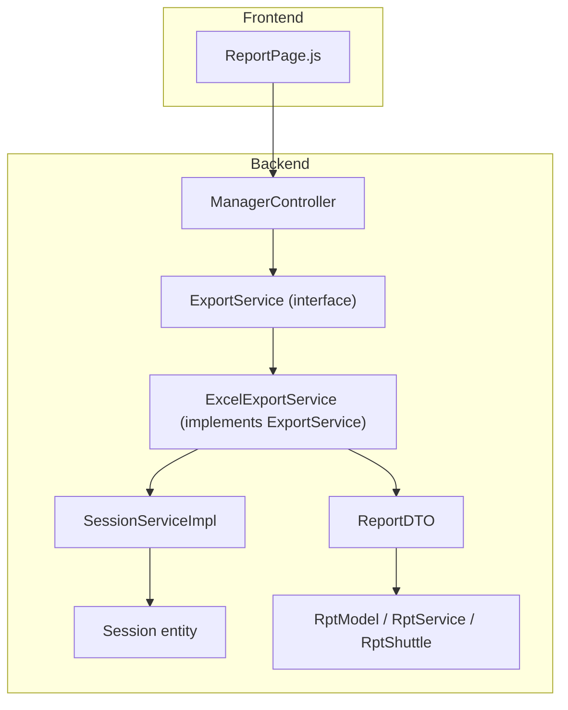
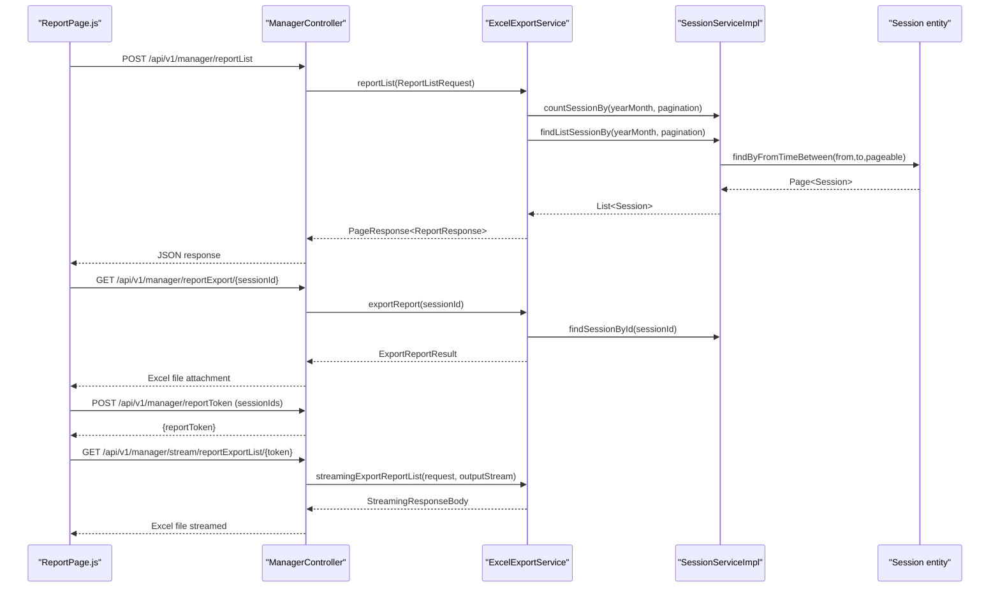
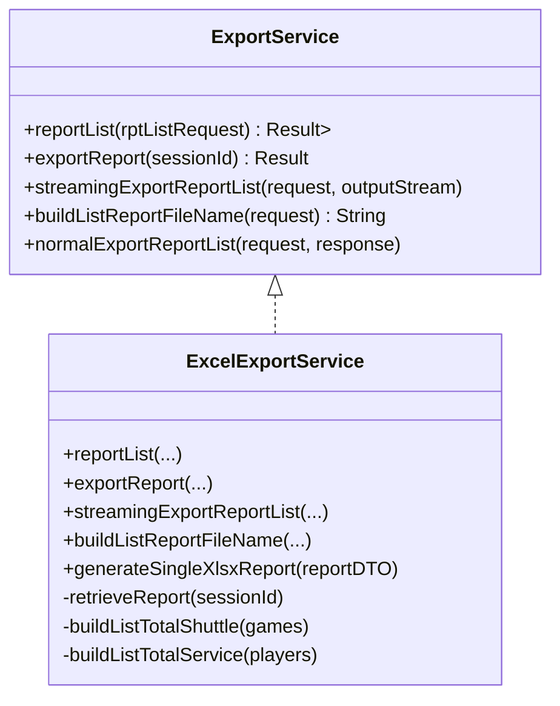
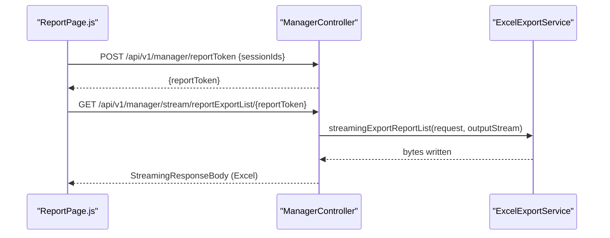
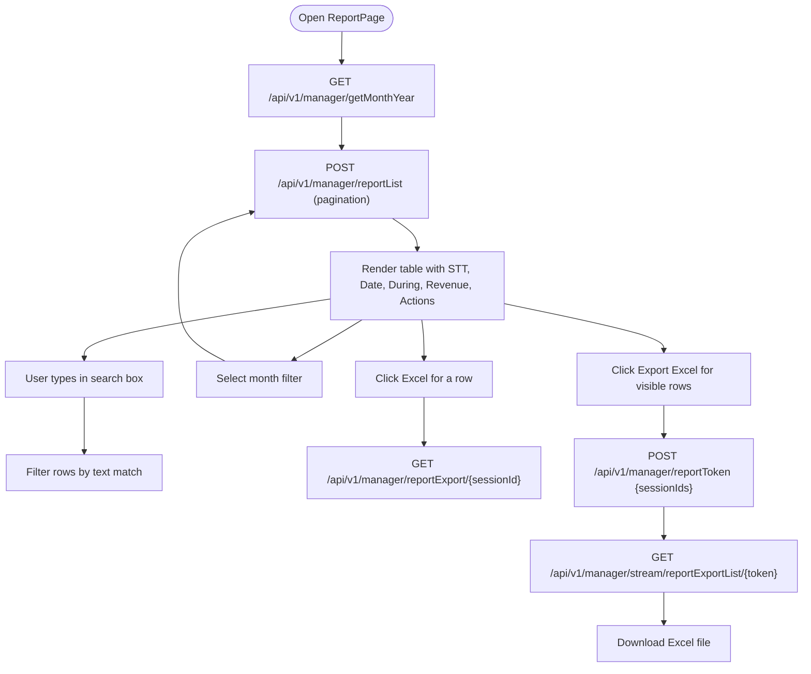
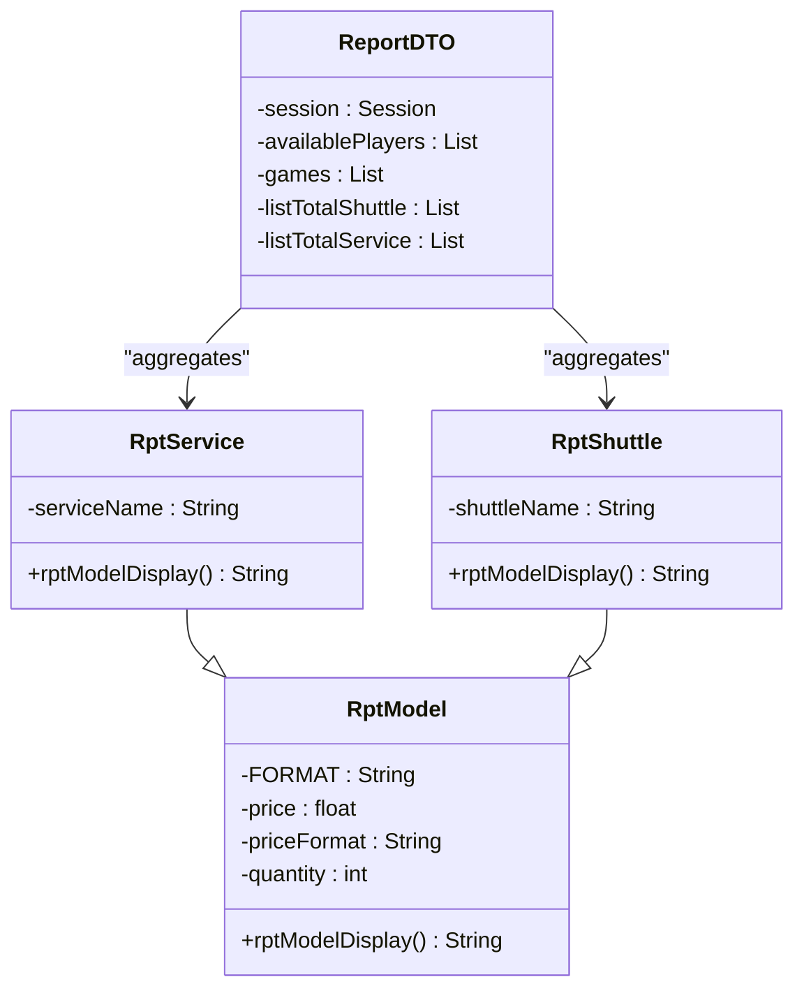
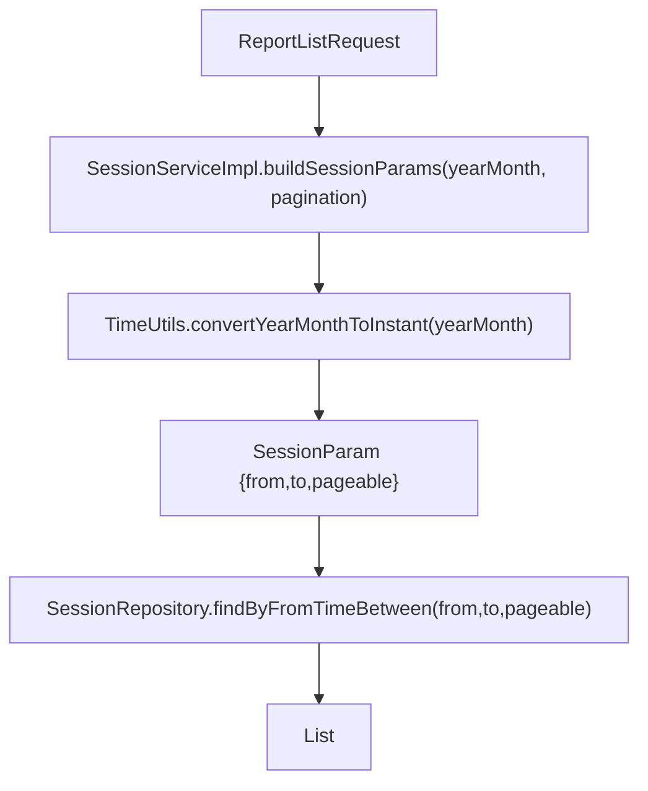
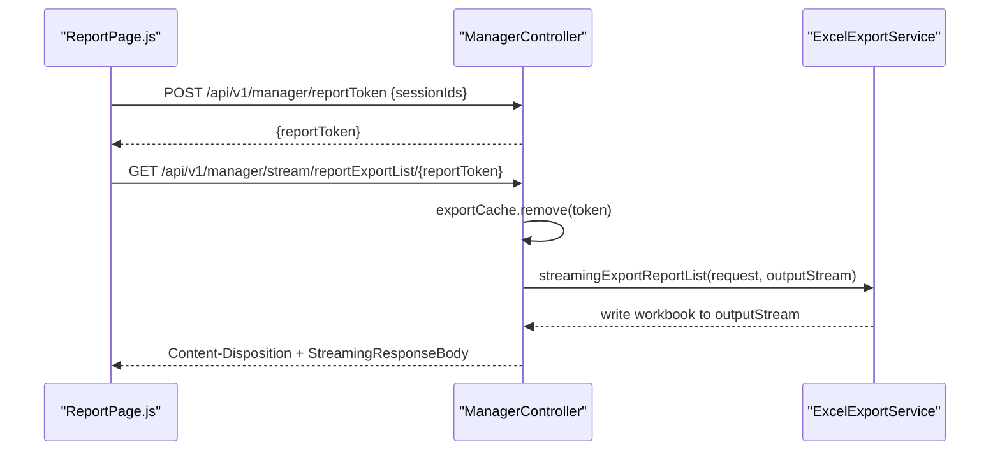
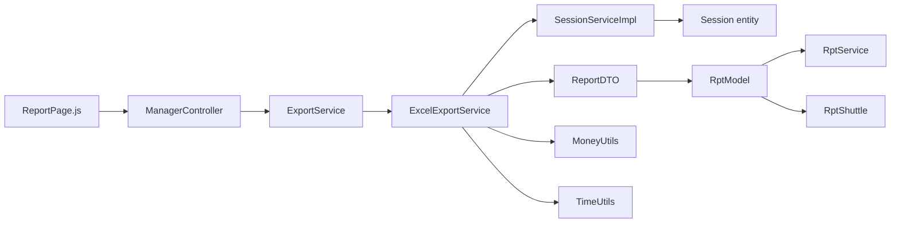

# Reporting & Analytics

<cite>
**Referenced Files in This Document**
- [ExcelExportService.java](file://BadmintonCourtManagement/src/main/java/com/badminton/service/impl/ExcelExportService.java)
- [ExportService.java](file://BadmintonCourtManagement/src/main/java/com/badminton/service/ExportService.java)
- [ManagerController.java](file://BadmintonCourtManagement/src/main/java/com/badminton/controller/ManagerController.java)
- [ReportPage.js](file://bad-court-mana-ui/src/page/ReportPage.js)
- [RptService.java](file://BadmintonCourtManagement/src/main/java/com/badminton/model/report/RptService.java)
- [RptShuttle.java](file://BadmintonCourtManagement/src/main/java/com/badminton/model/report/RptShuttle.java)
- [RptModel.java](file://BadmintonCourtManagement/src/main/java/com/badminton/model/report/RptModel.java)
- [ReportDTO.java](file://BadmintonCourtManagement/src/main/java/com/badminton/model/report/ReportDTO.java)
- [ExportReportResult.java](file://BadmintonCourtManagement/src/main/java/com/badminton/model/report/ExportReportResult.java)
- [ReportListRequest.java](file://BadmintonCourtManagement/src/main/java/com/badminton/requestmodel/ReportListRequest.java)
- [ExportReportRequest.java](file://BadmintonCourtManagement/src/main/java/com/badminton/requestmodel/ExportReportRequest.java)
- [Pagination.java](file://BadmintonCourtManagement/src/main/java/com/badminton/requestmodel/Pagination.java)
- [ReportResponse.java](file://BadmintonCourtManagement/src/main/java/com/badminton/response/ReportResponse.java)
- [SessionServiceImpl.java](file://BadmintonCourtManagement/src/main/java/com/badminton/service/SessionServiceImpl.java)
- [Session.java](file://BadmintonCourtManagement/src/main/java/com/badminton/entity/Session.java)
- [SessionParam.java](file://BadmintonCourtManagement/src/main/java/com/badminton/repository/filter/SessionParam.java)
- [MoneyUtils.java](file://BadmintonCourtManagement/src/main/java/com/badminton/util/MoneyUtils.java)
- [TimeUtils.java](file://BadmintonCourtManagement/src/main/java/com/badminton/util/TimeUtils.java)
</cite>

## Table of Contents
1. [Introduction](#introduction)
2. [Project Structure](#project-structure)
3. [Core Components](#core-components)
4. [Architecture Overview](#architecture-overview)
5. [Detailed Component Analysis](#detailed-component-analysis)
6. [Dependency Analysis](#dependency-analysis)
7. [Performance Considerations](#performance-considerations)
8. [Troubleshooting Guide](#troubleshooting-guide)
9. [Conclusion](#conclusion)
10. [Appendices](#appendices)

## Introduction
This document describes the Reporting and Analytics system for session-based reporting, revenue tracking, and Excel export functionality. It covers the ExportService implementation, ExcelExportService for data export, and report generation workflows. It also documents the RptService and RptShuttle models for structured reporting data, pagination support for report listings, and filtering capabilities by date ranges and session codes. The ReportPage frontend component, report customization options, and bulk export functionality are explained, along with the streaming download mechanism for large exports, report data aggregation, and audit-friendly export formats. Typical report types (session revenue, monthly summaries, service usage), supported export formats (Excel), and integration with the manager controller for report retrieval are included, alongside practical examples of reporting scenarios and data analysis workflows.

## Project Structure
The Reporting and Analytics system spans backend Java services and a React frontend UI:
- Backend services implement report listing, single session export, and bulk streaming export.
- Frontend provides a report listing page with search, pagination, month filtering, and export actions.
- Shared models define report DTOs, aggregated totals, and export results.

**Diagram sources**
- [ManagerController.java:44-73](file://BadmintonCourtManagement/src/main/java/com/badminton/controller/ManagerController.java#L44-L73)
- [ExportService.java:14-24](file://BadmintonCourtManagement/src/main/java/com/badminton/service/ExportService.java#L14-L24)
- [ExcelExportService.java:60-172](file://BadmintonCourtManagement/src/main/java/com/badminton/service/impl/ExcelExportService.java#L60-L172)
- [SessionServiceImpl.java:154-187](file://BadmintonCourtManagement/src/main/java/com/badminton/service/SessionServiceImpl.java#L154-L187)
- [Session.java:22-41](file://BadmintonCourtManagement/src/main/java/com/badminton/entity/Session.java#L22-L41)
- [ReportDTO.java:17-30](file://BadmintonCourtManagement/src/main/java/com/badminton/model/report/ReportDTO.java#L17-L30)
- [RptModel.java:10-18](file://BadmintonCourtManagement/src/main/java/com/badminton/model/report/RptModel.java#L10-L18)
- [RptService.java:6-13](file://BadmintonCourtManagement/src/main/java/com/badminton/model/report/RptService.java#L6-L13)
- [RptShuttle.java:6-14](file://BadmintonCourtManagement/src/main/java/com/badminton/model/report/RptShuttle.java#L6-L14)

**Section sources**
- [ManagerController.java:44-73](file://BadmintonCourtManagement/src/main/java/com/badminton/controller/ManagerController.java#L44-L73)
- [ExcelExportService.java:60-172](file://BadmintonCourtManagement/src/main/java/com/badminton/service/impl/ExcelExportService.java#L60-L172)
- [ReportPage.js:21-83](file://bad-court-mana-ui/src/page/ReportPage.js#L21-L83)

## Core Components
- ExportService: Defines report listing, single export, bulk streaming export, and file naming.
- ExcelExportService: Implements report generation, aggregation, and Excel export (single and bulk streaming).
- ManagerController: Exposes REST endpoints for report listing, single export, and streaming bulk export.
- ReportPage: Frontend UI for listing sessions, filtering, sorting, pagination, and exporting.
- Report models: RptModel, RptService, RptShuttle encapsulate aggregated totals; ReportDTO aggregates session data.
- Pagination and filtering: ReportListRequest supports year/month filtering and pagination; SessionServiceImpl applies filters and pagination.

**Section sources**
- [ExportService.java:14-24](file://BadmintonCourtManagement/src/main/java/com/badminton/service/ExportService.java#L14-L24)
- [ExcelExportService.java:60-172](file://BadmintonCourtManagement/src/main/java/com/badminton/service/impl/ExcelExportService.java#L60-L172)
- [ManagerController.java:44-73](file://BadmintonCourtManagement/src/main/java/com/badminton/controller/ManagerController.java#L44-L73)
- [ReportPage.js:21-83](file://bad-court-mana-ui/src/page/ReportPage.js#L21-L83)
- [RptModel.java:10-18](file://BadmintonCourtManagement/src/main/java/com/badminton/model/report/RptModel.java#L10-L18)
- [RptService.java:6-13](file://BadmintonCourtManagement/src/main/java/com/badminton/model/report/RptService.java#L6-L13)
- [RptShuttle.java:6-14](file://BadmintonCourtManagement/src/main/java/com/badminton/model/report/RptShuttle.java#L6-L14)
- [ReportDTO.java:17-30](file://BadmintonCourtManagement/src/main/java/com/badminton/model/report/ReportDTO.java#L17-L30)
- [ReportListRequest.java:6-12](file://BadmintonCourtManagement/src/main/java/com/badminton/requestmodel/ReportListRequest.java#L6-L12)
- [SessionServiceImpl.java:154-187](file://BadmintonCourtManagement/src/main/java/com/badminton/service/SessionServiceImpl.java#L154-L187)

## Architecture Overview
The system follows a layered architecture:
- Presentation: ReportPage UI handles user interactions and requests.
- Controller: ManagerController exposes endpoints for report listing, single export, and streaming bulk export.
- Service: ExcelExportService orchestrates report retrieval, aggregation, and Excel generation.
- Persistence: SessionServiceImpl retrieves sessions by date range and pagination; repositories supply data.
- Models: ReportDTO and Rpt* models represent report data and aggregated totals.

**Diagram sources**
- [ManagerController.java:44-73](file://BadmintonCourtManagement/src/main/java/com/badminton/controller/ManagerController.java#L44-L73)
- [ExcelExportService.java:115-172](file://BadmintonCourtManagement/src/main/java/com/badminton/service/impl/ExcelExportService.java#L115-L172)
- [SessionServiceImpl.java:154-187](file://BadmintonCourtManagement/src/main/java/com/badminton/service/SessionServiceImpl.java#L154-L187)
- [Session.java:22-41](file://BadmintonCourtManagement/src/main/java/com/badminton/entity/Session.java#L22-L41)

## Detailed Component Analysis

### ExportService and ExcelExportService
ExcelExportService implements ExportService and provides:
- Report listing with pagination and month filtering.
- Single session export to Excel with a generated filename.
- Bulk streaming export to Excel with aggregated totals and auto-filtered tables.
- Aggregation of shuttles and services per session and across sessions.
- Audit-friendly headers and column alignment for readability.

Key behaviors:
- reportList validates pagination, counts sessions, paginates, and converts to ReportResponse.
- exportReport builds a ByteArrayResource with a filename derived from session date and duration.
- streamingExportReportList writes a multi-session summary header, aggregates totals, and streams the response.
- buildListReportFileName derives a filename from the first and last session dates in the batch.

**Diagram sources**
- [ExportService.java:14-24](file://BadmintonCourtManagement/src/main/java/com/badminton/service/ExportService.java#L14-L24)
- [ExcelExportService.java:60-172](file://BadmintonCourtManagement/src/main/java/com/badminton/service/impl/ExcelExportService.java#L60-L172)

**Section sources**
- [ExportService.java:14-24](file://BadmintonCourtManagement/src/main/java/com/badminton/service/ExportService.java#L14-L24)
- [ExcelExportService.java:115-172](file://BadmintonCourtManagement/src/main/java/com/badminton/service/impl/ExcelExportService.java#L115-L172)
- [ExcelExportService.java:183-229](file://BadmintonCourtManagement/src/main/java/com/badminton/service/impl/ExcelExportService.java#L183-L229)
- [ExcelExportService.java:344-408](file://BadmintonCourtManagement/src/main/java/com/badminton/service/impl/ExcelExportService.java#L344-L408)

### ManagerController Integration
ManagerController exposes:
- POST /api/v1/manager/reportList for paginated report listing.
- GET /api/v1/manager/reportExport/{sessionId} for single session export.
- GET /api/v1/manager/stream/reportExportList/{token} for bulk streaming export via a temporary token.
- GET /api/v1/manager/getMonthYear for month/year options.
- POST /api/v1/manager/reportToken to issue a token for bulk export.
- GET /api/v1/manager/download/{token} for a ZIP download example (not used for Excel exports).

**Diagram sources**
- [ManagerController.java:82-89](file://BadmintonCourtManagement/src/main/java/com/badminton/controller/ManagerController.java#L82-L89)
- [ManagerController.java:55-73](file://BadmintonCourtManagement/src/main/java/com/badminton/controller/ManagerController.java#L55-L73)

**Section sources**
- [ManagerController.java:44-73](file://BadmintonCourtManagement/src/main/java/com/badminton/controller/ManagerController.java#L44-L73)
- [ManagerController.java:82-89](file://BadmintonCourtManagement/src/main/java/com/badminton/controller/ManagerController.java#L82-L89)

### ReportPage Frontend
ReportPage provides:
- Fetching report listings with pagination and page size selection.
- Filtering by text across date, duration, and revenue fields.
- Sorting by date, time range, and total revenue.
- Export per session and bulk export via tokenized streaming endpoint.
- Month/year filtering using options retrieved from the backend.

**Diagram sources**
- [ReportPage.js:52-60](file://bad-court-mana-ui/src/page/ReportPage.js#L52-L60)
- [ReportPage.js:62-83](file://bad-court-mana-ui/src/page/ReportPage.js#L62-L83)
- [ReportPage.js:114-139](file://bad-court-mana-ui/src/page/ReportPage.js#L114-L139)
- [ReportPage.js:141-154](file://bad-court-mana-ui/src/page/ReportPage.js#L141-L154)

**Section sources**
- [ReportPage.js:21-83](file://bad-court-mana-ui/src/page/ReportPage.js#L21-L83)
- [ReportPage.js:114-154](file://bad-court-mana-ui/src/page/ReportPage.js#L114-L154)

### Report Models and Aggregation
RptModel defines a base for aggregated items with price, formatted price, and quantity. RptService and RptShuttle extend it to represent service and shuttle totals respectively. ReportDTO aggregates session data, including available players, games, and computed totals.

Aggregation logic:
- Shuttle totals: Sum quantities across games grouped by shuttle name.
- Service totals: Count occurrences of non-cash-in-person services per player.
- Revenue totals: Sum pay amounts across available players.

**Diagram sources**
- [RptModel.java:10-18](file://BadmintonCourtManagement/src/main/java/com/badminton/model/report/RptModel.java#L10-L18)
- [RptService.java:6-13](file://BadmintonCourtManagement/src/main/java/com/badminton/model/report/RptService.java#L6-L13)
- [RptShuttle.java:6-14](file://BadmintonCourtManagement/src/main/java/com/badminton/model/report/RptShuttle.java#L6-L14)
- [ReportDTO.java:17-30](file://BadmintonCourtManagement/src/main/java/com/badminton/model/report/ReportDTO.java#L17-L30)

**Section sources**
- [RptModel.java:10-18](file://BadmintonCourtManagement/src/main/java/com/badminton/model/report/RptModel.java#L10-L18)
- [RptService.java:6-13](file://BadmintonCourtManagement/src/main/java/com/badminton/model/report/RptService.java#L6-L13)
- [RptShuttle.java:6-14](file://BadmintonCourtManagement/src/main/java/com/badminton/model/report/RptShuttle.java#L6-L14)
- [ReportDTO.java:17-30](file://BadmintonCourtManagement/src/main/java/com/badminton/model/report/ReportDTO.java#L17-L30)
- [ExcelExportService.java:648-712](file://BadmintonCourtManagement/src/main/java/com/badminton/service/impl/ExcelExportService.java#L648-L712)

### Pagination and Filtering
ReportListRequest supports:
- yearMonth for month/year filtering.
- pagination with current page and page size.
- Additional fields date and fromToDate (unused in current implementation).

SessionServiceImpl applies:
- Year/month conversion to Instant range.
- Pageable construction from pagination.
- Repository query by date range with descending order by fromTime.

**Diagram sources**
- [ReportListRequest.java:6-12](file://BadmintonCourtManagement/src/main/java/com/badminton/requestmodel/ReportListRequest.java#L6-L12)
- [SessionServiceImpl.java:177-183](file://BadmintonCourtManagement/src/main/java/com/badminton/service/SessionServiceImpl.java#L177-L183)
- [TimeUtils.java:54-75](file://BadmintonCourtManagement/src/main/java/com/badminton/util/TimeUtils.java#L54-L75)
- [SessionParam.java:9-13](file://BadmintonCourtManagement/src/main/java/com/badminton/repository/filter/SessionParam.java#L9-L13)

**Section sources**
- [ReportListRequest.java:6-12](file://BadmintonCourtManagement/src/main/java/com/badminton/requestmodel/ReportListRequest.java#L6-L12)
- [SessionServiceImpl.java:154-187](file://BadmintonCourtManagement/src/main/java/com/badminton/service/SessionServiceImpl.java#L154-L187)
- [TimeUtils.java:54-75](file://BadmintonCourtManagement/src/main/java/com/badminton/util/TimeUtils.java#L54-L75)
- [SessionParam.java:9-13](file://BadmintonCourtManagement/src/main/java/com/badminton/repository/filter/SessionParam.java#L9-L13)

### Streaming Download Mechanism
Bulk export uses a tokenized streaming approach:
- Frontend posts selected session IDs to obtain a reportToken.
- Frontend navigates to a streaming endpoint with the token.
- Backend removes the token from cache and streams Excel bytes to the client.
- ExcelExportService writes headers, tables, auto-filter regions, and disposes the workbook.

**Diagram sources**
- [ManagerController.java:82-89](file://BadmintonCourtManagement/src/main/java/com/badminton/controller/ManagerController.java#L82-L89)
- [ManagerController.java:55-73](file://BadmintonCourtManagement/src/main/java/com/badminton/controller/ManagerController.java#L55-L73)
- [ExcelExportService.java:183-229](file://BadmintonCourtManagement/src/main/java/com/badminton/service/impl/ExcelExportService.java#L183-L229)

**Section sources**
- [ManagerController.java:55-73](file://BadmintonCourtManagement/src/main/java/com/badminton/controller/ManagerController.java#L55-L73)
- [ExcelExportService.java:183-229](file://BadmintonCourtManagement/src/main/java/com/badminton/service/impl/ExcelExportService.java#L183-L229)

### Report Types and Data Analysis Workflows
Typical report types:
- Session revenue: Per-session total payments and breakdown by player.
- Monthly summaries: Aggregated shuttle usage and service counts across sessions in a month.
- Service usage: Totals for non-cash-in-person services across players.

Data analysis workflows:
- Filter sessions by month/year, paginate, and render a summary table with revenue totals.
- Export a single session for detailed analysis.
- Bulk export multiple sessions to analyze trends across days or weeks.

[No sources needed since this section provides general guidance]

## Dependency Analysis
The following diagram highlights key dependencies among components:

**Diagram sources**
- [ManagerController.java:44-73](file://BadmintonCourtManagement/src/main/java/com/badminton/controller/ManagerController.java#L44-L73)
- [ExcelExportService.java:60-172](file://BadmintonCourtManagement/src/main/java/com/badminton/service/impl/ExcelExportService.java#L60-L172)
- [SessionServiceImpl.java:154-187](file://BadmintonCourtManagement/src/main/java/com/badminton/service/SessionServiceImpl.java#L154-L187)
- [Session.java:22-41](file://BadmintonCourtManagement/src/main/java/com/badminton/entity/Session.java#L22-L41)
- [ReportDTO.java:17-30](file://BadmintonCourtManagement/src/main/java/com/badminton/model/report/ReportDTO.java#L17-L30)
- [RptModel.java:10-18](file://BadmintonCourtManagement/src/main/java/com/badminton/model/report/RptModel.java#L10-L18)
- [RptService.java:6-13](file://BadmintonCourtManagement/src/main/java/com/badminton/model/report/RptService.java#L6-L13)
- [RptShuttle.java:6-14](file://BadmintonCourtManagement/src/main/java/com/badminton/model/report/RptShuttle.java#L6-L14)
- [MoneyUtils.java:6-26](file://BadmintonCourtManagement/src/main/java/com/badminton/util/MoneyUtils.java#L6-L26)
- [TimeUtils.java:14-179](file://BadmintonCourtManagement/src/main/java/com/badminton/util/TimeUtils.java#L14-L179)

**Section sources**
- [ExcelExportService.java:60-172](file://BadmintonCourtManagement/src/main/java/com/badminton/service/impl/ExcelExportService.java#L60-L172)
- [SessionServiceImpl.java:154-187](file://BadmintonCourtManagement/src/main/java/com/badminton/service/SessionServiceImpl.java#L154-L187)

## Performance Considerations
- Streaming bulk exports: ExcelExportService uses SXSSFWorkbook to avoid memory spikes by disabling automatic row flushing and disposing the workbook after writing.
- Aggregation efficiency: Uses LinkedHashMap and merge operations to aggregate totals in O(n) passes over collections.
- Pagination: Backend enforces minimum page size and current page normalization to prevent excessive small pages.
- Currency formatting: MoneyUtils provides localized formatting to reduce repeated formatting overhead.

[No sources needed since this section provides general guidance]

## Troubleshooting Guide
Common issues and resolutions:
- Blank or missing session IDs: ExportService.preProcess asserts non-blank session IDs; ensure the frontend passes valid IDs.
- Pagination anomalies: validatePagination sets defaults for current and page size; verify frontend sends correct pagination values.
- Export errors: generateSingleXlsxReport wraps IO exceptions into BusinessException; check logs for export failures.
- Streaming timeouts: ensure the frontend maintains the token and triggers the streaming endpoint promptly.
- Missing totals: verify that games and services are populated for sessions; otherwise, totals may be zero.

**Section sources**
- [ExcelExportService.java:159-162](file://BadmintonCourtManagement/src/main/java/com/badminton/service/impl/ExcelExportService.java#L159-L162)
- [ExcelExportService.java:620-629](file://BadmintonCourtManagement/src/main/java/com/badminton/service/impl/ExcelExportService.java#L620-L629)
- [ExcelExportService.java:405-407](file://BadmintonCourtManagement/src/main/java/com/badminton/service/impl/ExcelExportService.java#L405-L407)

## Conclusion
The Reporting and Analytics system provides robust session-based reporting, revenue tracking, and Excel export capabilities. It supports single and bulk exports, streaming downloads for large datasets, and audit-friendly formats with auto-filtered tables. The frontend offers intuitive filtering, sorting, and pagination, while the backend ensures efficient data retrieval, aggregation, and export generation.

[No sources needed since this section summarizes without analyzing specific files]

## Appendices

### Supported Export Formats
- Excel (.xlsx): Generated via Apache POI, supporting single session and bulk streaming exports.

[No sources needed since this section provides general guidance]

### Typical Reporting Scenarios
- Daily revenue review: Filter by date, paginate, and export a single session for reconciliation.
- Monthly trend analysis: Filter by month/year, bulk export visible rows, and analyze shuttle and service usage.
- Audit export: Use streaming export to produce consolidated reports for compliance review.

[No sources needed since this section provides general guidance]