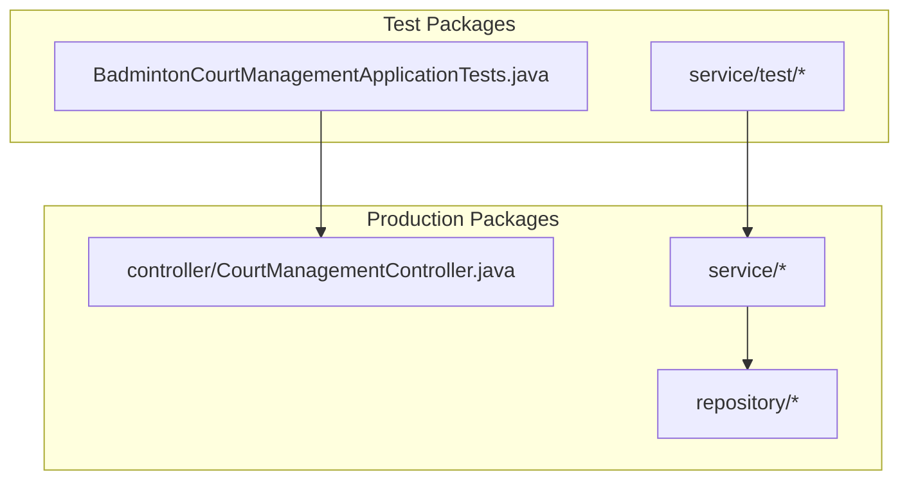
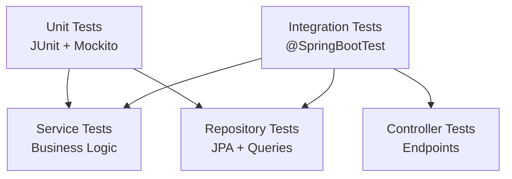
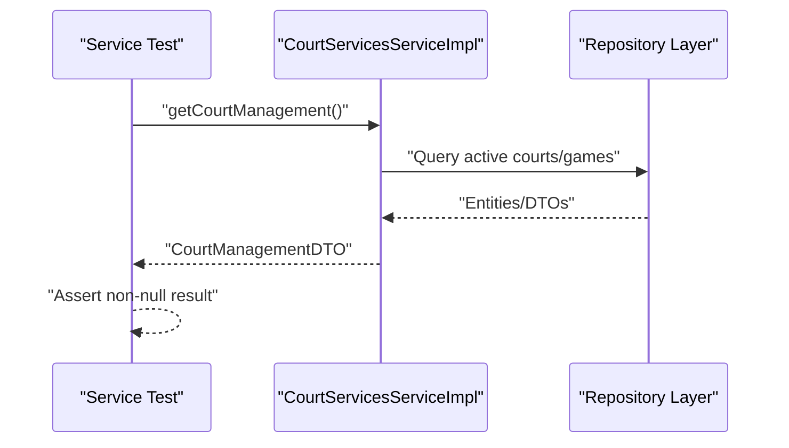
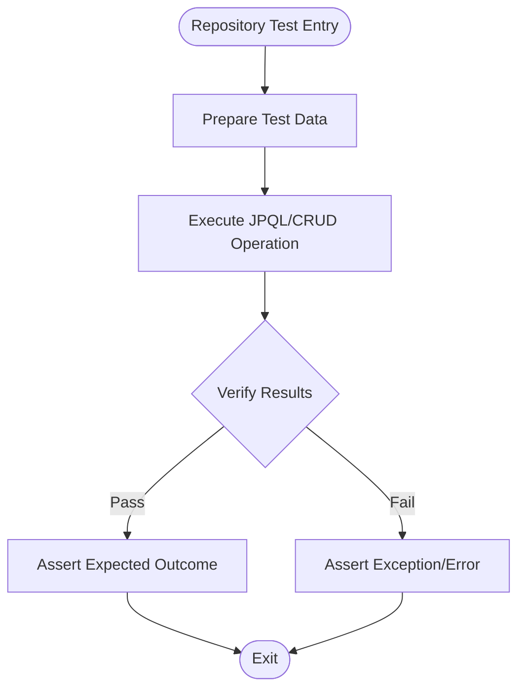
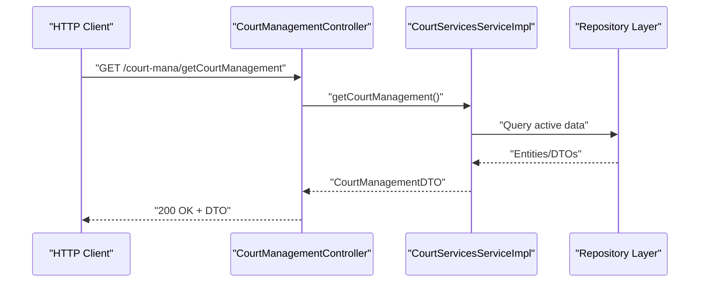
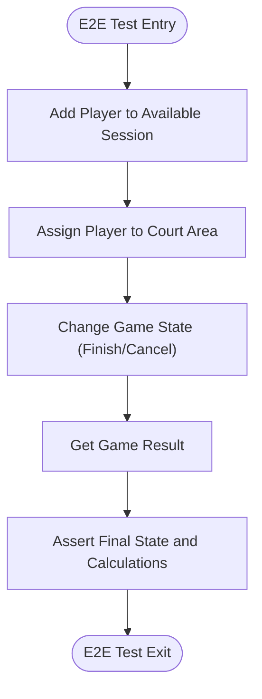
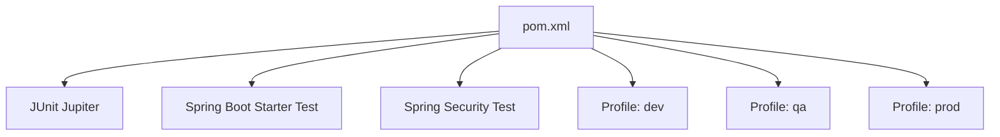

# Testing Strategy

<cite>
**Referenced Files in This Document**
- [pom.xml](file://BadmintonCourtManagement/pom.xml)
- [application.properties](file://BadmintonCourtManagement/src/main/resources/application.properties)
- [BadmintonCourtManagementApplicationTests.java](file://BadmintonCourtManagement/src/test/java/com/badminton/BadmintonCourtManagementApplicationTests.java)
- [CourtManagementServiceImplTest.java](file://BadmintonCourtManagement/src/test/java/com/badminton/service/test/CourtManagementServiceImplTest.java)
- [SessionServiceImplTest.java](file://BadmintonCourtManagement/src/test/java/com/badminton/service/test/SessionServiceImplTest.java)
- [CourtManagementController.java](file://BadmintonCourtManagement/src/main/java/com/badminton/controller/CourtManagementController.java)
- [CourtServicesServiceImpl.java](file://BadmintonCourtManagement/src/main/java/com/badminton/service/CourtServicesServiceImpl.java)
- [SessionServiceImpl.java](file://BadmintonCourtManagement/src/main/java/com/badminton/service/SessionServiceImpl.java)
- [GameServiceImpl.java](file://BadmintonCourtManagement/src/main/java/com/badminton/service/impl/GameServiceImpl.java)
- [CourtRepositoty.java](file://BadmintonCourtManagement/src/main/java/com/badminton/repository/CourtRepositoty.java)
- [GameRepository.java](file://BadmintonCourtManagement/src/main/java/com/badminton/repository/GameRepository.java)
- [SessionRepository.java](file://BadmintonCourtManagement/src/main/java/com/badminton/repository/SessionRepository.java)
</cite>

## Table of Contents
1. [Introduction](#introduction)
2. [Project Structure](#project-structure)
3. [Core Components](#core-components)
4. [Architecture Overview](#architecture-overview)
5. [Detailed Component Analysis](#detailed-component-analysis)
6. [Dependency Analysis](#dependency-analysis)
7. [Performance Considerations](#performance-considerations)
8. [Troubleshooting Guide](#troubleshooting-guide)
9. [Conclusion](#conclusion)
10. [Appendices](#appendices)

## Introduction
This document defines a comprehensive testing strategy for the Badminton Court Management system. It covers unit testing, integration testing, and test coverage analysis using JUnit, Mockito for mocking, and Spring Boot test annotations. The strategy outlines testing patterns for the service layer, repository layer, and controller layer, along with database integration tests, API endpoint testing, and end-to-end workflow testing. It also includes best practices for test naming, continuous integration considerations, test execution environments, database testing strategies, and performance testing approaches.

## Project Structure
The testing structure is organized around Spring Boot’s conventions:
- Unit and integration tests reside under src/test/java with package naming aligned to production packages.
- Tests leverage Spring Boot’s @SpringBootTest to load the application context.
- Dependencies for testing include Spring Boot Starter Test and Spring Security Test.

**Diagram sources**
- [BadmintonCourtManagementApplicationTests.java:1-14](file://BadmintonCourtManagement/src/test/java/com/badminton/BadmintonCourtManagementApplicationTests.java#L1-L14)
- [CourtManagementController.java:1-164](file://BadmintonCourtManagement/src/main/java/com/badminton/controller/CourtManagementController.java#L1-L164)
- [CourtServicesServiceImpl.java](file://BadmintonCourtManagement/src/main/java/com/badminton/service/CourtServicesServiceImpl.java)
- [CourtRepositoty.java:1-19](file://BadmintonCourtManagement/src/main/java/com/badminton/repository/CourtRepositoty.java#L1-L19)

**Section sources**
- [pom.xml:71-78](file://BadmintonCourtManagement/pom.xml#L71-L78)
- [BadmintonCourtManagementApplicationTests.java:1-14](file://BadmintonCourtManagement/src/test/java/com/badminton/BadmintonCourtManagementApplicationTests.java#L1-L14)

## Core Components
- Service Layer Testing: Tests validate business logic correctness, including game state transitions, session availability checks, and court management queries.
- Repository Layer Testing: Tests validate persistence operations and JPQL queries against the database.
- Controller Layer Testing: Tests validate HTTP endpoints, request/response handling, and error conditions.

Key test files:
- Application context test: [BadmintonCourtManagementApplicationTests.java:1-14](file://BadmintonCourtManagement/src/test/java/com/badminton/BadmintonCourtManagementApplicationTests.java#L1-L14)
- Service tests: [CourtManagementServiceImplTest.java:1-25](file://BadmintonCourtManagement/src/test/java/com/badminton/service/test/CourtManagementServiceImplTest.java#L1-L25), [SessionServiceImplTest.java:1-33](file://BadmintonCourtManagement/src/test/java/com/badminton/service/test/SessionServiceImplTest.java#L1-L33)
- Controller: [CourtManagementController.java:1-164](file://BadmintonCourtManagement/src/main/java/com/badminton/controller/CourtManagementController.java#L1-L164)
- Services and Repositories: [GameServiceImpl.java:1-367](file://BadmintonCourtManagement/src/main/java/com/badminton/service/impl/GameServiceImpl.java#L1-L367), [CourtRepositoty.java:1-19](file://BadmintonCourtManagement/src/main/java/com/badminton/repository/CourtRepositoty.java#L1-L19), [GameRepository.java:1-32](file://BadmintonCourtManagement/src/main/java/com/badminton/repository/GameRepository.java#L1-L32), [SessionRepository.java:1-56](file://BadmintonCourtManagement/src/main/java/com/badminton/repository/SessionRepository.java#L1-L56)

**Section sources**
- [CourtManagementServiceImplTest.java:1-25](file://BadmintonCourtManagement/src/test/java/com/badminton/service/test/CourtManagementServiceImplTest.java#L1-L25)
- [SessionServiceImplTest.java:1-33](file://BadmintonCourtManagement/src/test/java/com/badminton/service/test/SessionServiceImplTest.java#L1-L33)
- [CourtManagementController.java:1-164](file://BadmintonCourtManagement/src/main/java/com/badminton/controller/CourtManagementController.java#L1-L164)
- [GameServiceImpl.java:1-367](file://BadmintonCourtManagement/src/main/java/com/badminton/service/impl/GameServiceImpl.java#L1-L367)
- [CourtRepositoty.java:1-19](file://BadmintonCourtManagement/src/main/java/com/badminton/repository/CourtRepositoty.java#L1-L19)
- [GameRepository.java:1-32](file://BadmintonCourtManagement/src/main/java/com/badminton/repository/GameRepository.java#L1-L32)
- [SessionRepository.java:1-56](file://BadmintonCourtManagement/src/main/java/com/badminton/repository/SessionRepository.java#L1-L56)

## Architecture Overview
The testing architecture leverages Spring Boot’s test slices and annotations:
- @SpringBootTest loads the full application context for integration tests.
- Service tests use @SpringBootTest and @Autowired to inject services.
- Controller tests can use @WebMvcTest or @SpringBootTest depending on desired isolation level.

[No sources needed since this diagram shows conceptual workflow, not actual code structure]

## Detailed Component Analysis

### Service Layer Testing Pattern
- Purpose: Validate business logic correctness and error handling.
- Examples:
  - Court management retrieval: [CourtManagementServiceImplTest.java:17-23](file://BadmintonCourtManagement/src/test/java/com/badminton/service/test/CourtManagementServiceImplTest.java#L17-L23)
  - Session availability and current sessions: [SessionServiceImplTest.java:22-31](file://BadmintonCourtManagement/src/test/java/com/badminton/service/test/SessionServiceImplTest.java#L22-L31)

**Diagram sources**
- [CourtManagementServiceImplTest.java:17-23](file://BadmintonCourtManagement/src/test/java/com/badminton/service/test/CourtManagementServiceImplTest.java#L17-L23)
- [CourtServicesServiceImpl.java](file://BadmintonCourtManagement/src/main/java/com/badminton/service/CourtServicesServiceImpl.java)
- [CourtRepositoty.java:14-16](file://BadmintonCourtManagement/src/main/java/com/badminton/repository/CourtRepositoty.java#L14-L16)

**Section sources**
- [CourtManagementServiceImplTest.java:1-25](file://BadmintonCourtManagement/src/test/java/com/badminton/service/test/CourtManagementServiceImplTest.java#L1-L25)
- [SessionServiceImplTest.java:1-33](file://BadmintonCourtManagement/src/test/java/com/badminton/service/test/SessionServiceImplTest.java#L1-L33)

### Repository Layer Testing Pattern
- Purpose: Validate JPQL queries and persistence operations.
- Examples:
  - GameRepository queries: [GameRepository.java:14-30](file://BadmintonCourtManagement/src/main/java/com/badminton/repository/GameRepository.java#L14-L30)
  - SessionRepository queries: [SessionRepository.java:19-55](file://BadmintonCourtManagement/src/main/java/com/badminton/repository/SessionRepository.java#L19-L55)
  - Court repository filtering: [CourtRepositoty.java:12-16](file://BadmintonCourtManagement/src/main/java/com/badminton/repository/CourtRepositoty.java#L12-L16)

**Diagram sources**
- [GameRepository.java:14-30](file://BadmintonCourtManagement/src/main/java/com/badminton/repository/GameRepository.java#L14-L30)
- [SessionRepository.java:19-55](file://BadmintonCourtManagement/src/main/java/com/badminton/repository/SessionRepository.java#L19-L55)
- [CourtRepositoty.java:12-16](file://BadmintonCourtManagement/src/main/java/com/badminton/repository/CourtRepositoty.java#L12-L16)

**Section sources**
- [GameRepository.java:1-32](file://BadmintonCourtManagement/src/main/java/com/badminton/repository/GameRepository.java#L1-L32)
- [SessionRepository.java:1-56](file://BadmintonCourtManagement/src/main/java/com/badminton/repository/SessionRepository.java#L1-L56)
- [CourtRepositoty.java:1-19](file://BadmintonCourtManagement/src/main/java/com/badminton/repository/CourtRepositoty.java#L1-L19)

### Controller Layer Testing Pattern
- Purpose: Validate HTTP endpoints, request parsing, response conversion, and error handling.
- Example controller: [CourtManagementController.java:79-87](file://BadmintonCourtManagement/src/main/java/com/badminton/controller/CourtManagementController.java#L79-L87)

**Diagram sources**
- [CourtManagementController.java:79-87](file://BadmintonCourtManagement/src/main/java/com/badminton/controller/CourtManagementController.java#L79-L87)
- [CourtServicesServiceImpl.java](file://BadmintonCourtManagement/src/main/java/com/badminton/service/CourtServicesServiceImpl.java)
- [CourtRepositoty.java:14-16](file://BadmintonCourtManagement/src/main/java/com/badminton/repository/CourtRepositoty.java#L14-L16)

**Section sources**
- [CourtManagementController.java:1-164](file://BadmintonCourtManagement/src/main/java/com/badminton/controller/CourtManagementController.java#L1-L164)

### End-to-End Workflow Testing Pattern
Typical workflow: Add player to available session → Assign player to court area → Change game state → Retrieve game result.
- Service orchestration: [GameServiceImpl.java:83-116](file://BadmintonCourtManagement/src/main/java/com/badminton/service/impl/GameServiceImpl.java#L83-L116)
- Repository interactions: [GameRepository.java:18-22](file://BadmintonCourtManagement/src/main/java/com/badminton/repository/GameRepository.java#L18-L22)

**Diagram sources**
- [GameServiceImpl.java:83-116](file://BadmintonCourtManagement/src/main/java/com/badminton/service/impl/GameServiceImpl.java#L83-L116)
- [GameRepository.java:18-22](file://BadmintonCourtManagement/src/main/java/com/badminton/repository/GameRepository.java#L18-L22)

**Section sources**
- [GameServiceImpl.java:1-367](file://BadmintonCourtManagement/src/main/java/com/badminton/service/impl/GameServiceImpl.java#L1-L367)
- [GameRepository.java:1-32](file://BadmintonCourtManagement/src/main/java/com/badminton/repository/GameRepository.java#L1-L32)

## Dependency Analysis
Testing dependencies and profiles:
- Test dependencies: JUnit, Spring Boot Starter Test, Spring Security Test.
- Profiles: dev, qa, prod define build and runtime behavior.

**Diagram sources**
- [pom.xml:71-78](file://BadmintonCourtManagement/pom.xml#L71-L78)
- [pom.xml:115-201](file://BadmintonCourtManagement/pom.xml#L115-L201)

**Section sources**
- [pom.xml:1-204](file://BadmintonCourtManagement/pom.xml#L1-L204)

## Performance Considerations
- Use @DirtiesContext judiciously to avoid reloading the full context between tests.
- Prefer repository and service tests over full @SpringBootTest when possible to reduce overhead.
- Use @Transactional boundaries for database tests to keep tests isolated and fast.
- Profile-specific configurations: [application.properties:1-19](file://BadmintonCourtManagement/src/main/resources/application.properties#L1-L19)

[No sources needed since this section provides general guidance]

## Troubleshooting Guide
Common issues and debugging techniques:
- Context loading failures: Confirm @SpringBootTest activation and profile selection.
- Assertion failures: Use explicit assertions and logging to capture intermediate states.
- Repository query errors: Validate JPQL correctness and parameter binding.
- Controller error handling: Ensure proper ResponseEntity usage and error propagation.

References:
- Application context test: [BadmintonCourtManagementApplicationTests.java:9-11](file://BadmintonCourtManagement/src/test/java/com/badminton/BadmintonCourtManagementApplicationTests.java#L9-L11)
- Service test assertions: [CourtManagementServiceImplTest.java:19](file://BadmintonCourtManagement/src/test/java/com/badminton/service/test/CourtManagementServiceImplTest.java#L19), [SessionServiceImplTest.java:24](file://BadmintonCourtManagement/src/test/java/com/badminton/service/test/SessionServiceImplTest.java#L24)
- Logging configuration: [application.properties:10-18](file://BadmintonCourtManagement/src/main/resources/application.properties#L10-L18)

**Section sources**
- [BadmintonCourtManagementApplicationTests.java:1-14](file://BadmintonCourtManagement/src/test/java/com/badminton/BadmintonCourtManagementApplicationTests.java#L1-L14)
- [CourtManagementServiceImplTest.java:1-25](file://BadmintonCourtManagement/src/test/java/com/badminton/service/test/CourtManagementServiceImplTest.java#L1-L25)
- [SessionServiceImplTest.java:1-33](file://BadmintonCourtManagement/src/test/java/com/badminton/service/test/SessionServiceImplTest.java#L1-L33)
- [application.properties:1-19](file://BadmintonCourtManagement/src/main/resources/application.properties#L1-L19)

## Conclusion
The testing strategy emphasizes layered testing with service, repository, and controller validations, complemented by integration tests that exercise the full application context. By leveraging Spring Boot’s testing annotations, JUnit, and repository-driven verification, the system ensures robustness across business logic, persistence, and API surfaces. Continuous integration should enforce coverage thresholds and profile-specific builds to maintain quality across dev, qa, and prod environments.

[No sources needed since this section summarizes without analyzing specific files]

## Appendices

### Test Coverage Analysis
- Coverage tools: Integrate JaCoCo via Maven to measure line and branch coverage.
- Coverage targets: Aim for >80% line coverage in services and repositories; ensure critical paths in controllers are covered.
- Reporting: Generate reports per module and aggregate across profiles.

[No sources needed since this section provides general guidance]

### Mocking Strategy with Mockito
- Use @Mock and @InjectMocks for unit tests requiring controlled dependencies.
- Replace external collaborators (e.g., third-party APIs) with mocks to isolate unit tests.
- Combine with @Spy for partial mocking when necessary.

[No sources needed since this section provides general guidance]

### Test Naming Conventions
- Unit tests: Verb phrase describing behavior (e.g., testFindListCurrentSession).
- Integration tests: Descriptive scenario names (e.g., testGetCourtManagementReturnsNonNull).
- Repository tests: Include method name and expected outcome (e.g., testFindByCourtIdAndEndedDateIsNull_ReturnsGame).

[No sources needed since this section provides general guidance]

### Continuous Integration Considerations
- Build profiles: Ensure dev, qa, and prod builds execute tests and produce artifacts.
- Environment parity: Use application properties per profile for consistent test environments.
- Parallelization: Run tests in parallel where safe to reduce CI time.

**Section sources**
- [pom.xml:115-201](file://BadmintonCourtManagement/pom.xml#L115-L201)
- [application.properties:1-19](file://BadmintonCourtManagement/src/main/resources/application.properties#L1-L19)