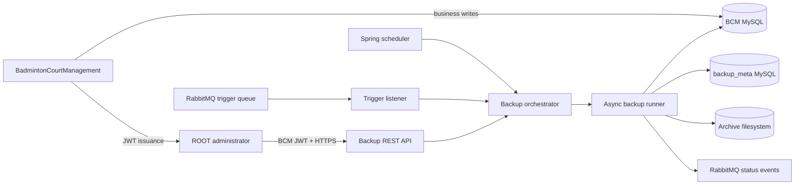
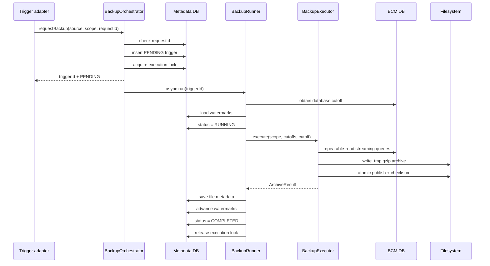

# Software Design Description

## BadmintonCourtManagement Backup Service

| Document attribute | Value |
|---|---|
| Document type | Software Design Description (SDD) |
| System | BadmintonCourtManagement Backup Service |
| Implementation directory | `BadmintonCourtManagementBackup` |
| Related system | `BadmintonCourtManagement` (BCM) |
| Runtime | Java 25 |
| Framework | Spring Boot 3.5.3 |
| Status | As-built design |

## 1. Purpose

This document defines the software design of the BadmintonCourtManagement Backup Service. It describes the implemented system boundaries, runtime architecture, components, interfaces, persistence model, backup algorithms, security controls, failure behavior, configuration, deployment model, and verification strategy.

The service creates logical, compressed backups of the BCM MySQL business database. It supports full and timestamp-based incremental extraction. Backup requests can originate from a schedule, a protected REST API, or RabbitMQ.

## 2. Scope

### 2.1 In scope

- Full logical exports of configured BCM tables.
- Incremental exports of inserted and updated rows.
- Incremental deletion tombstones.
- Gzip-compressed JSON archives.
- SHA-256 archive checksums.
- Trigger history, file metadata, and per-table watermarks.
- Database-backed prevention of overlapping executions.
- RabbitMQ request idempotency.
- Scheduled, REST, and RabbitMQ trigger adapters.
- BCM JWT validation and ROOT-role authorization.
- Startup validation and health reporting.

### 2.2 Out of scope

- Physical MySQL backup files.
- MySQL binary-log replication or point-in-time recovery.
- Automated restore or archive replay.
- Archive encryption or remote object storage.
- Automatic archive deletion or retention enforcement.
- Backup of files outside the BCM database.
- BCM business operations such as court, session, payment, inventory, or billing processing.

## 3. Design goals

1. **Separation:** backup processing must run independently from BCM business processing.
2. **No source writes:** the backup service accesses BCM through a read-only connection pool.
3. **Consistent extraction:** one execution uses a repeatable-read source transaction.
4. **No silent partial success:** an error in a configured table fails the complete backup.
5. **Safe publication:** an archive becomes visible only after it has been completely written.
6. **Safe watermarks:** incremental watermarks advance only after archive publication and metadata persistence.
7. **Unified triggering:** every trigger adapter enters the same orchestration path.
8. **Controlled administration:** only a BCM JWT carrying `ROLE_ROOT` can use the REST administration API.
9. **Horizontal coordination:** a metadata-database lock prevents concurrent backups across service instances.
10. **Operational traceability:** every accepted request has a trigger record and status lifecycle.

## 4. System context



## 5. System boundary and ownership

### 5.1 BCM responsibilities

BCM owns:

- Business tables and business transactions.
- User authentication and JWT issuance.
- The JWT `roles` claim.
- `created_at` and `updated_at` tracking columns.
- The `backup_deletion_log` tombstone table.
- Database triggers that record hard deletes.

BCM does not invoke internal backup classes and does not write backup archives or metadata.

### 5.2 Backup service responsibilities

The backup service owns:

- Backup trigger acceptance and validation.
- Backup execution lifecycle.
- Source table catalog and validation.
- Full and incremental extraction.
- Archive generation and checksums.
- Metadata and watermark persistence.
- Execution locking and RabbitMQ idempotency.
- REST authorization.
- Backup schedules and status events.

## 6. Technology design

| Concern | Technology |
|---|---|
| Runtime | OpenJDK 25 |
| Application framework | Spring Boot 3.5.3 |
| REST | Spring MVC |
| Security | Spring Security OAuth2 Resource Server |
| JWT implementation | Nimbus JWT decoder |
| Metadata persistence | Spring Data JPA / Hibernate |
| Source extraction | JDBC with HikariCP |
| Schema migration | Liquibase |
| Message broker | RabbitMQ / Spring AMQP |
| Archive serialization | Jackson streaming API |
| Compression | GZIP |
| Checksum | SHA-256 |
| Health | Spring Boot Actuator |
| Build | Maven |
| Tests | JUnit 5, AssertJ, Mockito |

## 7. Logical architecture

```text
controller/             REST adapter and HTTP error mapping
scheduler/              Cron trigger adapter
mq/                     RabbitMQ input and output adapters
service/
  BackupOrchestrator    Common request acceptance
  BackupRunner          Asynchronous lifecycle coordinator
  BackupExecutor        JDBC extraction and archive publication
  BackupCatalog         BCM-specific table/key catalog
  BackupSourceDatabase  Read-only BCM connection pool
  WatermarkService      Per-table cutoff management
  ExecutionLockService  Cross-instance execution lock
entity/                 backup_meta JPA entities
repository/             Metadata repositories
config/                 Security, AMQP, properties, startup, health
model/                  Request, response, scope, and status contracts
```

The design separates generic backup mechanics from BCM-specific catalog configuration. `BackupExecutor` implements generic JDBC-to-archive behavior. `BackupCatalog` defines which BCM tables are exported and how their records are identified.

## 8. Component design

### 8.1 `BadmintonBackupApplication`

Responsibilities:

- Starts the Spring Boot application.
- Enables scheduling.
- Enables asynchronous execution.

### 8.2 Trigger adapters

#### `BackupController`

Exposes ROOT-only REST operations. It does not execute a backup directly. Trigger requests are delegated to `BackupOrchestrator`.

#### `BackupScheduler`

Creates scheduled requests:

- Daily: incremental.
- Weekly: incremental.
- Monthly: full.

Cron expressions and timezone are external configuration.

#### `BackupTriggerListener`

Consumes `RabbitBackupRequest` messages. It requires a nonblank `requestId` of no more than 100 characters. A missing scope defaults to `INCREMENTAL`.

### 8.3 `BackupOrchestrator`

Responsibilities:

1. Check RabbitMQ request idempotency when a request ID exists.
2. Create a `PENDING` trigger record.
3. Acquire the database-backed execution lock.
4. Mark rejected overlapping requests as failed.
5. Save the external request mapping.
6. Submit execution to `BackupRunner`.
7. Return the trigger identifier and current status.

`BackupOrchestrator` is the only public entry into backup execution.

### 8.4 `BackupRunner`

Runs asynchronously and coordinates the complete lifecycle:

1. Load the trigger.
2. Obtain the cutoff from the source database clock.
3. Load per-table previous watermarks.
4. Change status to `RUNNING`.
5. Invoke `BackupExecutor`.
6. Save archive metadata.
7. Advance all table watermarks.
8. Change status to `COMPLETED`.
9. On error, change status to `FAILED` and retain the previous watermarks.
10. Release the execution lock in a `finally` block.
11. Publish the final status when RabbitMQ is enabled.

### 8.5 `BackupExecutor`

Responsibilities:

- Validate required source tables and columns.
- Start a read-only, repeatable-read JDBC transaction.
- Stream table rows through a Jackson `JsonGenerator`.
- Add deletion tombstones to incremental archives.
- Compress output through `GZIPOutputStream`.
- Write to a temporary path.
- Remove the temporary file when execution fails.
- Atomically move the completed file to its published path.
- Calculate SHA-256 after publication.
- Return file path, size, exported record count, and checksum.

The executor does not persist metadata or watermarks.

### 8.6 `BackupCatalog`

The catalog contains 25 BCM tables:

1. `player`
2. `session`
3. `available_player`
4. `court`
5. `team`
6. `shuttle_ball`
7. `game`
8. `game_shuttle_map`
9. `service`
10. `rent_by_time`
11. `debit`
12. `debit_summary`
13. `payment`
14. `payment_debit`
15. `inventory_item`
16. `purchase_lot`
17. `stock_movement`
18. `role`
19. `app_user`
20. `app_user_role`
21. `refresh_token`
22. `invoice`
23. `invoice_item`
24. `invoice_series`
25. `bill_config`

`app_user_role` has the composite key `(user_id, role_id)`. All other entries declare one primary key. Startup and execution validation require each table to exist and to have `updated_at`. The tombstone table `backup_deletion_log` must also exist.

### 8.7 `BackupSourceDatabase`

Owns a dedicated Hikari connection pool configured as read-only:

- Maximum pool size: 3.
- Minimum idle: 0.
- Connection timeout: 10 seconds.
- Independent from the metadata datasource.

It also obtains source database time through `CURRENT_TIMESTAMP(6)`.

### 8.8 `WatermarkService`

Watermarks are maintained per schema and table. A missing watermark resolves to `Instant.EPOCH`, making the first incremental request equivalent to a complete logical extraction of current rows plus all available tombstones.

`advanceAll` runs only after archive creation and metadata saving have succeeded.

### 8.9 `ExecutionLockService`

The singleton `backup_execution_lock` row is selected with `PESSIMISTIC_WRITE`. Its `locked` and `trigger_id` values coordinate execution across application instances sharing the same metadata database.

### 8.10 Status publisher

When RabbitMQ is enabled, `BackupStatusPublisher` emits either:

- `badminton.backup.status.completed`, or
- `badminton.backup.status.failed`.

The exchange and routing keys are configurable.

## 9. Runtime flows

### 9.1 Common trigger flow



### 9.2 Overlapping request flow

If the execution lock is already held:

1. A trigger record is created.
2. Lock acquisition fails.
3. The trigger becomes `FAILED`.
4. REST receives HTTP `409 Conflict`.
5. No backup runner starts.

### 9.3 Duplicate RabbitMQ flow

If `processed_backup_request` already contains `requestId`, the existing trigger response is returned. No new trigger, lock acquisition, or execution occurs.

## 10. Backup algorithms

### 10.1 Full backup

For every catalog table:

```sql
SELECT * FROM `<table>`
```

Rows are streamed into the table's `upserts` array. The `deletes` array is empty. One repeatable-read source transaction provides a consistent database snapshot for all table reads.

A successful full backup also advances all table watermarks to the execution cutoff, so a later incremental backup starts from that point.

### 10.2 Incremental backup

For each table with previous watermark `from` and current cutoff `to`:

```sql
SELECT *
FROM `<table>`
WHERE updated_at > :from
  AND updated_at <= :to
ORDER BY updated_at
```

Hard deletes are read from:

```sql
SELECT record_key, deleted_at
FROM backup_deletion_log
WHERE table_name = :table
  AND deleted_at > :from
  AND deleted_at <= :to
ORDER BY deleted_at, deletion_id
```

The interval is `(from, to]`, which avoids duplicate boundary rows while preserving rows at the new cutoff.

### 10.3 Change tracking in BCM

BCM's Liquibase migration:

- Adds `created_at` and `updated_at` to catalog tables.
- Uses MySQL `ON UPDATE CURRENT_TIMESTAMP(6)` for update tracking.
- Adds an index on each `updated_at` column.
- Adds `AFTER DELETE` triggers that insert JSON primary-key tombstones.

This database-managed design also tracks writes that bypass JPA.

## 11. Archive design

### 11.1 File naming

```text
<base-path>/<UTC-yyyy-MM-dd>/<scope>_<UTC-HHmmss_SSS>_<triggerId>.json.gz
```

Example:

```text
/var/backups/badminton/2026-10-05/incremental_153000_125_42.json.gz
```

### 11.2 Logical format

```json
{
  "formatVersion": 1,
  "triggerId": 42,
  "scope": "INCREMENTAL",
  "toInclusive": "2026-10-05T08:30:00.123456Z",
  "tables": {
    "payment": {
      "fromExclusive": "2026-10-04T08:30:00Z",
      "upserts": [
        {
          "payment_id": 1001,
          "amount": 250000,
          "updated_at": "2026-10-05T08:00:00Z"
        }
      ],
      "deletes": [
        {
          "key": {"payment_id": 998},
          "deletedAt": "2026-10-05T07:00:00Z"
        }
      ]
    }
  }
}
```

The exact row fields follow source database column labels. The format is intended for controlled machine processing, not direct end-user consumption.

### 11.3 Publication protocol

1. Create a unique `*.tmp` file using `CREATE_NEW`.
2. Stream and compress the complete archive.
3. Close all output streams.
4. Commit the source read transaction.
5. Move the temporary file using `ATOMIC_MOVE` when supported.
6. Fall back to a normal same-filesystem move when atomic moves are unavailable.
7. Calculate SHA-256 over the published gzip file.
8. Store metadata and advance watermarks.

## 12. Metadata data model

### 12.1 `backup_trigger`

Stores request and execution lifecycle:

- Trigger source: `SCHEDULED`, `REST`, or `RABBITMQ`.
- Scope: `FULL` or `INCREMENTAL`.
- Status: `PENDING`, `RUNNING`, `COMPLETED`, or `FAILED`.
- Schedule type and external request ID.
- Cutoff window.
- Start and completion time.
- Error message.

### 12.2 `backup_file`

Stores:

- Owning trigger.
- Source schema label.
- Archive path.
- Archive size.
- Exported record count.
- SHA-256 checksum.
- Creation time.

### 12.3 `backup_watermark`

Stores the last successful cutoff for each `(schema_name, table_name)` pair.

### 12.4 `processed_backup_request`

Maps a unique RabbitMQ `request_id` to one trigger. The primary-key constraint enforces idempotency at the database level.

### 12.5 `backup_execution_lock`

A singleton row with ID `1` stores the current lock state and trigger ID.

## 13. External interfaces

### 13.1 REST API

All `/api/backup/**` operations require `ROLE_ROOT`.

#### Create trigger

```http
POST /api/backup/triggers
Authorization: Bearer <BCM JWT>
Content-Type: application/json

{"scope":"INCREMENTAL"}
```

Response:

```http
HTTP/1.1 202 Accepted

{
  "triggerId": 42,
  "status": "PENDING",
  "scope": "INCREMENTAL"
}
```

#### Query interfaces

| Method | Path | Purpose |
|---|---|---|
| GET | `/api/backup/triggers?page=0&size=20` | Paged execution history |
| GET | `/api/backup/triggers/{id}` | Trigger details |
| GET | `/api/backup/triggers/{id}/files` | Trigger archive metadata |
| GET | `/api/backup/watermarks` | Current table watermarks |

Page size is restricted to 1-100.

### 13.2 Health API

The following are public:

- `/actuator/health`
- `/actuator/info`

The custom health indicator checks source connectivity and archive storage writability.

### 13.3 RabbitMQ input

Default queue:

```text
badminton.backup.trigger.queue
```

Message:

```json
{
  "requestId": "request-123",
  "scope": "INCREMENTAL"
}
```

### 13.4 RabbitMQ output

Status payload fields:

- `requestId`
- `triggerId`
- `status`
- `scope`
- `startedAt`
- `completedAt`
- `error`

## 14. Security design

### 14.1 Authentication and authorization

- The service does not issue JWTs.
- It loads BCM's RSA public key from a configured resource.
- Nimbus validates JWT signatures.
- The `roles` claim is converted to Spring authorities with prefix `ROLE_`.
- Backup REST operations require `ROLE_ROOT`.
- Actuator health and info are unauthenticated but detailed health is limited by Actuator configuration.
- All unspecified HTTP routes are denied.
- Server-side sessions are disabled.
- CSRF is disabled because the API uses stateless bearer authentication.

### 14.2 Database access

Recommended accounts:

- BCM source account: `SELECT` only.
- Metadata account: DML plus controlled Liquibase DDL permissions.

Credentials come from environment variables and are not stored in source control.

### 14.3 Data protection considerations

Archives contain business and authentication-related database records, including password hashes and refresh-token hashes. Production deployments must therefore provide:

- Restrictive filesystem ownership and permissions.
- Encrypted disks or encrypted volumes.
- TLS for MySQL and RabbitMQ connections.
- Secure key and credential injection.
- Controlled archive transfer and restore procedures.

Application-level archive encryption is not implemented.

## 15. Configuration design

Important environment variables:

| Variable | Purpose |
|---|---|
| `BACKUP_SERVER_PORT` | HTTP port |
| `BACKUP_META_URL` | Metadata JDBC URL |
| `BACKUP_META_USERNAME` | Metadata username |
| `BACKUP_META_PASSWORD` | Metadata password |
| `BCM_BACKUP_SOURCE_URL` | BCM source JDBC URL |
| `BCM_BACKUP_SOURCE_USERNAME` | Read-only source username |
| `BCM_BACKUP_SOURCE_PASSWORD` | Source password |
| `BCM_BACKUP_SOURCE_SCHEMA` | Source schema label |
| `BCM_JWT_PUBLIC_KEY` | BCM RSA public-key resource |
| `BACKUP_PATH` | Archive base directory |
| `BACKUP_SCHEDULE_ZONE` | Schedule timezone |
| `BACKUP_DAILY_CRON` | Daily incremental cron |
| `BACKUP_WEEKLY_CRON` | Weekly incremental cron |
| `BACKUP_MONTHLY_CRON` | Monthly full cron |
| `BACKUP_RABBITMQ_ENABLED` | Enable AMQP adapters |
| `RABBITMQ_HOST` | Broker host |
| `RABBITMQ_PORT` | Broker port |
| `RABBITMQ_USERNAME` | Broker username |
| `RABBITMQ_PASSWORD` | Broker password |

## 16. Startup behavior

At application startup:

1. Liquibase migrates the metadata schema.
2. The read-only source pool is initialized.
3. The archive base directory is created when absent.
4. Storage is checked for writability.
5. All catalog tables are validated.
6. Every catalog table is checked for `updated_at`.
7. `backup_deletion_log` is validated.
8. Startup fails if a required dependency or schema contract is missing.

There is no startup-triggered backup.

## 17. Failure handling

| Failure | Behavior |
|---|---|
| Missing source table/column | Startup or execution fails clearly |
| Source query failure | Entire trigger becomes `FAILED` |
| Archive write failure | Temporary file is removed; watermark remains unchanged |
| Atomic move unsupported | Same-filesystem normal move is used |
| Metadata file save failure | Trigger fails; watermark does not advance |
| Watermark save failure | Trigger fails; prior successful cutoffs remain available where transaction rollback applies |
| Concurrent trigger | New trigger fails and REST receives `409` |
| Duplicate RabbitMQ request | Existing trigger is returned; no new execution |
| Status publication failure | Logged by messaging infrastructure; backup result remains stored |
| Application termination during run | Lock may require operational recovery in the current design |

Error text stored in `backup_trigger` is limited to 2,000 characters.

## 18. Consistency and transaction design

- Source extraction and metadata writes use different databases and cannot share one ACID transaction.
- Source reads use one repeatable-read transaction.
- Metadata writes are committed through repository/service transactions.
- The archive is published before metadata is finalized.
- Watermarks are not advanced when extraction fails.
- A crash after archive publication but before metadata completion can leave an orphan archive. Operators may reconcile it using filename trigger IDs and metadata.
- Upserts make repeated row delivery tolerable for a future restore tool, but restore behavior is not implemented by this service.

## 19. Deployment design

Recommended topology:

```text
BCM application process              Backup service process
BCM business MySQL schema            backup_meta MySQL schema
Read/write BCM DB account            Read-only BCM source account
BCM JWT private/public key pair       BCM public key only
RabbitMQ (optional but shared)
Dedicated backup filesystem or mounted volume
```

The service artifact is:

```text
target/badminton-backup-1.0.0-SNAPSHOT.jar
```

Example build:

```bash
export JAVA_HOME=$(/usr/libexec/java_home -v 25)
../BadmintonCourtManagement/mvnw clean verify
```

Example launch:

```bash
java -jar target/badminton-backup-1.0.0-SNAPSHOT.jar
```

Production deployment should run one or more instances that share the same metadata database and archive storage. The execution lock serializes backup activity.

## 20. Verification design

Implemented unit tests verify:

- Catalog table uniqueness and composite keys.
- Missing watermark behavior.
- Advancement across all catalog tables.
- New request lock acquisition and runner submission.
- Duplicate RabbitMQ request idempotency.

Build verification uses JDK 25 and Maven `clean verify`.

Recommended environment integration tests:

1. Apply BCM and metadata Liquibase migrations to MySQL 8.
2. Run a full backup and inspect all 25 table sections.
3. Insert, update, and delete rows.
4. Run an incremental backup and verify upserts and tombstones.
5. Simulate archive write failure and verify unchanged watermarks.
6. Submit concurrent REST and RabbitMQ requests.
7. Submit a duplicate RabbitMQ request ID.
8. Validate ROOT, non-ROOT, expired, and malformed JWT behavior.
9. Decompress an archive and verify its SHA-256 checksum.
10. Restart after an interrupted execution and test lock recovery procedures.

## 21. Known limitations and design risks

1. **No restore tool:** archives cannot yet be replayed by this application.
2. **No point-in-time recovery:** timestamp extraction is not equivalent to MySQL binary-log backup.
3. **No archive encryption:** protection depends on infrastructure controls.
4. **Filesystem storage only:** object storage and replication are not implemented.
5. **No automatic retention:** archives and metadata grow until managed operationally.
6. **No stale-lock lease:** abrupt termination can leave the execution lock set.
7. **No dead-letter topology in application configuration:** broker-side policy is required for poison trigger messages.
8. **Fixed table catalog:** schema additions require a catalog and BCM tracking migration update.
9. **Logical schema coupling:** source column values and types are serialized as reported by JDBC.
10. **Separate persistence boundaries:** archive and metadata publication cannot be one atomic transaction.
11. **First incremental size:** absent watermarks use the Unix epoch and therefore export all current rows.
12. **Cascade-delete behavior:** MySQL foreign-key cascades may not execute child-table delete triggers; parent tombstones must be honored by a future restore process.

## 22. Future design extensions

Recommended future increments:

1. Restore planner and importer with foreign-key dependency ordering.
2. Archive encryption using a managed key service.
3. S3-compatible object storage with multipart upload.
4. Configurable retention with dry-run and explicit administrative approval.
5. Lock leases and abandoned-run recovery.
6. RabbitMQ dead-letter exchange and retry policy.
7. Metrics for duration, rows, bytes, failures, and last successful backup.
8. MySQL Testcontainers integration suite.
9. Signed archive manifests.
10. Binlog-based point-in-time recovery for higher recovery objectives.

## 23. Traceability matrix

| Requirement | Implementing component |
|---|---|
| Separate backup process | `BadmintonBackupApplication` |
| ROOT-only REST | `SecurityConfig`, `BackupController` |
| Scheduled trigger | `BackupScheduler` |
| RabbitMQ trigger | `BackupTriggerListener` |
| Common trigger path | `BackupOrchestrator` |
| Async execution | `BackupRunner` |
| Overlap protection | `ExecutionLockService`, `backup_execution_lock` |
| Full extraction | `BackupExecutor.streamRows` |
| Incremental extraction | `BackupExecutor.streamRows` with cutoff window |
| Delete capture | BCM delete triggers, `BackupExecutor.streamDeletes` |
| Atomic publication | `BackupExecutor.movePublished` |
| Checksum | `BackupExecutor.sha256` |
| Watermarks | `WatermarkService`, `backup_watermark` |
| Trigger history | `BackupTrigger`, `backup_trigger` |
| RabbitMQ idempotency | `ProcessedBackupRequest`, `processed_backup_request` |
| Startup validation | `BackupStartupValidator`, `BackupCatalog.validate` |
| Health reporting | `BackupHealthIndicator` |
