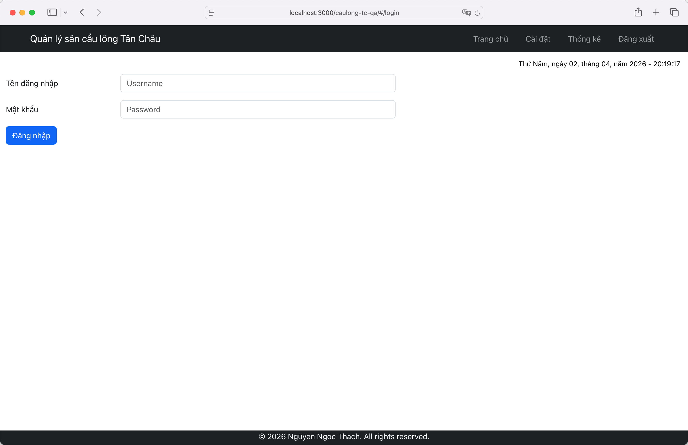
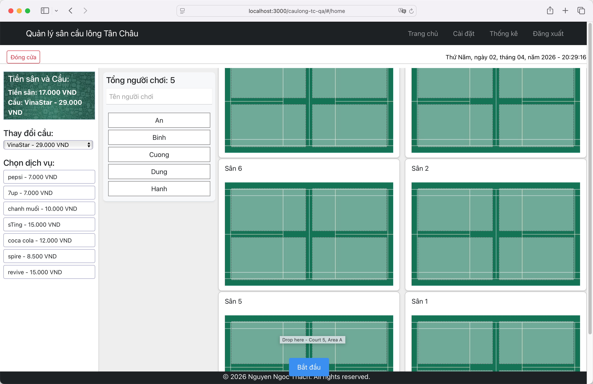
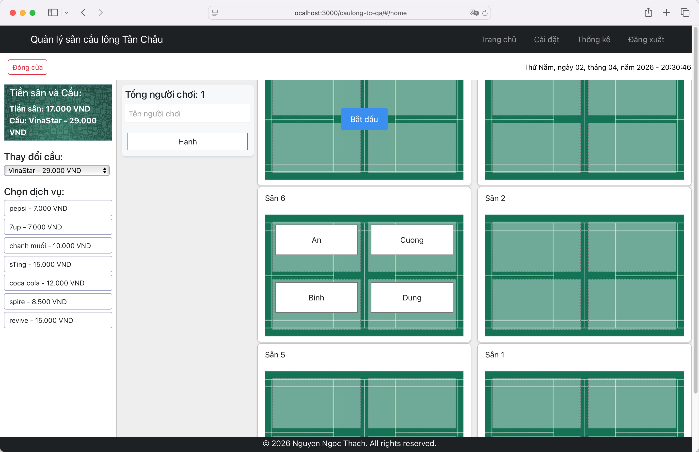
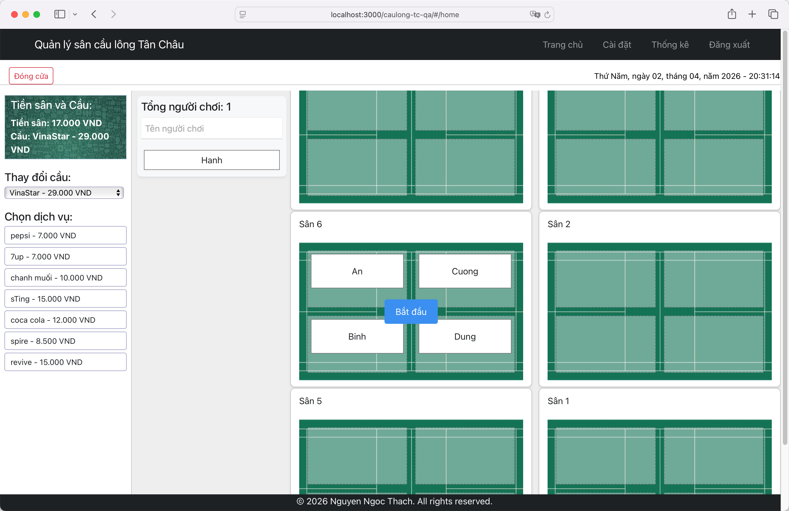
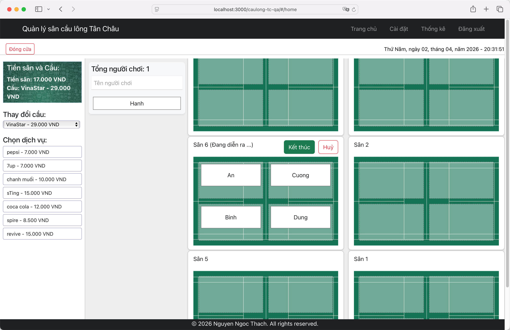
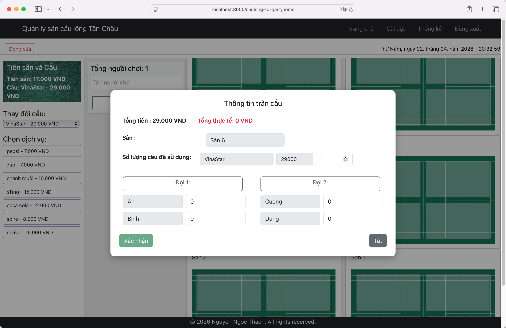
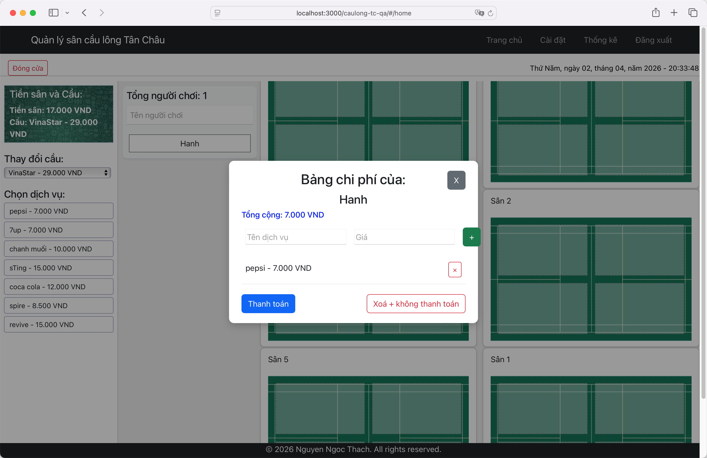
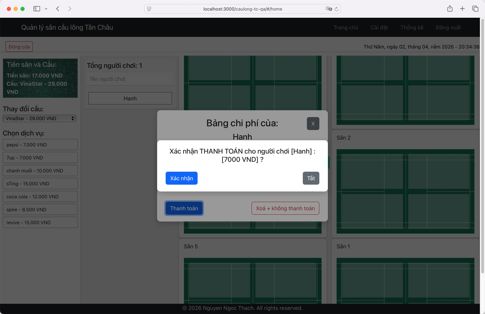
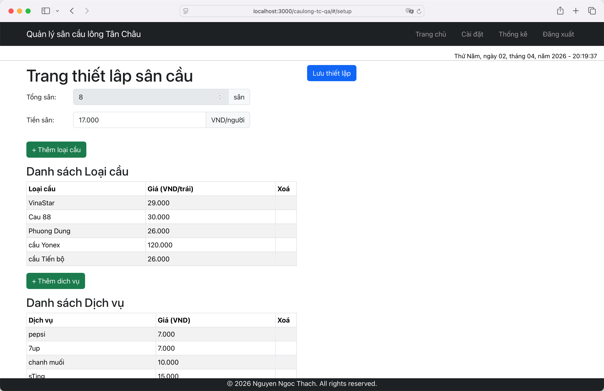
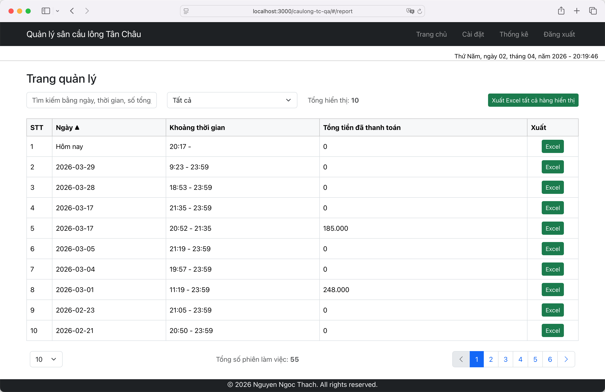

# HƯỚNG DẪN SỬ DỤNG HỆ THỐNG BADMINTON COURT MANAGEMENT

## 1. Mục đích tài liệu

Tài liệu này hướng dẫn người dùng vận hành hệ thống quản lý sân cầu lông dựa trên các hành vi được triển khai trong mã nguồn phần `controller`, `service` và các mô hình dữ liệu liên quan. Nội dung tập trung vào cách sử dụng hệ thống, các quy trình nghiệp vụ chính và những lưu ý vận hành.

## 2. Phạm vi chức năng

Hệ thống hỗ trợ các nhóm chức năng sau:

- Đăng nhập và duy trì phiên làm việc.
- Mở và đóng phiên chơi theo ngày.
- Quản lý danh sách người chơi đang có mặt trong buổi chơi.
- Quản lý sân, trận đấu, vị trí người chơi trên sân và trạng thái trận.
- Quản lý cầu và dịch vụ phát sinh.
- Xác nhận kết quả trận đấu và cộng chi phí cho người chơi.
- Thanh toán cho người chơi và ghi nhận hình thức thanh toán.
- Quản trị cấu hình sân, cầu, dịch vụ.
- Quản lý người dùng quản trị và đặt lại mật khẩu.
- Tra cứu và xuất báo cáo theo phiên chơi.

## 3. Nhóm người dùng

### 3.1. Người vận hành sân hoặc thu ngân

Người dùng nhóm này thường thực hiện các tác vụ:

- Đăng nhập hệ thống.
- Kiểm tra hoặc tạo phiên chơi trong ngày.
- Thêm người chơi vào danh sách hiện diện.
- Phân người chơi vào sân.
- Bắt đầu, kết thúc hoặc hủy trận đấu.
- Gắn dịch vụ phát sinh cho người chơi.
- Thu tiền và xác nhận người chơi rời buổi chơi.
- Xem và xuất báo cáo.

### 3.2. Quản trị cấu hình

Người dùng nhóm này phụ trách:

- Thiết lập số lượng sân hoạt động.
- Khai báo loại cầu đang sử dụng.
- Khai báo các dịch vụ phụ thu.
- Cập nhật cấu hình chi phí mặc định.

### 3.3. Quản trị nội bộ

Người dùng nhóm này có thêm các quyền:

- Tạo tài khoản quản trị.
- Xóa người chơi khỏi phiên hiện tại trong trường hợp ngoại lệ.
- Yêu cầu đặt lại mật khẩu.
- Đặt lại mật khẩu bằng mã xác nhận.

## 4. Đăng nhập và bảo mật phiên

### 4.1. Đăng nhập

Người dùng đăng nhập bằng tên đăng nhập và mật khẩu. Khi đăng nhập thành công, hệ thống tạo phiên làm việc phía máy chủ và trả về CSRF token để các yêu cầu tiếp theo được chấp nhận.

### 4.2. Kiểm tra hiệu lực phiên

Hệ thống có API kiểm tra CSRF token còn hiệu lực hay không. Nếu phiên không tồn tại hoặc token đã hết hạn thì người dùng cần đăng nhập lại.

### 4.3. Đăng xuất

Người dùng có thể đăng xuất để kết thúc phiên đăng nhập hiện tại.

### 4.4. Lưu ý vận hành

- Thời gian sống của phiên đăng nhập được cấu hình khoảng 30 phút.
- Một số API nội bộ dành cho quản trị được cấu hình mở công khai trong mã nguồn. Khi triển khai thực tế cần kiểm soát truy cập ở mức môi trường hoặc gateway.

## 5. Quy trình phiên chơi theo ngày

### 5.1. Kiểm tra phiên đang mở

Hệ thống cho phép kiểm tra xem trong ngày hiện tại đã có phiên chơi đang hoạt động hay chưa.

### 5.2. Tạo phiên mới

Nếu chưa có phiên hoạt động trong ngày, người vận hành tạo phiên mới. Phiên này là đơn vị chính để quản lý:

- Danh sách người chơi có mặt.
- Trận đấu phát sinh trong ngày.
- Dữ liệu thanh toán.
- Báo cáo cuối ngày hoặc cuối phiên.

### 5.3. Đóng phiên

Khi kết thúc ngày hoặc cần chốt dữ liệu, người dùng đóng phiên. Khi đóng phiên, hệ thống sẽ:

- Đánh dấu phiên không còn hoạt động.
- Ghi nhận thời gian kết thúc phiên.
- Hủy các trận còn đang dang dở.
- Đánh dấu toàn bộ người chơi chưa rời buổi là đã rời phiên.

### 5.4. Ý nghĩa nghiệp vụ

Phiên chơi là nền tảng cho toàn bộ dữ liệu phát sinh trong ngày. Nếu chưa có phiên hoạt động, nhiều thao tác như thêm người chơi hoặc thanh toán sẽ không thực hiện được.

## 6. Quản lý người chơi trong phiên

### 6.1. Xem danh sách người chơi hiện diện

Hệ thống cung cấp danh sách người chơi đang có mặt trong phiên hiện tại và chưa rời sân.

### 6.2. Thêm người chơi vào phiên

Khi người chơi đến sân, người vận hành nhập tên người chơi để thêm vào danh sách hiện diện.

Hành vi hệ thống:

- Nếu người chơi đã từng tồn tại trong cơ sở dữ liệu, hệ thống tái sử dụng bản ghi cũ.
- Nếu tên khác biệt chỉ do chữ hoa hoặc chữ thường, hệ thống cập nhật lại tên.
- Nếu là người chơi mới, hệ thống tự tạo người chơi mới.
- Nếu người chơi đã được thêm vào phiên hiện tại và chưa rời phiên, hệ thống sẽ từ chối thêm trùng.

### 6.3. Xóa người chơi khỏi phiên

Có hai tình huống:

- Xóa thông thường hoặc đánh dấu rời phiên khi người chơi kết thúc buổi chơi.
- Xóa cưỡng bức bởi quản trị nội bộ khi cần xử lý ngoại lệ.

Khi người chơi bị đưa ra khỏi phiên, hệ thống ghi nhận `leaveTime`.

## 7. Quản lý sân và bố trí người chơi

### 7.1. Xem màn hình quản lý sân

Dữ liệu quản lý sân tổng hợp gồm:

- Danh sách trận chưa kết thúc.
- Danh sách người chơi còn trống, chưa được xếp vào trận nào.
- Danh sách sân còn trống.

### 7.2. Thêm người chơi vào sân

Người vận hành chọn:

- Người chơi đang có mặt.
- Sân cần xếp.
- Vị trí trên sân.
- Loại cầu sử dụng ban đầu.

Hành vi hệ thống:

- Nếu sân chưa có trận ở trạng thái `NOT_START`, hệ thống tự tạo trận mới.
- Nếu sân đã có trận chưa bắt đầu, hệ thống thêm người chơi vào đội tương ứng.
- Vị trí A và B thuộc đội 1.
- Vị trí C và D thuộc đội 2.

### 7.3. Điều kiện bắt đầu trận

Hệ thống chỉ cho phép chuyển sang trạng thái bắt đầu khi cả hai đội đều đã có ít nhất một người chơi.

### 7.4. Xóa người chơi khỏi sân

Người dùng có thể đưa người chơi ra khỏi vị trí trên sân nếu trận chưa bắt đầu. Nếu trận đã bắt đầu hoặc đã kết thúc, thao tác này không còn phù hợp theo logic mã nguồn.

## 8. Quản lý trạng thái trận đấu

### 8.1. Các trạng thái chính

Theo mã nguồn, trận đấu có các trạng thái nghiệp vụ sau:

- `NOT_START`: đã tạo khung trận nhưng chưa thi đấu.
- `START`: trận đang diễn ra.
- `FINISH`: trận đã kết thúc và được chốt kết quả.
- `CANCEL`: trận bị hủy.

### 8.2. Bắt đầu trận

Khi bắt đầu trận:

- Hệ thống cập nhật trạng thái sang `START`.
- Hệ thống gắn loại cầu đang chọn vào trận và ghi nhận số lượng ban đầu.

Sau khi bắt đầu thành công, giao diện sẽ chuyển sang trạng thái trận đang diễn ra và hiển thị các nút thao tác như `Kết thúc` và `Huỷ`.

### 8.3. Kết thúc trận

Quy trình kết thúc trận thường gồm hai bước:

1. Lấy dữ liệu kết quả trận hiện tại để người dùng kiểm tra.
2. Người dùng xác nhận kết quả trận để hệ thống chốt chi phí.

### 8.4. Hủy trận

Nếu trận không diễn ra hoặc cần hủy bỏ, người dùng có thể gửi yêu cầu hủy. Hệ thống sẽ:

- Ghi nhận thời điểm kết thúc.
- Chuyển trạng thái sang `CANCEL`.

### 8.5. Tự động xử lý khi đóng phiên

Khi đóng phiên, các trận còn đang ở trạng thái chưa kết thúc sẽ bị chuyển sang `CANCEL`.

## 9. Xác nhận kết quả trận và phân bổ chi phí

### 9.1. Xem kết quả trận

Khi lấy kết quả trận, hệ thống trả về:

- Sân đang thi đấu.
- Danh sách đội 1 và đội 2.
- Danh sách cầu đã dùng và số lượng.
- Thời gian tạo và thời gian kết thúc trận.
- Trạng thái hiện tại của trận.

### 9.2. Kiểm tra hợp lệ trước khi xác nhận

Để chốt kết quả trận, dữ liệu cần hợp lệ theo các nguyên tắc:

- Phải có thông tin sân.
- Phải có danh sách vị trí người chơi trên sân.
- Phải có danh sách cầu sử dụng.
- Hai bên phải có số người tương ứng nhau.
- Phải xác định được đội thắng.
- Tổng chi phí người dùng nhập cho các vị trí phải khớp tổng chi phí cầu.

### 9.3. Hai kiểu phân bổ chi phí

Theo logic hệ thống, có hai kiểu:

- `SHARE`: chi phí chia đều hoặc theo số tiền mặc định.
- `NEGO`: có ít nhất một vị trí thắng được nhập chi phí khác mặc định, hiểu là phân bổ theo thương lượng.

### 9.4. Ghi nhận chi phí cho người chơi

Khi xác nhận kết quả trận:

- Hệ thống chuyển trạng thái trận sang `FINISH`.
- Ghi nhận thời điểm kết thúc.
- Gán chi phí cho từng người chơi theo vị trí A, B, C, D.
- Đồng thời cộng thêm một dịch vụ vào hồ sơ người chơi với tên dạng `Tiền <Tên sân>`.

Điều này có nghĩa là tiền sân sau mỗi trận được cộng trực tiếp vào danh sách dịch vụ của người chơi trong phiên hiện tại.

## 10. Quản lý cầu

### 10.1. Xem danh mục cầu

Người dùng có thể lấy danh sách các loại cầu đang hoạt động.

### 10.2. Đưa danh sách cầu vào sân

Hệ thống hỗ trợ gán danh sách cầu cho một sân theo yêu cầu của phiên làm việc.

### 10.3. Thay đổi số lượng cầu

Người dùng có thể cập nhật số lượng cầu sử dụng cho sân hoặc trận tương ứng.

### 10.4. Đổi cầu đang chọn

Hệ thống có thao tác đổi loại cầu đang được chọn để dùng cho trận.

## 11. Quản lý dịch vụ phát sinh

### 11.1. Danh mục dịch vụ

Người dùng có thể lấy danh sách dịch vụ đang hoạt động, ví dụ:

- Nước uống.
- Khăn lạnh.
- Thuê vợt.
- Phụ thu khác.

### 11.2. Gán dịch vụ cho người chơi

Có ba cách thao tác:

- Thêm một dịch vụ cho người chơi.
- Cập nhật toàn bộ danh sách dịch vụ của người chơi.
- Gỡ một dịch vụ khỏi người chơi.

Các dịch vụ này được lưu trực tiếp trên bản ghi người chơi trong phiên hiện tại.

### 11.3. Tiền sân là một dạng dịch vụ

Sau khi xác nhận kết quả trận, tiền sân được tự động cộng thành một dịch vụ riêng theo từng sân. Vì vậy ở bước thanh toán cuối buổi, người vận hành cần kiểm tra cả:

- Dịch vụ phát sinh thủ công.
- Tiền sân cộng tự động từ các trận đã chốt.

## 12. Thanh toán và kết thúc buổi chơi của một người

### 12.1. Mục tiêu

Khi người chơi thanh toán và rời sân, hệ thống cần chốt:

- Danh sách dịch vụ cuối cùng.
- Tổng tiền cần thanh toán.
- Hình thức hoặc trạng thái thanh toán.
- Thời điểm rời buổi chơi.

### 12.2. Xử lý thanh toán

Khi thực hiện thanh toán cho một người chơi:

- Hệ thống tìm người chơi đó trong phiên hiện tại.
- Ghi đè danh sách dịch vụ bằng danh sách được gửi từ màn hình thanh toán.
- Ghi nhận hình thức thanh toán.
- Ghi nhận tổng số tiền thanh toán.
- Ghi nhận thời điểm rời phiên.

### 12.3. Lưu ý nghiệp vụ

- Sau khi thanh toán, người chơi được xem như đã rời buổi chơi.
- Nếu cần hủy hoặc sửa trước khi thanh toán, người vận hành nên điều chỉnh lại danh sách dịch vụ từ màn hình quản lý người chơi.
- Mã nguồn có enum `PAY` và `CANCEL`, cho thấy hệ thống hỗ trợ ít nhất hai trạng thái hoặc kiểu thanh toán.

## 13. Quản trị cấu hình sân, cầu và dịch vụ

### 13.1. Xem cấu hình hiện tại

Hệ thống cung cấp màn hình lấy cấu hình thiết lập gồm:

- Tổng số sân đang hoạt động.
- Danh sách loại cầu đang dùng.
- Danh sách dịch vụ đang dùng.
- Chi phí mặc định trên đầu người nếu có.

### 13.2. Thiết lập ban đầu

Ở lần cấu hình ban đầu, quản trị có thể:

- Tạo số lượng sân.
- Khai báo loại cầu.
- Khai báo danh sách dịch vụ.
- Thiết lập chi phí mặc định theo đầu người.

### 13.3. Cập nhật cấu hình

Quản trị có thể:

- Thêm cầu mới.
- Ngừng sử dụng cầu cũ.
- Thêm dịch vụ mới.
- Ngừng sử dụng dịch vụ cũ.
- Cập nhật chi phí mặc định theo đầu người.

### 13.4. Xóa mềm

Khi xóa cầu hoặc dịch vụ, hệ thống không xóa vật lý bản ghi mà chỉ chuyển sang trạng thái không hoạt động. Điều này giúp bảo toàn dữ liệu lịch sử.

## 14. Quản trị người dùng nội bộ

### 14.1. Tạo tài khoản quản trị

Quản trị nội bộ có thể tạo tài khoản mới bằng tên người dùng và mật khẩu.

### 14.2. Quên mật khẩu

Hệ thống hỗ trợ sinh mã đặt lại mật khẩu cho một tên người dùng.

### 14.3. Đặt lại mật khẩu

Để đặt lại mật khẩu, cần cung cấp:

- Tên người dùng.
- Mã reset password đã được cấp.
- Mật khẩu mới.
- Nhập lại mật khẩu mới.

Theo mã nguồn:

- Mã reset chỉ có hiệu lực trong khoảng 3 phút.
- Tên người dùng trong yêu cầu phải khớp với thông tin gắn với mã.
- Hai lần nhập mật khẩu mới phải giống nhau.

## 15. Báo cáo và xuất dữ liệu

### 15.1. Xem danh sách báo cáo

Người dùng có thể tra cứu danh sách phiên theo tháng hoặc toàn bộ dữ liệu. Kết quả bao gồm:

- Mã phiên.
- Ngày.
- Khoảng thời gian diễn ra.
- Doanh thu gộp.

### 15.2. Lấy danh sách tháng có dữ liệu

Hệ thống trả về danh sách tháng năm đã có phiên để người dùng lọc báo cáo dễ hơn. Danh sách có thêm lựa chọn `Tất cả`.

### 15.3. Xuất báo cáo một phiên

Người dùng có thể xuất báo cáo Excel cho từng phiên. Báo cáo một phiên thường chứa:

- Thông tin ngày và thời lượng phiên.
- Danh sách người chơi.
- Tiền thanh toán.
- Thời gian rời sân.
- Tiền sân.
- Các dịch vụ còn lại.
- Thông tin liên quan tới các trận trong phiên.

### 15.4. Xuất báo cáo nhiều phiên

Hệ thống hỗ trợ tạo token tạm để xuất danh sách báo cáo nhiều phiên theo luồng streaming. Điều này phù hợp khi khối lượng dữ liệu lớn.

## 16. Quy trình vận hành khuyến nghị

### 16.1. Quy trình đầu ngày

1. Đăng nhập hệ thống.
2. Kiểm tra có phiên đang mở hay chưa.
3. Nếu chưa có, tạo phiên mới trong ngày.
4. Kiểm tra cấu hình sân, cầu và dịch vụ đang hoạt động.

### 16.2. Quy trình trong buổi chơi

1. Thêm người chơi khi họ đến.
2. Gán dịch vụ phát sinh nếu có.
3. Xếp người chơi vào sân và vị trí thi đấu.
4. Chọn cầu và bắt đầu trận.
5. Khi trận kết thúc, xác nhận kết quả và chốt tiền sân.
6. Điều chỉnh dịch vụ cho từng người chơi trong suốt buổi chơi nếu cần.

### 16.3. Quy trình khi người chơi ra về

1. Kiểm tra toàn bộ dịch vụ và tiền sân của người chơi.
2. Xác nhận tổng tiền.
3. Chọn loại hoặc trạng thái thanh toán.
4. Thực hiện thanh toán để hệ thống ghi nhận người chơi rời phiên.

### 16.4. Quy trình cuối ngày

1. Kiểm tra các trận còn dang dở.
2. Đóng phiên chơi.
3. Xem danh sách báo cáo.
4. Xuất báo cáo nếu cần lưu trữ hoặc đối soát.

## 17. Các quy tắc nghiệp vụ quan trọng

- Một ngày chỉ nên có một phiên đang hoạt động.
- Người chơi phải nằm trong phiên hiện tại trước khi được xếp vào sân hoặc thanh toán.
- Không được thêm trùng cùng một người chơi đang còn hiệu lực trong cùng phiên.
- Chỉ nên đưa người chơi ra khỏi sân khi trận chưa bắt đầu.
- Trận chỉ được bắt đầu khi hai đội đều đã có người.
- Khi chốt kết quả trận, tổng chi phí nhập phải khớp tổng chi phí cầu.
- Thanh toán sẽ đồng thời đánh dấu thời gian rời phiên của người chơi.
- Đóng phiên sẽ tự động hủy các trận chưa kết thúc.

## 18. Các trường hợp cần lưu ý

### 18.1. Không tạo được phiên mới

Nguyên nhân thường gặp:

- Đã có phiên đang hoạt động trong ngày.
- Có lỗi dữ liệu hoặc lỗi giao dịch cơ sở dữ liệu.

### 18.2. Không thêm được người chơi

Nguyên nhân thường gặp:

- Chưa có phiên hiện tại.
- Tên người chơi rỗng.
- Người chơi đã tồn tại trong phiên và chưa rời buổi.

### 18.3. Không bắt đầu được trận

Nguyên nhân thường gặp:

- Một trong hai đội chưa có người.
- Trạng thái chuyển đổi không hợp lệ.

### 18.4. Không chốt được kết quả trận

Nguyên nhân thường gặp:

- Thiếu sân, cầu hoặc danh sách vị trí.
- Chưa xác định đội thắng.
- Số người hai bên không cân bằng.
- Tổng tiền trên các vị trí không khớp chi phí cầu.

### 18.5. Không thanh toán được

Nguyên nhân thường gặp:

- Không tìm thấy người chơi trong phiên hiện tại.
- Thiếu loại thanh toán hoặc danh sách dịch vụ.

## 19. Kết luận

Hệ thống Badminton Court Management được thiết kế xoay quanh một phiên chơi theo ngày. Mọi nghiệp vụ từ thêm người chơi, tổ chức trận, cộng tiền sân, gán dịch vụ, thanh toán đến báo cáo đều bám theo phiên này. Khi vận hành đúng trình tự, hệ thống cho phép kiểm soát khá đầy đủ hoạt động sân cầu lông theo từng ngày làm việc.

## 20. Ghi chú nguồn phân tích

Tài liệu này được tổng hợp từ hành vi trong các lớp điều khiển và dịch vụ chính của dự án, nổi bật gồm:

- `AuthenController`
- `SessionController`
- `CourtManagementController`
- `GameResultController`
- `PaymentController`
- `SettingsController`
- `ManagerController`
- `SuperAdminController`
- `SessionServiceImpl`
- `CourtServicesServiceImpl`
- `GameServiceImpl`
- `PayServiceImpl`
- `AdminServiceImpl`
- `ExcelExportService`

Do chưa có tài liệu giao diện hoặc đặc tả sản phẩm riêng trong workspace, một số mô tả về màn hình đã được suy luận từ luồng API và dữ liệu nghiệp vụ trong mã nguồn.
