# Advance Payment (Trả Trước) - Sequence Diagram

## Feature Overview
Advance payment allows cashiers to collect a partial payment when a player joins a session. The advance amount is stored as a negative-cost "Trả trước" service line item, which automatically reduces the total at checkout.

## Sequence Diagram

```mermaid
sequenceDiagram
    participant User as User (Cashier)
    participant HomePage as HomePage.js
    participant AdvanceDialog as AdvancePaymentDialog.js
    participant API as api/index.js
    participant Controller as CourtManagementController
    participant CourtService as CourtServicesServiceImpl
    participant ServiceTemple as ServiceTemple
    participant TransactionTemplate as TransactionTemplate
    participant SessionService as SessionServiceImpl
    participant UserRepo as UserRepository
    participant AvaPlayerRepo as AvailablePlayerRepository
    participant ServiceUtil as ServiceUtil

    Note over User,ServiceUtil: === Add Player with Advance Payment ===

    User->>HomePage: Enter player name in PlayerArea
    HomePage->>HomePage: onAddPlayer(playerName)
    HomePage->>HomePage: Set pendingPlayerName, setShowAdvanceDialog(true)
    HomePage->>AdvanceDialog: Open dialog

    User->>AdvanceDialog: Enter advance amount (or select quick amount)
    User->>AdvanceDialog: Click "Xác nhận"
    AdvanceDialog->>AdvanceDialog: Parse numeric amount
    AdvanceDialog->>HomePage: onConfirm(playerName, amount)

    HomePage->>API: POST /court-mana/addPlayer
    Note over API: Body: { playerName, advanceAmount }
    API->>Controller: addPlayerToAvailableSession(AddPlayerRequest)
    Controller->>CourtService: addPlayerToCurrentSession(request)

    CourtService->>ServiceTemple: execute(ProcessCallback)
    ServiceTemple->>ServiceTemple: preProcess - validate request
    ServiceTemple->>CourtService: process()

    CourtService->>TransactionTemplate: execute(TransactionCallback)
    TransactionTemplate->>CourtService: doInTransaction()

    CourtService->>CourtService: Extract playerName, advanceAmount
    CourtService->>CourtService: transactionAddPlayerToCurrentSessionWithAdvance(name, advanceAmount)

    CourtService->>UserRepo: findAllByPlayerName(name)
    UserRepo-->>CourtService: List<Player>

    alt Player exists
        CourtService->>CourtService: Use existing player
    else Player not found
        CourtService->>CourtService: Create new Player(name, name)
        CourtService->>UserRepo: save(player)
    end

    CourtService->>SessionService: findListCurrentSession()
    SessionService-->>CourtService: List<Session>
    CourtService->>CourtService: Get first active session

    CourtService->>AvaPlayerRepo: findAllBySessionAndPlayerAndLeaveTimeIsNull(session, player)
    AvaPlayerRepo-->>CourtService: List<AvailablePlayer>
    CourtService->>CourtService: Assert list is empty (no duplicate)

    CourtService->>CourtService: Create new AvailablePlayer(player, session)

    alt advanceAmount > 0
        CourtService->>CourtService: newAvaPlayer.setAdvancePayment(advanceAmount)
        CourtService->>CourtService: Create ServiceDTO("Trả trước", -advanceAmount)
        CourtService->>ServiceUtil: addServiceToJsonArray(currentServices, advanceServiceDTO)
        ServiceUtil-->>CourtService: Updated services JSON
        CourtService->>CourtService: newAvaPlayer.setServices(updatedServices)
    end

    CourtService->>AvaPlayerRepo: save(newAvaPlayer)
    AvaPlayerRepo-->>CourtService: Saved

    CourtService-->>TransactionTemplate: Boolean.TRUE
    TransactionTemplate-->>CourtService: Result
    CourtService-->>ServiceTemple: Result<Boolean>
    ServiceTemple-->>CourtService: Result<Boolean>
    CourtService-->>Controller: Result<Boolean>
    Controller-->>API: ResponseEntity<Result<Boolean>>
    API-->>HomePage: Response

    HomePage->>HomePage: setAvailablePlayers([...prev, playerName])
    HomePage->>HomePage: handleDropService(playerName, "Tiền sân", costInPerson)
    HomePage->>AdvanceDialog: Close dialog

    Note over User,ServiceUtil: === Add Player without Advance (Skip) ===

    User->>AdvanceDialog: Click "Bỏ qua"
    AdvanceDialog->>HomePage: onSkip(playerName)
    HomePage->>API: POST /court-mana/addPlayer
    Note over API: Body: { playerName, advanceAmount: 0 }
    API->>Controller: addPlayerToAvailableSession(AddPlayerRequest)
    Controller->>CourtService: addPlayerToCurrentSession(request)
    CourtService->>CourtService: advanceAmount = 0
    CourtService->>CourtService: transactionAddPlayerToCurrentSessionWithAdvance(name, 0f)
    Note over CourtService: Same flow but skip advance payment block
    CourtService->>AvaPlayerRepo: save(newAvaPlayer without advance)
    AvaPlayerRepo-->>CourtService: Saved
    CourtService-->>Controller: Result<Boolean>
    Controller-->>API: ResponseEntity
    API-->>HomePage: Response
    HomePage->>HomePage: Add player to availablePlayers
    HomePage->>HomePage: Add "Tiền sân" service only
    HomePage->>AdvanceDialog: Close dialog

    Note over User,ServiceUtil: === Payment with Advance Deduction ===

    User->>HomePage: Click "Kết thúc" on court
    HomePage->>API: GET /gameResult/getGameResult?courtId={id}
    API-->>HomePage: GameResult data
    HomePage->>HomePage: Open PayConfirm dialog

    HomePage->>PayConfirm: Open with game data
    PayConfirm->>PayConfirm: Separate "Trả trước" from regular services
    PayConfirm->>PayConfirm: Calculate netTotal = expense (already includes deduction)
    PayConfirm->>PayConfirm: Display advance info bar if advance exists

    Note over PayConfirm: Display: "Đã trả trước: −XX,XXX ₫"
    Note over PayConfirm: Net total = Gross total - Advance amount

    User->>PayConfirm: Confirm payment
    PayConfirm->>HomePage: onConfirm(formData)
    HomePage->>API: POST /gameResult/confirmGameResult
    API-->>HomePage: Response
    HomePage->>HomePage: Reset court, update UI

    Note over User,ServiceUtil: === Service Dialog Display ===

    User->>HomePage: Click on player in court
    HomePage->>ServiceDialog: Open with player services
    ServiceDialog->>ServiceDialog: Check if service is "Trả trước"
    alt Service is "Trả trước"
        ServiceDialog->>ServiceDialog: Render with blue background (info.light)
        ServiceDialog->>ServiceDialog: Show "Đã trả" Chip (not delete button)
    else Regular service
        ServiceDialog->>ServiceDialog: Render normally with delete button
    end

    Note over User,ServiceUtil: === Excel Export Handling ===

    User->>HomePage: Click export button
    HomePage->>API: GET /report/exportExcel
    API->>ExcelExportService: buildListTotalService()
    ExcelExportService->>ExcelExportService: Filter out "Trả trước" from aggregation
    Note over ExcelExportService: Prevents incorrect rollup with negative costs
    ExcelExportService->>ExcelExportService: Keep "Trả trước" in per-player breakdown
    Note over ExcelExportService: Shows deduction in individual player services
```



## Key Components

| Layer | Component | File |
|-------|-----------|------|
| Frontend UI | HomePage.js | `bad-court-mana-ui/src/page/HomePage.js` |
| Frontend Dialog | AdvancePaymentDialog.js | `bad-court-mana-ui/src/page/dialog/AdvancePaymentDialog.js` |
| Frontend Dialog | PayConfirm.js | `bad-court-mana-ui/src/page/dialog/PayConfirm.js` |
| Frontend Dialog | ServiceDialog.js | `bad-court-mana-ui/src/page/dialog/ServiceDialog.js` |
| API Layer | api/index.js | `bad-court-mana-ui/src/api/index.js` |
| Controller | CourtManagementController | `BadmintonCourtManagement/.../controller/CourtManagementController.java` |
| Service | CourtServicesServiceImpl | `BadmintonCourtManagement/.../service/CourtServicesServiceImpl.java` |
| Service | ExcelExportService | `BadmintonCourtManagement/.../service/impl/ExcelExportService.java` |
| Repository | AvailablePlayerRepository | `BadmintonCourtManagement/.../repository/AvailablePlayerRepository.java` |
| Entity | AvailablePlayer | `BadmintonCourtManagement/.../entity/AvailablePlayer.java` |
| Constant | GameConstant | `BadmintonCourtManagement/.../constant/GameConstant.java` |
| Constant | ApiConstant | `BadmintonCourtManagement/.../constant/ApiConstant.java` |

## API Endpoints

| Method | Endpoint | Description |
|--------|----------|-------------|
| POST | `/court-mana/addPlayer` | Add player to session with optional advance payment |
| GET | `/gameResult/getGameResult?courtId={id}` | Get game result for payment |
| POST | `/gameResult/confirmGameResult` | Confirm payment and finish game |
| GET | `/report/exportExcel` | Export report with advance payment handling |

## Data Model

### AvailablePlayer Entity
```java
private Float advancePayment;  // Stores the advance amount in DB
private String services;       // JSON array including "Trả trước" with negative cost
```

### Service JSON Structure
```json
[
  { "serviceName": "Tiền sân", "cost": 50000 },
  { "serviceName": "Trả trước", "cost": -20000 }
]
```

### Payment Calculation
- **Gross Total**: Sum of all positive services (Tiền sân + other services)
- **Advance Amount**: Absolute value of "Trả trước" service cost
- **Net Total**: Gross Total - Advance Amount (stored in `expense` field)

## Database Schema

### available_player table
```sql
advance_payment DECIMAL(10,0) DEFAULT 0
```

### Liquibase Changeset
- File: `db/changelog/advance-payment.sql`
- Changeset ID: `005`
- Author: `thach`
