# Rent By Time - Sequence Diagram

## Feature Overview
Rent by time allows courts to be rented by the hour with automatic fee calculation and shuttle ball tracking.

## Sequence Diagram

```mermaid
sequenceDiagram
    participant User as User (Cashier)
    participant Court as Court.js
    participant HomePage as HomePage.js
    participant RentDialog as RentByTimeDialog.js
    participant API as api/index.js
    participant Controller as CourtManagementController
    participant RentService as RentByTimeService
    participant SessionService as SessionServiceImpl
    participant CourtRepo as CourtRepository
    participant AvaPlayerRepo as AvailablePlayerRepository
    participant RentRepo as RentByTimeRepository
    participant ServiceRepo as ServiceRepository

    Note over User,RentRepo: === Apply Rent By Time ===

    User->>Court: Click "Thuê theo giờ" menu
    Court->>HomePage: onRentByTime(courtId)
    HomePage->>HomePage: Set rentCourtId, rentCourtName
    HomePage->>HomePage: setShowRentDialog(true)
    HomePage->>RentDialog: Open dialog with court info

    User->>RentDialog: Enter player name, duration, shuttles
    User->>RentDialog: Click "Bắt đầu"
    RentDialog->>RentDialog: Calculate fee, build ISO times
    RentDialog->>HomePage: onConfirm(rentData)

    HomePage->>API: POST /court-mana/applyRentByTime
    API->>Controller: applyRentByTime(RentByTimeRequest)
    Controller->>RentService: applyRentByTime(request)

    RentService->>CourtRepo: findById(courtId)
    CourtRepo-->>RentService: Court entity

    RentService->>SessionService: getAvailablePlayerInActiveSession(playerName)
    SessionService-->>RentService: AvailablePlayer entity

    RentService->>SessionService: getUTCPlus7Instant()
    SessionService-->>RentService: startTime (Instant)

    RentService->>RentService: Calculate endTime = startTime + duration
    RentService->>RentService: Build shuttles JSON

    RentService->>RentRepo: save(RentByTime entity)
    RentRepo-->>RentService: Saved rental

    RentService->>ServiceRepo: findBySerName("rentByTime")
    ServiceRepo-->>RentService: Service (hourly rate)

    RentService->>RentService: Calculate cost = numTime × hourlyRate
    RentService->>RentService: Build service name "Thuê theo giờ {courtName}"
    RentService->>AvaPlayerRepo: save(player with updated services)
    AvaPlayerRepo-->>RentService: Saved

    RentService->>RentService: toResponse(rental)
    RentService-->>Controller: RentByTimeResponse
    Controller-->>API: ResponseEntity<RentByTimeResponse>
    API-->>HomePage: Response data
    HomePage->>HomePage: Update rentalInfoMap[courtId]
    HomePage->>RentDialog: Close dialog

    Note over User,RentRepo: === Finish Rent By Time ===

    User->>Court: Click "Kết thúc" button
    Court->>HomePage: onFinishRent(courtId)
    HomePage->>API: POST /court-mana/payRentByTime?rentId={id}&customFee=0
    API->>Controller: payRentByTime(rentId, customFee)
    Controller->>RentService: payRentByTime(rentId, customFee)

    RentService->>RentRepo: findById(rentId)
    RentRepo-->>RentService: RentByTime entity

    RentService->>RentService: Get player from rental
    RentService->>RentService: Calculate courtFee + shuttleCost
    RentService->>RentService: Update player service cost
    RentService->>AvaPlayerRepo: save(player with updated cost)

    RentService->>RentService: Set state = "Finish"
    RentService->>RentService: Update endTime if needed
    RentService->>RentRepo: save(rental)
    RentRepo-->>RentService: Saved

    RentService-->>Controller: RentByTimeResponse
    Controller-->>API: ResponseEntity
    API-->>HomePage: Response
    HomePage->>HomePage: Remove rentalInfoMap[courtId]

    Note over User,RentRepo: === Cancel Rent By Time ===

    User->>Court: Click "Huỷ" button
    Court->>HomePage: onCancelRent(courtId)
    HomePage->>HomePage: Show confirmation dialog
    User->>HomePage: Confirm cancel
    HomePage->>API: POST /court-mana/cancelRentByTime?rentId={id}
    API->>Controller: cancelRentByTime(rentId)
    Controller->>RentService: cancelRentByTime(rentId)

    RentService->>RentRepo: findById(rentId)
    RentRepo-->>RentService: RentByTime entity

    RentService->>RentService: Set state = "Cancel"
    RentService->>RentService: Set endTime = now
    RentService->>RentRepo: save(rental)

    RentService->>RentService: Remove "Thuê theo giờ" service from player
    RentService->>AvaPlayerRepo: save(player without rent service)

    RentService-->>Controller: RentByTimeResponse
    Controller-->>API: ResponseEntity
    API-->>HomePage: Response
    HomePage->>HomePage: Remove rentalInfoMap[courtId]

    Note over User,RentRepo: === Update Rent By Time ===

    User->>Court: Click "Cập nhật" button
    Court->>HomePage: onUpdateRent(courtId)
    HomePage->>HomePage: Set editMode=true, initialData=rental
    HomePage->>HomePage: setShowRentDialog(true)
    HomePage->>RentDialog: Open dialog in edit mode

    User->>RentDialog: Modify duration, shuttles, etc.
    User->>RentDialog: Click "Cập nhật"
    RentDialog->>HomePage: onConfirm(updatedData)
    HomePage->>API: POST /court-mana/updateRentByTime?rentId={id}
    API->>Controller: updateRentByTime(rentId, request)
    Controller->>RentService: updateRentByTime(rentId, request)

    RentService->>RentRepo: findById(rentId)
    RentRepo-->>RentService: RentByTime entity

    alt startTime provided
        RentService->>RentService: Update startTime
    end

    alt numTime provided
        RentService->>RentService: Update numTime
        RentService->>RentService: Recalculate cost
        RentService->>RentService: Update player service cost
        RentService->>AvaPlayerRepo: save(player)
    end

    alt endTime provided
        RentService->>RentService: Update endTime
    end

    alt shuttleBalls provided
        RentService->>RentService: Update shuttles JSON
    end

    RentService->>RentRepo: save(rental)
    RentRepo-->>RentService: Saved

    RentService-->>Controller: RentByTimeResponse
    Controller-->>API: ResponseEntity
    API-->>HomePage: Response
    HomePage->>HomePage: Update rentalInfoMap[courtId]
    HomePage->>RentDialog: Close dialog
```

## Key Components

| Layer | Component | File |
|-------|-----------|------|
| Frontend UI | Court.js | `bad-court-mana-ui/src/page/dragNdrop/Court.js` |
| Frontend State | HomePage.js | `bad-court-mana-ui/src/page/HomePage.js` |
| Frontend Dialog | RentByTimeDialog.js | `bad-court-mana-ui/src/page/dialog/RentByTimeDialog.js` |
| API Layer | api/index.js | `bad-court-mana-ui/src/api/index.js` |
| Controller | CourtManagementController | `BadmintonCourtManagement/.../controller/CourtManagementController.java` |
| Service | RentByTimeService | `BadmintonCourtManagement/.../service/RentByTimeService.java` |
| Repository | RentByTimeRepository | `BadmintonCourtManagement/.../repository/RentByTimeRepository.java` |
| Entity | RentByTime | `BadmintonCourtManagement/.../entity/RentByTime.java` |

## API Endpoints

| Method | Endpoint | Description |
|--------|----------|-------------|
| POST | `/court-mana/applyRentByTime` | Start a new rental |
| POST | `/court-mana/payRentByTime?rentId={id}&customFee={fee}` | Finish rental and calculate final cost |
| POST | `/court-mana/cancelRentByTime?rentId={id}` | Cancel rental and remove service |
| POST | `/court-mana/updateRentByTime?rentId={id}` | Update rental duration/shuttles |
| GET | `/court-mana/getActiveRentByTime?courtId={id}` | Get active rental for a court |
